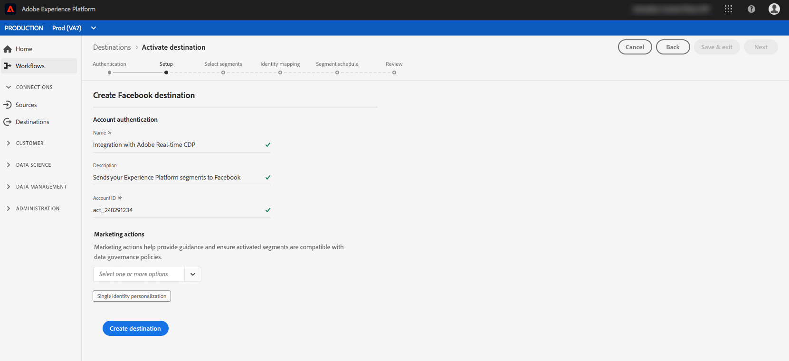

# Créer une destination de réseau social {#social-network-destinations-workflow}

## Présentation {#overview}

Ce didacticiel utilise [!DNL Facebook] comme exemple, mais le processus Adobe Experience Platform est le même pour toutes les destinations de réseau social.

Dans **[!UICONTROL Destinations]** > **[!UICONTROL Catalogue]**, faites défiler la catégorie **[!UICONTROL Social]**. Sélectionnez la destination de votre réseau social préférée, puis **[!UICONTROL Configurer]**.

>[!NOTE]
>
>Si une connexion avec cette destination existe déjà, vous pouvez voir un bouton **[!UICONTROL Activer]** sur la carte de destination. Pour plus d&#39;informations sur la différence entre **[!UICONTROL Activer]** et **[!UICONTROL Configurer]**, consultez la section [Catalogue](../../ui/destinations-workspace.md#catalog) de la documentation de l&#39;espace de travail de destination.

## Étape d&#39;authentification {#authentication}

À l’étape **Authentification**, si vous avez auparavant configuré une connexion à votre destination de réseau social, sélectionnez **[!UICONTROL Compte existant]**, puis sélectionnez la connexion existante. Vous pouvez aussi sélectionner **[!UICONTROL Nouveau compte]** pour configurer une nouvelle connexion à votre destination de réseau social. Sélectionnez **[!UICONTROL Se connecter à la destination]** pour atteindre la destination de réseau social sélectionnée afin de vous identifier et de connecter Adobe Experience Cloud à votre compte publicitaire sur le réseau social.

>[!NOTE]
>
>La plate-forme prend en charge la validation des informations d’identification dans le processus d’authentification et affiche un message d’erreur si vous saisissez des informations d’identification incorrectes à l’identifiant de compte de réseau social. Ainsi, vous n’effectuez pas le workflow avec des informations d’identification incorrectes.

Une fois vos informations d’identification confirmées et la connexion d’Adobe Experience Cloud à votre réseau social établie, vous pouvez sélectionner **[!UICONTROL Suivant]** pour passer à l’étape de **[!UICONTROL Configuration]**.

## Étape de configuration {#setup}

À l’étape **[!UICONTROL Configuration]**, saisissez un [!UICONTROL Nom] et une [!UICONTROL Description] pour votre flux d’activation et saisissez l’[!UICONTROL identifiant de compte] de votre compte publicitaire sur le réseau social.

>[!IMPORTANT]
>
> Pour les destinations [!DNL Facebook], **[!UICONTROL ID de compte]** correspond à votre [!DNL Facebook Ad Account ID]. Vous pouvez trouver cet ID dans le [!DNL Facebook Ads Manager]. Préfixez l’identifiant avec `act_`, comme indiqué ci-dessous :

>[!IMPORTANT]
>
> Pour les destinations [!DNL LinkedIn], **[!UICONTROL ID de compte]** correspond à votre [!DNL LinkedIn Campaign Manager Account ID]. Vous pouvez trouver cet ID dans le [!DNL LinkedIn Campaign Manager].

À cette étape, vous pouvez également sélectionner toute **[!UICONTROL action marketing]** qui doit s’appliquer à cette destination. Les actions marketing indiquent l’intention d’exporter les données vers la destination. Vous pouvez choisir parmi des actions marketing définies par Adobe ou créer votre propre action marketing. Pour plus d&#39;informations sur les actions marketing, consultez la [Présentation des stratégies d&#39;utilisation des données](../../../data-governance/policies/overview.md).

Sélectionnez **[!UICONTROL Créer la destination]** après avoir renseigné les champs ci-dessus.

Votre destination est maintenant créée. Vous pouvez sélectionner **[!UICONTROL Enregistrer et quitter]** si vous souhaitez activer les segments ultérieurement. Sélectionnez **[!UICONTROL Suivant]** pour poursuivre le workflow et choisir les segments à activer. Dans les deux cas, consultez la section suivante, [Activation des segments vers les réseaux sociaux](#activate-segments), pour le reste du workflow.

## Activation des segments vers les réseaux sociaux {#activate-segments}

Pour des instructions sur l’activation des segments vers les réseaux sociaux, consultez [Activation des données vers les destinations](../../ui/activate-destinations.md).