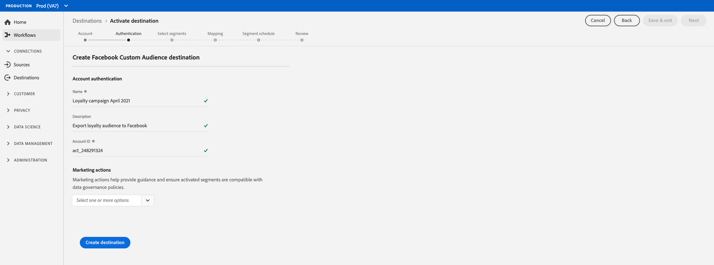

# Créer une destination sociale {#social-network-destinations-workflow}

## Présentation {#overview}

Ce didacticiel utilise [!DNL Facebook] comme exemple, mais le processus Adobe Experience Platform est le même pour toutes les destinations sociales.

## Configurer la destination sociale - Présentation vidéo {#video}

La vidéo ci-dessous montre comment configurer une destination sociale et activer des segments dans Adobe Experience Platform. Les étapes sont également présentées de manière séquentielle dans les sections suivantes.

>[!VIDEO](https://video.tv.adobe.com/v/332599/?quality=12&learn=on&captions=eng)

## Sélectionner la destination sociale {#select-destination}

Dans **[!UICONTROL Destinations]** > **[!UICONTROL Catalogue]**, faites défiler la catégorie **[!UICONTROL Social]**. Sélectionnez votre destination sociale préférée, puis **[!UICONTROL Configurer]**.

>[!NOTE]
>
>Si une connexion avec cette destination existe déjà, vous pouvez voir un bouton **[!UICONTROL Activer]** sur la carte de destination. Pour plus d&#39;informations sur la différence entre **[!UICONTROL Activer]** et **[!UICONTROL Configurer]**, consultez la section [Catalogue](../../ui/destinations-workspace.md#catalog) de la documentation de l&#39;espace de travail de destination.

## Étape du compte {#account}

À l’étape **Compte**, si vous aviez précédemment configuré une connexion à votre destination sociale, sélectionnez **[!UICONTROL Compte existant]** et sélectionnez votre connexion existante. Vous pouvez également sélectionner **[!UICONTROL Nouveau compte]** pour configurer une nouvelle connexion à votre destination sociale. Sélectionnez **[!UICONTROL Se connecter à destination]** et cela vous mènera à la destination sociale sélectionnée pour vous connecter et connecter Adobe Experience Cloud à votre compte publicitaire social.

>[!NOTE]
>
>La plate-forme prend en charge la validation des informations d’identification dans le processus d’authentification et affiche un message d’erreur si vous saisissez des informations d’identification incorrectes dans l’ID de votre compte social. Ainsi, vous n’effectuez pas le workflow avec des informations d’identification incorrectes.

Une fois vos informations d’identification confirmées et que Adobe Experience Cloud est connecté à votre réseau social, vous pouvez sélectionner **[!UICONTROL Suivant]** pour passer à l’étape **[!UICONTROL Authentification]**.

## Étape d&#39;authentification {#authentication}

À l’étape **[!UICONTROL Authentification]**, saisissez [!UICONTROL Nom] et [!UICONTROL Description] pour votre flux d’activation, puis saisissez l’[!UICONTROL ID de compte] de votre compte publicitaire réseau social.

>[!IMPORTANT]
>
> * Pour les destinations [!DNL Facebook], **[!UICONTROL ID de compte]** correspond à votre [!DNL Facebook Ad Account ID]. Vous pouvez trouver cet ID dans le [!DNL Facebook Ads Manager]. Ajoutez un préfixe à l’identifiant `act_`, comme illustré dans l’image ci-dessous.
> * Pour les destinations [!DNL LinkedIn], **[!UICONTROL ID de compte]** correspond à votre [!DNL LinkedIn Campaign Manager Account ID]. Vous pouvez trouver cet ID dans le [!DNL LinkedIn Campaign Manager].

Au cours de cette étape, vous pouvez également sélectionner toute **[!UICONTROL action marketing]** qui doit s’appliquer à cette destination. Les actions marketing indiquent l’intention d’exporter les données vers la destination. Vous pouvez choisir parmi des actions marketing définies par Adobe ou créer votre propre action marketing. Pour plus d&#39;informations sur les actions marketing, consultez la [Présentation des stratégies d&#39;utilisation des données](../../../data-governance/policies/overview.md).

Sélectionnez **[!UICONTROL Créer la destination]** après avoir renseigné les champs ci-dessus.

Votre destination est maintenant créée. Vous pouvez sélectionner **[!UICONTROL Enregistrer et quitter]** si vous souhaitez activer les segments ultérieurement. Sélectionnez **[!UICONTROL Suivant]** pour poursuivre le workflow et choisir les segments à activer. Dans les deux cas, voir la section suivante, [Activer les segments vers les destinations sociales](#activate-segments), pour le reste du flux de travail.

## Activer les segments vers les destinations sociales {#activate-segments}

Pour savoir comment activer des segments vers des destinations sociales, voir [Activer les données vers les destinations](../../ui/activate-destinations.md).
