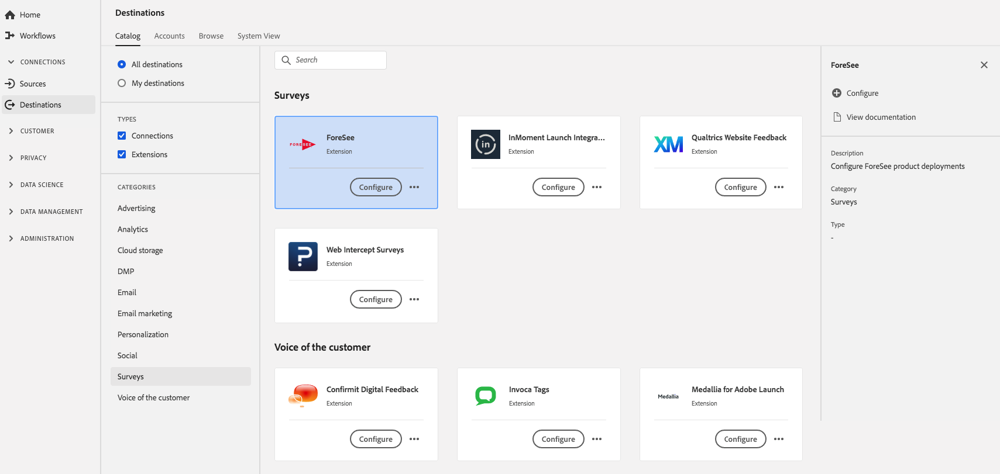

# [!DNL Foresee] Extension {#foresee-extension}

## Présentation {#overview}

Configure [!DNL ForeSee] product deployments using Experience Platform Launch.

[!DNL Foresee] est une extension de questionnaire dans la plateforme de données client en temps réel. Pour plus d’informations sur les fonctionnalités de l’extension, consultez la page de l’extension dans [Adobe Exchange](https://exchange.adobe.com/experiencecloud.details.100164.html).

Cette destination est une extension Adobe Experience Platform Launch. For more information about how Platform Launch extensions work in Real-time CDP, see [Adobe Experience Platform Launch extensions overview](../launch-extensions/overview.md).

## Conditions préalables  {#prerequisites}

This extension is available in the [!DNL Destinations] catalog for all customers who have purchased Real-time CDP.

Pour utiliser cette extension, vous devez accéder à Adobe Experience Platform Launch.  Platform Launch est une fonctionnalité gratuite intégrée à Adobe Experience Cloud. Contact your organization administrator to get access to Platform Launch and ask them to grant you the **[!UICONTROL manage_properties]** permission so you can install extensions.

## Installation de l’extension {#install-extension}

Pour installer l’ [!DNL Foresee] extension :

In the [Real-time CDP interface](http://platform.adobe.com/), go to **[!UICONTROL Destinations]** > **[!UICONTROL Catalog]**.

Sélectionnez l’extension dans le catalogue ou utilisez la barre de recherche.

Click on the destination to highlight it, then select **[!UICONTROL Configure]** in the right rail. If the **[!UICONTROL Configure]** control is greyed out, you are missing the **[!UICONTROL manage_properties]** permission. Voir les [Conditions préalables](#prerequisites).

In the **[!UICONTROL Select available Platform Launch property]** window, select the Platform Launch property in which you want to install the extension. Vous avez également la possibilité de créer une nouvelle propriété dans le lancement de plate-forme. Une propriété est un ensemble de règles, d’éléments de données, d’extensions configurées, d’environnements et de bibliothèques. Learn about properties in the [Properties page section](https://experienceleague.adobe.com/docs/launch/using/reference/admin/companies-and-properties.html#properties-page) of the Platform Launch documentation.

Le processus vous conduit au lancement de la plate-forme pour terminer l’installation.

Pour plus d’informations sur les options de configuration de l’extension, consultez la [page de l’extension Foresee](https://exchange.adobe.com/experiencecloud.details.100164.html) sur Adobe Exchange.

You can also install the extension directly in the [Adobe Experience Platform Launch interface](https://launch.adobe.com/). See [Add a new extension](https://experienceleague.adobe.com/docs/launch/using/reference/manage-resources/extensions/overview.html?lang=en#add-a-new-extension) in the Platform Launch documentation.

## Utilisation de l’extension {#how-to-use}

Une fois que vous avez installé l&#39;extension, vous pouvez début la configuration de règles pour celle-ci directement dans le lancement de la plate-forme.

Dans le lancement de plate-forme, vous pouvez configurer des règles pour vos extensions installées afin d&#39;envoyer des données de événement à la destination de l&#39;extension uniquement dans certaines situations. Pour plus d’informations sur la configuration de règles pour vos extensions, consultez la [documentation des règles](https://experienceleague.adobe.com/docs/launch/using/reference/manage-resources/rules.html).

## Configuration, mise à niveau et suppression de l’extension {#configure-upgrade-delete}

Vous pouvez configurer, mettre à niveau et supprimer des extensions dans l’interface de lancement de plate-forme.

>[!TIP]
>
>If the extension is already installed on one of your properties, the Real-time CDP UI still displays **[!UICONTROL Install]** for the extension. Kick off the installation workflow as described in [Install extension](#install-extension) to get to Platform Launch and configure or delete your extension.

To upgrade your extension, see [Extension upgrade](https://experienceleague.adobe.com/docs/launch/using/reference/manage-resources/extensions/extension-upgrade.html) in the Platform Launch documentation.
