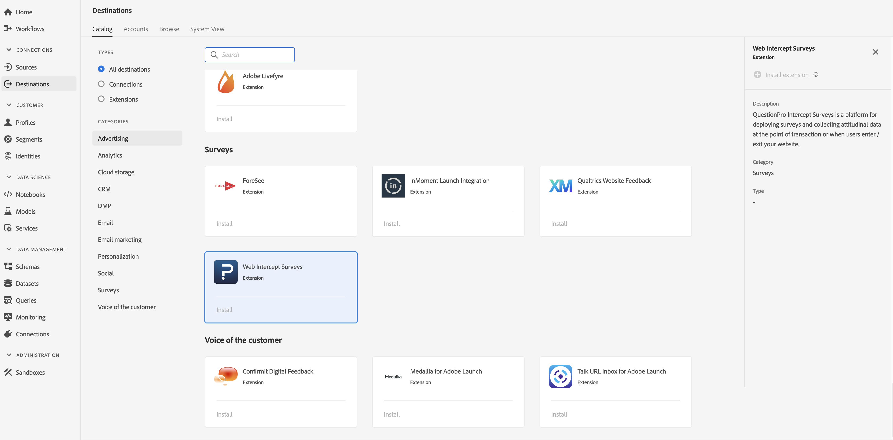

# Extension [!DNL QuestionPro Intercept Surveys] {#questionpro-extension}

## Vue d’ensemble {#overview}

[!DNL QuestionPro Intercept Surveys] est une plateforme permettant de déployer des questionnaires et de collecter des données sur les attitudes au point de transaction ou lorsque les utilisateurs accèdent à votre site web ou le quittent.

[!DNL QuestionPro Intercept Surveys] est une extension d’enquête dans [!DNL Adobe Experience Platform]. Pour plus d’informations sur les fonctionnalités de l’extension, consultez la page de l’extension dans [Adobe Exchange](https://exchange.adobe.com/experiencecloud.details.90096.questionpro-surveys.html).

Cette destination est une extension de balise. Pour plus d’informations sur le fonctionnement des extensions de balises dans Experience Platform, consultez la [ présentation des extensions de balises](../launch-extensions/overview.md).

## Conditions préalables {#prerequisites}

Cette extension est disponible dans le catalogue [!DNL Destinations] pour tous les clients qui ont acheté Experience Platform.

Pour utiliser cette extension, vous devez accéder aux balises dans [!DNL Adobe Experience Platform]. Les balises sont proposées aux clients [!DNL Adobe CX Enterprise] en tant que fonctionnalité à valeur ajoutée incluse. Contactez l’administrateur ou l’administratrice de votre organisation pour accéder aux balises et demandez-lui de vous accorder l’autorisation **[!UICONTROL manage_properties]** afin que vous puissiez installer les extensions.

## Installation l’extension {#install-extension}

Pour installer l’extension [!DNL QuestionPro Intercept Surveys], procédez comme suit :

Dans l’interface , accédez à **[!UICONTROL Destinations]** > **[!UICONTROL Catalogue]**.

Sélectionnez l’extension dans le catalogue ou utilisez la barre de recherche.

Sélectionnez la destination, puis sélectionnez **[!UICONTROL Configurer]** dans le rail de droite. Si le contrôle **[!UICONTROL Configurer]** est grisé, vous ne disposez pas de l’autorisation **[!UICONTROL manage_properties]**. Voir les [Conditions préalables](#prerequisites).

Sélectionnez la propriété dans laquelle vous souhaitez installer l’extension. Vous pouvez aussi créer une propriété. Une propriété est un ensemble de règles, d’éléments de données, d’extensions configurées, d’environnements et de bibliothèques. Pour en savoir plus sur les propriétés, consultez la [section de la page propriétés](../../../tags/ui/administration/companies-and-properties.md#properties-page) de la documentation sur les balises.

Le workflow vous guide tout au long des étapes nécessaires pour terminer l’installation.

Pour plus d’informations sur les options de configuration de l’extension et sur l’aide à l’installation, consultez la [page Intercept Surveys de QuestionPro sur Adobe Exchange](https://exchange.adobe.com/experiencecloud.details.90096.questionpro-surveys.html).

Vous pouvez également installer l’extension directement dans l’[interface utilisateur de la collecte de données](https://experience.adobe.com/#/data-collection/). Pour plus d’informations, voir la section sur l’[ajout d’une nouvelle extension](../../../tags/ui/managing-resources/extensions/overview.md#add-a-new-extension) dans la documentation sur les balises.

## Utilisation de l’extension {#how-to-use}

Une fois que vous avez installé l’extension, vous pouvez commencer à configurer des règles.

Vous pouvez configurer des règles pour vos extensions installées afin d’envoyer des données d’événement vers la destination de l’extension uniquement dans certains cas. Pour plus d’informations sur la configuration de règles pour vos extensions, consultez la [documentation sur les balises](../../../tags/ui/managing-resources/rules.md).

## Configuration, mise à niveau et suppression de l’extension {#configure-upgrade-delete}

Vous pouvez configurer, mettre à niveau et supprimer des extensions dans l’interface utilisateur de collecte de données.

>[!TIP]
>
>Si l’extension est déjà installée sur l’une de vos propriétés, l’interface utilisateur d’Experience Platform continue d’afficher **[!UICONTROL Installer]** pour l’extension. Démarrez le workflow d’installation comme décrit dans [Installation de l’extension](#install-extension) pour configurer ou supprimer votre extension.

Pour mettre à niveau votre extension, consultez le guide sur le [processus de mise à niveau d’extension](../../../tags/ui/managing-resources/extensions/extension-upgrade.md) dans la documentation sur les balises.
