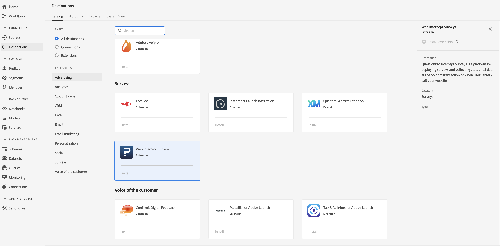

# [!DNL QuestionPro Intercept Surveys] Extension {#questionpro-extension}

[!DNL QuestionPro Intercept Surveys] est une plateforme permettant de déployer des questionnaires et de collecter des données comportementales au point de la transaction ou lorsque les utilisateurs entrent ou sortent de votre site Web.

[!DNL QuestionPro Intercept Surveys] est une extension de questionnaire dans Adobe Experience Platform. Pour plus d’informations sur les fonctionnalités de l’extension, consultez la page de l’extension dans [Adobe Exchange](https://exchange.adobe.com/experiencecloud.details.90096.questionpro-surveys.html).

Cette destination est une extension Adobe Experience Platform Launch. Pour plus d&#39;informations sur le fonctionnement des extensions de lancement de plateformes dans Platform, voir [Présentation des extensions Adobe Experience Platform Launch](../launch-extensions/overview.md).

## Conditions préalables  {#prerequisites}

Cette extension est disponible dans le catalogue [!DNL Destinations] pour tous les clients qui ont acheté Platform.

Pour utiliser cette extension, vous devez accéder à Adobe Experience Platform Launch.  Platform Launch est une fonctionnalité gratuite intégrée à Adobe Experience Cloud. Contactez l’administrateur de votre organisation pour accéder à Platform Launch et demandez-lui de vous accorder l’autorisation **[!UICONTROL manage_properties]** afin que vous puissiez installer les extensions.

## Installation de l’extension {#install-extension}

Pour installer l&#39;extension [!DNL QuestionPro Intercept Surveys] :

Dans l&#39;[interface de plate-forme](http://platform.adobe.com/), accédez à **[!UICONTROL Destinations]** > **[!UICONTROL Catalogue]**.

Sélectionnez l’extension dans le catalogue ou utilisez la barre de recherche.

Cliquez sur la destination pour la mettre en évidence, puis sélectionnez **[!UICONTROL Configurer]** dans le rail de droite. Si le contrôle **[!UICONTROL Configure]** est grisé, l&#39;autorisation **[!UICONTROL manage_properties]** vous manque. Voir les [Conditions préalables](#prerequisites).

Dans la fenêtre **[!UICONTROL Sélectionner la propriété de lancement de plate-forme disponible]**, sélectionnez la propriété de lancement de plate-forme dans laquelle vous souhaitez installer l&#39;extension. Vous avez également la possibilité de créer une nouvelle propriété dans le lancement de plate-forme. Une propriété est un ensemble de règles, d’éléments de données, d’extensions configurées, d’environnements et de bibliothèques. Découvrez les propriétés dans la section [Page Propriétés](https://experienceleague.adobe.com/docs/launch/using/reference/admin/companies-and-properties.html#properties-page) de la documentation sur le lancement de plate-forme.

Le processus vous conduit au lancement de la plate-forme pour terminer l’installation.

Pour plus d’informations sur les options de configuration de l’extension et sur l’aide à l’installation, consultez la [page Intercept Surveys de QuestionPro sur Adobe Exchange](https://exchange.adobe.com/experiencecloud.details.90096.questionpro-surveys.html).

Vous pouvez également installer l&#39;extension directement dans l&#39;[interface Adobe Experience Platform Launch](https://launch.adobe.com/). Voir [Ajouter une nouvelle extension](https://experienceleague.adobe.com/docs/launch/using/reference/manage-resources/extensions/overview.html?lang=en#add-a-new-extension) dans la documentation de Platform Launch.

## Utilisation de l’extension {#how-to-use}

Une fois que vous avez installé l&#39;extension, vous pouvez début la configuration de règles pour celle-ci directement dans le lancement de la plate-forme.

Dans le lancement de plate-forme, vous pouvez configurer des règles pour vos extensions installées afin d&#39;envoyer des données de événement à la destination de l&#39;extension uniquement dans certaines situations. Pour plus d’informations sur la configuration de règles pour vos extensions, consultez la [documentation des règles](https://experienceleague.adobe.com/docs/launch/using/reference/manage-resources/rules.html).

## Configuration, mise à niveau et suppression de l’extension {#configure-upgrade-delete}

Vous pouvez configurer, mettre à niveau et supprimer des extensions dans l’interface de lancement de plate-forme.

>[!TIP]
>
>Si l&#39;extension est déjà installée sur l&#39;une de vos propriétés, l&#39;interface utilisateur de la plate-forme affiche toujours **[!UICONTROL Installer]** pour l&#39;extension. Lancez le processus d&#39;installation comme décrit dans [Installer l&#39;extension](#install-extension) pour accéder au lancement de la plate-forme et configurer ou supprimer votre extension.

Pour mettre à niveau votre extension, voir [Extension upgrade](https://experienceleague.adobe.com/docs/launch/using/reference/manage-resources/extensions/extension-upgrade.html) dans la documentation Platform Launch.