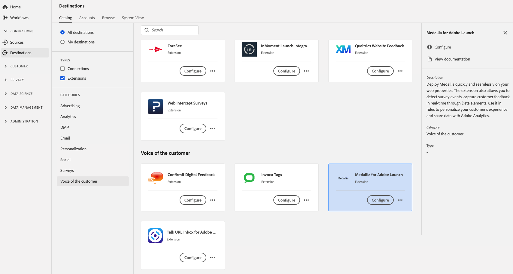

# [!DNL Medallia] Extension {#medallia-extension}

Déployez [!DNL Medallia] rapidement et facilement sur vos propriétés Web. L’extension vous permet également de détecter des événements d’enquête, de capturer les commentaires des clients en temps réel au moyen d’éléments de données, de les utiliser dans des règles pour personnaliser votre expérience client et de partager des données avec Adobe Analytics.

[!DNL Medallia] est une voix de l&#39;extension client à Adobe Experience Platform. Pour plus d’informations sur les fonctionnalités de l’extension, consultez la page de l’extension dans [Adobe Exchange](https://exchange.adobe.com/experiencecloud.details.103279.medallia-for-adobe-launch.html).

Cette destination est une extension Adobe Experience Platform Launch. Pour plus d&#39;informations sur le fonctionnement des extensions de lancement de plateformes dans Platform, voir [Présentation des extensions Adobe Experience Platform Launch](../launch-extensions/overview.md).

## Conditions préalables  {#prerequisites}

Cette extension est disponible dans le catalogue [!DNL Destinations] pour tous les clients qui ont acheté Platform.

Pour utiliser cette extension, vous devez accéder à Adobe Experience Platform Launch.  Platform Launch est une fonctionnalité gratuite intégrée à Adobe Experience Cloud. Contactez l’administrateur de votre organisation pour accéder à Platform Launch et demandez-lui de vous accorder l’autorisation **[!UICONTROL manage_properties]** afin que vous puissiez installer les extensions.

## Installation de l’extension {#install-extension}

Pour installer l&#39;extension [!DNL Medallia] :

Dans l&#39;[interface de plate-forme](http://platform.adobe.com/), accédez à **[!UICONTROL Destinations]** > **[!UICONTROL Catalogue]**.

Sélectionnez l’extension dans le catalogue ou utilisez la barre de recherche.

Cliquez sur la destination pour la mettre en évidence, puis sélectionnez **[!UICONTROL Configurer]** dans le rail de droite. Si le contrôle **[!UICONTROL Configure]** est grisé, l&#39;autorisation **[!UICONTROL manage_properties]** vous manque. Voir les [Conditions préalables](#prerequisites).

Dans la fenêtre **[!UICONTROL Sélectionner la propriété de lancement de plate-forme disponible]**, sélectionnez la propriété de lancement de plate-forme dans laquelle vous souhaitez installer l&#39;extension. Vous avez également la possibilité de créer une nouvelle propriété dans le lancement de plate-forme. Une propriété est un ensemble de règles, d’éléments de données, d’extensions configurées, d’environnements et de bibliothèques. Découvrez les propriétés dans la section [Page Propriétés](https://experienceleague.adobe.com/docs/launch/using/reference/admin/companies-and-properties.html#properties-page) de la documentation sur le lancement de plate-forme.

Le processus vous conduit au lancement de la plate-forme pour terminer l’installation.

Pour plus d’informations sur les options de configuration d’extension et la prise en charge de l’installation, consultez la [page Medallia sur Adobe Exchange](https://exchange.adobe.com/experiencecloud.details.103279.medallia-for-adobe-launch.html).

Vous pouvez également installer l&#39;extension directement dans l&#39;[interface Adobe Experience Platform Launch](https://launch.adobe.com/). Voir [Ajouter une nouvelle extension](https://experienceleague.adobe.com/docs/launch/using/reference/manage-resources/extensions/overview.html?lang=en#add-a-new-extension) dans la documentation de Platform Launch.

## Utilisation de l’extension {#how-to-use}

Une fois que vous avez installé l&#39;extension, vous pouvez début la configuration de règles pour celle-ci directement dans le lancement de la plate-forme.

Dans le lancement de plate-forme, vous pouvez configurer des règles pour vos extensions installées afin d&#39;envoyer des données de événement à la destination de l&#39;extension uniquement dans certaines situations. Pour plus d’informations sur la configuration de règles pour vos extensions, consultez la [documentation des règles](https://experienceleague.adobe.com/docs/launch/using/reference/manage-resources/rules.html).

## Configuration, mise à niveau et suppression de l’extension {#configure-upgrade-delete}

Vous pouvez configurer, mettre à niveau et supprimer des extensions dans l’interface de lancement de plate-forme.

>[!TIP]
>
>Si l&#39;extension est déjà installée sur l&#39;une de vos propriétés, l&#39;interface utilisateur de la plate-forme affiche toujours **[!UICONTROL Installer]** pour l&#39;extension. Lancez le processus d&#39;installation comme décrit dans [Installer l&#39;extension](#install-extension) pour accéder au lancement de la plate-forme et configurer ou supprimer votre extension.

Pour mettre à niveau votre extension, voir [Extension upgrade](https://experienceleague.adobe.com/docs/launch/using/reference/manage-resources/extensions/extension-upgrade.html) dans la documentation Platform Launch.