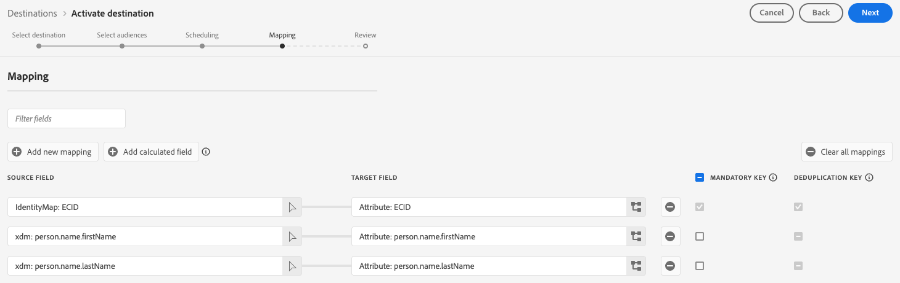

# Connexion par lots à Snowflake {#snowflake-destination}

>[!AVAILABILITY]
>
>Ce connecteur de destination est en disponibilité limitée et disponible uniquement pour les clients Real-Time CDP Ultimate configurés dans la région [VA7](/help/landing/multi-cloud.md#azure-regions).

## Vue d’ensemble {#overview}

Utilisez cette destination pour envoyer des données d’audience dans des tableaux dynamiques de votre compte Snowflake. Les tableaux dynamiques permettent d’accéder à vos données sans avoir besoin de copies de données physiques.

Lisez les sections suivantes pour comprendre comment fonctionne la destination Snowflake et comment les données sont transférées entre Adobe et Snowflake.

### Fonctionnement du partage des données de Snowflake {#data-sharing}

Cette destination utilise un partage de données [!DNL Snowflake], ce qui signifie qu’aucune donnée n’est physiquement exportée ou transférée vers votre propre instance de Snowflake. Au lieu de cela, Adobe vous accorde un accès en lecture seule à une table dynamique hébergée dans l’environnement Adobe Snowflake. Vous pouvez interroger cette table partagée directement à partir de votre compte Snowflake, mais vous n’êtes pas propriétaire de la table et ne pouvez pas la modifier ni la conserver au-delà de la période de conservation spécifiée. Adobe gère entièrement le cycle de vie et la structure de la table partagée.

La première fois que vous configurez un flux de données d’Adobe vers votre compte Snowflake, vous êtes invité à accepter la liste privée d’Adobe.

### Conservation des données et durée de vie (TTL) {#ttl}

Toutes les données partagées par le biais de cette intégration ont une durée de vie (TTL) fixe de sept jours. Sept jours après la dernière exportation, le tableau dynamique expire automatiquement et devient inaccessible, que le flux de données soit toujours actif ou non. Si vous devez conserver les données pendant plus de sept jours, vous devez copier le contenu dans une table que vous détenez dans votre propre instance Snowflake avant l’expiration de la TTL.

>[!IMPORTANT]
>
>La suppression d’un flux de données dans Experience Platform entraîne la disparition du tableau dynamique de votre compte Snowflake.

### Comportement de mise à jour de l’audience {#audience-update-behavior}

Si votre audience est évaluée en [mode batch](../../../segmentation/methods/batch-segmentation.md), les données du tableau partagé sont actualisées toutes les 24 heures. Cela signifie qu’il peut y avoir un retard de jusqu’à 24 heures entre les modifications de l’appartenance à l’audience et le moment où ces modifications sont répercutées dans le tableau partagé.

### Logique de partage des données par lots {#batch-data-sharing}

Lorsqu’un flux de données s’exécute pour une audience pour la première fois, il effectue un renvoi et partage tous les profils actuellement qualifiés. Après ce renvoi initial, la destination fournit des instantanés périodiques de l’abonnement complet à l’audience. Chaque instantané remplace les données précédentes dans la table partagée, ce qui garantit que vous voyez toujours la dernière vue complète de l’audience sans données historiques.

## Partage de données par lots ou en flux continu {#batch-vs-streaming}

Experience Platform fournit deux types de destinations Snowflake : [Diffusion en continu Snowflake](snowflake.md) et [Lot Snowflake](snowflake-batch.md).

Bien que les deux destinations vous donnent accès à vos données dans Snowflake en mode copie nulle, il existe quelques bonnes pratiques recommandées en termes de cas d’utilisation pour chaque connecteur.

Le tableau ci-dessous vous aidera à choisir le connecteur à utiliser en décrivant les scénarios où chaque méthode de partage de données est la plus appropriée.

|  | Choisissez [Snowflake Batch](snowflake-batch.md) lorsque vous en avez besoin | Choisissez [Snowflake Streaming](snowflake.md) lorsque vous en avez besoin |
|--------|-------------------|----------------------|
| **Fréquence de mise à jour** | Instantanés périodiques | Mises à jour continues en temps réel |
| **Présentation des données** | Instantané d’audience complet qui remplace les données précédentes | Mises à jour incrémentielles en fonction des modifications de profil |
| **Cas d’utilisation ciblé** | Charges de travail analytiques/ML pour lesquelles la latence n’est pas critique | Scénarios d’action immédiate nécessitant des mises à jour en temps réel |
| **Gestion des données** | Toujours afficher le dernier instantané complet | Mises à jour incrémentielles en fonction des modifications de l’appartenance à une audience |
| **Exemples de scénarios** | Création de rapports d’entreprise, analyse de données, formation au modèle ML | Suppression des campagnes marketing, personnalisation en temps réel |

Pour plus d’informations sur le partage de données en flux continu, consultez la documentation Connexion en flux continu Snowflake .

## Cas d’utilisation {#use-cases}

Le partage de données par lots est idéal pour les scénarios où vous avez besoin d’un instantané complet de votre audience et où les mises à jour en temps réel ne sont pas requises, par exemple :

* **Charges de travail analytiques** : lors de l’exécution de tâches d’analyse de données, de création de rapports ou de Business Intelligence nécessitant une vue complète de l’appartenance à l’audience
* **Workflows de machine learning** : pour entraîner des modèles ML ou exécuter des analyses prédictives qui bénéficient d’instantanés d’audience complets
* **Entrepôt de données** : lorsque vous devez conserver une copie à jour des données d’audience dans votre propre instance Snowflake
* **Rapports périodiques** : pour les rapports d’entreprise réguliers pour lesquels vous avez besoin du dernier état d’audience sans suivi des modifications historiques
* **Processus ETL** : lorsque vous devez transformer ou traiter les données d’audience par lots

Le partage de données par lots simplifie la gestion des données en fournissant des instantanés complets, ce qui élimine la nécessité de gérer des mises à jour incrémentielles ou de fusionner manuellement les modifications.

## Conditions préalables {#prerequisites}

Avant de configurer votre connexion Snowflake, veillez à respecter les conditions préalables suivantes :

* Vous avez accès à un compte [!DNL Snowflake].
* Votre compte Snowflake est abonné à des annonces privées. Vous ou un membre de votre société disposant de droits d’administrateur de compte sur Snowflake pouvez configurer cette option.

Lisez la [[!DNL Snowflake] documentation](https://docs.snowflake.com/en/collaboration/consumer-listings-access#access-a-private-listing) pour plus d’informations sur les autorisations nécessaires.

## Audiences prises en charge {#supported-audiences}

Cette section décrit les types d’audiences que vous pouvez exporter vers cette destination. Les deux tableaux ci-dessous indiquent les audiences prises en charge par ce connecteur, par _origine de l’audience_ et _types de profil inclus dans l’audience_ :

| Origine de l’audience | Pris en charge | Description |
|---------|----------|----------|
| [!DNL Segmentation Service] | ✓ | Audiences générées via Experience Platform [Segmentation Service](../../../segmentation/home.md). |
| Toutes les autres origines d’audience | ✓ | Cette catégorie inclut toutes les origines d’audience en dehors des audiences générées par le [!DNL Segmentation Service]. Découvrez les [différentes origines d’audience](/help/segmentation/ui/audience-portal.md#customize). Voici quelques exemples : <ul><li> audiences de chargement personnalisées [importées](../../../segmentation/ui/audience-portal.md#import-audience) dans Experience Platform à partir de fichiers CSV,</li><li> les audiences semblables, </li><li> les audiences fédérées, </li><li> les audiences générées dans d’autres applications Experience Platform telles que Adobe Journey Optimizer, </li><li> et plus encore. </li></ul> |

{style="table-layout:auto"}

Audiences prises en charge par type de données d’audience :

| Type de données d’audience | Pris en charge | Description | Cas d’utilisation |
|--------------------|-----------|-------------|-----------|
| [Audiences de personnes](/help/segmentation/types/people-audiences.md) | ✓ | En fonction des profils client, ce qui vous permet de cibler des groupes spécifiques de personnes pour les campagnes marketing. | Acheteurs fréquents, personnes abandonnant leur panier |
| [Audiences de compte](/help/segmentation/types/account-audiences.md) | Non | Ciblez des individus au sein d’organisations spécifiques pour les stratégies marketing basées sur les comptes. | Marketing B2B |
| [Audiences de prospects ](/help/segmentation/types/prospect-audiences.md) | Non | Ciblez les individus qui ne sont pas encore clients, mais qui partagent des caractéristiques avec votre audience cible. | Prospection à l’aide de données tierces |
| [Exportations de jeux de données](/help/catalog/datasets/overview.md) | Non | Collections de données structurées stockées dans le lac de données Adobe Experience Platform. | Rapports, workflows de science des données |

{style="table-layout:auto"}

## Type et fréquence d’exportation {#export-type-frequency}

Reportez-vous au tableau ci-dessous pour plus d’informations sur le type et la fréquence d’exportation des destinations.

| Élément | Type | Notes |
|---------|----------|---------|
| Type d’exportation | **[!UICONTROL Audience export]** | Vous exportez tous les profils membres d’une audience ainsi que les identifiants (nom, numéro de téléphone ou autres) utilisés dans la destination [!DNL Snowflake]. |
| Fréquence des exportations | **[!UICONTROL Batch]** | Cette destination fournit des instantanés périodiques de l’adhésion complète à l’audience via le partage de données Snowflake. Chaque instantané remplace les données précédentes, ce qui vous permet de toujours disposer de la dernière vue complète de votre audience. |

{style="table-layout:auto"}

## Se connecter à la destination {#connect}

>[!IMPORTANT]
> 
>Pour vous connecter à la destination, vous avez besoin des **[!UICONTROL View Destinations]** et **[!UICONTROL Manage Destinations]** [autorisations de contrôle d’accès](/help/access-control/home.md#permissions). Lisez la [présentation du contrôle d’accès](/help/access-control/ui/overview.md) ou contactez votre administrateur de produit pour obtenir les autorisations requises.

Pour vous connecter à cette destination, procédez comme décrit dans le [tutoriel sur la configuration des destinations](../../ui/connect-destination.md). Dans le workflow de configuration des destinations, renseignez les champs répertoriés dans les deux sections ci-dessous.

### S’authentifier auprès de la destination {#authenticate}

Pour vous authentifier auprès de la destination, sélectionnez **[!UICONTROL Connect to destination]** et indiquez un nom de compte et, éventuellement, une description de compte.

### Renseigner les détails de la destination {#destination-details}

>[!CONTEXTUALHELP]
>id="platform_destinations_snowflake_batch_accountID"
>title="Saisir votre identifiant de compte Snowflake"
>abstract="Si votre compte est lié à une organisation, utilisez le format suivant : `OrganizationName.AccountName`  . Si votre compte n’est pas lié à une organisation, utilisez le format suivant : `AccountName`."

Pour configurer les détails de la destination, renseignez les champs obligatoires et facultatifs ci-dessous. Un astérisque situé en regard d’un champ de l’interface utilisateur indique que le champ est obligatoire.

* **[!UICONTROL Name]** : nom par lequel vous reconnaîtrez cette destination à l’avenir.
* **[!UICONTROL Description]** : une description qui vous aidera à identifier cette destination à l’avenir.
* **[!UICONTROL Snowflake Account ID]** : identifiant de votre compte Snowflake. Utilisez le format d’identifiant de compte suivant selon que votre compte est lié ou non à une organisation :
   * Si votre compte est lié à une organisation, procédez comme suit `OrganizationName.AccountName`.
   * Si votre compte n’est pas lié à une organisation, `AccountName`.
* **[!UICONTROL Account acknowledgment]** : activez/désactivez l’accusé de réception de l’ID de compte Snowflake pour confirmer que l’ID de compte est correct et qu’il vous appartient.

>[!IMPORTANT]
>
> Les caractères spéciaux utilisés dans le nom de la destination et le nom du sandbox Experience Platform sont automatiquement convertis en traits de soulignement (`_`) dans Snowflake. Pour éviter toute confusion, n’utilisez pas de caractères spéciaux dans la destination et le nom du sandbox.

### Activer les alertes {#enable-alerts}

Vous pouvez activer les alertes pour recevoir des notifications sur le statut de votre flux de données vers votre destination. Sélectionnez une alerte dans la liste et abonnez-vous à des notifications concernant le statut de votre flux de données. Pour plus d’informations sur les alertes, consultez le guide sur l’[abonnement aux alertes des destinations dans l’interface utilisateur](../../ui/alerts.md).

Lorsque vous avez terminé de renseigner les détails sur votre connexion de destination, sélectionnez **[!UICONTROL Next]**.

## Activer des audiences vers cette destination {#activate}

>[!IMPORTANT]
> 
>* Pour activer les données, vous avez besoin des autorisations de contrôle d’accès **[!UICONTROL View Destinations]**, **[!UICONTROL Activate Destinations]**, **[!UICONTROL View Profiles]** et **[!UICONTROL View Segments]** [Access control](/help/access-control/home.md#permissions). Lisez la [présentation du contrôle d’accès](/help/access-control/ui/overview.md) ou contactez votre administrateur ou administratrice du produit pour obtenir les autorisations requises.
>* Pour exporter des *identités*, vous devez disposer de l’autorisation de contrôle d’accès **[!UICONTROL View Identity Graph]**.   {width="100" zoomable="yes"}

Consultez la section [Activer des données d’audience vers des destinations d’exportation de profils par lots](/help/destinations/ui/activate-batch-profile-destinations.md) pour obtenir des instructions sur l’activation des audience vers cette destination.

### Attributs de mappage {#map}

Vous pouvez exporter des identités et des attributs de profil vers cette destination.

Vous pouvez utiliser le contrôle [champs calculés](../../ui/data-transformations-calculated-fields.md) pour exporter et effectuer des opérations sur des tableaux.

Les attributs de la cible sont automatiquement créés dans Snowflake à l’aide du nom d’attribut que vous fournissez dans le champ **[!UICONTROL Attribute name]** .

## Données exportées / Valider l’exportation des données {#exported-data}

Les données sont transférées dans votre compte Snowflake par le biais d’un tableau dynamique. Vérifiez votre compte Snowflake pour vous assurer que les données ont été correctement exportées.

### Structure des données {#data-structure}

Le tableau dynamique contient les colonnes suivantes :

* **TS** : colonne de date et heure qui représente la date de la dernière mise à jour de chaque ligne
* **Attributs de mappage** : chaque attribut de mappage que vous sélectionnez pendant le workflow d’activation est représenté sous la forme d’un en-tête de colonne dans Snowflake
* **Appartenance à une audience** : l’appartenance à une audience mappée au flux de données est indiquée par une entrée `active` dans la cellule correspondante

## Limites connues {#known-limitations}

### Restriction de la politique de fusion par défaut {#default-merge-policy-restriction}

Actuellement, seules les audiences mappées à la politique de fusion par défaut peuvent être exportées.

### Disponibilité régionale {#regional-availability}

Actuellement, la destination par lots [!DNL Snowflake] n’est disponible que pour les clients Real-Time CDP configurés dans la région Experience Platform VA7.

## Utilisation et gouvernance des données {#data-usage-governance}

Lors de la gestion de vos données, toutes les destinations [!DNL Adobe Experience Platform] se conforment aux politiques d’utilisation des données. Pour obtenir des informations détaillées sur la manière dont [!DNL Adobe Experience Platform] applique la gouvernance des données, consultez la [Présentation de la gouvernance des données](/help/data-governance/home.md).
