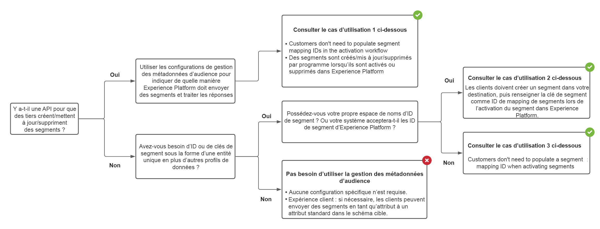

# Gestion des métadonnées d’audience {#audience-metadata-management}

## Présentation {#overview}

Utilisez les modèles de métadonnées d’audience pour créer, mettre à jour ou supprimer des audiences par programmation dans votre destination. Adobe fournit un modèle de métadonnées d’audience extensible que vous pouvez configurer en fonction des spécifications de votre API marketing. Une fois la configuration définie, testée et envoyée, elle sera utilisée par Adobe pour structurer les appels d’API vers votre destination.

Vous pouvez configurer les fonctionnalités décrites dans ce document à l’aide du `/authoring/audience-templates` Point d’entrée de l’API. Lecture [Opérations de l’API de point d’entrée des métadonnées d’audience](./audience-metadata-api.md) pour obtenir une liste complète des opérations que vous pouvez effectuer sur le point de terminaison .

## Quand utiliser le point d’entrée de la gestion des métadonnées d’audience {#when-to-use}

Selon la configuration de votre API, vous devrez peut-être utiliser le point de terminaison de la gestion des métadonnées de l’audience, car vous configurez votre destination dans Experience Platform. Utilisez le diagramme de l’arborescence de décision ci-dessous pour savoir quand utiliser le point de terminaison des métadonnées d’audience et comment configurer un modèle de métadonnées d’audience pour votre destination.



## Cas d’utilisation pris en charge par la gestion des métadonnées d’audience {#use-cases}

Avec la prise en charge des métadonnées d’audience dans Destination SDK, lorsque vous configurez votre destination Experience Platform, vous pouvez donner aux utilisateurs de Platform l’une des options suivantes lorsqu’ils mappent et activent des segments vers votre destination. Vous pouvez contrôler les options disponibles pour l’utilisateur via les paramètres de la section de mappage des segments de la [configuration de destination](./destination-configuration.md#segment-mapping).

### Cas d’utilisation 1 - Vous disposez d’une API tierce et les utilisateurs n’ont pas besoin de saisir les identifiants de mappage

Si vous disposez d’un point de terminaison API pour créer/mettre à jour/supprimer des segments ou des audiences, vous pouvez utiliser des modèles de métadonnées d’audience pour configurer Destination SDK afin qu’il corresponde aux spécifications de votre point de terminaison de création/mise à jour/suppression de segments. Experience Platform peut créer, mettre à jour ou supprimer des segments par programmation et resynchroniser les métadonnées dans Experience Platform.

Lors de l’activation de segments vers votre destination dans l’interface utilisateur de l’Experience Platform, les utilisateurs n’ont pas besoin de remplir manuellement un champ d’identifiant de mappage de segments dans le processus d’activation.

### Cas d’utilisation 2 - Les utilisateurs doivent d’abord créer un segment dans votre destination et doivent saisir manuellement l’ID de mappage

Si des segments et d’autres métadonnées doivent être créés manuellement par des partenaires ou des utilisateurs dans votre destination, les utilisateurs doivent renseigner manuellement le champ ID de mappage de segments dans le processus d’activation pour synchroniser les métadonnées de segment entre votre destination et votre Experience Platform.


### Cas d’utilisation 3 - Votre destination accepte l’identifiant de segment Experience Platform, les utilisateurs n’ont pas besoin de saisir manuellement l’identifiant de mappage

Si votre système de destination accepte l’identifiant de segment Experience Platform, vous pouvez le configurer dans votre modèle de métadonnées d’audience. Les utilisateurs n’ont pas à renseigner d’identifiant de mappage de segments lors de l’activation d’un segment.

## Modèle d’audience générique et extensible {#generic-and-extensible}

Pour prendre en charge les cas d’utilisation répertoriés ci-dessus, Adobe vous fournit un modèle générique qui peut être personnalisé pour s’adapter aux spécifications de votre API.

Vous pouvez utiliser le modèle générique pour [créer un modèle d’audience ;](./audience-metadata-api.md#create) si votre API prend en charge :

* Méthodes HTTP : POST, GET, PUT, DELETE, PATCH
* Types d’authentification : OAuth 1, OAuth 2 avec jeton d’actualisation, OAuth 2 avec jeton porteur
* Fonctions : créer une audience, mettre à jour une audience, obtenir une audience, supprimer une audience, valider les informations d’identification

L’équipe d’ingénierie d’Adobe peut collaborer avec vous pour développer le modèle générique avec des champs personnalisés si vos cas d’utilisation le requièrent.

## Exemples de configuration {#configuration-examples}

Cette section présente trois exemples de configurations génériques des métadonnées d’audience, à titre de référence, ainsi que des descriptions des sections principales de la configuration. Notez les différences entre l’URL, les en-têtes, la requête et le corps de réponse entre les trois exemples de configuration. Cela est dû aux différentes spécifications de l’API marketing des trois exemples de plateformes.

Notez que dans certains exemples, les champs de macro tels que `{{authData.accessToken}}` ou `{{segment.name}}` sont utilisés dans l’URL et dans d’autres exemples, ils sont utilisés dans les en-têtes ou dans le corps de la requête. Cela dépend vraiment de vos spécifications d’API marketing.

| Section Modèle | Description |
|--- |--- |
| `create` | Inclut tous les composants requis (URL, méthode HTTP, en-têtes, requête et corps de réponse) pour effectuer un appel HTTP à votre API afin de créer par programmation des segments/audiences dans votre plateforme et de synchroniser les informations avec Adobe Experience Platform. |
| `update` | Inclut tous les composants requis (URL, méthode HTTP, en-têtes, requête et corps de réponse) pour effectuer un appel HTTP à votre API, pour mettre à jour par programmation les segments/audiences de votre plateforme et synchroniser les informations avec Adobe Experience Platform. |
| `delete` | Inclut tous les composants requis (URL, méthode HTTP, en-têtes, requête et corps de réponse) pour effectuer un appel HTTP à votre API afin de supprimer par programmation les segments/audiences de votre plateforme. |
| `validate` | Exécute des validations pour tous les champs de la configuration du modèle avant d’effectuer un appel vers l’API du partenaire. Par exemple, vous pouvez vérifier que l’ID de compte de l’utilisateur est saisi correctement. |

{style=&quot;table-layout:auto&quot;}

### Premier exemple {#example-1}

```json
{
   "instanceId":"34ab9cc2-2536-44a5-9dc5-b2fea60b3bd6",
   "createdDate":"2021-07-26T19:30:52.012490Z",
   "lastModifiedDate":"2021-07-27T21:25:42.763478Z",
   "metadataTemplate":{
      "create":{
         "url":"https://adsapi.moviestar.com/v1/adaccounts/{{customerData.accountId}}/segments",
         "httpMethod":"POST",
         "headers":[
            {
               "value":"application/json",
               "header":"Content-Type"
            },
            {
               "value":"Bearer {{oauth2ServiceAccessToken}}",
               "header":"Authorization"
            }
         ],
         "requestBody":{
            "json":{
               "segments":[
                  {
                     "name":"{{segment.name}}",
                     "description":"{{segment.description}}",
                     "source_type":"FIRST_PARTY",
                     "ad_account_id":"{{customerData.accountId}}",
                     "retention_in_days":180
                  }
               ]
            }
         },
         "responseFields":[
            {
               "value":"{{body.segments[0].segment.id}}",
               "name":"externalAudienceId"
            }
         ],
         "responseErrorFields":[
            {
               "value":"{{root}}",
               "name":"message"
            }
         ]
      },
      "update":{
         "url":"https://adsapi.moviestar.com/v1/adaccounts/{{customerData.accountId}}/segments/{{segment.alias}}",
         "httpMethod":"PUT",
         "headers":[
            {
               "value":"application/json",
               "header":"Content-Type"
            },
            {
               "value":"Bearer {{oauth2ServiceAccessToken}}",
               "header":"Authorization"
            }
         ],
         "requestBody":{
            "json":{
               "segments":[
                  {
                     "id":"{{segment.alias}}",
                     "name":"{{segment.name}}",
                     "description":"{{segment.description}}"
                  }
               ]
            }
         },
         "responseFields":[
            {
               "value":"{{body.segments[0].segment.id}}",
               "name":"externalAudienceId"
            }
         ],
         "responseErrorFields":[
            {
               "value":"{{root}}",
               "name":"message"
            }
         ]
      },
      "delete":{
         "url":"https://adsapi.moviestar.com/v1/adaccounts/{{customerData.accountId}}/segments/{{segment.alias}}",
         "httpMethod":"DELETE",
         "headers":[
            {
               "value":"application/json",
               "header":"Content-Type"
            },
            {
               "value":"Bearer {{oauth2ServiceAccessToken}}",
               "header":"Authorization"
            }
         ],
         "responseErrorFields":[
            {
               "value":"{{root}}",
               "name":"message"
            }
         ]
      },
      "name":"Moviestar destination audience template - Example 1"
   }
}
```

### Deuxième exemple {#example-2}

```json
{
   "instanceId":"12c78017-5af3-4d4e-8f9c-d330c547c482",
   "createdDate":"2021-07-20T13:27:37.029490Z",
   "lastModifiedDate":"2021-07-20T18:53:03.622306Z",
   "metadataTemplate":{
      "create":{
         "url":"https://api.moviestar.com/v1.0/{{customerData.accountId}}/customaudiences?fields=name,description,account_id&subtype=CUSTOM&name={{segment.name}}&customer_file_source={{segment.metadata.customer_file_source}}&access_token={{authData.accessToken}}",
         "httpMethod":"POST",
         "headers":[
            {
               "value":"application/x-www-form-urlencoded",
               "header":"Content-Type"
            }
         ],
         "responseFields":[
            {
               "value":"{{response.id}}",
               "name":"externalAudienceId"
            }
         ],
         "responseErrorFields":[
            {
               "value":"{{error.message}}",
               "name":"message"
            }
         ]
      },
      "update":{
         "url":"https://api.moviestar.com/v1.0/{{segment.alias}}?field=name,description,account_id&access_token={{authData.accessToken}}&customerAudienceId={{segment.alias}}&&name={{segment.name}}&description={{segment.description}}&customer_file_source={{segment.metadata.customer_file_source}}",
         "httpMethod":"POST",
         "headers":[
            {
               "value":"application/x-www-form-urlencoded",
               "header":"Content-Type"
            }
         ],
         "responseFields":[
            {
               "value":"{{response.id}}",
               "name":"externalAudienceId"
            }
         ],
         "responseErrorFields":[
            {
               "value":"{{error.message}}",
               "name":"message"
            }
         ]
      },
      "delete":{
         "url":"https://api.moviestar.com/v1.0/{{segment.alias}}?fields=name,description,account_id&access_token={{authData.accessToken}}&customerAudienceId={{segment.alias}}",
         "httpMethod":"DELETE",
         "headers":[
            {
               "value":"application/x-www-form-urlencoded",
               "header":"Content-Type"
            }
         ],
         "responseErrorFields":[
            {
               "value":"{{error.message}}",
               "name":"message"
            }
         ]
      },
      "validate":{
         "url":"https://api.moviestar.com/v1.0/permissions?access_token={{authData.accessToken}}",
         "httpMethod":"GET",
         "headers":[
            {
               "value":"application/x-www-form-urlencoded",
               "header":"Content-Type"
            }
         ],
         "responseFields":[
            {
               "value":"{{response.data[0].permission}}",
               "name":"Id"
            }
         ],
         "responseErrorFields":[
            {
               "value":"{{error.message}}",
               "name":"message"
            }
         ]
      }
   }
}
```

### Troisième exemple {#example-3}

```json
{
   "instanceId":"12a3238f-b509-4a40-b8fb-0a5006e7901d",
   "createdDate":"2021-07-20T13:30:30.843054Z",
   "lastModifiedDate":"2021-07-21T16:33:05.787472Z",
   "metadataTemplate":{
      "create":{
         "url":"https://api.moviestar.com/v2/dmpSegments",
         "httpMethod":"POST",
         "headers":[
            {
               "value":"application/json",
               "header":"Content-Type"
            },
            {
               "value":"Bearer {{authData.accessToken}}",
               "header":"Authorization"
            }
         ],
         "requestBody":{
            "json":{
               "name":"{{segment.name}}",
               "type":"USER",
               "account":"{{customerData.accountId}}",
               "accessPolicy":"PRIVATE",
               "destinations":[
                  {
                     "destination":"MOVIESTAR"
                  }
               ],
               "sourcePlatform":"ADOBE"
            }
         },
         "responseFields":[
            {
               "value":"{{headers.x-moviestar-id}}",
               "name":"externalAudienceId"
            }
         ],
         "responseErrorFields":[
            {
               "value":"{{message}}",
               "name":"message"
            }
         ]
      },
      "update":{
         "url":"https://api.moviestar.com/v2/dmpSegments/{{segment.alias}}",
         "httpMethod":"POST",
         "headers":[
            {
               "value":"application/json",
               "header":"Content-Type"
            },
            {
               "value":"Bearer {{authData.accessToken}}",
               "header":"Authorization"
            }
         ],
         "requestBody":{
            "json":{
               "patch":{
                  "$set":{
                     "name":"{{segment.name}}"
                  }
               }
            }
         },
         "responseErrorFields":[
            {
               "value":"{{message}}",
               "name":"message"
            }
         ]
      },
      "delete":{
         "url":"https://api.moviestar.com/v2/dmpSegments/{{segment.alias}}",
         "httpMethod":"DELETE",
         "headers":[
            {
               "value":"application/json",
               "header":"Content-Type"
            },
            {
               "value":"Bearer {{authData.accessToken}}",
               "header":"Authorization"
            }
         ],
         "responseErrorFields":[
            {
               "value":"{{message}}",
               "name":"message"
            }
         ]
      },
      "name":"Moviestar audience template - Third example"
   }
}
```

Rechercher des descriptions de tous les paramètres du modèle dans la documentation de référence [Opérations de l’API de point d’entrée des métadonnées d’audience](./audience-metadata-api.md).

## Macros utilisées dans les modèles de métadonnées d’audience

Pour transmettre des informations telles que des identifiants de segment, des jetons d’accès, des messages d’erreur, etc. entre l’Experience Platform et votre API, les modèles d’audience incluent des macros que vous pouvez utiliser. Lisez ci-dessous une description des macros utilisées dans les trois exemples de configuration de cette page :

| Macro | Description |
|--- |--- |
| `{{segment.alias}}` | Permet d’accéder à l’alias du segment dans Experience Platform. |
| `{{segment.name}}` | Permet d’accéder au nom du segment dans Experience Platform. |
| `{{segment.id}}` | Permet d’accéder à l’identifiant du segment dans Experience Platform. |
| `{{customerData.accountId}}` | Permet d’accéder au champ Identifiant de compte que vous configurez dans la configuration de destination. |
| `{{oauth2ServiceAccessToken}}` | Permet de générer dynamiquement un jeton d’accès en fonction de votre configuration OAuth 2. |
| `{{authData.accessToken}}` | Permet de transmettre le jeton d’accès à votre point d’entrée API. Utilisation `{{authData.accessToken}}` si l’Experience Platform doit utiliser des jetons non expirants pour se connecter à votre destination, sinon, utilisez `{{oauth2ServiceAccessToken}}` pour générer un jeton d’accès. |
| `{{body.segments[0].segment.id}}` | Renvoie l&#39;identifiant unique de l&#39;audience créée, sous la forme de la valeur de la clé `externalAudienceId`. |
| `{{error.message}}` | Renvoie un message d’erreur qui sera affiché pour les utilisateurs dans l’interface utilisateur de l’Experience Platform. |

{style=&quot;table-layout:auto&quot;}
