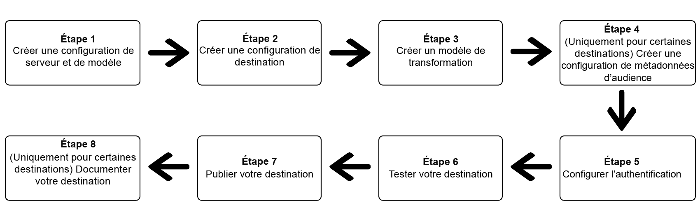

# Utilisation de la Destination SDK pour configurer une destination de diffusion en continu

## Présentation {#overview}

Cette page décrit l’utilisation des informations dans [Options de configuration dans le SDK Destinations](./configuration-options.md) et dans d’autres fonctionnalités de Destination SDK et documents de référence d’API pour configurer une [destination de diffusion en continu](/help/destinations/destination-types.md#streaming-destinations). Les étapes sont présentées dans l’ordre séquentiel ci-dessous.

## Conditions préalables {#prerequisites}

Avant de passer aux étapes illustrées ci-dessous, veuillez lire la section [Prise en main de la Destination SDK](./getting-started.md) pour plus d’informations sur l’obtention des informations d’authentification d’Adobe I/O nécessaires et d’autres conditions préalables requises pour utiliser les API Destination SDK.

## Étapes d’utilisation des options de configuration dans Destination SDK pour configurer votre destination {#steps}



## Étape 1 : Création d’une configuration de serveur et de modèle {#create-server-template-configuration}

Commencez par créer une configuration de serveur et de modèle à l’aide du `/destinations-server` point d’entrée (lecture) [Référence d’API](destination-server-api.md)). Pour plus d’informations sur la configuration du serveur et des modèles, reportez-vous à la section [Spécifications du serveur et des modèles](server-and-template-configuration.md) dans la section de référence.

Vous trouverez ci-dessous un exemple de configuration. Notez que le modèle de transformation du message dans la variable `requestBody.value` est abordé à l’étape 3, [Créer un modèle de transformation](./configure-destination-instructions.md#create-transformation-template).

```json
POST platform.adobe.io/data/core/activation/authoring/destination-servers

{
   "name":"Moviestar destination server",
   "destinationServerType":"URL_BASED",
   "urlBasedDestination":{
      "url":{
         "templatingStrategy":"PEBBLE_V1",
         "value":"https://api.moviestar.com/data/{{customerData.region}}/items"
      }
   },
   "httpTemplate":{
      "httpMethod":"POST",
      "requestBody":{
         "templatingStrategy":"PEBBLE_V1",
         "value":"insert after you create a template in step 3"
      },
      "contentType":"application/json"
   }
}
```

## Étape 2 : Création d’une configuration de destination {#create-destination-configuration}

Vous trouverez ci-dessous un exemple de configuration pour un modèle de destination, créé à l’aide de la fonction `/destinations` Point d’entrée de l’API. Pour plus d’informations sur ce paramétrage, reportez-vous à la section [Configuration de la destination](./destination-configuration.md).

Pour connecter la configuration du serveur et du modèle à l’étape 1 à cette configuration de destination, ajoutez l’ID d’instance du serveur et la configuration du modèle en tant que `destinationServerId` ici.

>[!IMPORTANT]
>
>Pour créer une destination correctement configurée, vous devez *must* ajouter au moins une identité cible dans `identityNamespaces`, comme illustré ci-dessous. Si aucune identité cible n’est configurée, les utilisateurs ne pourront pas passer le [Etape de mappage](/help/destinations/ui/activate-segment-streaming-destinations.md#mapping) du workflow d’activation.

```json
POST platform.adobe.io/data/core/activation/authoring/destinations
 
{
   "name":"Moviestar",
   "description":"Moviestar is a fictional destination, used for this example.",
   "status":"TEST",
   "customerAuthenticationConfigurations":[
      {
         "authType":"BEARER"
      }
   ],
   "customerDataFields":[
      {
         "name":"endpointsInstance",
         "type":"string",
         "title":"Select Endpoint",
         "description":"Moviestar manages several instances across the globe for REST endpoints that our customers are provisioned for. Select your endpoint in the dropdown list.",
         "isRequired":true,
         "enum":[
            "US",
            "EU",
            "APAC",
            "NZ"
         ]
      },
      {
         "name":"customerID",
         "type":"string",
         "title":"Moviestar Customer ID",
         "description":"Your customer ID in the Moviestar destination (e.g. abcdef).",
         "isRequired":true,
         "pattern":""
      }
   ],
   "uiAttributes":{
      "documentationLink":"http://www.adobe.com/go/destinations-moviestar-en",
      "category":"mobile",
      "connectionType":"Server-to-server",
      "frequency":"Streaming"
   },
   "identityNamespaces":{
      "external_id":{
         "acceptsAttributes":true,
         "acceptsCustomNamespaces":true
      },
      "another_id":{
         "acceptsAttributes":true,
         "acceptsCustomNamespaces":true
      }
   },
   "segmentMappingConfig":{
      "mapExperiencePlatformSegmentName":false,
      "mapExperiencePlatformSegmentId":false,
      "mapUserInput":false,
      "audienceTemplateId":"cbf90a70-96b4-437b-86be-522fbdaabe9c"
   },   
   "aggregation":{
      "aggregationType":"CONFIGURABLE_AGGREGATION",
      "configurableAggregation":{
         "aggregationPolicyId":null,
         "aggregationKey":{
            "includeSegmentId":true,
            "includeSegmentStatus":true,
            "includeIdentity":true,
            "oneIdentityPerGroup":true,
            "groups":null
         },
         "splitUserById":true,
         "maxBatchAgeInSecs":360,
         "maxNumEventsInBatch":100
      }
   },
   "destinationDelivery":[
      {
         "authenticationRule":"CUSTOMER_AUTHENTICATION",
         "destinationServerId":"9c77000a-4559-40ae-9119-a04324a3ecd4"
      }
   ]
}
```

## Étape 3 : Créer un modèle de transformation de message : utilisez un langage de modèle pour spécifier le format de sortie du message. {#create-transformation-template}

En fonction des payloads pris en charge par votre destination, vous devez créer un modèle qui transforme le format des données exportées à partir du format XDM Adobe dans un format pris en charge par votre destination. Voir des exemples de modèles dans la section [Utilisation d’une langue de modèle pour les transformations d’identité, d’attributs et d’appartenance aux segments](./message-format.md#using-templating) et utilisez la fonction [outil de création de modèles](./create-template.md) fourni par Adobe.

Une fois que vous avez conçu un modèle de transformation de messages qui fonctionne pour vous, ajoutez-le à la configuration de serveur et de modèle que vous avez créée à l’étape 1.

## Étape 4 : Création d’une configuration de métadonnées d’audience {#create-audience-metadata-configuration}

Pour certaines destinations, Destination SDK exige que vous configuriez une configuration de métadonnées d’audience afin de créer, mettre à jour ou supprimer des audiences par programmation dans votre destination. Voir [Gestion des métadonnées d’audience](./audience-metadata-management.md) pour plus d’informations sur le moment où vous devez configurer cette configuration et la manière de procéder.

Si vous utilisez une configuration de métadonnées d’audience, vous devez la connecter à la configuration de destination que vous avez créée à l’étape 2. Ajoutez l’ID d’instance de votre configuration de métadonnées d’audience à votre configuration de destination en tant que `audienceTemplateId`.

## Étape 5 : Configuration de l’authentification {#set-up-authentication}

Selon que vous spécifiez `"authenticationRule": "CUSTOMER_AUTHENTICATION"` ou `"authenticationRule": "PLATFORM_AUTHENTICATION"` dans la configuration de destination ci-dessus, vous pouvez configurer l’authentification pour votre destination à l’aide du `/destination` ou le `/credentials` point de terminaison .

* **Cas le plus courant**: Si vous avez sélectionné `"authenticationRule": "CUSTOMER_AUTHENTICATION"` dans la configuration de destination et votre destination prend en charge la méthode d’authentification OAuth 2, lisez [Authentification OAuth 2](./oauth2-authentication.md).
* Si vous avez sélectionné `"authenticationRule": "PLATFORM_AUTHENTICATION"`, reportez-vous à la section [Configuration de l’authentification](./authentication-configuration.md#when-to-use).

## Étape 6 : Tester votre destination {#test-destination}

Après avoir configuré votre destination à l’aide des points de terminaison de configuration des étapes précédentes, vous pouvez utiliser la variable [outil de test de destination](./test-destination.md) pour tester l’intégration entre Adobe Experience Platform et votre destination.

Dans le cadre du processus de test de votre destination, vous devez utiliser l’interface utilisateur de l’Experience Platform pour créer des segments que vous activerez vers votre destination. Reportez-vous aux deux ressources ci-dessous pour savoir comment créer des segments dans Experience Platform :

* [Création d’une page de documentation sur les segments](https://experienceleague.adobe.com/docs/experience-platform/segmentation/ui/overview.html?lang=en#create-segment)
* [Présentation vidéo de la création d’un segment](https://experienceleague.adobe.com/docs/platform-learn/tutorials/segments/create-segments.html?lang=en)

## Étape 7 : Publier votre destination {#publish-destination}

Après avoir configuré et testé votre destination, utilisez la variable [API de publication de destination](./destination-publish-api.md) pour envoyer votre configuration à Adobe en vue de la révision.

## Étape 8 : Document de votre destination {#document-destination}

Si vous êtes un fournisseur de logiciels indépendant (ISV) ou un intégrateur de système (SI), créez une [intégration productive](./overview.md#productized-custom-integrations), utilisez le [processus de documentation en libre-service](./docs-framework/documentation-instructions.md) pour créer une page de documentation du produit pour votre destination dans le [Catalogue des destinations Experience Platform](/help/destinations/catalog/overview.md).
