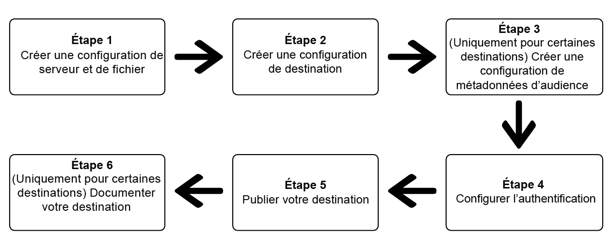

# (Version Beta) Utilisez Destination SDK pour configurer une destination basée sur des fichiers.

## Présentation {#overview}

>[!IMPORTANT]
>
>La fonctionnalité de configuration et d’envoi de destinations basées sur des fichiers à l’aide de Destination SDK d’Adobe Experience Platform est actuellement en version Beta. La documentation et la fonctionnalité peuvent changer.

Cette page décrit comment utiliser les informations contenues dans la section [Options de configuration dans Destination SDK](./configuration-options.md) et dans dʼautres documents de référence sur les fonctionnalités et lʼAPI Destination SDK pour configurer une [destination basée sur des fichiers](../../destinations/destination-types.md#file-based). Les étapes sont présentées dans l’ordre séquentiel ci-dessous.

## Conditions préalables {#prerequisites}

Avant dʼeffectuer les étapes illustrées ci-dessous, consultez la page [Prise en main de Destination SDK](./getting-started.md) pour plus d’informations sur l’obtention des informations d’authentification Adobe I/O nécessaires et d’autres conditions préalables requises pour utiliser les API Destination SDK.

## Étapes à suivre pour utiliser les options de configuration de Destination SDK afin de configurer votre destination. {#steps}



## Étape 1 : créer une configuration de serveur et de fichier {#create-server-file-configuration}

Commencez par créer une configuration de serveur et de fichier à l’aide du point d’entrée `/destinations-server` (Consultez la section [Référence d’API](./destination-server-api.md)).

Vous trouverez ci-dessous un exemple de configuration pour une destination [!DNL Amazon S3]. Pour configurer d’autres types de destinations basées sur des fichiers, consultez leurs [configurations de serveur](server-and-file-configuration.md).

**Format d’API**

```http
POST platform.adobe.io/data/core/activation/authoring/destination-servers
```

```json
{
    "name": "S3 destination",
    "destinationServerType": "FILE_BASED_S3",
    "fileBasedS3Destination": {
        "bucket": {
            "templatingStrategy": "PEBBLE_V1",
            "value": "{{customerData.bucket}}"
        },
        "path": {
            "templatingStrategy": "PEBBLE_V1",
            "value": "{{customerData.path}}"
        }
    },
    "fileConfigurations": {
        "compression": {
            "templatingStrategy": "PEBBLE_V1",
            "value": "{{customerData.compression}}"
        },
        "fileType": {
            "templatingStrategy": "PEBBLE_V1",
            "value": "{{customerData.fileType}}"
        },
        "csvOptions": {
            "quote": {
                "templatingStrategy": "NONE",
                "value": "\""
            },
            "quoteAll": {
                "templatingStrategy": "NONE",
                "value": "false"
            },
            "escape": {
                "templatingStrategy": "NONE",
                "value": "\\"
            },
            "escapeQuotes": {
                "templatingStrategy": "NONE",
                "value": "true"
            },
            "header": {
                "templatingStrategy": "NONE",
                "value": "true"
            },
            "ignoreLeadingWhiteSpace": {
                "templatingStrategy": "NONE",
                "value": "true"
            },
            "ignoreTrailingWhiteSpace": {
                "templatingStrategy": "NONE",
                "value": "true"
            },
            "nullValue": {
                "templatingStrategy": "NONE",
                "value": ""
            },
            "dateFormat": {
                "templatingStrategy": "NONE",
                "value": "yyyy-MM-dd"
            },
            "timestampFormat": {
                "templatingStrategy": "NONE",
                "value": "yyyy-MM-dd'T':mm:ss[.SSS][XXX]"
            },
            "charToEscapeQuoteEscaping": {
                "templatingStrategy": "NONE",
                "value": "\\"
            },
            "emptyValue": {
                "templatingStrategy": "NONE",
                "value": ""
            },
            "lineSep": {
                "templatingStrategy": "NONE",
                "value": "\n"
            }
        }
    }
}
```

## Étape 2 : créer une configuration de destination {#create-destination-configuration}

Vous trouverez ci-dessous un exemple de configuration de destination, créée à l’aide du point d’entrée de l’API `/destinations`. Pour plus d’informations sur cette configuration, consultez la section [Configuration de la destination](./file-based-destination-configuration.md).

Pour connecter la configuration du serveur et des fichiers de l’étape 1 à cette configuration de destination, ajoutez l’ID d’instance du serveur et la configuration de modèle en tant que `destinationServerId` ici.

**Format d’API**

```http
POST platform.adobe.io/data/core/activation/authoring/destinations
```

```json
{
    "name": "Amazon S3 destination",
    "description": "Amazon S3 destination is a fictional destination, used for this example.",
    "releaseNotes": "Test",
    "status": "Test",
    "customerAuthenticationConfigurations": [
        {
            "authType": "S3"
        }
    ],
    "customerEncryptionConfigurations": [],
    "customerDataFields": [
        {
            "name": "bucket",
            "title": "Amazon S3 bucket name",
            "description": "Enter the Amazon S3 Bucket name that will host the exported files.",
            "type": "string",
            "isRequired": true,
            "readOnly": false,
            "hidden": false
        },
        {
            "name": "path",
            "title": "Amazon S3 path",
            "description": "Enter Amazon S3 folder path",
            "type": "string",
            "isRequired": true,
            "pattern": "^[A-Za-z]+$",
            "readOnly": false,
            "hidden": false
        },
        {
            "name": "compression",
            "title": "Select compression type",
            "description": "Select the file compression type used by the exported files.",
            "type": "string",
            "isRequired": true,
            "readOnly": false,
            "enum": [
                "GZIP",
                "NONE",
                "bzip2",
                "lz4",
                "snappy",
                "deflate"
            ]
        },
        {
            "name": "fileType",
            "title": "Select a file format",
            "description": "Select the file format to be used by the exported files.",
            "type": "string",
            "isRequired": true,
            "readOnly": false,
            "hidden": false,
            "enum": [
                "csv",
                "json",
                "parquet"
            ],
            "default": "csv"
        }
    ],
    "uiAttributes": {
        "documentationLink": "https://www.adobe.io/apis/experienceplatform.html",
        "category": "S3",
        "iconUrl": "https://dc5tqsrhldvnl.cloudfront.net/2/90048/da276e30c730ce6cd666c8ca78360df21.png",
        "connectionType": "S3",
        "flowRunsSupported": true,
        "monitoringSupported": true,
        "frequency": "Batch"
    },
    "destinationDelivery": [
        {
            "deliveryMatchers": [
                {
                    "type": "SOURCE",
                    "value": [
                        "batch"
                    ]
                }
            ],
            "authenticationRule": "CUSTOMER_AUTHENTICATION",
            "destinationServerId": "eec25bde-4f56-4c02-a830-9aa9ec73ee9d"
        }
    ],
    "schemaConfig": {
        "profileRequired": true,
        "segmentRequired": true,
        "identityRequired": true
    },
    "batchConfig": {
        "allowMandatoryFieldSelection": true,
        "allowDedupeKeyFieldSelection": true,
        "defaultExportMode": "DAILY_FULL_EXPORT",
        "allowedExportMode": [
            "DAILY_FULL_EXPORT",
            "FIRST_FULL_THEN_INCREMENTAL"
        ],
        "allowedScheduleFrequency": [
            "DAILY",
            "EVERY_3_HOURS",
            "EVERY_6_HOURS",
            "EVERY_8_HOURS",
            "EVERY_12_HOURS",
            "ONCE"
        ],
        "defaultFrequency": "DAILY",
        "defaultStartTime": "00:00"
    },
    "backfillHistoricalProfileData": true
}
```

## Étape 3 : créer une configuration de métadonnées d’audience {#create-audience-metadata-configuration}

Pour certaines destinations, Destination SDK exige que vous configuriez des métadonnées d’audience afin de créer, mettre à jour ou supprimer des audiences par programmation dans votre destination. Pour plus d’informations sur le moment et la manière de configurer cette configuration, consultez la section [Gestion des métadonnées d’audience](./audience-metadata-management.md).

Si vous utilisez une configuration de métadonnées d’audience, vous devez la connecter à la configuration de destination créée à l’étape 2. Ajoutez l’ID d’instance de votre configuration de métadonnées d’audience à votre configuration de destination en tant que `audienceTemplateId`.

## Étape 4 : configurer l’authentification {#set-up-authentication}

Selon que vous spécifiez `"authenticationRule": "CUSTOMER_AUTHENTICATION"` ou `"authenticationRule": "PLATFORM_AUTHENTICATION"` dans la configuration de destination ci-dessus, vous pouvez configurer l’authentification pour votre destination à l’aide du point d’entrée `/destination` ou `/credentials`.

* Si vous avez sélectionné `"authenticationRule": "CUSTOMER_AUTHENTICATION"` dans la configuration des destinations, reportez-vous aux sections suivantes pour connaître les types d’authentification pris en charge par Destination SDK pour les destinations basées sur des fichiers :

   * [Authentification Amazon S3](authentication-configuration.md#s3)
   * [Chaîne de connexion Azure](authentication-configuration.md#blob)
   * [Principal de service Azure](authentication-configuration.md#adls)
   * [Authentification SFTP avec clé SSH](authentication-configuration.md#sftp-ssh)
   * [Authentification SFTP avec mot de passe](authentication-configuration.md#sftp-password)

* Si vous avez sélectionné `"authenticationRule": "PLATFORM_AUTHENTICATION"`, reportez-vous à la section [Configuration de l’authentification](./authentication-configuration.md#when-to-use).


<!-- ## Step 5: Test your destination {#test-destination}

After setting up your destination using the configuration endpoints in the previous steps, you can use the [destination testing tool](./create-template.md) to test the integration between Adobe Experience Platform and your destination.

As part of the process to test your destination, you must use the Experience Platform UI to create segments, which you will activate to your destination. Refer to the two resources below for instructions how to create segments in Experience Platform:

* [Create a segment documentation page](https://experienceleague.adobe.com/docs/experience-platform/segmentation/ui/overview.html?lang=en#create-segment)
* [Create a segment video walkthrough](https://experienceleague.adobe.com/docs/platform-learn/tutorials/segments/create-segments.html?lang=en) -->

## Étape 5 : publier la destination {#publish-destination}

Une fois la destination configurée et testée, utilisez l’[API de publication de destinations](./destination-publish-api.md) pour envoyer votre configuration à Adobe pour révision.

## Étape 6 : documenter la destination {#document-destination}

Si vous êtes un fournisseur de logiciels indépendant (ISV) ou un intégrateur de système (SI) créant une [intégration personnalisée](./overview.md#productized-custom-integrations), utilisez le [processus de documentation en libre-service](./docs-framework/documentation-instructions.md) pour créer une page de documentation du produit pour votre destination dans le [Catalogue des destinations Experience Platform](/help/destinations/catalog/overview.md).
