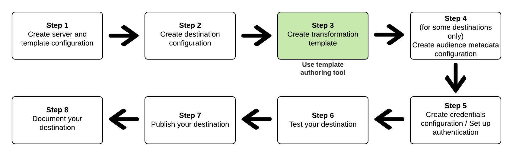

# Créer et tester un modèle de transformation de message {#create-template}

## Présentation {#overview}

Dans le cadre de Destination SDK, Adobe fournit des outils de développement pour vous aider à configurer et tester votre destination. Cette page décrit comment créer et tester un modèle de transformation de messages. Pour plus d’informations sur la manière de tester votre destination, reportez-vous à la section [Test de votre configuration de destination](./test-destination.md).

À **créer et tester un modèle de transformation de message ;** entre le schéma cible de Adobe Experience Platform et le format de message pris en charge par votre destination, utilisez la méthode *Outil de création de modèles* décrit plus loin.  En savoir plus sur la transformation des données entre le schéma source et le schéma cible dans la section [document format du message](./message-format.md#using-templating).

L’illustration ci-dessous montre comment la création et le test d’un modèle de transformation de message s’insèrent dans le [workflow de configuration des destinations](./configure-destination-instructions.md) dans Destination SDK :



## Pourquoi vous devez créer et tester un modèle de transformation de message {#why-create-message-transformation-template}

L’une des premières étapes de la création de votre destination dans Destination SDK consiste à réfléchir à la manière dont le format de données pour l’appartenance à un segment, les identités et les attributs de profil est transformé lors de l’exportation de Adobe Experience Platform vers votre destination. Obtenez des informations sur la transformation entre le schéma XDM d’Adobe et votre schéma de destination dans la section [document format du message](./message-format.md#using-templating).

Pour que la transformation réussisse, vous devez fournir un modèle de transformation semblable à celui-ci : [Créer un modèle qui envoie des segments, des identités et des attributs de profil](./message-format.md#segments-identities-attributes).

Adobe fournit un outil de modèle qui vous permet de créer et de tester le modèle de message qui transforme les données du format XDM d’Adobe dans le format pris en charge par votre destination. L’outil comporte deux points de terminaison API que vous pouvez utiliser :
* Utilisez la variable *exemple d’API de modèle* pour obtenir un exemple de modèle.
* Utilisez la variable *API de modèle de rendu* pour effectuer le rendu de l’exemple de modèle afin de comparer le résultat au format de données attendu de votre destination. Après avoir comparé les données exportées au format de données attendu par votre destination, vous pouvez modifier le modèle. Ainsi, les données exportées que vous générez correspondent au format de données attendu par votre destination.

## Etapes à suivre avant de créer le modèle {#prerequisites}

Avant de vous préparer à créer le modèle, procédez comme suit :

1. [Création d’une configuration de serveur de destination](./destination-server-api.md). Le modèle que vous allez générer diffère en fonction de la valeur fournie pour la variable `maxUsersPerRequest` .
   * Utilisation `maxUsersPerRequest=1` si vous souhaitez qu’un appel d’API à votre destination inclue un seul profil, ainsi que ses qualifications de segment, ses identités et ses attributs de profil.
   * Utilisation `maxUsersPerRequest` avec une valeur supérieure à un si vous souhaitez qu’un appel d’API vers votre destination inclue plusieurs profils, ainsi que leurs qualifications de segments, leurs identités et leurs attributs de profil.
2. [Création d’une configuration de destination](./destination-configuration-api.md#create) et ajoutez l’identifiant de la configuration du serveur de destination dans `destinationDelivery.destinationServerId`.
3. [Obtention de l’identifiant de la configuration de destination](./destination-configuration-api.md#retrieve-list) que vous venez de créer, afin que vous puissiez l’utiliser dans l’outil de création de modèles.

## Utilisation de l’exemple d’API de modèle et de l’API de modèle de rendu pour créer un modèle pour votre destination {#iterative-process}

>[!TIP]
>
>Avant de concevoir et de modifier votre modèle de transformation des messages, vous pouvez commencer par appeler le [point d’entrée de l’API de modèle de rendu](./render-template-api.md#render-exported-data) avec un modèle simple qui exporte vos profils bruts sans appliquer de transformations. La syntaxe du modèle simple est la suivante : <br> `"template": "{{profile|raw}}}"`

Le processus d’obtention et de test du modèle est itératif. Répétez les étapes ci-dessous jusqu’à ce que les profils exportés correspondent au format de données attendu de votre destination.

1. Tout d’abord, [obtenir un exemple de modèle](./create-template.md#sample-template-api).
2. Utilisez l’exemple de modèle comme point de départ pour créer votre propre version préliminaire.
3. Appelez le [point d’entrée de l’API de modèle de rendu](./create-template.md#render-template-api) avec votre propre modèle. Adobe génère des exemples de profils en fonction de votre schéma et renvoie le résultat ou les erreurs rencontrées.
4. Comparez les données exportées au format de données attendu par votre destination. Si nécessaire, modifiez le modèle.
5. Répétez cette procédure jusqu’à ce que les profils exportés correspondent au format de données attendu de votre destination.

## Obtention d’un exemple de modèle à l’aide de l’API Exemple de modèle {#sample-template-api}

>[!NOTE]
>
>Pour consulter la documentation de référence complète sur l’API, reportez-vous à la section [Obtention d’un exemple d’opération d’API de modèle](./sample-template-api.md).

Ajoutez un ID de destination à l’appel, comme illustré ci-dessous, et la réponse renvoie un exemple de modèle correspondant à l’ID de destination.

```shell
curl --location --request GET 'https://platform.adobe.io/data/core/activation/authoring/testing/template/sample/5114d758-ce71-43ba-b53e-e2a91d67b67f' \
--header 'Content-Type: application/json' \
--header 'Accept: application/json' \
--header 'x-api-key: {API_KEY}' \
--header 'Authorization: Bearer {ACCESS_TOKEN}' \
--header 'x-gw-ims-org-id: {IMS_ORG}' \
--header 'x-sandbox-name: {SANDBOX_NAME}' \
```

Si l’identifiant de destination que vous fournissez correspond à une configuration de destination avec [agrégation des meilleurs efforts](./destination-configuration.md#best-effort-aggregation) et `maxUsersPerRequest=1` dans la stratégie d’agrégation, la requête renvoie un exemple de modèle similaire à celui-ci :

```python
{#- THIS is an example template for a single profile -#}
{#- A '-' at the beginning or end of a tag removes all whitespace on that side of the tag. -#}
{
    "identities": [
    
    
        
        {
            "type": "{{ namespace }}",
            "id": "{{ identity.id }}"
        },
        ,
    
    ],
    "AdobeExperiencePlatformSegments": {
        "add": [
        
            "{{ segment.key }}",
        
        ],
        "remove": [
        {#- Alternative syntax for filtering segments by status: -#}
        
            "{{ segment.key }}",
        
        ]
    }
}
```

Si l’identifiant de destination que vous fournissez correspond à un modèle de serveur de destination avec [agrégation configurable](./destination-configuration.md#configurable-aggregation) ou [agrégation des meilleurs efforts](./destination-configuration.md#best-effort-aggregation) avec `maxUsersPerRequest` supérieur à un, la requête renvoie un exemple de modèle similaire à celui-ci :

```python
{#- THIS is an example template for multiple profiles -#}
{#- A '-' at the beginning or end of a tag removes all whitespace on that side of the tag. -#}
{
    "profiles": [
    
        {
            "identities": [
            
            
                
                {
                    "type": "{{ namespace }}",
                    "id": "{{ identity.id }}"
                },
                ,
            
            ],
            "AdobeExperiencePlatformSegments": {
                "add": [
                
                    "{{ segment.key }}",
                
                ],
                "remove": [
                {#- Alternative syntax for filtering segments by status: -#}
                
                    "{{ segment.key }}",
                
                ]
            }
        },
    
    ]
}
```

## Caractère et échappement du modèle {#character-escape-template}

Avant d’utiliser le modèle pour effectuer le rendu des profils qui correspondent au format attendu de votre destination, vous devez ajouter un caractère d’échappement au modèle, comme indiqué dans l’enregistrement d’écran ci-dessous.


Vous pouvez utiliser un outil d’échappement des caractères en ligne. La démonstration ci-dessus utilise la méthode [Formateur d’échappement JSON](https://jsonformatter.org/json-escape).

## API de modèle de rendu {#render-template-api}

Après avoir créé un modèle de transformation de message à l’aide de la variable [exemple d’API de modèle](./create-template.md#sample-template-api), vous pouvez [rendu du modèle ;](./render-template-api.md) pour générer les données exportées en fonction de celle-ci. Cela vous permet de vérifier si les profils que Adobe Experience Platform exporterait vers votre destination correspondent au format prévu de votre destination.

Reportez-vous à la référence d’API pour obtenir des exemples d’appels que vous pouvez effectuer :

* [Rendu d’un modèle sans profils envoyés dans le corps](./render-template-api.md#multiple-profiles-no-body)
* [Rendu d’un modèle avec des profils envoyés dans le corps](./render-template-api.md#multiple-profiles-with-body)

Modifiez le modèle et effectuez des appels vers le point de terminaison de l’API du modèle de rendu jusqu’à ce que les profils exportés correspondent au format de données attendu de votre destination.

## Ajoutez votre modèle avec séquence d’échappement aux caractères à la configuration du serveur de destination.

Une fois que vous êtes satisfait de votre modèle de transformation de messages, ajoutez-le à votre [configuration du serveur de destination](./server-and-template-configuration.md), dans `httpTemplate.requestBody.value`.
