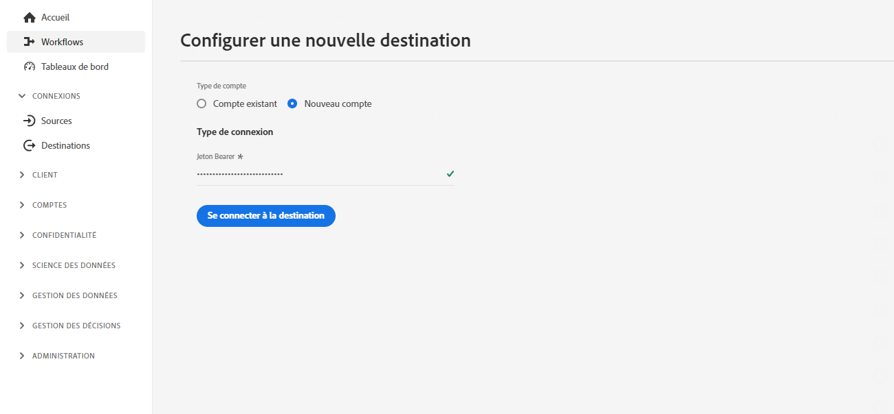
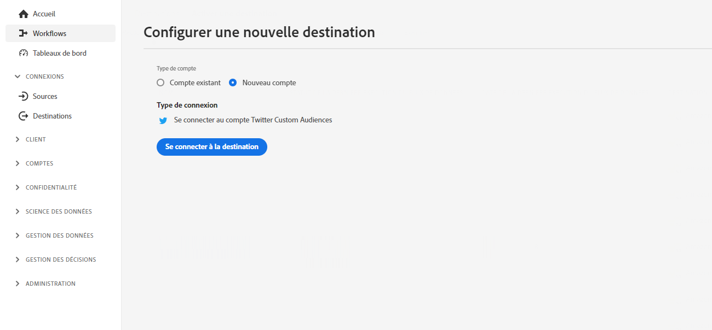
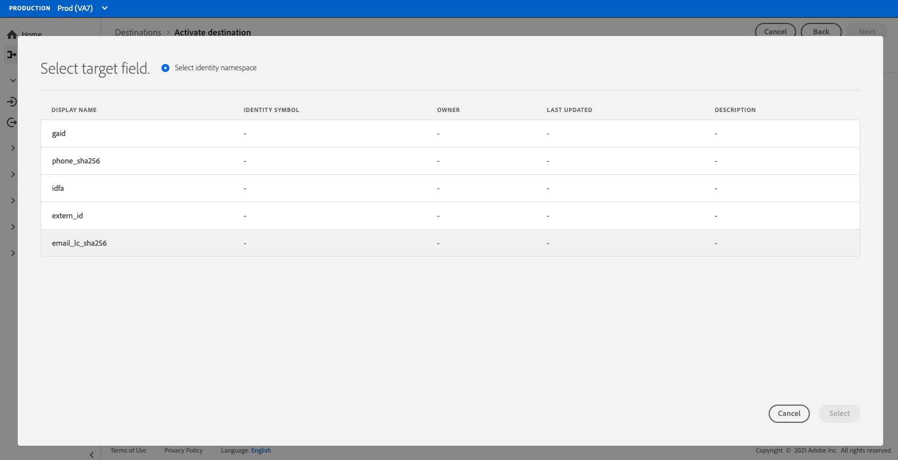

# Configuration de destination de diffusion en continu {#destination-configuration}

## Présentation {#overview}

Cette configuration vous permet d’indiquer les informations essentielles à votre destination de diffusion en continu, telles que votre nom de destination, votre catégorie, votre description, etc. Les paramètres de cette configuration déterminent également comment les utilisateurs d’Experience Platform s’authentifient pour votre destination, comment ils apparaissent dans l’interface utilisateur d’Experience Platform ainsi que les identités qui peuvent être exportées vers votre destination.

Cette configuration connecte également les autres configurations requises pour que votre destination fonctionne (métadonnées de serveur de destination et d’audience) à celle-ci. Découvrez comment vous pouvez référencer les deux configurations dans une [section ci-dessous](./destination-configuration.md#connecting-all-configurations).

Vous pouvez configurer la fonctionnalité décrite dans ce document à l’aide du point d’entrée de l’API `/authoring/destinations`. Consultez [Opérations de point d’entrée de l’API Destinations](./destination-configuration-api.md) pour obtenir une liste complète des opérations que vous pouvez effectuer sur le point d’entrée.

## Exemple de configuration de diffusion en continu {#example-configuration}

Voici un exemple de configuration d’une destination fictive de diffusion en continu, Moviestar, qui dispose de points d’entrée dans quatre endroits sur le globe. La destination appartient à la catégorie des destinations mobiles.

```json
{
   "name":"Moviestar",
   "description":"Moviestar is a fictional destination, used for this example.",
   "status":"TEST",
   "customerAuthenticationConfigurations":[
      {
         "authType":"BEARER"
      }
   ],
   "customerDataFields":[
      {
         "name":"endpointsInstance",
         "type":"string",
         "title":"Select Endpoint",
         "description":"Moviestar manages several instances across the globe for REST endpoints that our customers are provisioned for. Select your endpoint in the dropdown list.",
         "isRequired":true,
         "enum":[
            "US",
            "EU",
            "APAC",
            "NZ"
         ]
      },
      {
         "name":"customerID",
         "type":"string",
         "title":"Moviestar Customer ID",
         "description":"Your customer ID in the Moviestar destination (e.g. abcdef).",
         "isRequired":true,
         "pattern":"^[A-Za-z]+$"
      }
   ],
   "uiAttributes":{
      "documentationLink":"http://www.adobe.com/go/destinations-moviestar-en",
      "category":"mobile",
      "connectionType":"Server-to-server",
      "frequency":"Streaming"
   },
   "identityNamespaces":{
      "external_id":{
         "acceptsAttributes":true,
         "acceptsCustomNamespaces":true,
         "acceptedGlobalNamespaces":{
            "Email":{
               
            }
         }
      },
      "another_id":{
         "acceptsAttributes":true,
         "acceptsCustomNamespaces":true
      }
   },
   "schemaConfig":{
      "profileRequired":false,
      "segmentRequired":true,
      "identityRequired":true
   },
   "destinationDelivery":[
      {
         "authenticationRule":"CUSTOMER_AUTHENTICATION",
         "destinationServerId":"9c77000a-4559-40ae-9119-a04324a3ecd4"
      }
   ],
   "segmentMappingConfig":{
      "mapExperiencePlatformSegmentName":false,
      "mapExperiencePlatformSegmentId":false,
      "mapUserInput":false,
      "audienceTemplateId":"cbf90a70-96b4-437b-86be-522fbdaabe9c"
   },
   "aggregation":{
      "aggregationType":"CONFIGURABLE_AGGREGATION",
      "configurableAggregation":{
         "splitUserById":true,
         "maxBatchAgeInSecs":2400,
         "maxNumEventsInBatch":5000,
         "aggregationKey":{
            "includeSegmentId":true,
            "includeSegmentStatus":true,
            "includeIdentity":true,
            "oneIdentityPerGroup":false,
            "groups":[
               {
                  "namespaces":[
                     "IDFA",
                     "GAID"
                  ]
               },
               {
                  "namespaces":[
                     "EMAIL"
                  ]
               }
            ]
         }
      }
   },
   "backfillHistoricalProfileData":true
}
```

| Paramètre | Type | Description |
|---------|----------|------|
| `name` | Chaîne | Indique le titre de votre destination dans le catalogue Experience Platform. |
| `description` | Chaîne | Fournissez une description de votre carte de destination dans le catalogue des destinations Experience Platform. N’utilisez pas plus de 4 à 5 phrases. |
| `status` | Chaîne | Indique le statut du cycle de vie de la carte de destination. Les valeurs acceptées sont `TEST`, `PUBLISHED` et `DELETED`. Utilisez `TEST` lorsque vous configurez votre destination pour la première fois. |

{style=&quot;table-layout:auto&quot;}

## Configurations de l’authentification du client {#customer-authentication-configurations}

Cette section de la configuration des destinations génère la page [Configurer une nouvelle destination](/help/destinations/ui/connect-destination.md) dans l’interface utilisateur d’Experience Platform, où les utilisateurs connectent Experience Platform aux comptes qu’ils possèdent avec votre destination. Selon l’option d’authentification que vous indiquez dans le champ `authType`, la page Experience Platform est générée pour les utilisateurs comme suit :

### Authentification du porteur

Lorsque vous configurez le type d’authentification du porteur, les utilisateurs doivent saisir le jeton du porteur qu’ils obtiennent de votre destination.



### Authentification OAuth 2

Les utilisateurs sélectionnent **[!UICONTROL Se connecter à la destination]** pour déclencher le flux d’authentification OAuth 2 vers votre destination, comme illustré dans l’exemple ci-dessous pour la destination Audiences personnalisées de Twitter. Pour plus d’informations sur la configuration de l’authentification OAuth 2 à votre point d’entrée de destination, consultez la page [Authentification OAuth 2 de Destination SDK](./oauth2-authentication.md).



| Paramètre | Type | Description |
|---------|----------|------|
| `customerAuthenticationConfigurations` | Chaîne | Indique la configuration utilisée pour authentifier les clients Experience Platform sur votre serveur. Consultez `authType` ci-dessous pour les valeurs acceptées. |
| `authType` | Chaîne | Les valeurs acceptées pour les destinations de diffusion en continu sont les suivantes :<ul><li>`BEARER`. Si votre destination prend en charge l’authentification du porteur, définissez `"authType":"Bearer"` et  `"authenticationRule":"CUSTOMER_AUTHENTICATION"` dans la [section de diffusion de destination](./destination-configuration.md).</li><li>`OAUTH2`. Si votre destination prend en charge l’authentification OAuth 2, définissez `"authType":"OAUTH2"` et ajoutez les champs requis pour OAuth 2, comme indiqué à la page [Authentification OAuth 2 de Destination SDK](./oauth2-authentication.md). En outre, définissez `"authenticationRule":"CUSTOMER_AUTHENTICATION"` dans la [section de diffusion de destination](./destination-configuration.md).</li> |

{style=&quot;table-layout:auto&quot;}

## Champs de données client {#customer-data-fields}

Utilisez cette section pour demander aux utilisateurs de renseigner des champs personnalisés, spécifiques à votre destination, lors de la connexion à la destination dans l’interface utilisateur d’Experience Platform. La configuration se reflète dans le flux d’authentification comme illustré ci-dessous :


| Paramètre | Type | Description |
|---------|----------|------|
| `name` | Chaîne | Attribuez un nom au champ personnalisé que vous introduisez. |
| `type` | Chaîne | Indique le type de champ personnalisé que vous introduisez. Les valeurs acceptées sont les suivantes : `string`, `object` ou `integer`. |
| `title` | Chaîne | Indique le nom du champ tel qu’il est affiché par les clients dans l’interface utilisateur d’Experience Platform. |
| `description` | Chaîne | Fournissez une description du champ personnalisé. |
| `isRequired` | Booléen | Indique si ce champ est requis dans le workflow de configuration de destination. |
| `enum` | Chaîne | Rend le champ personnalisé sous forme de menu déroulant et répertorie les options disponibles pour l’utilisateur. |
| `pattern` | Chaîne | Impose un modèle pour le champ personnalisé, le cas échéant. Utilisez des expressions régulières pour appliquer un modèle. Par exemple, si vos identifiants de client n’incluent pas de chiffres ou de traits de soulignement, saisissez `^[A-Za-z]+$` dans ce champ. |

{style=&quot;table-layout:auto&quot;}

## Attributs de l’interface utilisateur {#ui-attributes}

Cette section fait référence aux éléments de l’interface utilisateur dans la configuration ci-dessus qu’Adobe doit utiliser pour votre destination dans l’interface utilisateur d’Adobe Experience Platform. Consultez le tableau ci-dessous :

| Paramètre | Type | Description |
|---------|----------|------|
| `documentationLink` | Chaîne | Fait référence à la page de documentation du [Catalogue des destinations](https://experienceleague.adobe.com/docs/experience-platform/destinations/catalog/overview.html?lang=fr#catalog) pour votre destination. Utilisez `http://www.adobe.com/go/destinations-YOURDESTINATION-en`, où `YOURDESTINATION` est le nom de votre destination. Par exemple, pour une destination appelée Moviestar, procédez comme suit : `http://www.adobe.com/go/destinations-moviestar-en` |
| `category` | Chaîne | Fait référence à la catégorie affectée à votre destination dans Adobe Experience Platform. Pour plus d’informations, consultez la section [Catégories de destinations](https://experienceleague.adobe.com/docs/experience-platform/destinations/destination-types.html?lang=fr). Utilisez l’une des valeurs suivantes :`adobeSolutions, advertising, analytics, cdp, cloudStorage, crm, customerSuccess, database, dmp, ecommerce, email, emailMarketing, enrichment, livechat, marketingAutomation, mobile, personalization, protocols, social, streaming, subscriptions, surveys, tagManagers, voc, warehouses, payments`. |
| `connectionType` | Chaîne | `Server-to-server` est actuellement la seule option disponible. |
| `frequency` | Chaîne | Fait référence au type d’exportation des données pris en charge par la destination. Valeurs prises en charge : <ul><li>`Streaming`</li><li>`Batch`</li></ul> |

{style=&quot;table-layout:auto&quot;}

## Configuration du schéma dans l’étape de mappage {#schema-configuration}


Utilisez les paramètres de la section `schemaConfig` pour activer l’étape de mappage du workflow d’activation de destination. En utilisant les paramètres décrits ci-dessous, vous pouvez déterminer si les utilisateurs Experience Platform peuvent mapper des attributs de profil et/ou des identités au schéma souhaité du côté de votre destination.

| Paramètre | Type | Description |
|---------|----------|------|
| `profileFields` | Tableau | *Non affiché dans l’exemple de configuration ci-dessus.* Lorsque vous ajoutez des champs `profileFields` prédéfinis, les utilisateurs Experience Platform ont la possibilité de mapper les attributs de Platform aux attributs prédéfinis du côté de votre destination. |
| `profileRequired` | Booléen | Utilisez `true` si les utilisateurs doivent être en mesure de mapper les attributs de profil d’Experience Platform aux attributs personnalisés du côté de votre destination, tel qu’indiqué dans l’exemple de configuration ci-dessus. |
| `segmentRequired` | Booléen | Utilisez toujours `segmentRequired:true`. |
| `identityRequired` | Booléen | Utilisez `true` si les utilisateurs doivent être en mesure de mapper des espaces de noms d’identité d’Experience Platform à votre schéma souhaité. |

{style=&quot;table-layout:auto&quot;}


## Identités et attributs {#identities-and-attributes}

Les paramètres de cette section déterminent les identités acceptées par votre destination. Cette configuration renseigne également les identités et les attributs cibles dans l’[étape de mappage](/help/destinations/ui/activate-segment-streaming-destinations.md#mapping) de l’interface utilisateur dʼExperience Platform, où les utilisateurs mappent les identités et les attributs de leurs schémas XDM au schéma de votre destination.

Vous devez indiquer quelles identités [!DNL Platform] les clients peuvent exporter vers votre destination. Voici quelques exemples : [!DNL Experience Cloud ID], e-mail haché, identifiant de l’appareil ([!DNL IDFA], [!DNL GAID]). Ces valeurs sont les suivantes : espaces de noms d’identité [!DNL Platform] que les clients peuvent mapper aux espaces de noms d’identité de votre destination. Vous pouvez également indiquer si les clients peuvent mapper des espaces de noms personnalisés à des identités prises en charge par votre destination.

Les espaces de noms d’identité ne nécessitent pas de correspondance 1-1 entre [!DNL Platform] et votre destination.
Par exemple, les clients peuvent mapper un espace de nom [!DNL Platform] [!DNL IDFA] à un espace de noms [!DNL IDFA] depuis votre destination ou mapper le même espace de noms [!DNL Platform] [!DNL IDFA] à un espace de noms [!DNL Customer ID] dans votre destination.

En savoir plus dans la section [Présentation des espaces de noms d’identité](https://experienceleague.adobe.com/docs/experience-platform/identity/namespaces.html?lang=fr).



| Paramètre | Type | Description |
|---------|----------|------|
| `acceptsAttributes` | Booléen | Indique si votre destination accepte les attributs de profil standard. En règle générale, ces attributs apparaissent en surbrillance dans la documentation des partenaires. |
| `acceptsCustomNamespaces` | Booléen | Indique si les clients peuvent configurer des espaces de noms personnalisés dans votre destination. |
| `transformation` | Chaîne | *Non affiché dans l’exemple de configuration*. Utilisé, par exemple, lorsque le client [!DNL Platform] dispose d’adresses électroniques simples en tant qu’attribut et que votre plateforme accepte les e-mails hachés uniquement. Dans cet objet, vous pouvez effectuer la transformation qui doit être appliquée (par exemple, transformer l’e-mail en minuscules, puis en hachage). Pour consulter un exemple, reportez-vous à la section `requiredTransformation` dans la [référence de l’API de configuration de destination](./destination-configuration-api.md#update). |
| `acceptedGlobalNamespaces` | - | Utilisé si votre plateforme accepte les [espaces de noms d’identité standard](https://experienceleague.adobe.com/docs/experience-platform/identity/namespaces.html?lang=fr#standard-namespaces) (IDFA, par exemple), afin que vous puissiez empêcher les utilisateurs de Platform de sélectionner uniquement ces espaces de noms d’identité. |

{style=&quot;table-layout:auto&quot;}

## Diffusion de destination {#destination-delivery}

| Paramètre | Type | Description |
|---------|----------|------|
| `authenticationRule` | Chaîne | Indique comment les clients [!DNL Platform] se connectent à votre destination. Les valeurs acceptées sont les suivantes : `CUSTOMER_AUTHENTICATION`, `PLATFORM_AUTHENTICATION`, `NONE`. <br> <ul><li>Utilisez `CUSTOMER_AUTHENTICATION` si les clients Platform se connectent à votre système par le biais d’un nom d’utilisateur et d’un mot de passe, d’un jeton porteur ou d’une autre méthode d’authentification. Par exemple, sélectionnez cette option si vous avez également sélectionné `authType: OAUTH2` ou `authType:BEARER` dans `customerAuthenticationConfigurations`. </li><li> Utilisez `PLATFORM_AUTHENTICATION` s’il existe un système d’authentification global entre Adobe et votre destination et que le client [!DNL Platform] n’a pas besoin de fournir d’informations d’authentification pour se connecter à votre destination. Dans ce cas, vous devez créer des informations d’identification à l’aide de la configuration des [Informations d’identification](./credentials-configuration-api.md). </li><li>Utilisez `NONE` si aucune authentification n’est requise pour envoyer des données à votre plateforme de destination. </li></ul> |
| `destinationServerId` | Chaîne | L’`instanceId` de la [configuration du serveur de destination](./destination-server-api.md) utilisé pour cette destination. |

{style=&quot;table-layout:auto&quot;}

## Configuration du mappage de segments {#segment-mapping}


Cette section de la configuration de destination concerne la manière dont les métadonnées de segment telles que les noms ou les identifiants doivent être partagées entre Experience Platform et votre destination.

Par le biais de `audienceTemplateId`, cette section associe également cette configuration à la [configuration des métadonnées d’audience](./audience-metadata-management.md).

Les paramètres affichés dans la configuration ci-dessus sont décrits dans la [référence de l’API de point d’entrée des destinations](./destination-configuration-api.md).

## Stratégie d’agrégation {#aggregation}


Cette section vous permet de définir les stratégies d’agrégation qu’Experience Platform doit utiliser lors de l’exportation de données vers votre destination.

Une stratégie d’agrégation détermine la manière dont les profils exportés sont combinés dans les exportations de données. Les options disponibles sont les suivantes :
* Agrégation des meilleurs efforts
* Agrégation configurable (affichée dans la configuration ci-dessus)

Lisez la section relative à l’[utilisation de modèles](./message-format.md#using-templating) ainsi que les [exemples de clés d’agrégation](./message-format.md#template-aggregation-key) pour comprendre comment inclure la stratégie d’agrégation dans votre modèle de transformation des messages en fonction de votre stratégie d’agrégation sélectionnée.

### Agrégation des meilleurs efforts {#best-effort-aggregation}

>[!TIP]
>
>Utilisez cette option si votre point d’entrée API accepte moins de 100 profils par appel API.

Cette option fonctionne mieux pour les destinations qui préfèrent moins de profils par requête et qui préfèrent recevoir plus de requêtes avec moins de données que de requêtes avec plus de données.

Utilisez le paramètre `maxUsersPerRequest` pour spécifier le nombre maximal de profils que votre destination peut prendre dans une requête.

### Agrégation configurable {#configurable-aggregation}

Cette option fonctionne mieux si vous préférez accepter des lots volumineux, avec des milliers de profils sur le même appel. Cette option permet également d’agréger les profils exportés en fonction de règles d’agrégation complexes.

Cette option vous permet d’effectuer les opérations suivantes :
* Définissez la durée maximale et le nombre maximal de profils à agréger avant qu’un appel API ne soit effectué vers votre destination.
* Agrégez les profils exportés mappés à la destination en fonction des éléments suivants :
   * Identifiant du segment ;
   * Statut du segment ;
   * Identité ou groupes d’identités.

>[!NOTE]
>
>Lorsque vous utilisez l’option d’agrégation configurable pour votre destination, gardez à l’esprit les valeurs minimale et maximale que vous pouvez utiliser pour les deux paramètres. `maxBatchAgeInSecs` (minimum 1 800 et maximum 3 600) et `maxNumEventsInBatch` (minimum 1 000, maximum 10 000).

Pour des explications détaillées des paramètres d’agrégation, reportez-vous à la page de référence [Opérations de point d’entrée de l’API Destinations](./destination-configuration-api.md), où chaque paramètre est décrit.

## Qualifications des profils historiques {#profile-backfill}

Vous pouvez utiliser le paramètre `backfillHistoricalProfileData` dans la configuration des destinations pour déterminer si les qualifications des profils historiques doivent être exportées vers votre destination.

| Paramètre | Type | Description |
|---------|----------|------|
| `backfillHistoricalProfileData` | Booléen | Contrôle si les données de profil historiques sont exportées lorsque les segments sont activés vers la destination. <br> <ul><li> `true` : [!DNL Platform] envoie les profils utilisateur historiques qualifiés pour le segment avant l’activation du segment. </li><li> `false` : [!DNL Platform] inclut uniquement les profils utilisateur qui remplissent les critères pour le segment une fois le segment activé. </li></ul> |

## Comment cette configuration connecte toutes les informations nécessaires à votre destination {#connecting-all-configurations}

Certains de vos paramètres de destination doivent être configurés via le [serveur de destination](./server-and-template-configuration.md) ou la [configuration des métadonnées d’audience](./audience-metadata-management.md). La configuration de destination décrite ici connecte tous ces paramètres en référençant les deux autres configurations comme suit :

* Utilisez la variable `destinationServerId` pour référencer la configuration du serveur de destination et du modèle pour votre destination.
* Utilisez la variable `audienceMetadataId` pour référencer la configuration des métadonnées d’audience pour votre destination.