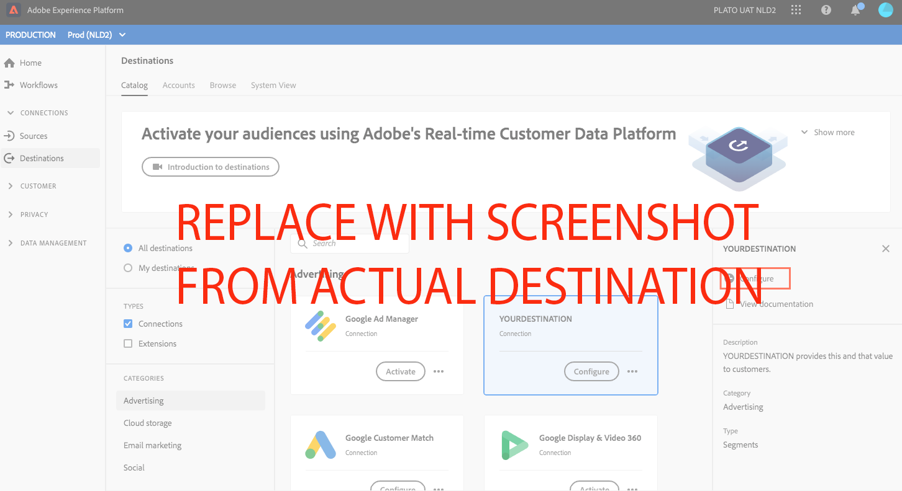
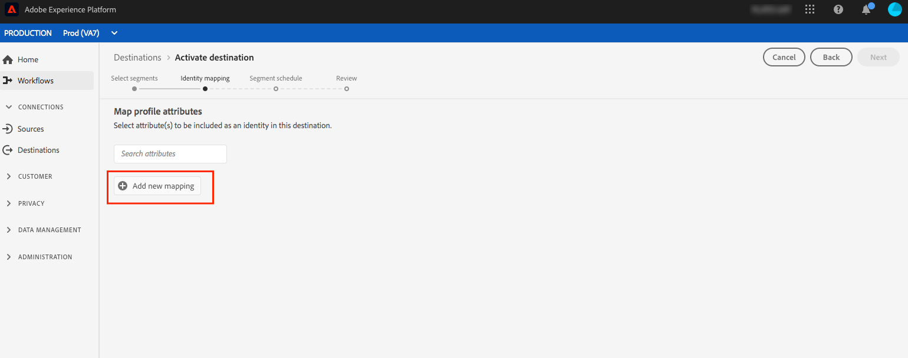

# YOURDESTINATION {#your-destination}

*Lorsque vous parcourez ce modèle, remplacez ou supprimez tous les paragraphes en italique (en commençant par celui-ci).*

*Commencez par mettre à jour les métadonnées (titre et description) en haut de la page. Veuillez ignorer toutes les instances d&#39;UICONTROL sur cette page. Il s’agit d’une balise qui aide nos processus de traduction automatique à traduire correctement la page dans les multiples langues prises en charge. Nous ajouterons des balises à votre documentation après l’avoir envoyée.*

## Présentation {#overview}

*Fournissez un bref aperçu de votre entreprise, y compris la valeur qu’elle fournit aux clients. Pour plus d’informations, insérez un lien vers la page d’accueil de la documentation du produit.*

>[!IMPORTANT]
>
>Cette page de documentation a été créée par la fonction *YOURDESTINATION* l&#39;équipe. Pour toute demande de mise à jour ou de renseignements, contactez-les directement à l’adresse *Ajouter un lien ou une adresse électronique permettant d’accéder aux mises à jour*

## Conditions préalables {#prerequisites}

*Ajoutez des informations dans cette section sur tout ce dont les clients doivent tenir compte avant de commencer à configurer la destination dans l’interface utilisateur de Adobe Experience Platform. Il peut s’agir :*

* *à ajouter à une liste autorisée*
* *conditions requises pour le hachage des emails*
* *toute spécification de compte de votre côté ;*
* *Comment obtenir une clé API pour se connecter à votre plateforme*

*Vous pouvez créer un lien vers votre documentation appropriée si cela s’avère utile aux clients.*

## Identités prises en charge {#supported-identities}

*Ajoutez des informations dans cette section sur les identités prises en charge par votre destination. Nous avons prérempli le tableau avec certaines valeurs standard. Supprimez les valeurs qui ne s’appliquent pas à votre destination et celles qui ne sont pas préremplies.*

*YOURDESTINATION* prend en charge l’activation des identités décrites dans le tableau ci-dessous. En savoir plus sur [identités](https://experienceleague.adobe.com/docs/experience-platform/identity/namespaces.html?lang=fr#getting-started).

| Identité cible | Description | Considérations |
|---|---|---|
| GAID | Google Advertising ID | Sélectionnez l’identité cible GAID lorsque votre identité source est un espace de noms GAID. |
| IDFA | Identifiant Apple pour les annonceurs | Sélectionnez l’identité cible IDFA lorsque votre identité source est un espace de noms IDFA. |
| ECID | Experience Cloud ID | Espace de noms qui représente l’ECID. Cet espace de noms peut également être référencé par les alias suivants : &quot;Adobe Marketing Cloud ID&quot;, &quot;Adobe Experience Cloud ID&quot;, &quot;Adobe Experience Platform ID&quot;. Consultez le document suivant sur [ECID](https://experienceleague.adobe.com/docs/experience-platform/identity/ecid.html) pour plus d’informations. |
| phone_sha256 | Numéros de téléphone hachés avec l’algorithme SHA256 | Adobe Experience Platform prend en charge le texte brut et les numéros de téléphone hachés SHA256. Lorsque votre champ source contient des attributs non hachés, vérifiez la variable **[!UICONTROL Appliquer la transformation]** option, pour avoir [!DNL Platform] hachage automatique des données lors de l’activation. |
| email_lc_sha256 | Adresses électroniques hachées avec l’algorithme SHA256 | Adobe Experience Platform prend en charge le texte brut et les adresses électroniques hachées SHA256. Lorsque votre champ source contient des attributs non hachés, vérifiez la variable **[!UICONTROL Appliquer la transformation]** option, pour avoir [!DNL Platform] hachage automatique des données lors de l’activation. |
| extern_id | ID utilisateur personnalisés | Sélectionnez cette identité cible lorsque votre identité source est un espace de noms personnalisé. |

{style=&quot;table-layout:auto&quot;}

## Type et fréquence d&#39;export {#export-type-frequency}

*Dans le tableau, conservez uniquement les lignes correspondant à votre destination. Vous devez avoir une ligne pour le type Export et une ligne pour la Fréquence d&#39;export. Supprimez les valeurs qui ne s’appliquent pas à votre destination.*

Reportez-vous au tableau ci-dessous pour plus d’informations sur le type et la fréquence d’exportation des destinations.

| Élément | Type | Notes |
---------|----------|---------|
| Type d&#39;export | **[!UICONTROL Exportation des segments]** | Vous exportez tous les membres d’un segment (audience) avec les identifiants (nom, numéro de téléphone ou autres) utilisés dans la variable *YOURDESTINATION* destination. |
| Type d&#39;export | **[!UICONTROL Basé sur les profils]** | Vous exportez tous les membres d’un segment, ainsi que les champs de schéma de votre choix (par exemple : adresse électronique, numéro de téléphone, nom), tel que sélectionné dans l’écran de sélection des attributs de profil de la fonction [workflow d’activation de destination](/help/destinations/ui/activate-batch-profile-destinations.md#select-attributes). |
| Fréquence des exports | **[!UICONTROL Diffusion en continu]** | Les destinations de diffusion en continu sont &quot;toujours sur&quot; des connexions basées sur l’API. Dès qu’un profil est mis à jour dans Experience Platform en fonction de l’évaluation des segments, le connecteur envoie la mise à jour en aval vers la plateforme de destination. En savoir plus sur [destinations de diffusion en continu](/help/destinations/destination-types.md#streaming-destinations). |
| Fréquence des exports | **[!UICONTROL Lot]** | Les destinations de lot exportent des fichiers vers des plateformes en aval par incréments de trois, six, huit, douze ou vingt-quatre heures. En savoir plus sur [destinations basées sur des fichiers de lots](/help/destinations/destination-types.md#file-based). |

{style=&quot;table-layout:auto&quot;}

## Cas dʼutilisation {#use-cases}

Pour vous aider à mieux comprendre comment et à quel moment utiliser la variable *YOURDESTINATION* destination, voici des exemples de cas d’utilisation que les clients Adobe Experience Platform peuvent résoudre à l’aide de cette destination.

### Cas d’utilisation #1

*Pour les plateformes de messagerie mobile :*

*Une plate-forme de location et de vente d’habitations souhaite envoyer des notifications mobiles aux appareils Android et iOS des clients afin de leur faire savoir qu’il y a 100 listes mises à jour dans la zone où ils ont déjà recherché une location.*

### Cas d’utilisation #2

*Pour les plateformes de réseaux sociaux :*

*Une marque de vêtements d’athlétisme veut atteindre ses clients existants par le biais de leurs comptes de médias sociaux. La marque de vêtements peut ingérer des adresses électroniques de son propre CRM vers Adobe Experience Platform, créer des segments à partir de ses propres données hors ligne et envoyer ces segments vers YOURDESTINATION afin d’afficher des publicités dans les flux de médias sociaux de ses clients.*

## Connexion à la destination {#connect}

Pour vous connecter à cette destination, procédez comme décrit dans la section [tutoriel sur la configuration des destinations](https://experienceleague.adobe.com/docs/experience-platform/destinations/ui/connect-destination.html).

### Paramètres de connexion {#parameters}

while [configuration](https://experienceleague.adobe.com/docs/experience-platform/destinations/ui/connect-destination.html) Pour cette destination, vous devez fournir les informations suivantes :

*Ajoutez les champs que les clients doivent renseigner lors de la configuration d’une nouvelle destination. Ces champs sont spécifiques à la destination et dépendent de votre configuration dans Destination SDK. Les champs de votre destination peuvent ne pas être identiques à ceux répertoriés ci-dessous.*

* **[!UICONTROL Nom]**: Un nom par lequel vous reconnaîtrez cette destination à l’avenir.
* **[!UICONTROL Description]**: Description qui vous aidera à identifier cette destination ultérieurement.
* **[!UICONTROL Identifiant de compte]**: Votre *YOURDESTINATION* ID de compte.


<!--

*Replace YOURDESTINATION with your destination name and TOBEFILLEDIN with the category that your destination belongs to.*

1. In **[!UICONTROL Destinations]** > **[!UICONTROL Catalog]**, scroll to the ***TOBEFILLEDIN*** category. Select ***YOURDESTINATION***, then select **[!UICONTROL Configure]**.


    >[!NOTE]
    >
    >If a connection with this destination already exists, you can see an **[!UICONTROL Activate]** button on the destination card. For more information about the difference between **[!UICONTROL Activate]** and **[!UICONTROL Configure]**, refer to the [Catalog](https://experienceleague.adobe.com/docs/experience-platform/destinations/ui/destinations-workspace.html#catalog) section of the destination workspace documentation.  

    

2. In the **Account** step, if you had previously set up a connection to your *YOURDESTINATION* destination, select **[!UICONTROL Existing Account]** and select your existing connection. Or, you can select **[!UICONTROL New Account]** to set up a new connection to *YOURDESTINATION*. Select **[!UICONTROL Connect to destination]** to log in and connect Adobe Experience Cloud to your *YOURDESTINATION* account.

    >[!NOTE]
    >
    >Adobe Experience Platform supports credentials validation in the authentication process and displays an error message if you input incorrect credentials to your ***YOURDESTINATION*** account. This ensures that you don't complete the workflow with incorrect credentials.

3. Once your credentials are confirmed and Adobe Experience Cloud is connected to your ***YOURDESTINATION*** account, you can select **[!UICONTROL Next]** to proceed to the **[!UICONTROL Setup]** step.

4. In the **[!UICONTROL Authentication]** step, enter a **[!UICONTROL Name]** and a **[!UICONTROL Description]** for your activation flow and fill your account ID. <br> Also in this step, you can select any marketing action that should apply to this destination. Marketing actions indicate the intent for which data will be exported to the destination. You can select from Adobe-defined marketing actions or you can create your own marketing action. For more information about marketing actions, see the [Data usage policies overview](https://experienceleague.adobe.com/docs/experience-platform/data-governance/policies/overview.html).

    

5. Your destination is now created. You can select **[!UICONTROL Save & Exit]** if you want to activate segments later on or you can select **[!UICONTROL Next]** to continue the workflow and select segments to activate. In either case, see the next section, [Activate segments](#activate-segments), for the rest of the workflow.

-->

## Activation des segments vers cette destination {#activate}

Lecture [Activation des profils et des segments vers des destinations d’exportation de segments en continu](https://experienceleague.adobe.com/docs/experience-platform/destinations/ui/activate/activate-segment-streaming-destinations.html?lang=en) pour obtenir des instructions sur l’activation des segments d’audience vers cette destination.

<!--

To activate segments to *YOURDESTINATION*, follow the steps below: 

1. In **[!UICONTROL Destinations > Browse]**, select the *YOURDESTINATION* destination where you want to activate your segments.

2. Click the name of the destination. This takes you to the Activate flow.
    
    Note that if an activation flow already exists for a destination, you can see the segments that are currently being sent to the destination. Select **[!UICONTROL Edit activation]** in the right rail and follow the steps below to modify the activation details.
3. Select **[!UICONTROL Activate]**;
4. In the **[!UICONTROL Activate destination]** workflow, on the **[!UICONTROL Select Segments]** page, select which segments to send to *YOURDESTINATION*.
    
5.  In the **[!UICONTROL Mapping]** step, select which attributes and identities from the source XDM schema to map to the target schema. Select **[!UICONTROL Add new mapping]** and browse your schema, select identity namespaces and map them to the corresponding target identity.  
 <br>&nbsp;
   *Plain text email address as primary identity*: If you have plain text (unhashed) email addresses as primary identity in your schema, select the email field in your **[!UICONTROL Source Attributes]** and map to the Email field in the right column under **[!UICONTROL Target Identities]**, as shown below. Set up a mapping between any other attributes you plan to use.
    <br>&nbsp;
6. On the **[!UICONTROL Segment schedule]** page, you can set the start date for sending data to the destination.
7. On the **[!UICONTROL Review]** page, you can see a summary of your selection. Select **[!UICONTROL Cancel]** to break up the flow, **[!UICONTROL Back]** to modify your settings, or **[!UICONTROL Finish]** to confirm your selection and start sending data to the destination.

>[!IMPORTANT]
>
>In this step, Adobe Experience Platform checks for data usage policy violations. Shown below is an example where a policy is violated. You cannot complete the segment activation workflow until you have resolved the violation. For information on how to resolve policy violations, see [Policy enforcement](https://experienceleague.adobe.com/docs/experience-platform/data-governance/enforcement/auto-enforcement.html#enforcement) in the data governance documentation section.
 


If no policy violations have been detected, select **[!UICONTROL Finish]** to confirm your selection and start sending data to the destination.


-->

## Données exportées {#exported-data}

*Ajoutez une note sur la manière dont les données sont exportées vers votre destination. Cela permet au client de s’assurer qu’il s’est correctement intégré à votre destination. Par exemple, vous pouvez fournir un exemple JSON comme celui ci-dessous.*

```
{
  "person": {
    "email": "yourstruly@adobe.com"
  },
  "segmentMembership": {
    "ups": {
      "7841ba61-23c1-4bb3-a495-00d3g5fe1e93": {
        "lastQualificationTime": "2020-05-25T21:24:39Z",
        "status": "exited"
      },
      "59bd2fkd-3c48-4b18-bf56-4f5c5e6967ae": {
        "lastQualificationTime": "2020-05-25T23:37:33Z",
        "status": "existing"
      }
    }
  },
  "identityMap": {
    "ecid": [
      {
        "id": "14575006536349286404619648085736425115"
      },
      {
        "id": "66478888669296734530114754794777368480"
      }
    ],
    "email_lc_sha256": [
      {
        "id": "655332b5fa2aea4498bf7a290cff017cb4"
      },
      {
        "id": "66baf76ef9de8b42df8903f00e0e3dc0b7"
      }
    ]
  }
}
```

## Utilisation et gouvernance des données {#data-usage-governance}

Tous [!DNL Adobe Experience Platform] Les destinations sont conformes aux politiques d’utilisation des données lors de la gestion de vos données. Pour obtenir des informations détaillées sur la manière dont [!DNL Adobe Experience Platform] applique la gouvernance des données, lisez la section [Présentation de la gouvernance des données](https://experienceleague.adobe.com/docs/experience-platform/data-governance/home.html).

## Ressources supplémentaires {#additional-resources}

*Vous pouvez fournir d’autres liens vers la documentation de votre produit ou toute autre ressource que vous considérez importante pour le succès du client.*
