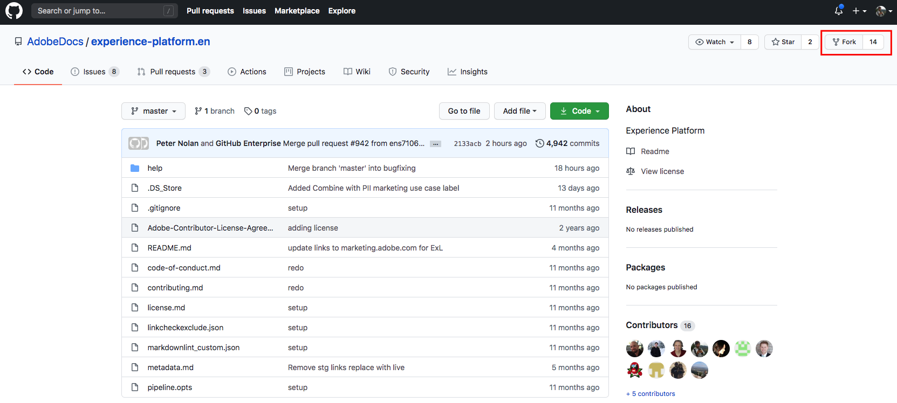

# Utilisation de l’interface web GitHub pour créer une page de documentation de destination {#github-interface}

Les instructions ci-dessous vous montrent comment utiliser l’interface web GitHub pour créer de la documentation et envoyer une requête de tirage (PR). Avant de passer en revue les étapes indiquées ici, veillez à lire [Document de votre destination dans les destinations Adobe Experience Platform](./documentation-instructions.md).

>[!TIP]
>
>Reportez-vous également à la documentation à l’appui du guide du contributeur d’Adobe :
>* [Installation des outils de création Git et Markdown](https://experienceleague.adobe.com/docs/contributor/contributor-guide/setup/install-tools.html?lang=en)
>* [Configuration locale du référentiel Git pour la documentation](https://experienceleague.adobe.com/docs/contributor/contributor-guide/setup/local-repo.html?lang=en)
>* [Workflow de contributions GitHub pour les modifications majeures](https://experienceleague.adobe.com/docs/contributor/contributor-guide/setup/full-workflow.html?lang=en).

## Configuration de votre environnement de création GitHub {#set-up-environment}

1. Dans votre navigateur, accédez à la page suivante : `https://github.com/AdobeDocs/experience-platform.en`.
2. Pour [dupliquer](https://experienceleague.adobe.com/docs/contributor/contributor-guide/setup/local-repo.html?lang=en#fork-the-repository) le référentiel, cliquez sur **Fork** comme illustré dans l’image ci-dessous.

   

3. Dans le branchement du référentiel, créez une branche pour votre projet, comme illustré ci-dessous. Utilisez cette nouvelle branche pour votre travail.

   

4. Dans la structure de dossiers GitHub du référentiel dupliqué, accédez à `experience-platform.en/help/destinations/catalog/[...]`, où `[...]` est la catégorie souhaitée pour votre destination. Par exemple, si vous ajoutez une destination de personnalisation à Experience Platform, sélectionnez la catégorie `personalization`. Sélectionnez **Ajouter un fichier > Créer un fichier**.

   

5. Nommez votre destination `YOURDESTINATION.md`, où YOURDESTINATION est le nom de votre destination dans Adobe Experience Platform. Par exemple, si votre société s’appelle Moviestar, vous nommerez votre fichier `moviestar.md`.

## Créez la page de documentation de votre destination. {#author-documentation}

1. Vous allez créer le contenu de votre page de destination en fonction du [modèle en libre-service de la documentation](./self-service-template.md). **** Téléchargez le modèle et décompressez-le pour extraire le modèle de  `.md` fichier.
2. Collez et modifiez le contenu du modèle avec les informations pertinentes pour votre destination dans un éditeur de balisage en ligne, tel que [dillinger.io](https://dillinger.io/). Suivez les instructions du modèle pour plus d’informations sur ce que vous devez remplir et les paragraphes qui peuvent être supprimés.
3. Copiez le contenu de l’éditeur de Markdown dans votre nouveau fichier dans GitHub.
4. Pour toute capture d’écran ou image que vous prévoyez d’utiliser, utilisez l’interface GitHub pour télécharger les fichiers vers `experience-platform.en/help/destinations/assets/catalog/[...]`, où `[...]` est la catégorie souhaitée pour votre destination. Par exemple, si vous ajoutez une destination de personnalisation à Experience Platform, sélectionnez la catégorie `personalization`. Vous devez créer un lien vers les images de la page que vous créez. Voir les [instructions pour créer un lien vers des images](https://experienceleague.adobe.com/docs/contributor/contributor-guide/writing-essentials/linking.html?lang=en#link-to-images).

   

5. Lorsque vous êtes prêt, enregistrez le fichier dans votre branche.

## Soumettre votre documentation pour révision {#submit-review}

1. Après avoir enregistré le fichier et téléchargé les images de votre choix, vous pouvez ouvrir une requête de tirage (PR) pour fusionner votre branche de travail dans la branche principale du référentiel de documentation Adobe. Assurez-vous que la branche sur laquelle vous avez travaillé est sélectionnée et sélectionnez **Requête d’extraction**.

1. Assurez-vous que les branches de base et de comparaison sont correctes. Ajoutez une note au document de requête de tirage décrivant votre mise à jour, puis sélectionnez **Créer une requête de tirage**. Cela ouvre une requête de tirage pour fusionner la branche opérationnelle de votre double dans la branche principale du référentiel Adobe.

   >[!TIP]
   >
   >Laissez la case **Autoriser les modifications par les responsables** cochée afin que l’équipe de documentation d’Adobe puisse apporter des modifications au résiduel.

   

1. À ce stade, une notification s’affiche pour vous inviter à signer le contrat de licence du contributeur Adobe (CLA). Cette étape est obligatoire. Après avoir signé le contrat de licence du contributeur, actualisez la page de requête de tirage et envoyez la requête de tirage.

1. Vous pouvez confirmer que la demande d’extraction a été envoyée en consultant l’onglet **Requêtes d’extraction** dans `https://github.com/AdobeDocs/experience-platform.en`.

   

1. Merci ! L’équipe de documentation de l’Adobe contactera le service des relations publiques si des modifications sont nécessaires et vous indiquera quand la documentation sera publiée.

>[!TIP]
>
>Pour ajouter des images et des liens à votre documentation, ainsi que toute autre question concernant Markdown, consultez la section [Utilisation de Markdown](https://experienceleague.adobe.com/docs/contributor/contributor-guide/writing-essentials/markdown.html?lang=en) dans le guide d’écriture collaborative de l’Adobe.
