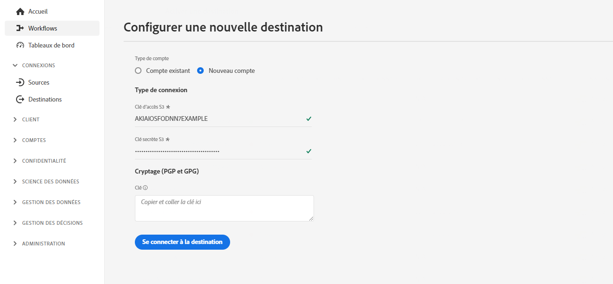
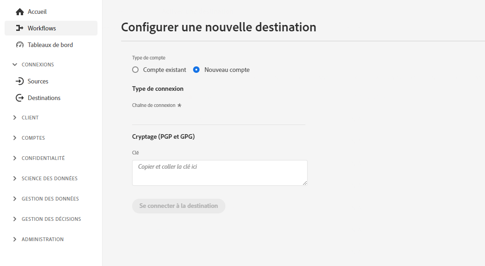
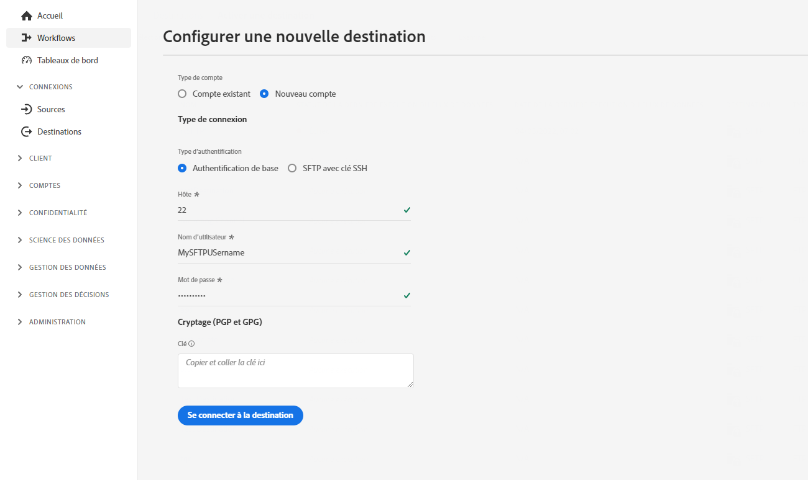
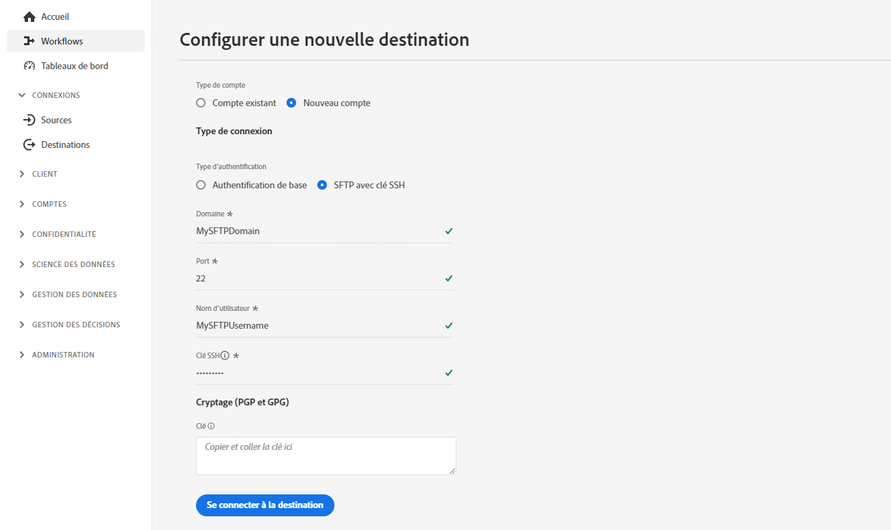

# Configuration des destinations basées sur des fichiers {#destination-configuration}

## Présentation {#overview}

Cette configuration vous permet d’indiquer les informations essentielles pour votre destination basée sur des fichiers, telles que votre nom de destination, votre catégorie, votre description, etc. Les paramètres de cette configuration déterminent également comment les utilisateurs d’Experience Platform s’authentifient pour votre destination, comment ils apparaissent dans l’interface utilisateur d’Experience Platform ainsi que les identités qui peuvent être exportées vers votre destination. Vous pouvez également utiliser cette configuration pour afficher les options liées au type de fichier, au format de fichier ou aux paramètres de compression des fichiers exportés.

Cette configuration connecte également les autres configurations requises pour que votre destination fonctionne (métadonnées de serveur de destination et d’audience) à celle-ci. Découvrez comment vous pouvez référencer les deux configurations dans une [section ci-dessous](./file-based-destination-configuration.md#connecting-all-configurations).

Vous pouvez configurer la fonctionnalité décrite dans ce document à l’aide du point d’entrée de l’API `/authoring/destinations`. Consultez [Opérations de point d’entrée de l’API Destinations](./destination-configuration-api.md) pour obtenir une liste complète des opérations que vous pouvez effectuer sur le point d’entrée.

## Exemple de configuration de destination Amazon S3 {#batch-example-configuration}

Vous trouverez ci-dessous un exemple d’une destination Amazon S3 personnalisée privée créée à l’aide de la fonction `/destinations` point d’entrée de configuration.

```json
{
   "name":"S3 Destination with CSV Options",
   "description":"S3 Destination with CSV Options",
   "status":"TEST",
   "maxProfileAttributes":"2000",
   "maxIdentityAttributes":"10",
   "customerAuthenticationConfigurations":[
      {
         "authType":"S3"
      }
   ],
   "customerEncryptionConfigurations":[
      
   ],
   "customerDataFields":[
      {
         "name":"bucket",
         "title":"Amazon S3 bucket name",
         "description":"Enter your Amazon S3 bucket name",
         "type":"string",
         "isRequired":true,
         "readOnly":false,
         "hidden":false
      },
      {
         "name":"path",
         "title":"Amazon S3 bucket path",
         "description":"Enter your S3 bucket path",
         "type":"string",
         "isRequired":true,
         "pattern":"^[A-Za-z]+$",
         "readOnly":false,
         "hidden":false
      },
      {
         "name":"sep",
         "title":"Enter a separator for each field and value",
         "description":"Enter a separator character for each field and value",
         "type":"string",
         "isRequired":false,
         "readOnly":false,
         "hidden":false
      },
      {
         "name":"encoding",
         "title":"Specify encoding (charset) of saved CSV files",
         "description":"Select encoding of csv files",
         "type":"string",
         "enum":[
            "UTF-8",
            "UTF-16"
         ],
         "isRequired":false,
         "readOnly":false,
         "hidden":false
      },
      {
         "name":"quote",
         "title":"Select a single character used for escaping quoted values",
         "description":"Select single charachter for escaping quoted values",
         "type":"string",
         "isRequired":false,
         "readOnly":false,
         "hidden":false
      },
      {
         "name":"quoteAll",
         "title":"Escape all quoted values",
         "description":"Select whether to escape all quoted values",
         "type":"string",
         "enum":[
            "true",
            "false"
         ],
         "default":"true",
         "isRequired":true,
         "readOnly":false,
         "hidden":false
      },
      {
         "name":"escape",
         "title":"Select a single character used for escaping quotes",
         "description":"Select a single character used for escaping quotes inside an already quoted value",
         "type":"string",
         "isRequired":false,
         "readOnly":false,
         "hidden":false
      },
      {
         "name":"escapeQuotes",
         "title":"Escape quotes",
         "description":"A flag indicating whether values containing quotes should always be enclosed in quotes",
         "type":"string",
         "enum":[
            "true",
            "false"
         ],
         "isRequired":false,
         "default":"true",
         "readOnly":false,
         "hidden":false
      },
      {
         "name":"header",
         "title":"header",
         "description":"Writes the names of columns as the first line.",
         "type":"string",
         "isRequired":false,
         "enum":[
            "true",
            "false"
         ],
         "readOnly":false,
         "default":"true",
         "hidden":false
      },
      {
         "name":"ignoreLeadingWhiteSpace",
         "title":"Ignore leading white space",
         "description":"A flag indicating whether or not leading whitespaces from values being written should be skipped.",
         "type":"string",
         "isRequired":false,
         "enum":[
            "true",
            "false"
         ],
         "readOnly":false,
         "default":"true",
         "hidden":false
      },
      {
         "name":"nullValue",
         "title":"Select the string representation of a null value",
         "description":"Sets the string representation of a null value. ",
         "type":"string",
         "isRequired":false,
         "readOnly":false,
         "hidden":false
      },
      {
         "name":"dateFormat",
         "title":"Date format",
         "description":"Select the string that indicates a date format. ",
         "type":"string",
         "default":"yyyy-MM-dd",
         "isRequired":false,
         "readOnly":false,
         "hidden":false
      },
      {
         "name":"charToEscapeQuoteEscaping",
         "title":"Char to escape quote escaping",
         "description":"Sets a single character used for escaping the escape for the quote character",
         "type":"string",
         "isRequired":false,
         "readOnly":false,
         "hidden":false
      },
      {
         "name":"emptyValue",
         "title":"Select the string representation of an empty value",
         "description":"Select the string representation of an empty value",
         "type":"string",
         "isRequired":false,
         "readOnly":false,
         "default":"",
         "hidden":false
      },
      {
         "name":"compression",
         "title":"Select compression",
         "description":"Select compressiont",
         "type":"string",
         "isRequired":true,
         "readOnly":false,
         "enum":[
            "SNAPPY",
            "GZIP",
            "DEFLATE",
            "NONE"
         ]
      },
      {
         "name":"fileType",
         "title":"Select a fileType",
         "description":"Select fileType",
         "type":"string",
         "isRequired":true,
         "readOnly":false,
         "hidden":false,
         "enum":[
            "csv",
            "json",
            "parquet"
         ],
         "default":"csv"
      }
   ],
   "uiAttributes":{
      "documentationLink":"http://www.adobe.com/go/YOURDESTINATION-en",
      "category":"S3",
      "iconUrl":"https://dc5tqsrhldvnl.cloudfront.net/2/90048/da276e30c730ce6cd666c8ca78360df21.png",
      "connectionType":"S3",
      "flowRunsSupported":true,
      "monitoringSupported":true,
      "frequency":"Batch"
   },
   "destinationDelivery":[
      {
         "deliveryMatchers":[
            {
               "type":"SOURCE",
               "value":[
                  "batch"
               ]
            }
         ],
         "authenticationRule":"CUSTOMER_AUTHENTICATION",
         "destinationServerId":"{{destinationServerId}}"
      }
   ],
   "identityNamespaces":{
      "adobe_id":{
         "acceptsAttributes":true,
         "acceptsCustomNamespaces":true
      },
      "mobile_id":{
         "acceptsAttributes":true,
         "acceptsCustomNamespaces":true
      }
   },
   "segmentMappingConfig":{
      "mapExperiencePlatformSegmentName":false,
      "mapExperiencePlatformSegmentId":false,
      "mapUserInput":false,
      "audienceTemplateId":"cbf90a70-96b4-437b-86be-522fbdaabe9c"
   },
   "schemaConfig":{
      "profileFields":[
         {
            "name":"phoneNo",
            "title":"phoneNo",
            "description":"This is a fixed attribute on your destination side that customers can map profile attributes to. For example, the phoneNumber value in Experience Platform could be phoneNo on your side.",
            "type":"string",
            "isRequired":false,
            "readOnly":false,
            "hidden":false
         }
      ],
      "profileRequired":true,
      "segmentRequired":true,
      "identityRequired":true
   },
   "batchConfig":{
      "allowMandatoryFieldSelection":true,
      "allowDedupeKeyFieldSelection":true,
      "defaultExportMode":"DAILY_FULL_EXPORT",
      "allowedExportMode":[
         "DAILY_FULL_EXPORT",
         "FIRST_FULL_THEN_INCREMENTAL"
      ],
      "allowedScheduleFrequency":[
         "DAILY",
         "EVERY_3_HOURS",
         "EVERY_6_HOURS",
         "EVERY_8_HOURS",
         "EVERY_12_HOURS",
         "ONCE"
      ],
      "defaultFrequency":"DAILY",
      "defaultStartTime":"00:00",
      "filenameConfig":{
         "allowedFilenameAppendOptions":[
            "SEGMENT_NAME",
            "DESTINATION_INSTANCE_ID",
            "DESTINATION_INSTANCE_NAME",
            "ORGANIZATION_NAME",
            "SANDBOX_NAME",
            "DATETIME",
            "CUSTOM_TEXT"
         ],
         "defaultFilenameAppendOptions":[
            "DATETIME"
         ],
         "defaultFilename":"%DESTINATION%_%SEGMENT_ID%"
      },
      "backfillHistoricalProfileData":true
   }
```

| Paramètre | Type | Description |
|---------|----------|------|
| `name` | Chaîne | Indique le titre de votre destination dans le catalogue Experience Platform. |
| `description` | Chaîne | Fournissez une description de votre carte de destination dans le catalogue des destinations Experience Platform. N’utilisez pas plus de 4 à 5 phrases. |
| `status` | Chaîne | Indique le statut du cycle de vie de la carte de destination. Les valeurs acceptées sont `TEST`, `PUBLISHED` et `DELETED`. Utilisez `TEST` lorsque vous configurez votre destination pour la première fois. |
| `maxProfileAttributes` | Chaîne | Indique le nombre maximal d’attributs de profil que les clients peuvent exporter vers la destination. La valeur par défaut est `2000`. |
| `maxIdentityAttributes` | Chaîne | Indique le nombre maximal d’espaces de noms d’identité que les clients peuvent exporter vers la destination. La valeur par défaut est `10`. |

{style=&quot;table-layout:auto&quot;}

## Configurations de l’authentification du client {#customer-authentication-configurations}

Cette section de la configuration des destinations génère la page [Configurer une nouvelle destination](/help/destinations/ui/connect-destination.md) dans l’interface utilisateur d’Experience Platform, où les utilisateurs connectent Experience Platform aux comptes qu’ils possèdent avec votre destination.

```json
"customerAuthenticationConfigurations": [
        {
            "authType": "S3"
        }
    ],
```

Selon l’[option d’authentification](authentication-configuration.md##supported-authentication-types) que vous indiquez dans le champ `authType`, la page Experience Platform est générée pour les utilisateurs comme suit :

### Authentification Amazon S3 {#s3}

Lorsque vous configurez le type d’authentification Amazon S3, les utilisateurs doivent saisir les informations d’identification S3.



### Authentification Azure Blob  {#blob}

Lorsque vous configurez le type d’authentification Azure Blob, les utilisateurs doivent saisir la chaîne de connexion.



### SFTP avec authentification par mot de passe

Lorsque vous configurez le SFTP avec le type d’authentification par mot de passe, les utilisateurs doivent saisir le nom d’utilisateur et le mot de passe SFTP, ainsi que le domaine et le port SFTP (le port par défaut est 22).



### SFTP avec authentification par clé SSH

Lorsque vous configurez le SFTP avec le type d’authentification par clé SSH, les utilisateurs doivent saisir le nom d’utilisateur SFTP et la clé SSH, ainsi que le domaine et le port SFTP (le port par défaut est 22).



## Champs de données client {#customer-data-fields}

Utilisez cette section pour demander aux utilisateurs de renseigner des champs personnalisés, spécifiques à votre destination, lors de la connexion à la destination dans l’interface utilisateur d’Experience Platform.

Dans l’exemple ci-dessous, `customerDataFields` exige des utilisateurs qu’ils saisissent un nom pour leur destination et qu’ils fournissent un [!DNL Amazon S3] nom du compartiment et chemin du dossier, ainsi qu’un type de compression, un format de fichier et plusieurs autres options de formatage de fichier.

Vous pouvez accéder aux entrées client des champs de données client et les utiliser dans un modèle. Utilisation de la macro `{{customerData.exampleName}}`. Par exemple, si vous demandez aux utilisateurs de saisir un champ de compartiment Amazon S3, avec le nom `bucket`, vous pouvez y accéder dans un modèle à l’aide de la macro . `{{customerData.bucket}}`. Afficher un exemple d’utilisation d’un champ de données client dans la variable [configuration du serveur de destination](/help/destinations/destination-sdk/server-and-file-configuration.md#s3-example).

```json
 "customerDataFields":[
      {
         "name":"bucket",
         "title":"Amazon S3 bucket name",
         "description":"Enter your Amazon S3 bucket name",
         "type":"string",
         "isRequired":true,
         "readOnly":false,
         "hidden":false
      },
      {
         "name":"path",
         "title":"Amazon S3 bucket path",
         "description":"Enter your S3 bucket path",
         "type":"string",
         "isRequired":true,
         "pattern":"^[A-Za-z]+$",
         "readOnly":false,
         "hidden":false
      },
      {
         "name":"sep",
         "title":"Enter a separator for each field and value",
         "description":"Enter a separator character for each field and value",
         "type":"string",
         "isRequired":false,
         "readOnly":false,
         "hidden":false
      },
      {
         "name":"encoding",
         "title":"Specify encoding (charset) of saved CSV files",
         "description":"Select encoding of csv files",
         "type":"string",
         "enum":[
            "UTF-8",
            "UTF-16"
         ],
         "isRequired":false,
         "readOnly":false,
         "hidden":false
      },
      {
         "name":"quote",
         "title":"Select a single character used for escaping quoted values",
         "description":"Select single charachter for escaping quoted values",
         "type":"string",
         "isRequired":false,
         "readOnly":false,
         "hidden":false
      },
      {
         "name":"quoteAll",
         "title":"Escape all quoted values",
         "description":"Select whether to escape all quoted values",
         "type":"string",
         "enum":[
            "true",
            "false"
         ],
         "default":"true",
         "isRequired":true,
         "readOnly":false,
         "hidden":false
      },
      {
         "name":"escape",
         "title":"Select a single character used for escaping quotes",
         "description":"Select a single character used for escaping quotes inside an already quoted value",
         "type":"string",
         "isRequired":false,
         "readOnly":false,
         "hidden":false
      },
      {
         "name":"escapeQuotes",
         "title":"Escape quotes",
         "description":"A flag indicating whether values containing quotes should always be enclosed in quotes",
         "type":"string",
         "enum":[
            "true",
            "false"
         ],
         "isRequired":false,
         "default":"true",
         "readOnly":false,
         "hidden":false
      },
      {
         "name":"header",
         "title":"header",
         "description":"Writes the names of columns as the first line.",
         "type":"string",
         "isRequired":false,
         "enum":[
            "true",
            "false"
         ],
         "readOnly":false,
         "default":"true",
         "hidden":false
      },
      {
         "name":"ignoreLeadingWhiteSpace",
         "title":"Ignore leading white space",
         "description":"A flag indicating whether or not leading whitespaces from values being written should be skipped.",
         "type":"string",
         "isRequired":false,
         "enum":[
            "true",
            "false"
         ],
         "readOnly":false,
         "default":"true",
         "hidden":false
      },
      {
         "name":"nullValue",
         "title":"Select the string representation of a null value",
         "description":"Sets the string representation of a null value. ",
         "type":"string",
         "isRequired":false,
         "readOnly":false,
         "hidden":false
      },
      {
         "name":"dateFormat",
         "title":"Date format",
         "description":"Select the string that indicates a date format. ",
         "type":"string",
         "default":"yyyy-MM-dd",
         "isRequired":false,
         "readOnly":false,
         "hidden":false
      },
      {
         "name":"charToEscapeQuoteEscaping",
         "title":"Char to escape quote escaping",
         "description":"Sets a single character used for escaping the escape for the quote character",
         "type":"string",
         "isRequired":false,
         "readOnly":false,
         "hidden":false
      },
      {
         "name":"emptyValue",
         "title":"Select the string representation of an empty value",
         "description":"Select the string representation of an empty value",
         "type":"string",
         "isRequired":false,
         "readOnly":false,
         "default":"",
         "hidden":false
      },
      {
         "name":"compression",
         "title":"Select compression",
         "description":"Select compressiont",
         "type":"string",
         "isRequired":true,
         "readOnly":false,
         "enum":[
            "SNAPPY",
            "GZIP",
            "DEFLATE",
            "NONE"
         ]
      },
      {
         "name":"fileType",
         "title":"Select a fileType",
         "description":"Select fileType",
         "type":"string",
         "isRequired":true,
         "readOnly":false,
         "hidden":false,
         "enum":[
            "csv",
            "json",
            "parquet"
         ],
         "default":"csv"
      }
```

>[!TIP]
>
>Toutes les configurations de mise en forme de fichier répertoriées dans l’exemple ci-dessus sont décrites en détail dans la section [configuration du formatage de fichier](/help/destinations/destination-sdk/server-and-file-configuration.md#file-configuration) .

| Paramètre | Type | Description |
|---------|----------|------|
| `name` | Chaîne | Attribuez un nom au champ personnalisé que vous introduisez. |
| `title` | Chaîne | Indique le nom du champ tel qu’il est affiché par les clients dans l’interface utilisateur d’Experience Platform. |
| `description` | Chaîne | Fournissez une description du champ personnalisé. |
| `type` | Chaîne | Indique le type de champ personnalisé que vous introduisez. Les valeurs acceptées sont `string`, `object` et `integer`. |
| `isRequired` | Booléen | Indique si ce champ est requis dans le workflow de configuration de destination. |
| `pattern` | Chaîne | Impose un modèle pour le champ personnalisé, le cas échéant. Utilisez des expressions régulières pour appliquer un modèle. Par exemple, si vos identifiants de client n’incluent pas de chiffres ou de traits de soulignement, saisissez `^[A-Za-z]+$` dans ce champ. |
| `enum` | Chaîne | Rend le champ personnalisé sous forme de menu déroulant et répertorie les options disponibles pour l’utilisateur. |
| `default` | Chaîne | Définit la valeur par défaut d’une liste `enum`. |

{style=&quot;table-layout:auto&quot;}

## Attributs de l’interface utilisateur {#ui-attributes}

Cette section fait référence aux éléments de l’interface utilisateur dans la configuration ci-dessus qu’Adobe doit utiliser pour votre destination dans l’interface utilisateur d’Adobe Experience Platform.

```json
"uiAttributes":{
      "documentationLink":"http://www.adobe.com/go/YOURDESTINATION-en",
      "category":"cloudStorage",
      "iconUrl":"https://dc5tqsrhldvnl.cloudfront.net/2/90048/da276e30c730ce6cd666c8ca78360df21.png",
      "connectionType":"S3",
      "flowRunsSupported":true,
      "monitoringSupported":true,
      "frequency":"Batch"
   }
```

| Paramètre | Type | Description |
|---------|----------|------|
| `documentationLink` | Chaîne | Fait référence à la page de documentation du [Catalogue des destinations](https://experienceleague.adobe.com/docs/experience-platform/destinations/catalog/overview.html?lang=fr#catalog) pour votre destination. Utilisez `http://www.adobe.com/go/destinations-YOURDESTINATION-en`, où `YOURDESTINATION` est le nom de votre destination. Par exemple, pour une destination appelée Moviestar, procédez comme suit : `http://www.adobe.com/go/destinations-moviestar-en`. Notez que ce lien ne fonctionne qu’après que Adobe a défini votre destination et que la documentation a été publiée. |
| `category` | Chaîne | Fait référence à la catégorie affectée à votre destination dans Adobe Experience Platform. Pour plus d’informations, consultez la section [Catégories de destinations](https://experienceleague.adobe.com/docs/experience-platform/destinations/destination-types.html?lang=fr). Utilisez l’une des valeurs suivantes :`adobeSolutions, advertising, analytics, cdp, cloudStorage, crm, customerSuccess, database, dmp, ecommerce, email, emailMarketing, enrichment, livechat, marketingAutomation, mobile, personalization, protocols, social, streaming, subscriptions, surveys, tagManagers, voc, warehouses, payments`. |
| `iconUrl` | Chaîne | URL dans laquelle vous avez hébergé l’icône à afficher dans la carte du catalogue des destinations. Pour les intégrations personnalisées privées, cela n’est pas obligatoire. Pour les configurations productisées, vous devez partager une icône avec l’équipe d’Adobe lorsque vous [envoyer la destination pour révision ;](/help/destinations/destination-sdk/submit-destination.md#logo). |
| `connectionType` | Chaîne | Type de connexion en fonction de la destination. Valeurs prises en charge : <ul><li>`Azure Blob`</li><li>`Azure Data Lake Storage`</li><li>`S3`</li><li>`SFTP`</li></ul> |
| `flowRunsSupported` | Booléen | Indique si la connexion de destination est incluse dans l’[interface utilisateur d’exécution de flux](../../dataflows/ui/monitor-destinations.md#monitoring-destinations-dashboard). Lorsque vous définissez ce paramètre sur `true` : <ul><li>La **[!UICONTROL date d’exécution du dernier flux de données]** et **[!UICONTROL le statut d’exécution du dernier flux de données]** s’affichent dans la page de navigation de destination.</li><li>Les onglets **[!UICONTROL Exécution du flux de données]** et **[!UICONTROL Données d’activation]** s’affichent dans la page d’affichage de destination.</li></ul> |
| `monitoringSupported` | Booléen | Indique si la connexion de destination est incluse dans la [surveillance de l’interface utilisateur](../ui/destinations-workspace.md#browse). Lorsque vous définissez ce paramètre sur `true`, l’option **[!UICONTROL Afficher dans la surveillance]** s’affiche sur la page de navigation de destination. |
| `frequency` | Chaîne | Fait référence au type d’exportation des données pris en charge par la destination. Définissez sur `Batch` pour les destinations basées sur des fichiers. |

{style=&quot;table-layout:auto&quot;}

## Diffusion de destination {#destination-delivery}

La section de diffusion destination indique où se rendent exactement les données exportées et quelle règle d’authentification est utilisée à l’emplacement où les données atterriront. Vous devez indiquer une ou plusieurs `destinationServerId`s où les données seront diffusées et règle d’authentification. Dans la plupart des cas, la règle d’authentification que vous devez utiliser est : `CUSTOMER_AUTHENTICATION`.

Le `deliveryMatchers` est facultative et peut être utilisée si vous spécifiez plusieurs `destinationServerId`s. Si c’est le cas, la variable `deliveryMatchers` indique comment les données exportées doivent être fractionnées entre les différents serveurs de destination.

```json
 "destinationDelivery":[
      {
         "deliveryMatchers":[
            {
               "type":"SOURCE",
               "value":[
                  "batch"
               ]
            }
         ],
         "authenticationRule":"CUSTOMER_AUTHENTICATION",
         "destinationServerId":"{{destinationServerId}}"
      }
   ]
```

| Paramètre | Type | Description |
|---------|----------|------|
| `authenticationRule` | Chaîne | Indique comment les clients [!DNL Platform] se connectent à votre destination. Les valeurs acceptées sont les suivantes : `CUSTOMER_AUTHENTICATION`, `PLATFORM_AUTHENTICATION` ou `NONE`. <br> <ul><li>Utilisez `CUSTOMER_AUTHENTICATION` si les clients Platform se connectent à votre système par l’une des méthodes suivantes : <ul><li>`"authType": "S3"`</li><li>`"authType":"AZURE_CONNECTION_STRING"`</li><li>`"authType":"AZURE_SERVICE_PRINCIPAL"`</li><li>`"authType":"SFTP_WITH_SSH_KEY"`</li><li>`"authType":"SFTP_WITH_PASSWORD"`</li></ul> </li><li> Utilisez `PLATFORM_AUTHENTICATION` s’il existe un système d’authentification global entre Adobe et votre destination et que le client [!DNL Platform] n’a pas besoin de fournir d’informations d’authentification pour se connecter à votre destination. Dans ce cas, vous devez créer des informations d’identification à l’aide de la configuration des [Informations d’identification](./credentials-configuration-api.md). </li><li>Utilisez `NONE` si aucune authentification n’est requise pour envoyer des données à votre plateforme de destination. </li></ul> |
| `destinationServerId` | Chaîne | Le `instanceId` de [configuration du serveur de destination](./server-and-file-configuration.md) que vous [created](/help/destinations/destination-sdk/destination-server-api.md#create-file-based) pour cette destination. |

{style=&quot;table-layout:auto&quot;}

## Configuration du mappage de segments {#segment-mapping}

Cette section de la configuration de destination concerne la manière dont les métadonnées de segment telles que les noms ou les identifiants doivent être partagées entre Experience Platform et votre destination.

Par le biais du paramètre `audienceTemplateId`, cette section associe également cette configuration à la [configuration des métadonnées d’audience](./audience-metadata-management.md).

```json
   "segmentMappingConfig":{
       "mapExperiencePlatformSegmentName":false,
       "mapExperiencePlatformSegmentId":false,
       "mapUserInput":false,
       "audienceTemplateId":"cbf90a70-96b4-437b-86be-522fbdaabe9c"
   },
```

| Paramètre | Type | Description |
|---------|----------|------|
| `mapExperiencePlatformSegmentName` | Booléen | Contrôle si l’identifiant de mappage de segments dans le workflow d’activation de destination est le nom du segment Experience Platform. |
| `mapExperiencePlatformSegmentId` | Booléen | Contrôle si l’identifiant de mappage de segments dans le workflow d’activation de destination est l’identifiant de segment Experience Platform. |
| `mapUserInput` | Booléen | Contrôle si l’identifiant de mappage de segments dans le workflow d’activation de destination est saisi par l’utilisateur. |
| `audienceTemplateId` | Booléen | Paramètre `instanceId` du [modèle de métadonnées d’audience](./audience-metadata-management.md) utilisé pour cette destination. Pour configurer un modèle de métadonnées d’audience, consultez la [référence de l’API de métadonnées d’audience](./audience-metadata-api.md). |

## Configuration du schéma dans l’étape de mappage {#schema-configuration}

Adobe Experience Platform Destination SDK prend en charge les schémas définis par les partenaires. Un schéma défini par un partenaire permet aux utilisateurs de mapper des attributs de profil et des identités à des schémas personnalisés définis par les partenaires de destination, comme le fait le processus de [destinations de diffusion en continu](destination-configuration.md#schema-configuration).

Utilisez les paramètres de la section `schemaConfig` pour activer l’étape de mappage du processus d’activation de destination. En utilisant les paramètres décrits ci-dessous, vous pouvez déterminer si les utilisateurs d’Experience Platform peuvent mapper des attributs de profil et/ou des identités à votre destination basée sur des fichiers.

Vous pouvez créer des champs de schéma statiques codés en dur ou spécifier un schéma dynamique auquel l’Experience Platform doit se connecter afin de récupérer et de remplir dynamiquement les champs dans le schéma cible du workflow de mappage. Le schéma cible est présenté dans la capture d’écran ci-dessous.


### Configuration statique des champs de schéma codés en dur

```json
"schemaConfig":{
      "profileFields":[
           {
              "name":"phoneNo",
              "title":"phoneNo",
              "description":"This is a fixed attribute on your destination side that customers can map profile attributes to. For example, the phoneNumber value in Experience Platform could be phoneNo on your side.",
              "type":"string",
              "isRequired":false,
              "readOnly":false,
              "hidden":false
           }
        ],
      "profileRequired":true,
      "segmentRequired":true,
      "identityRequired":true
}
```

| Paramètre | Type | Description |
|---------|----------|------|
| `profileFields` | Tableau | Lorsque vous ajoutez des champs `profileFields` prédéfinis, les utilisateurs Experience Platform ont la possibilité de mapper les attributs Platform aux attributs prédéfinis de votre destination. |
| `profileRequired` | Booléen | Utilisez `true` si les utilisateurs doivent être en mesure de mapper les attributs de profil d’Experience Platform aux attributs personnalisés du côté de votre destination, tel qu’indiqué dans l’exemple de configuration ci-dessus. |
| `segmentRequired` | Booléen | Utilisez toujours `segmentRequired:true`. |
| `identityRequired` | Booléen | Utilisez `true` si les utilisateurs doivent être en mesure de mapper des espaces de noms d’identité d’Experience Platform à votre schéma souhaité. |

{style=&quot;table-layout:auto&quot;}

### Configuration de schéma dynamique dans l’étape de mappage {#dynamic-schema-configuration}

Utilisez les paramètres de la section  `dynamicSchemaConfig` pour récupérer dynamiquement votre propre schéma auquel les attributs de profil et/ou les identités de Platform peuvent être mappés.

```json
"schemaConfig":{
   "dynamicSchemaConfig":{
      "dynamicEnum": {
         "authenticationRule":"CUSTOMER_AUTHENTICATION",
         "destinationServerId":"2aa8a809-c4ae-4f66-bb02-12df2e0a2279",
         "value": "Schema Name",
         "responseFormat": "SCHEMA"
      }
   },
   "profileRequired":true,
   "segmentRequired":true,
   "identityRequired":true
}
```

| Paramètre | Type | Description |
|---------|----------|------|
| `profileRequired` | Booléen | Utilisez `true` si les utilisateurs doivent être en mesure de mapper les attributs de profil d’Experience Platform aux attributs personnalisés du côté de votre destination, tel qu’indiqué dans l’exemple de configuration ci-dessus. |
| `segmentRequired` | Booléen | Utilisez toujours `segmentRequired:true`. |
| `identityRequired` | Booléen | Utilisez `true` si les utilisateurs doivent être en mesure de mapper des espaces de noms d’identité Experience Platform à votre schéma souhaité. |
| `destinationServerId` | Chaîne | Le `instanceId` de [configuration du serveur de destination](./destination-server-api.md) que vous avez créé pour votre schéma dynamique. Ce serveur de destination inclut le point de terminaison HTTP que l’Experience Platform appellera pour récupérer le schéma dynamique utilisé pour renseigner les champs cibles. |
| `authenticationRule` | Chaîne | Indique comment les clients [!DNL Platform] se connectent à votre destination. Les valeurs acceptées sont les suivantes : `CUSTOMER_AUTHENTICATION`, `PLATFORM_AUTHENTICATION` ou `NONE`. <br> <ul><li>Utilisez `CUSTOMER_AUTHENTICATION` si les clients Platform se connectent à votre système par l’une des méthodes suivantes : <ul><li>`"authType": "S3"`</li><li>`"authType":"AZURE_CONNECTION_STRING"`</li><li>`"authType":"AZURE_SERVICE_PRINCIPAL"`</li><li>`"authType":"SFTP_WITH_SSH_KEY"`</li><li>`"authType":"SFTP_WITH_PASSWORD"`</li></ul> </li><li> Utilisez `PLATFORM_AUTHENTICATION` s’il existe un système d’authentification global entre Adobe et votre destination et que le client [!DNL Platform] n’a pas besoin de fournir d’informations d’authentification pour se connecter à votre destination. Dans ce cas, vous devez créer des informations d’identification à l’aide de la configuration des [Informations d’identification](./credentials-configuration-api.md). </li><li>Utilisez `NONE` si aucune authentification n’est requise pour envoyer des données à votre plateforme de destination. </li></ul> |
| `value` | Chaîne | Nom du schéma à afficher dans l’interface utilisateur d’Experience Platform, à l’étape de mappage. |
| `responseFormat` | Chaîne | Toujours définie sur `SCHEMA` lors de la définition d’un schéma personnalisé. |

{style=&quot;table-layout:auto&quot;}

### Mappings requis {#required-mappings}

Dans la configuration du schéma, vous avez la possibilité d’ajouter des mappages obligatoires (ou prédéfinis). Il s’agit de mappages que les utilisateurs peuvent afficher, mais pas modifier, lorsqu’ils configurent une connexion à votre destination. Par exemple, vous pouvez appliquer le champ de l’adresse électronique pour qu’il soit toujours envoyé à la destination dans les fichiers exportés. Voir ci-dessous deux exemples de configuration d’un schéma avec les mappages requis et à quoi ils ressemblent à l’étape de mappage de l’ [Activation des données vers le workflow de destinations par lot](/help/destinations/ui/activate-batch-profile-destinations.md).

```json
    "requiredMappingsOnly": true, // when this is selected true , users cannot map other attributes and identities in the activation flow, apart from the required mappings that you define.
    "requiredMappings": [
      {
        "destination": "identityMap.ExamplePartner_ID", //if only the destination field is specified, then the user is able to select a source field to map to the destination.
        "mandatoryRequired": true,
        "primaryKeyRequired": true
      }
    ] 
```


```json
    "requiredMappingsOnly": true, // when this is selected true , users cannot map other attributes and identities in the activation flow, apart from the required mappings that you define.
    "requiredMappings": [
      {
        "sourceType": "text/x.schema-path",
        "source": "personalEmail.address",
        "destination": "personalEmail.address" //when both source and destination fields are specified as required mappings, then the user can not select or edit any of the two fields and can only view the selection.
      }
    ] 
```


>[!NOTE]
>
>Les combinaisons de mappages requis actuellement prises en charge sont les suivantes :
>* Vous pouvez configurer un champ source obligatoire et un champ de destination obligatoire. Dans ce cas, les utilisateurs ne peuvent pas modifier ni sélectionner l’un des deux champs et peuvent uniquement afficher la sélection.
>* Vous ne pouvez configurer qu’un champ de destination obligatoire. Dans ce cas, les utilisateurs seront autorisés à sélectionner un champ source à mapper à la destination.
>
> La configuration d’un champ source requis est actuellement la seule *not* pris en charge.

Utilisez les paramètres décrits dans le tableau ci-dessous si vous souhaitez ajouter les mappages requis dans le workflow d’activation pour votre destination.

| Paramètre | Type | Description |
|---------|----------|------|
| `requiredMappingsOnly` | Booléen | Indique si les utilisateurs peuvent mapper d’autres attributs et identités dans le flux d’activation, *apart* les mappages requis que vous définissez. |
| `requiredMappings.mandatoryRequired` | Booléen | Définissez cette variable sur true si ce champ doit être un attribut obligatoire qui doit toujours être présent dans les exportations de fichiers vers votre destination. En savoir plus sur [attributs obligatoires](/help/destinations/ui/activate-batch-profile-destinations.md#mandatory-attributes). |
| `requiredMappings.primaryKeyRequired` | Booléen | Définissez cette variable sur true si ce champ doit être utilisé comme clé de déduplication dans les exportations de fichiers vers votre destination. En savoir plus sur [clés de déduplication](/help/destinations/ui/activate-batch-profile-destinations.md#deduplication-keys). |
| `requiredMappings.sourceType` | Chaîne | Utilisé lorsque vous configurez un champ source selon les besoins. Utilisation `"text/x.schema-path"`, qui indique que le champ source est un attribut XDM prédéfini. |
| `requiredMappings.source` | Chaîne | Indique le champ source requis. |
| `requiredMappings.destination` | Chaîne | Indique le champ de destination requis. |

{style=&quot;table-layout:auto&quot;}

## Identités et attributs {#identities-and-attributes}

Les paramètres de cette section déterminent les identités acceptées par votre destination. Cette configuration renseigne également les identités et les attributs cibles dans l’[étape de mappage](/help/destinations/ui/activate-segment-streaming-destinations.md#mapping) de l’interface utilisateur dʼExperience Platform, où les utilisateurs mappent les identités et les attributs de leurs schémas XDM au schéma de votre destination.


```json
"identityNamespaces": {
        "crm_id": {
            "acceptsAttributes": true,
            "acceptsCustomNamespaces": true
        },
        "mobile_id": {
            "acceptsAttributes": true,
            "acceptsCustomNamespaces": true
        }
    },
```

Vous devez indiquer quelles identités [!DNL Platform] les clients peuvent exporter vers votre destination. Voici quelques exemples : [!DNL Experience Cloud ID], e-mail haché, identifiant de l’appareil ([!DNL IDFA], [!DNL GAID]). Ces valeurs sont les suivantes : espaces de noms d’identité [!DNL Platform] que les clients peuvent mapper aux espaces de noms d’identité de votre destination. Vous pouvez également indiquer si les clients peuvent mapper des espaces de noms personnalisés à des identités prises en charge par votre destination (`acceptsCustomNamespaces: true`) et si les clients peuvent mapper des attributs XDM standard à des identités prises en charge par votre destination (`acceptsAttributes: true`).

Les espaces de noms d’identité ne nécessitent pas de correspondance 1-1 entre [!DNL Platform] et votre destination.
Par exemple, les clients peuvent mapper un espace de nom [!DNL Platform] [!DNL IDFA] à un espace de noms [!DNL IDFA] depuis votre destination ou mapper le même espace de noms [!DNL Platform] [!DNL IDFA] à un espace de noms [!DNL Customer ID] dans votre destination.

En savoir plus sur les identités dans [Présentation d’Identity Namespace](/help/identity-service/namespaces.md).


## Configuration de lot - Dénomination de fichier et planification de l’exportation {#batch-configuration}

Cette section fait référence aux paramètres de dénomination des fichiers et de planification des exportations qui s’afficheront pour votre destination dans l’interface utilisateur de Adobe Experience Platform. Les valeurs que vous configurez ici sont affichées dans la variable [Planification de l’exportation de segments](/help/destinations/ui/activate-batch-profile-destinations.md#scheduling) de l’étape du workflow d’activation des destinations basées sur des fichiers.

```json
"batchConfig":{
   "allowMandatoryFieldSelection":true,
   "allowDedupeKeyFieldSelection":true,
   "defaultExportMode":"DAILY_FULL_EXPORT",
   "allowedExportMode":[
      "DAILY_FULL_EXPORT",
      "FIRST_FULL_THEN_INCREMENTAL"
   ],
   "allowedScheduleFrequency":[
      "DAILY",
      "EVERY_3_HOURS",
      "EVERY_6_HOURS",
      "EVERY_8_HOURS",
      "EVERY_12_HOURS",
      "ONCE"
   ],
   "defaultFrequency":"DAILY",
   "defaultStartTime":"00:00",
   "filenameConfig":{
         "allowedFilenameAppendOptions":[
            "SEGMENT_NAME",
            "DESTINATION_INSTANCE_ID",
            "DESTINATION_INSTANCE_NAME",
            "ORGANIZATION_NAME",
            "SANDBOX_NAME",
            "DATETIME",
            "CUSTOM_TEXT"
         ],
         "defaultFilenameAppendOptions":[
            "DATETIME"
         ],
         "defaultFilename":"%DESTINATION%_%SEGMENT_ID%"
      },
   }
```

| Paramètre | Type | Description |
|---------|----------|------|
| `allowMandatoryFieldSelection` | Booléen | Définissez cette valeur sur `true` afin de permettre aux clients de spécifier les attributs de profil obligatoires. La valeur par défaut est `false`. Pour plus d’informations, consultez la section [Attributs obligatoires](../ui/activate-batch-profile-destinations.md#mandatory-attributes). |
| `allowDedupeKeyFieldSelection` | Booléen | Définissez cette valeur sur `true` afin de permettre aux clients de spécifier des clés de déduplication. La valeur par défaut est `false`. Pour plus d’informations, consultez la section [Clés de déduplication](../ui/activate-batch-profile-destinations.md#deduplication-keys). |
| `defaultExportMode` | Énumération | Définit le mode d’exportation de fichier par défaut. Valeurs prises en charge :<ul><li>`DAILY_FULL_EXPORT`</li><li>`FIRST_FULL_THEN_INCREMENTAL`</li></ul> La valeur par défaut est `DAILY_FULL_EXPORT`. Pour plus d’informations sur la planification des exportations de fichiers, consultez la [documentation sur l’activation par lots](../ui/activate-batch-profile-destinations.md#scheduling). |
| `allowedExportModes` | Liste | Définit les modes d’exportation de fichiers disponibles pour les clients. Valeurs prises en charge :<ul><li>`DAILY_FULL_EXPORT`</li><li>`FIRST_FULL_THEN_INCREMENTAL`</li></ul> |
| `allowedScheduleFrequency` | Liste | Définit la fréquence d’exportation des fichiers disponible pour les clients. Valeurs prises en charge :<ul><li>`ONCE`</li><li>`EVERY_3_HOURS`</li><li>`EVERY_6_HOURS`</li><li>`EVERY_8_HOURS`</li><li>`EVERY_12_HOURS`</li><li>`DAILY`</li></ul> |
| `defaultFrequency` | Énumération | Définit la fréquence d’exportation des fichiers par défaut. Les valeurs prises en charge sont les suivantes :<ul><li>`ONCE`</li><li>`EVERY_3_HOURS`</li><li>`EVERY_6_HOURS`</li><li>`EVERY_8_HOURS`</li><li>`EVERY_12_HOURS`</li><li>`DAILY`</li></ul> La valeur par défaut est `DAILY`. |
| `defaultStartTime` | Chaîne | Définit l’heure de début par défaut de l’exportation du fichier. Utilise le format de fichier de 24 heures. La valeur par défaut est « 00:00 ». |
| `filenameConfig.allowedFilenameAppendOptions` | Chaîne | *Obligatoire*. Liste des macros de nom de fichier disponibles à l’intention des utilisateurs. Cela détermine les éléments qui sont ajoutés aux noms de fichier exportés (ID de segment, nom de l’organisation, date et heure de l’exportation, etc.). Lorsque vous définissez `defaultFilename`, veillez à éviter la duplication des macros. <br><br>Valeurs prises en charge : <ul><li>`DESTINATION`</li><li>`SEGMENT_ID`</li><li>`SEGMENT_NAME`</li><li>`DESTINATION_INSTANCE_ID`</li><li>`DESTINATION_INSTANCE_NAME`</li><li>`ORGANIZATION_NAME`</li><li>`SANDBOX_NAME`</li><li>`DATETIME`</li><li>`CUSTOM_TEXT`</li></ul>Quel que soit l’ordre dans lequel vous définissez les macros, l’interface utilisateur de l’Experience Platform les affiche toujours dans l’ordre présenté ici. <br><br> If `defaultFilename` est vide, la variable `allowedFilenameAppendOptions` La liste doit contenir au moins une macro. |
| `filenameConfig.defaultFilenameAppendOptions` | Chaîne | *Obligatoire*. Macros de nom de fichier par défaut présélectionnées que les utilisateurs peuvent décocher.<br><br> Les macros de cette liste sont un sous-ensemble de celles définies dans la variable `allowedFilenameAppendOptions`. |
| `filenameConfig.defaultFilename` | Chaîne | *Facultatif*. Définit les macros de nom de fichier par défaut pour les fichiers exportés. Ils ne peuvent pas être remplacés par les utilisateurs. <br><br>Toute macro définie par `allowedFilenameAppendOptions` sera annexé après l’événement `defaultFilename` macros. <br><br>If `defaultFilename` est vide, vous devez définir au moins une macro dans `allowedFilenameAppendOptions`. |

{style=&quot;table-layout:auto&quot;}

### Configuration du nom de fichier {#file-name-configuration}

Utilisez les macros de configuration des noms de fichier pour définir les noms de fichier exportés à inclure. Les macros du tableau ci-dessous décrivent les éléments figurant dans l’interface utilisateur de la fonction [configuration du nom de fichier](../ui/activate-batch-profile-destinations.md#file-names) écran.


>[!TIP]
> 
>En règle générale, vous devez toujours inclure la variable `SEGMENT_ID` macro dans les noms de fichiers exportés. Les identifiants de segment sont uniques. Par conséquent, leur inclusion dans le nom de fichier est la meilleure manière de s’assurer que les noms de fichier sont également uniques.

| Macro | Libellé de l’interface utilisateur | Description | Exemple |
|---|---|---|---|
| `DESTINATION` | [!UICONTROL Destination] | Nom de la destination dans l’interface utilisateur. | Amazon S3 |
| `SEGMENT_ID` | [!UICONTROL Identifiant de segment] | Identifiant de segment unique généré par Platform | ce5c5482-2813-4a80-99bc-57113f6acde2 |
| `SEGMENT_NAME` | [!UICONTROL Nom du segment] | Nom de segment défini par l’utilisateur | abonné VIP |
| `DESTINATION_INSTANCE_ID` | [!UICONTROL ID de destination] | Identifiant unique généré par Platform de l’instance de destination. | 7b891e5f-025a-4f0d-9e73-1919e71da3b0 |
| `DESTINATION_INSTANCE_NAME` | [!UICONTROL Nom de la destination] | Nom défini par l’utilisateur de l’instance de destination. | Ma destination publicitaire 2022 |
| `ORGANIZATION_NAME` | [!UICONTROL Nom de l’organisation] | Nom de l’organisation du client dans Adobe Experience Platform. | Mon nom d’organisation |
| `SANDBOX_NAME` | [!UICONTROL Nom du sandbox] | Nom de l’environnement de test utilisé par le client. | prod |
| `DATETIME` / `TIMESTAMP` | [!UICONTROL Date et heure] | `DATETIME` et `TIMESTAMP` les deux définissent le moment où le fichier a été généré, mais dans des formats différents. <br><br><ul><li>`DATETIME` utilise le format suivant : YYYYMMDD_HHMMSS.</li><li>`TIMESTAMP` utilise le format Unix à 10 chiffres. </li></ul> `DATETIME` et `TIMESTAMP` s’excluent mutuellement et ne peuvent pas être utilisés simultanément. | <ul><li>`DATETIME`: 20220509_210543</li><li>`TIMESTAMP`: 1652131584</li></ul> |
| `CUSTOM_TEXT` | [!UICONTROL Texte personnalisé] | Texte personnalisé défini par l’utilisateur à inclure dans le nom du fichier. Ne peut pas être utilisé dans `defaultFilename`. | My_Custom_Text |
| `TIMESTAMP` | [!UICONTROL Date et heure] | Horodatage à 10 chiffres de l’heure de génération du fichier, au format Unix. | 1652131584 |

{style=&quot;table-layout:auto&quot;}


L’exemple illustré dans l’image ci-dessus utilise la configuration de macro de nom de fichier suivante :

```json
"filenameConfig":{
   "allowedFilenameAppendOptions":[
      "CUSTOM_TEXT",
      "SEGMENT_ID",
      "DATETIME"
   ],
   "defaultFilenameAppendOptions":[
      "SEGMENT_ID",
      "DATETIME"
   ],
   "defaultFilename": "%DESTINATION%"
}
```


## Qualifications des profils historiques {#profile-backfill}

Vous pouvez utiliser le paramètre `backfillHistoricalProfileData` dans la configuration des destinations pour déterminer si les qualifications des profils historiques doivent être exportées vers votre destination.

```json
   "backfillHistoricalProfileData":true
```

| Paramètre | Type | Description |
|---------|----------|------|
| `backfillHistoricalProfileData` | Booléen | Contrôle si les données de profil historiques sont exportées lorsque les segments sont activés vers la destination. <br> <ul><li> `true` : [!DNL Platform] envoie les profils utilisateur historiques qualifiés pour le segment avant l’activation du segment. </li><li> `false` : [!DNL Platform] inclut uniquement les profils utilisateur qui remplissent les critères pour le segment une fois le segment activé. </li></ul> |

{style=&quot;table-layout:auto&quot;}

## Comment cette configuration connecte toutes les informations nécessaires à votre destination {#connecting-all-configurations}

Certains de vos paramètres de destination doivent être configurés via le [serveur de destination](./server-and-file-configuration.md) ou le [configuration des métadonnées d’audience](./audience-metadata-management.md) points de fin. La configuration de destination décrite ici connecte tous ces paramètres en référençant les deux autres configurations comme suit :

* Utilisez la variable `destinationServerId` pour référencer la configuration du serveur de destination et du modèle de fichier configuré pour votre destination.
* Utilisez la variable `audienceMetadataId` pour référencer la configuration des métadonnées d’audience pour votre destination.
