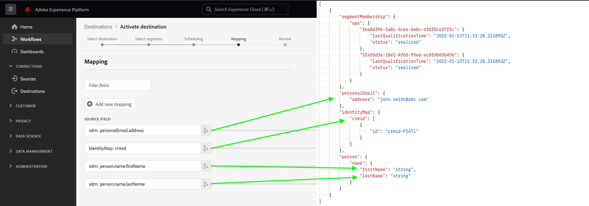

# Générer des exemples de profils en fonction d’un schéma source

## Présentation {#overview}

La première étape du test de votre destination basée sur les fichiers consiste à utiliser la variable `/sample-profiles` point d’entrée pour générer un exemple de profil en fonction de votre schéma source existant.

Les exemples de profils peuvent vous aider à comprendre la structure JSON d’un profil. En outre, ils vous donnent une valeur par défaut que vous pouvez personnaliser avec vos propres données de profil, pour d’autres tests de destination.

## Prise en main {#getting-started}

Avant de poursuivre, consultez le [guide de prise en main](./getting-started.md) pour obtenir des informations importantes à connaître avant d’effectuer des appels vers l’API, notamment sur la manière d’obtenir l’autorisation de création de la destination et les en-têtes requis.

## Conditions préalables {#prerequisites}

Avant d’utiliser la variable `/sample-profiles` endpoint, assurez-vous de respecter les conditions suivantes :

* Une destination basée sur des fichiers existante est créée via la Destination SDK et vous pouvez la voir dans votre [destinations](../ui/destinations-workspace.md).
* Vous avez créé au moins un flux d’activation pour votre destination dans l’interface utilisateur de l’Experience Platform. Le `/sample-profiles` endpoint crée les profils en fonction du schéma source que vous avez défini dans votre flux d’activation. Voir [tutoriel sur l’activation](../ui/activate-batch-profile-destinations.md) pour savoir comment créer un flux d’activation.
* Pour réussir la requête API, vous avez besoin de l’ID d’instance de destination correspondant à l’instance de destination que vous allez tester. Obtenez l’ID d’instance de destination que vous devez utiliser dans l’appel API, à partir de l’URL, lors de l’exploration d’une connexion avec votre destination dans l’interface utilisateur de Platform.

   

## Génération d’exemples de profils pour les tests de destination {#generate-sample-profiles}

Vous pouvez générer des exemples de profils en fonction de votre schéma source en adressant une requête de GET à la fonction `/sample-profiles` point de terminaison avec l’identifiant de l’instance de destination de la destination que vous souhaitez tester.

**Format d’API**

```http
GET /authoring/sample-profiles?destinationInstanceId={DESTINATION_INSTANCE_ID}&count={NUMBER_OF_GENERATED_PROFILES}
```

| Paramètres de requête | Description |
| -------- | ----------- |
| `destinationInstanceId` | L’identifiant de l’instance de destination pour laquelle vous générez des exemples de profils. Voir [conditions préalables](#prerequisites) pour plus d’informations sur la manière d’obtenir cet identifiant. |
| `count` | *Facultatif*. Le nombre d’exemples de profils que vous souhaitez générer. Le paramètre peut prendre des valeurs entre les variables `1 - 1000`. Si cette propriété n’est pas définie, l’API génère un seul exemple de profil. |

**Requête**

La requête suivante génère un exemple de profil en fonction du schéma source défini dans l’instance de destination avec le `destinationInstanceId`.

```shell
curl -X GET 'https://platform.adobe.io/data/core/activation/authoring/sample-profiles?destinationInstanceId={DESTINATION_INSTANCE_ID}' \
 -H 'Authorization: Bearer {ACCESS_TOKEN}' \
 -H 'Content-Type: application/json' \
 -H 'x-gw-ims-org-id: {IMS_ORG}' \
 -H 'x-api-key: {API_KEY}' \
 -H 'x-sandbox-name: {SANDBOX_NAME}' \
```

**Réponse**

Une réponse réussie renvoie un état HTTP 200 avec le nombre spécifié de profils d’exemple, avec l’appartenance au segment, les identités et les attributs de profil qui correspondent au schéma XDM source.

>[!NOTE]
>
> La réponse renvoie uniquement les attributs d’appartenance, d’identité et de profil utilisés dans l’instance de destination. Même si votre schéma source comporte d’autres champs, ceux-ci sont ignorés.

```json
[
   {
      "segmentMembership":{
         "ups":{
            "fea8d394-5a8c-4cea-bebc-df020ce37f5c":{
               "lastQualificationTime":"2022-01-13T11:33:28.211895Z",
               "status":"realized"
            },
            "5fa55d3a-18e1-4f65-95ed-ac8fdb03b45b":{
               "lastQualificationTime":"2022-01-13T11:33:28.211893Z",
               "status":"realized"
            }
         }
      },
      "personalEmail":{
         "address":"john.smith@abc.com"
      },
      "identityMap":{
         "crmid":[
            {
               "id":"crmid-P1A7l"
            }
         ]
      },
      "person":{
         "name":{
            "firstName":"string",
            "lastName":"string"
         }
      }
   }
]
```



| Propriété | Description |
| -------- | ----------- |
| `segmentMembership` | Objet map qui décrit les appartenances aux segments de l’individu. Pour plus d’informations sur `segmentMembership`, lire [Détails de l’adhésion au segment](../../xdm/field-groups/profile/segmentation.md). |
| `lastQualificationTime` | Horodatage de la dernière fois que ce profil s’est qualifié pour le segment. |
| `status` | Un champ de chaîne qui indique si l’appartenance au segment a été réalisée dans le cadre de la requête actuelle. Les valeurs suivantes sont acceptées : <ul><li>`existing`: Le profil faisait déjà partie du segment avant la demande et continue de conserver son adhésion.</li><li>`realized`: Le profil entre dans le segment dans le cadre de la requête actuelle.</li><li>`exited`: Le profil quitte le segment dans le cadre de la requête actuelle.</li></ul> |
| `identityMap` | Champ de type map qui décrit les différentes valeurs d’identité d’un individu, ainsi que les espaces de noms qui lui sont associés. Pour plus d’informations sur `identityMap`, voir [base de la composition des schémas](../../xdm/schema/composition.md#identityMap). |

{style=&quot;table-layout:auto&quot;}

## Gestion des erreurs d’API {#api-error-handling}

Les points d’entrée de l’API Destination SDK suivent les principes généraux des messages d’erreur de l’API Experience Platform. Consultez les sections [Codes dʼétat d’API](../../landing/troubleshooting.md#api-status-codes) et [Erreurs dʼen-tête de requête](../../landing/troubleshooting.md#request-header-errors) dans le guide de dépannage de Platform.

## Étapes suivantes

Après avoir lu ce document, vous savez maintenant comment générer des profils d’exemple en fonction du schéma source que vous avez configuré dans votre destination. [flux d’activation](../ui/activate-batch-profile-destinations.md).

Vous pouvez désormais personnaliser ces profils ou les utiliser tels qu’ils sont renvoyés par l’API pour [test de votre configuration de destination basée sur des fichiers](file-based-destination-testing-api.md).
