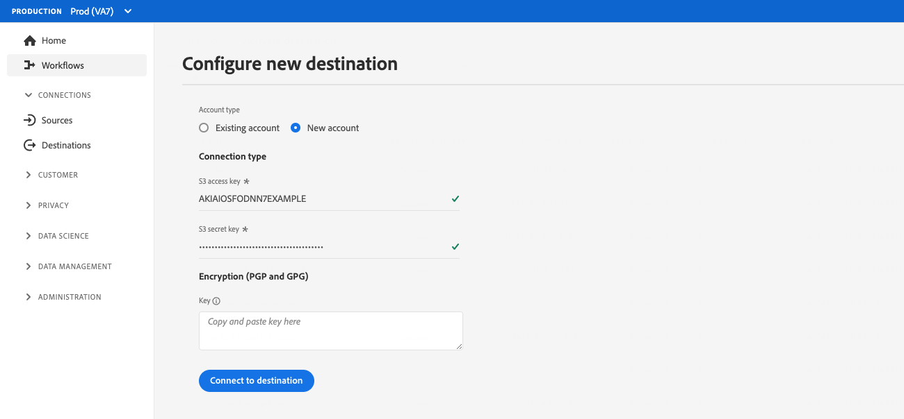
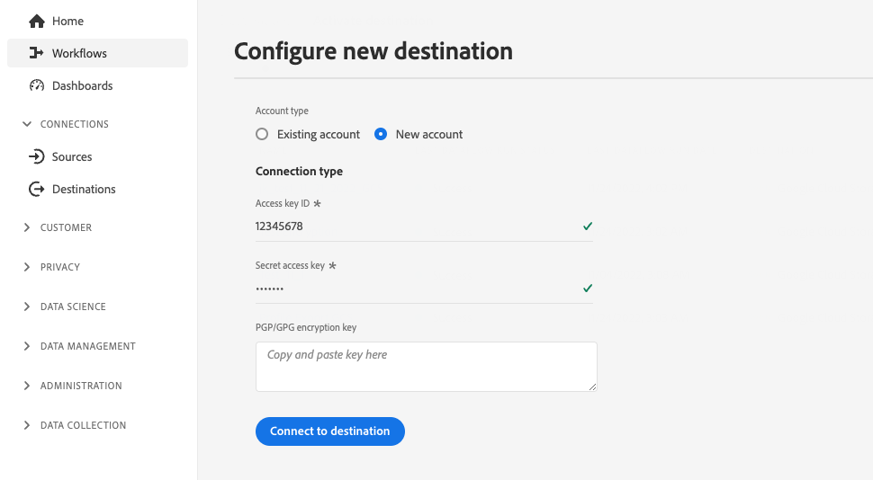

# Configuration de l’authentification du client

Experience Platform offre une grande flexibilité dans les protocoles d’authentification mis à la disposition des partenaires et de la clientèle. Vous pouvez configurer la destination pour qu’elle prenne en charge l’une des méthodes d’authentification standard du secteur, telles que [!DNL OAuth2], l’authentification par jeton d’un porteur, l’authentification par mot de passe, etc.

Cette page explique comment configurer la destination à l’aide de votre méthode d’authentification préférée. En fonction de la configuration d’authentification que vous utilisez au moment de la création de la destination, différents types de pages d’authentification s’affichent lors de la connexion à la destination dans l’interface utilisateur d’Experience Platform.

Pour comprendre la place de ce composant dans une intégration créée avec Destination SDK, consultez le diagramme de la documentation [Options de configuration](../configuration-options.md) ou consultez les pages de vue d’ensemble de la configuration de destination suivantes :

* [Utiliser Destination SDK pour configurer une destination de diffusion en streaming](../../guides/configure-destination-instructions.md#create-destination-configuration)
* [Utilisation de Destination SDK pour configurer une destination basée sur des fichiers](../../guides/configure-file-based-destination-instructions.md#create-destination-configuration)

Avant de pouvoir exporter des données d’Experience Platform vers la destination, une nouvelle connexion entre Experience Platform et la destination doit être établie, en suivant les étapes décrites dans le tutoriel [connexion de destination](../../../ui/connect-destination.md).

Pendant la [création d’une destination](../../authoring-api/destination-configuration/create-destination-configuration.md) avec Destination SDK, la section `customerAuthenticationConfigurations` définit ce que voit la clientèle sur l’[écran d’authentification](../../../ui/connect-destination.md#authenticate). Selon le type d’authentification de destination, divers détails d’authentification doivent être fournis, notamment :

* Pour les destinations qui utilisent un moyen d’[authentification de base](#basic), les utilisateurs doivent fournir un nom d’utilisateur et un mot de passe directement dans la page d’authentification de l’interface utilisateur Experience Platform.
* Pour les destinations qui utilisent l’[authentification du porteur](#bearer), les utilisateurs doivent fournir un jeton porteur.
* Pour les destinations qui utilisent l’autorisation [OAuth2](#oauth2), les utilisateurs sont redirigés vers la page de connexion de la destination, où ils peuvent se connecter à l’aide de leurs informations d’identification.
* Pour les destinations [Amazon S3](#s3), les utilisateurs doivent fournir leurs clés d’accès et clé secrète [!DNL Amazon S3].
* Pour les destinations [Azure Blob](#blob), les utilisateurs doivent fournir leur chaîne de connexion [!DNL Azure Blob].

Vous pouvez configurer les détails de l’authentification du client via le point d’entrée `/authoring/destinations`. Pour obtenir des exemples d’appels API détaillés dans lesquels vous pouvez configurer les composants affichés sur cette page, consultez les pages de référence de l’API suivantes.

* [Création d’une configuration de destination](../../authoring-api/destination-configuration/create-destination-configuration.md)
* [Mise à jour d’une configuration de destination](../../authoring-api/destination-configuration/update-destination-configuration.md)

Cet article décrit toutes les configurations d’authentification du client prises en charge que vous pouvez utiliser pour la destination et montre ce que la clientèle verra dans l’interface utilisateur d’Experience Platform en fonction de la méthode d’authentification que vous avez configurée pour la destination.

>[!IMPORTANT]
>
>La configuration de l’authentification du client ne demande pas que vous configuriez des paramètres. Vous pouvez copier et coller les fragments de code affichés sur cette page dans vos appels API au moment de la [création](../../authoring-api/destination-configuration/create-destination-configuration.md) ou [mise à jour](../../authoring-api/destination-configuration/update-destination-configuration.md) d’une configuration de destination, et vos utilisateurs verront l’écran d’authentification correspondant apparaître dans l’interface utilisateur d’Experience Platform.

>[!IMPORTANT]
>
>Tous les noms et toutes les valeurs de paramètre pris en charge par Destination SDK **sont sensibles à la casse**. Pour éviter les erreurs de respect de la casse, utilisez les noms et valeurs des paramètres exactement comme indiqué dans la documentation.

## Types d’intégration pris en charge {#supported-integration-types}

Pour en savoir plus sur les types d’intégration qui prennent en charge les fonctionnalités décrites sur cette page, consultez le tableau ci-dessous.

| Type d’intégration | Fonctionnalité de prise en charge |
|---|---|
| Intégrations en temps réel (streaming) | Oui |
| Intégrations basées sur des fichiers (par lots) | Oui |

## Configuration des règles d’authentification {#authentication-rule}

Pendant l’utilisation de l’une des configurations d’authentification du client décrites sur cette page, définissez toujours le paramètre `authenticationRule` dans la [diffusion de destination](destination-delivery.md) sur `"CUSTOMER_AUTHENTICATION"`, comme illustré ci-dessous.

```json {line-numbers="true" highlight="4"
{
   "destinationDelivery":[
      {
         "authenticationRule":"CUSTOMER_AUTHENTICATION",
         "destinationServerId":"{{destinationServerId}}"
      }
   ]
}
```

## Authentification de base {#basic}

L’authentification de base est prise en charge pour les intégrations en temps réel (streaming) dans Experience Platform.

Quand vous configurez le type d’authentification de base, les utilisateurs doivent saisir un nom d’utilisateur et un mot de passe pour se connecter à la destination.


Pour configurer l’authentification de base pour la destination, configurez la section `customerAuthenticationConfigurations` via le point d’entrée `/destinations` comme illustré ci-dessous :

```json
"customerAuthenticationConfigurations":[
   {
      "authType":"BASIC"
   }
]
```

## Authentification du porteur {#bearer}

Lorsque vous configurez le type d’authentification du porteur, les utilisateurs doivent saisir le jeton du porteur qu’ils obtiennent de votre destination.


Pour configurer l’authentification de type porteur pour la destination, configurez la section `customerAuthenticationConfigurations` via le point d’entrée `/destinations` comme illustré ci-dessous :

```json
"customerAuthenticationConfigurations":[
   {
      "authType":"BEARER"
   }
]
```

## Authentification OAuth 2 {#oauth2}

Les utilisateurs sélectionnent **[!UICONTROL Se connecter à la destination]** pour déclencher le flux d’authentification OAuth 2 vers votre destination, comme illustré dans l’exemple ci-dessous pour la destination Audiences personnalisées de Twitter. Pour plus d’informations sur la configuration de l’authentification OAuth 2 à votre point d’entrée de destination, consultez la page [Authentification OAuth 2 de Destination SDK](oauth2-authorization.md).


Pour configurer l’authentification [!DNL OAuth2] pour la destination, configurez la section `customerAuthenticationConfigurations` via le point d’entrée `/destinations` comme illustré ci-dessous :

```json
"customerAuthenticationConfigurations":[
   {
      "authType":"OAUTH2"
   }
]
```

## Authentification Amazon S3 {#s3}

L’authentification [!DNL Amazon S3] est prise en charge pour les destinations basées sur des fichiers dans Experience Platform.

Quand vous configurez le type d’authentification Amazon S3, les utilisateurs doivent saisir leurs informations d’identification S3.



Pour configurer l’authentification [!DNL Amazon S3] pour la destination, configurez la section `customerAuthenticationConfigurations` via le point d’entrée `/destinations` comme illustré ci-dessous :

```json
"customerAuthenticationConfigurations":[
   {
      "authType":"S3"
   }
]
```

## Authentification Azure Blob  {#blob}

L’authentification [!DNL Azure Blob Storage] est prise en charge pour les destinations basées sur des fichiers dans Experience Platform.

Lorsque vous configurez le type d’authentification Azure Blob, les utilisateurs doivent saisir la chaîne de connexion.


Pour configurer l’authentification [!DNL Azure Blob] pour la destination, configurez le paramètre `customerAuthenticationConfigurations` du point d’entrée `/destinations` comme illustré ci-dessous :

```json
"customerAuthenticationConfigurations":[
   {
      "authType":"AZURE_CONNECTION_STRING"
   }
]
```

## Authentification [!DNL Azure Data Lake Storage] {#adls}

L’authentification [!DNL Azure Data Lake Storage] est prise en charge pour les destinations basées sur des fichiers dans Experience Platform.

Quand vous configurez le type d’authentification[!DNL Azure Data Lake Storage], les utilisateurs doivent saisir les informations d’identification d’Azure Service Principal et leurs informations de client.

![[!DNL Azure Data Lake Storage]Rendu de l’interface utilisateur avec authentification &#x200B;](../../assets/functionality/destination-configuration/adls-authentication-ui.png)

Pour configurer l’authentification [!DNL Azure Data Lake Storage] (ADLS) de la destination, configurez le paramètre `customerAuthenticationConfigurations` du point d’entrée `/destinations` comme illustré ci-dessous :

```json
"customerAuthenticationConfigurations":[
   {
      "authType":"AZURE_SERVICE_PRINCIPAL"
   }
]
```

## SFTP avec authentification par mot de passe

L’authentification [!DNL SFTP] avec mot de passe est prise en charge pour les destinations basées sur des fichiers dans Experience Platform.

Lorsque vous configurez le SFTP avec le type d’authentification par mot de passe, les utilisateurs doivent saisir le nom d’utilisateur et le mot de passe SFTP, ainsi que le domaine et le port SFTP (le port par défaut est 22).


Pour configurer l’authentification SFTP avec le mot de passe de la destination, configurez le paramètre `customerAuthenticationConfigurations` du point d’entrée `/destinations` comme illustré ci-dessous :

```json
"customerAuthenticationConfigurations":[
   {
      "authType":"SFTP_WITH_PASSWORD"
   }
]
```

## SFTP avec authentification par clé SSH

L’authentification [!DNL SFTP] avec la clé [!DNL SSH] est prise en charge pour les destinations basées sur des fichiers dans Experience Platform.

Lorsque vous configurez le SFTP avec le type d’authentification par clé SSH, les utilisateurs doivent saisir le nom d’utilisateur SFTP et la clé SSH, ainsi que le domaine et le port SFTP (le port par défaut est 22).


Pour configurer l’authentification SFTP avec la clé SSH pour la destination, configurez le paramètre `customerAuthenticationConfigurations` du point d’entrée `/destinations` comme illustré ci-dessous :

```json
"customerAuthenticationConfigurations":[
   {
      "authType":"SFTP_WITH_SSH_KEY"
   }
]
```

## Authentification [!DNL Google Cloud Storage] {#gcs}

L’authentification [!DNL Google Cloud Storage] est prise en charge pour les destinations basées sur des fichiers dans Experience Platform.

Quand vous configurez le type d’authentification [!DNL Google Cloud Storage], les utilisateurs doivent saisir leur [!UICONTROL identifiant de clé d’accès] [!DNL Google Cloud Storage] et leur [!UICONTROL clé d’accès secrète].



Pour configurer l’authentification [!DNL Google Cloud Storage] pour la destination, configurez le paramètre `customerAuthenticationConfigurations` du point d’entrée `/destinations` comme illustré ci-dessous :

```json
"customerAuthenticationConfigurations":[
   {
      "authType":"GOOGLE_CLOUD_STORAGE"
   }
]
```

## Étapes suivantes {#next-steps}

Vous êtes arrivé au bout de cet article. À présent, vous devriez mieux comprendre comment configurer l’authentification des utilisateurs sur votre plateforme de destination.

Pour en savoir plus sur les autres composants de destination, consultez les articles suivants :

* [Autorisation OAuth2](oauth2-authorization.md)
* [Champs de données client](customer-data-fields.md)
* [Attributs de l’interface utilisateur](ui-attributes.md)
* [Configuration du schéma](schema-configuration.md)
* [Configuration de l’espace de noms d’identité](identity-namespace-configuration.md)
* [Configurations de mappage prises en charge](supported-mapping-configurations.md)
* [Diffusion de destination](destination-delivery.md)
* [Configuration des métadonnées d’audience](audience-metadata-configuration.md)
* [Politique d’agrégation](aggregation-policy.md)
* [Configuration par lots](batch-configuration.md)
* [Qualifications des profils historiques](historical-profile-qualifications.md)
