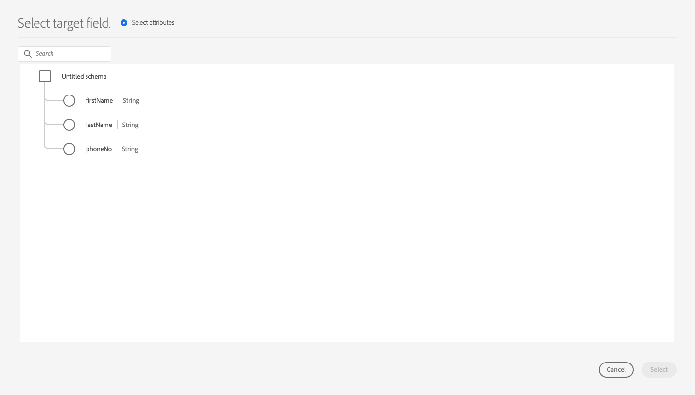

# Configuration des schémas de partenaire

Experience Platform utilise des schémas pour décrire la structure des données de manière cohérente et réutilisable. Lorsque des données sont ingérées dans Experience Platform, elles sont structurées selon un schéma XDM. Pour plus d’informations sur le modèle de composition de schémas, notamment sur les principes de conception et les bonnes pratiques, consultez les [bases de la composition de schémas](../../../../xdm/schema/composition.md).

Pendant la création d’une destination avec Destination SDK, vous pouvez définir votre propre schéma de partenaire à utiliser par votre plateforme de destination. Cela permet aux utilisateurs de mapper les attributs de profil d’Experience Platform à des champs spécifiques reconnus par votre plateforme de destination, le tout dans l’interface utilisateur d’Experience Platform.

Pendant la configuration du schéma de partenaire pour la destination, vous pouvez affiner le mappage des champs pris en charge par votre plateforme de destination, par exemple :

* Autoriser les utilisateurs à mapper un attribut XDM `phoneNumber` à un attribut `phone` pris en charge par votre plateforme de destination.
* Créer des schémas de partenaire dynamique qu’Experience Platform peut appeler dynamiquement pour récupérer une liste de tous les attributs pris en charge dans la destination.
* Définir les mappages de champs obligatoires par votre plateforme de destination.

Pour comprendre la place de ce composant dans une intégration créée avec Destination SDK, consultez le diagramme de la documentation [options de configuration](../configuration-options.md) ou consultez le guide sur la [utilisation de Destination SDK pour configurer une destination basée sur des fichiers](../../guides/configure-file-based-destination-instructions.md#create-server-file-configuration).

Vous pouvez configurer vos paramètres de schéma via le point d’entrée `/authoring/destinations`. Pour obtenir des exemples d’appels API détaillés dans lesquels vous pouvez configurer les composants affichés sur cette page, consultez les pages de référence de l’API suivantes.

* [Création d’une configuration de destination](../../authoring-api/destination-configuration/create-destination-configuration.md)
* [Mise à jour d’une configuration de destination](../../authoring-api/destination-configuration/update-destination-configuration.md)

Cet article décrit toutes les options de configuration de schéma prises en charge que vous pouvez utiliser pour la destination et montre ce que la clientèle verra dans l’interface utilisateur d’Experience Platform.

>[!IMPORTANT]
>
>Tous les noms et toutes les valeurs de paramètre pris en charge par Destination SDK **sont sensibles à la casse**. Pour éviter les erreurs de respect de la casse, utilisez les noms et valeurs des paramètres exactement comme indiqué dans la documentation.

## Types d’intégration pris en charge {#supported-integration-types}

Pour en savoir plus sur les types d’intégration qui prennent en charge les fonctionnalités décrites sur cette page, consultez le tableau ci-dessous.

| Type d’intégration | Fonctionnalité de prise en charge |
|---|---|
| Intégrations en temps réel (streaming) | Oui |
| Intégrations basées sur des fichiers (par lots) | Oui |

## Configuration de schéma prise en charge {#supported-schema-types}

Destination SDK prend en charge plusieurs configurations de schéma :

* Les schémas statiques sont définis depuis le tableau `profileFields` de la section `schemaConfig`. Dans un schéma statique, vous définissez chaque attribut cible qui doit s’afficher dans l’interface utilisateur d’Experience Platform dans le tableau `profileFields`. Si vous devez mettre à jour votre schéma, vous devez procéder à une [mise à jour de la configuration de destination](../../authoring-api/destination-configuration/update-destination-configuration.md).
* Les schémas dynamiques utilisent un type de serveur de destination supplémentaire, appelé [serveur de schéma dynamique](../../authoring-api/destination-server/create-destination-server.md#dynamic-schema-servers), afin de récupérer dynamiquement les attributs cibles pris en charge et générer des schémas en fonction de votre propre API. Les schémas dynamiques n’utilisent pas le tableau `profileFields`. Si vous devez mettre à jour votre schéma, vous n’êtes pas obligé de procéder à une [mise à jour de la configuration de destination](../../authoring-api/destination-configuration/update-destination-configuration.md). Au lieu de cela, le serveur de schéma dynamique récupère le schéma mis à jour de votre API.
* Dans la configuration du schéma, vous avez la possibilité d’ajouter des mappages obligatoires (ou prédéfinis). Il s’agit de mappages que les utilisateurs peuvent afficher dans l’interface utilisateur d’Experience Platform, mais qu’ils ne peuvent pas modifier lors de la configuration d’une connexion à la destination. Vous pouvez, par exemple, appliquer le champ de l’adresse e-mail pour qu’il soit toujours envoyé à la destination.

`schemaConfig` utilise plusieurs paramètres de configuration, en fonction du type de schéma dont vous avez besoin, comme indiqué dans les sections ci-dessous.

## Création d’un schéma statique {#attributes-schema}

Pour créer un schéma statique avec des attributs de profil, définissez les attributs de la cible dans `profileFields` comme illustré ci-dessous.

```json
"schemaConfig":{
      "profileFields":[
           {
              "name":"phoneNo",
              "title":"phoneNo",
              "description":"This is a fixed attribute on your destination side that customers can map profile attributes to. For example, the mobilePhone.number value in Experience Platform could be phoneNo on your side.",
              "type":"string",
              "isRequired":false,
              "readOnly":false,
              "hidden":false
           },
                      {
              "name":"firstName",
              "title":"firstName",
              "description":"This is a fixed attribute on your destination side that customers can map profile attributes to. For example, the person.name.firstName value in Experience Platform could be firstName on your side.",
              "type":"string",
              "isRequired":false,
              "readOnly":false,
              "hidden":false
           },
                      {
              "name":"lastName",
              "title":"lastName",
              "description":"This is a fixed attribute on your destination side that customers can map profile attributes to. For example, the person.name.lastName value in Experience Platform could be phoneNo on your side.",
              "type":"string",
              "isRequired":false,
              "readOnly":false,
              "hidden":false
           }
        ],
      "useCustomerSchemaForAttributeMapping":false,
      "profileRequired":true,
      "segmentRequired":true,
      "identityRequired":true,
      "segmentNamespaceAllowList": ["someNamespace"],
      "segmentNamespaceDenyList": ["someOtherNamespace"]

}
```

| Paramètre | Type | Obligatoire / Facultatif | Description |
|---------|----------|------|---|
| `profileFields` | Tableau | Facultatif | Définit le tableau des attributs de cible acceptés par votre plateforme de destination vers lequel la clientèle peut mapper ses attributs de profil. Pendant l’utilisation d’un tableau `profileFields`, vous pouvez entièrement omettre le paramètre `useCustomerSchemaForAttributeMapping`. |
| `useCustomerSchemaForAttributeMapping` | Booléen | Facultatif | Active ou désactive le mappage des attributs du schéma client aux attributs que vous définissez dans le tableau `profileFields`. <ul><li>Si le paramètre est défini sur `true`, les utilisateurs ne voient que la colonne source dans le champ de mappage. `profileFields` ne sont pas applicables dans ce cas.</li><li>Si le paramètre est défini sur `false`, les utilisateurs peuvent mapper les attributs sources de leur schéma aux attributs que vous avez définis dans le tableau `profileFields`.</li></ul> La valeur par défaut est `false`. |
| `profileRequired` | Booléen | Facultatif | Utilisez `true` si les utilisateurs doivent être en mesure de mapper les attributs de profil d’Experience Platform aux attributs personnalisés du côté de votre plateforme de destination. |
| `segmentRequired` | Booléen | Obligatoire | Ce paramètre est demandé par Destination SDK et doit toujours être défini sur `true`. |
| `identityRequired` | Booléen | Obligatoire | Définissez-le sur `true` si les utilisateurs doivent être en mesure de mapper les [types d’identité](identity-namespace-configuration.md) d’Experience Platform aux attributs que vous avez définis dans le tableau `profileFields`. |
| `segmentNamespaceAllowList` | Tableau | Facultatif | Permet aux utilisateurs de mapper uniquement des audiences des espaces de noms d’audience définis dans le tableau à la destination. <br><br> L&#39;utilisation de ce paramètre est déconseillée dans la plupart des cas. Utilisez plutôt `"segmentNamespaceDenyList":[]` pour autoriser l’exportation de tous les types d’audiences vers votre destination. <br><br> Si les `segmentNamespaceAllowList` et les `segmentNamespaceDenyList` sont absents de votre configuration, les utilisateurs ne pourront exporter que les audiences provenant du [service de segmentation](../../../../segmentation/home.md). <br><br>`segmentNamespaceAllowList` et `segmentNamespaceDenyList` s’excluent mutuellement. |
| `segmentNamespaceDenyList` | Tableau | Facultatif | Limite les utilisateurs du mappage des audiences des espaces de noms d’audience définis dans le tableau vers la destination. <br><br>Adobe recommande d&#39;autoriser l&#39;exportation de toutes les audiences, quelle que soit leur origine, en définissant `"segmentNamespaceDenyList":[]`. <br><br>Si les `segmentNamespaceAllowed` et les `segmentNamespaceDenyList` sont absents de votre configuration, les utilisateurs ne pourront exporter que les audiences provenant du [service de segmentation](../../../../segmentation/home.md). <br><br>`segmentNamespaceAllowList` et `segmentNamespaceDenyList` s’excluent mutuellement. |

{style="table-layout:auto"}

L’expérience de l’interface utilisateur qui en résulte est affichée dans les images ci-dessous.

Quand les utilisateurs sélectionnent le mapping de ciblage, ils peuvent voir les champs définis dans le tableau `profileFields`.



Après avoir sélectionné les attributs, les utilisateurs peuvent les voir dans la colonne du champ cible.


## Création d’un schéma dynamique {#dynamic-schema-configuration}

Destination SDK prend en charge la création de schémas de partenaire dynamiques. Contrairement à un schéma statique, un schéma dynamique n’utilise pas de tableau `profileFields`, mais un serveur de schéma dynamique qui se connecte à votre propre API à partir de laquelle il récupère la configuration du schéma.

>[!IMPORTANT]
>
>Avant de créer un schéma dynamique, vous devez procéder à la [création d’un serveur de schéma dynamique](../../authoring-api/destination-server/create-destination-server.md#dynamic-schema-servers).

Dans une configuration de schéma dynamique, le tableau `profileFields` est remplacé par `dynamicSchemaConfig`, comme illustré ci-dessous.

```json
"schemaConfig":{
   "dynamicSchemaConfig":{
      "dynamicEnum": {
         "authenticationRule":"CUSTOMER_AUTHENTICATION",
         "destinationServerId":"DYNAMIC_SCHEMA_SERVER_ID",
         "value": "Schema Name",
         "responseFormat": "SCHEMA"
      }
   },
   "profileRequired":true,
   "segmentRequired":true,
   "identityRequired":true
}
```

| Paramètre | Type | Obligatoire / Facultatif | Description |
|---------|----------|------|---|
| `dynamicEnum.authenticationRule` | Chaîne | Obligatoire | Indique comment la clientèle [!DNL Experience Platform] se connecte à votre destination. Les valeurs acceptées sont les suivantes : `CUSTOMER_AUTHENTICATION`, `PLATFORM_AUTHENTICATION`, `NONE`. <br> <ul><li>Utilisez `CUSTOMER_AUTHENTICATION` si la clientèle Experience Platform se connecte à votre système par l’une des méthodes d’authentification décrites [ici](customer-authentication.md). </li><li> Utilisez `PLATFORM_AUTHENTICATION` s’il existe un système d’authentification global entre Adobe et votre destination et que la clientèle [!DNL Experience Platform] n’a pas besoin de fournir d’informations d’authentification pour se connecter à votre destination. Dans ce cas, vous devez procéder à la [création d’un objet d’informations d’identification](../../credentials-api/create-credential-configuration.md) à l’aide de l’API d’informations d’identification. </li><li>Utilisez `NONE` si aucune authentification n’est requise pour envoyer des données à votre plateforme de destination. </li></ul> |
| `dynamicEnum.destinationServerId` | Chaîne | Obligatoire | `instanceId` de votre serveur de schéma dynamique. Ce serveur de destination inclut le point d’entrée de l’API qu’Experience Platform appellera pour récupérer le schéma dynamique. |
| `dynamicEnum.value` | Chaîne | Obligatoire | Nom du schéma dynamique, tel que défini dans la configuration du serveur de schéma dynamique. |
| `dynamicEnum.responseFormat` | Chaîne | Obligatoire | Toujours définie sur `SCHEMA` pendant la définition d’un schéma dynamique. |
| `profileRequired` | Booléen | Facultatif | Utilisez `true` si les utilisateurs doivent être en mesure de mapper les attributs de profil d’Experience Platform aux attributs personnalisés du côté de votre plateforme de destination. |
| `segmentRequired` | Booléen | Obligatoire | Ce paramètre est demandé par Destination SDK et doit toujours être défini sur `true`. |
| `identityRequired` | Booléen | Obligatoire | Définissez-le sur `true` si les utilisateurs doivent être en mesure de mapper les [types d’identité](identity-namespace-configuration.md) d’Experience Platform aux attributs que vous avez définis dans le tableau `profileFields`. |

{style="table-layout:auto"}

## Mappages obligatoires {#required-mappings}

Dans la configuration du schéma, en plus de votre schéma statique ou dynamique, vous avez la possibilité d’ajouter des mappages obligatoires (ou prédéfinis). Il s’agit de mappages que les utilisateurs peuvent afficher dans l’interface utilisateur d’Experience Platform, mais qu’ils ne peuvent pas modifier lors de la configuration d’une connexion à la destination.

Vous pouvez, par exemple, appliquer le champ de l’adresse e-mail pour qu’il soit toujours envoyé à la destination.

>[!NOTE]
>
>Les combinaisons suivantes de mappages obligatoires sont actuellement prises en charge :
>* Vous pouvez configurer un champ source et un champ de destination obligatoires. Dans ce cas, les utilisateurs ne peuvent pas modifier ni sélectionner l’un des deux champs et peuvent uniquement afficher la sélection.
>* Vous ne pouvez configurer qu’un champ de destination obligatoire. Dans ce cas, les utilisateurs seront autorisés à sélectionner un champ source à mapper à la destination.
>
> La configuration d’un champ source obligatoire n’est *pas* prise en charge pour l’instant.

Vous trouverez ci-dessous deux exemples de configuration de schéma avec les mappages obligatoires et ce à quoi ils ressemblent dans l’étape de mappage du flux de travail d’[activation des données vers les destinations des lots](../../../ui/activate-batch-profile-destinations.md).


>[!BEGINTABS]

>[!TAB Mappages source et de destination obligatoire]

L’exemple ci-dessous montre les mappages source et de destination obligatoires. Quand les champs source et de destination sont spécifiés comme des mappages obligatoires, les utilisateurs ne peuvent pas sélectionner ni modifier l’un des deux champs et peuvent uniquement afficher la sélection prédéfinie.

```json
"schemaConfig": {
    "requiredMappingsOnly": true,
    "requiredMappings": [
      {
        "sourceType": "text/x.schema-path",
        "source": "personalEmail.address",
        "destination": "personalEmail.address"
      }
    ] 
}
```

| Paramètre | Type | Obligatoire / Facultatif | Description |
|---|---|---|---|
| `requiredMappingsOnly` | Booléen | Facultatif | Quand cette valeur est définie sur « true », les utilisateurs ne peuvent pas mapper d’autres attributs et identités dans le flux d’activation, à l’exception des mappages obligatoires que vous définissez dans le tableau `requiredMappings`. |
| `requiredMappings.sourceType` | Chaîne | Obligatoire | Indique le type du champ `source`. Valeurs prises en charge : <ul><li>`text/x.schema-path` : utilisez cette valeur quand le champ `source` est l’attribut de profil d’un schéma XDM.</li><li>`text/x.aep-xl` : utilisez cette valeur quand votre champ `source` est défini par une expression régulière. Exemple : `iif(segmentMembership.ups.aep_seg_id.status==\"exited\", \"1\", \"0\")`</li><li>`text/plain` : utilisez cette valeur quand votre champ `source` est défini par un modèle de macro. Actuellement, le seul modèle de macro pris en charge est `metadata.segment.alias`.</li></ul> |
| `requiredMappings.source` | Chaîne | Obligatoire | Indique la valeur du champ source. Types de valeur pris en charge : <ul><li>Attributs de profil XDM. Exemple : `personalEmail.address`. Quand votre attribut source est un attribut de profil XDM, définissez le paramètre `sourceType` sur `text/x.schema-path`.</li><li>Expressions régulières. Exemple : `iif(segmentMembership.ups.aep_seg_id.status==\"exited\", \"1\", \"0\")`. Quand votre attribut source est une expression régulière, définissez le paramètre `sourceType` sur `text/x.aep-xl`.</li><li>Modèles de macro. Exemple : `metadata.segment.alias`. Quand votre attribut source est un modèle de macro, définissez le paramètre `sourceType` sur `text/plain`. Actuellement, le seul modèle de macro pris en charge est `metadata.segment.alias`.</li></ul> |
| `requiredMappings.destination` | Chaîne | Obligatoire | Indique la valeur du champ cible. Quand les champs source et de destination sont spécifiés comme des mappages obligatoires les utilisateurs ne peuvent pas sélectionner ni modifier l’un des deux champs et peuvent uniquement afficher la sélection. |

{style="table-layout:auto"}

**Par conséquent, les sections Champ** Source et **[!UICONTROL Champ cible]** de l’interface utilisateur d’Experience Platform sont grisées.


>[!TAB Mappage de destination obligatoire]

L’exemple ci-dessous montre un mappage de destination obligatoire. Si seul le champ de destination est spécifié, les utilisateurs peuvent sélectionner le champ source à mapper.

```json
"schemaConfig": {
    "requiredMappingsOnly": true,
    "requiredMappings": [
      {
        "destination": "identityMap.ExamplePartner_ID",
        "mandatoryRequired": true,
        "primaryKeyRequired": true
      }
    ] 
}
```

| Paramètre | Type | Obligatoire / Facultatif | Description |
|---|---|---|---|
| `requiredMappingsOnly` | Booléen | Facultatif | Quand cette valeur est définie sur « true », les utilisateurs ne peuvent pas mapper d’autres attributs et identités dans le flux d’activation, à l’exception des mappages obligatoires que vous définissez dans le tableau `requiredMappings`. |
| `requiredMappings.destination` | Chaîne | Obligatoire | Indique la valeur du champ cible. Quand seul le champ de destination est spécifié, les utilisateurs peuvent sélectionner un champ source à mapper vers la destination. |
| `mandatoryRequired` | Booléen | Facultatif | Indique si le mappage doit être marqué comme un [attribut obligatoire](../../../ui/activate-batch-profile-destinations.md#mandatory-attributes). |
| `primaryKeyRequired` | Booléen | Facultatif | Indique si le mappage doit être marqué comme une [clé de déduplication](../../../ui/activate-batch-profile-destinations.md#deduplication-keys). |

{style="table-layout:auto"}

Ainsi, la section **[!UICONTROL Champ cible]** de l’interface utilisateur d’Experience Platform est grisée, tandis que la section **[!UICONTROL Champ Source]** est active et les utilisateurs peuvent interagir avec celle-ci. Les options **[!UICONTROL clé obligatoire]** et **[!UICONTROL clé de déduplication]** sont actives et les utilisateurs ne peuvent pas les modifier.


>[!ENDTABS]

## Configuration de la prise en charge des audiences externes {#external-audiences}

Pour configurer la destination afin de prendre en charge l’activation des [audiences générées en externe](../../../../segmentation/ui/audience-portal.md#import-audience), incluez le fragment de code ci-dessous dans la section `schemaConfig`.

```json
"schemaConfig": {
  "segmentNamespaceDenyList": [],
  ...
}
```

Consultez les descriptions des propriétés dans le [tableau](#attributes-schema) plus haut sur cette page pour en savoir plus sur la fonctionnalité de `segmentNamespaceDenyList`.

## Étapes suivantes {#next-steps}

Vous êtes arrivé au bout de cet article. À présent, vous devriez mieux comprendre quels types de schémas sont pris en charge par Destination SDK et comment le configurer.

Pour en savoir plus sur les autres composants de destination, consultez les articles suivants :

* [Authentification du client](customer-authentication.md)
* [Autorisation OAuth2](oauth2-authorization.md)
* [Attributs de l’interface utilisateur](ui-attributes.md)
* [Champs de données client](customer-data-fields.md)
* [Configuration de l’espace de noms d’identité](identity-namespace-configuration.md)
* [Configurations de mappage prises en charge](supported-mapping-configurations.md)
* [Diffusion de destination](destination-delivery.md)
* [Configuration des métadonnées d’audience](audience-metadata-configuration.md)
* [Politique d’agrégation](aggregation-policy.md)
* [Configuration par lots](batch-configuration.md)
* [Qualifications des profils historiques](historical-profile-qualifications.md)
