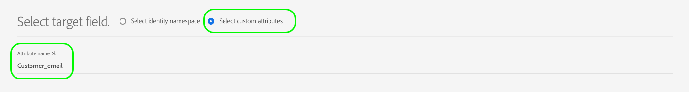

# Configurations de mappage prises en charge

Les destinations créées avec Destination SDK prennent en charge les configurations spécifiques d’espace de noms d’identité et de mappage d’attributs, en fonction du type de destination.

Cet article décrit toutes les configurations de mappage prises en charge que vous pouvez utiliser au moment de la configuration de la destination.

>[!WARNING]
>
>Toute configuration de mappage qui ne figure pas dans cet article n’est pas prise en charge par Destination SDK.

Pendant la création de la destination, configurez vos espaces de noms de schéma et d’identité en fonction de l’une des configurations de mappage décrites sur cette page.

>[!IMPORTANT]
>
>Tous les noms et toutes les valeurs de paramètre pris en charge par Destination SDK **sont sensibles à la casse**. Pour éviter les erreurs de respect de la casse, utilisez les noms et valeurs des paramètres exactement comme indiqué dans la documentation.

## Mappages pris en charge pour les destinations de diffusion en streaming {#streaming-mappings}

Les destinations en temps réel (streaming) créé avec Destination SDK prennent en charge les configurations de mappage décrites dans le tableau ci-dessous.

| Champ source | Champ cible |
| --- | --- |
| Attribut XDM | Attribut personnalisé |
| Espace de noms d’identité | Espace de noms d’identité |

L’exemple de configuration suivant permet d’utiliser les deux mappages dans le tableau ci-dessus.

```json
"schemaConfig":{
   "profileRequired":true,
   "segmentRequired":true,
   "identityRequired":true
},
"identityNamespaces":{
   "Customer_contact":{
      "acceptsAttributes":false,
      "acceptsCustomNamespaces":true,
      "acceptedGlobalNamespaces":{
         "Email":{
            
         },
         "Phone":{
            
         }
      }
   }
},
```

### Mappage des attributs XDM aux attributs personnalisés {#streaming-xdm-to-custom}

Les utilisateurs peuvent mapper des attributs de leur profil XDM source aux attributs personnalisés du côté de la destination.

Les utilisateurs doivent saisir manuellement le nom de l’attribut personnalisé cible au moment de la sélection du mapping de ciblage de champ.



L’expérience de l’interface utilisateur qui en résulte est affichée dans l’image ci-dessous.


### Mappage des espaces de noms d’identité aux espaces de noms d’identité de partenaires {#streaming-identity-to-identity}

Les utilisateurs peuvent mapper des espaces de noms d’identité personnalisés ou globaux d’Experience Platform aux espaces de noms d’identité que vous avez définis.

L’expérience de l’interface utilisateur qui en résulte est affichée dans l’image ci-dessous.


## Mappages pris en charge pour les destinations basées sur des fichiers {#batch-mappings}

Les destinations basées sur des fichiers créés avec Destination SDK prennent en charge les configurations de mappage décrites dans le tableau ci-dessous. Pour obtenir des exemples de mappage détaillés, consultez les sections suivantes.

| Champ source | Champ cible |
| --- | --- |
| Attribut XDM | Attribut/attribut personnalisé |
| Espace de noms d’identité | Attribut/attribut personnalisé |
| Espace de noms d’identité | Espace de noms d’identité |

L’exemple de configuration ci-dessous permet d’utiliser tous les mappages du tableau ci-dessus.

```json
"schemaConfig":{
   "profileRequired":true,
   "segmentRequired":true,
   "identityRequired":true
},
"identityNamespaces":{
   "Customer_contact":{
      "acceptsAttributes":false,
      "acceptsCustomNamespaces":true,
      "acceptedGlobalNamespaces":{
         "Email":{
         },
         "Phone":{
         }
      }
   }
},
```

### Mappage des attributs XDM aux attributs personnalisés {#batch-xdm-to-custom}

Les utilisateurs peuvent mapper des attributs de leur profil XDM source aux attributs personnalisés du côté de la destination.

Pour les destinations basées sur des fichiers, le champ cible est automatiquement renseigné avec un attribut par défaut du même nom que le champ source.

L’expérience de l’interface utilisateur qui en résulte est affichée dans l’image ci-dessous.


Les utilisateurs peuvent conserver le nom par défaut ou saisir un nom d’attribut personnalisé dans l’écran de sélection des champs cibles.


### Mappage des espaces de noms d’identité aux attributs personnalisés {#batch-identity-to-custom}

Les utilisateurs peuvent mapper des espaces de noms d’identité personnalisés ou globaux d’Experience Platform aux attributs personnalisés du côté de la destination.

Pendant la sélection d’un espace de noms d’identité comme champ source, le champ cible est automatiquement renseigné avec un espace de noms d’identité équivalent. Pour remplacer le champ cible par un attribut personnalisé, les utilisateurs doivent saisir un nom d’attribut personnalisé dans l’écran de sélection du champ cible.


L’expérience de l’interface utilisateur qui en résulte est affichée dans l’image ci-dessous.


### Mappage des espaces de noms d’identité aux espaces de noms d’identité de partenaires {#batch-identity-to-identity}

Les utilisateurs peuvent mapper des espaces de noms d’identité personnalisés ou globaux d’Experience Platform à des espaces de noms d’identité équivalents.

Pendant la sélection d’un espace de noms d’identité comme champ source, le champ cible est automatiquement renseigné avec un espace de noms d’identité équivalent.

L’expérience de l’interface utilisateur qui en résulte est affichée dans l’image ci-dessous.


## Étapes suivantes {#next-steps}

Vous êtes arrivé au bout de cet article. À présent, vous devriez mieux comprendre quels mappages sont pris en charge par les destinations créées à l’aide de Destination SDK.

Pour en savoir plus sur les autres composants de destination, consultez les articles suivants :

* [Authentification du client](customer-authentication.md)
* [Autorisation OAuth2](oauth2-authorization.md)
* [Champs de données client](customer-data-fields.md)
* [Attributs de l’interface utilisateur](ui-attributes.md)
* [Configuration du schéma](schema-configuration.md)
* [Configuration de l’espace de noms d’identité](identity-namespace-configuration.md)
* [Diffusion de destination](destination-delivery.md)
* [Configuration des métadonnées d’audience](audience-metadata-configuration.md)
* [Politique d’agrégation](aggregation-policy.md)
* [Configuration par lots](batch-configuration.md)
* [Qualifications des profils historiques](historical-profile-qualifications.md)
