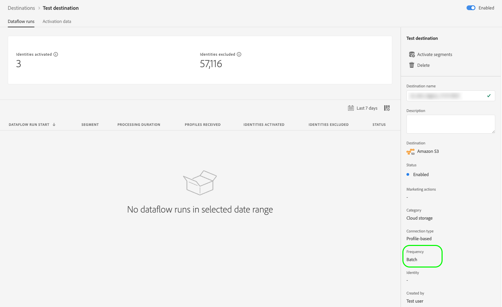

# Attributs de l’interface utilisateur

Les attributs de l’interface utilisateur définissent les éléments visuels qu’Adobe doit afficher pour votre carte de destination dans l’interface utilisateur de Adobe Experience Platform, tels qu’un logo, un lien vers la page de documentation, une description de destination et sa catégorie et son type.

Pour comprendre la place de ce composant dans une intégration créée avec Destination SDK, consultez le diagramme de la documentation [Options de configuration](../configuration-options.md) ou consultez les pages de vue d’ensemble de la configuration de destination suivantes :

* [Utiliser Destination SDK pour configurer une destination de diffusion en streaming](../../guides/configure-destination-instructions.md#create-destination-configuration)
* [Utilisation de Destination SDK pour configurer une destination basée sur des fichiers](../../guides/configure-file-based-destination-instructions.md#create-destination-configuration)

Pendant la [création d’une destination](../../authoring-api/destination-configuration/create-destination-configuration.md) avec Destination SDK, la section `uiAttributes` définit les propriétés visuelles suivantes de votre carte de destination :

* URL de votre page de documentation de destination dans le [catalogue de destination](../../../catalog/overview.md).
* La catégorie sous laquelle la destination sera visible dans l’interface utilisateur d’Experience Platform.
* Fréquence d’exportation des données pour la destination.
* Type de connexion de destination, tel qu’Amazon S3, Azure Blob, etc.
* URL dans laquelle vous avez hébergé l’icône à afficher dans la carte du catalogue des destinations.

Vous pouvez configurer les attributs de l’interface utilisateur via le point d’entrée `/authoring/destinations`. Pour obtenir des exemples d’appels API détaillés dans lesquels vous pouvez configurer les composants affichés sur cette page, consultez les pages de référence de l’API suivantes.

* [Création d’une configuration de destination](../../authoring-api/destination-configuration/create-destination-configuration.md)
* [Mise à jour d’une configuration de destination](../../authoring-api/destination-configuration/update-destination-configuration.md)

Cet article décrit tous les attributs de l’interface utilisateur pris en charge que vous pouvez utiliser pour la destination et montre ce que la clientèle verra dans l’interface utilisateur d’Experience Platform.


>[!IMPORTANT]
>
>Tous les noms et toutes les valeurs de paramètre pris en charge par Destination SDK **sont sensibles à la casse**. Pour éviter les erreurs de respect de la casse, utilisez les noms et valeurs des paramètres exactement comme indiqué dans la documentation.

## Types d’intégration pris en charge {#supported-integration-types}

Pour en savoir plus sur les types d’intégration qui prennent en charge les fonctionnalités décrites sur cette page, consultez le tableau ci-dessous.

| Type d’intégration | Fonctionnalité de prise en charge |
|---|---|
| Intégrations en temps réel (streaming) | Oui |
| Intégrations basées sur des fichiers (par lots) | Oui |

## Paramètres pris en charge {#supported-parameters}

```json
"uiAttributes":{
      "documentationLink":"http://www.adobe.com/go/YOURDESTINATION-en",
      "category":"cloudStorage",
      "connectionType":"S3",
      "frequency":"batch",
      "isBeta":"true"
   }
```

### `documentationLink` {#documentation-link}

`documentationLink` est un paramètre de chaîne qui fait référence à la page de documentation du [catalogue des destinations](../../../catalog/overview.md) pour la destination. Chaque destination produite dans Adobe Experience Platform doit être associée à une page de documentation correspondante. [Découvrez comment créer une page de documentation de destination](../../docs-framework/documentation-instructions.md) pour la destination. Notez que cela n’est pas obligatoire pour les destinations privées/personnalisées.

Utilisez le format suivant : `http://www.adobe.com/go/destinations-YOURDESTINATION-en`, où `YOURDESTINATION` est le nom de la destination. Par exemple, pour une destination appelée Moviestar, procédez comme suit : `http://www.adobe.com/go/destinations-moviestar-en`.

Les utilisateurs peuvent voir et consulter votre lien vers votre documentation à partir de la page de catalogue des destinations de l’interface utilisateur. Ils doivent accéder à votre carte de destination, sélectionner **[!UICONTROL Autres actions]**, puis **[!UICONTROL Afficher la documentation]**, comme illustrée dans l’image ci-dessous.


>[!NOTE]
>
>Ce lien ne fonctionne qu’une fois la destination mise en ligne par Adobe et la documentation publiée.

### `category` {#category}

`category` est un paramètre de chaîne qui fait référence à la catégorie affectée à la destination dans Adobe Experience Platform. Pour plus d’informations, consultez la section [Catégories de destinations](../../../destination-types.md). Utilisez l’une des valeurs suivantes : `adobeSolutions, advertising, analytics, cdp, cloudStorage, crm, customerSuccess, database, dmp, ecommerce, email, emailMarketing, enrichment, livechat, marketingAutomation, mobile, personalization, protocols, social, streaming, subscriptions, surveys, tagManagers, voc, warehouses, payments`.

Les utilisateurs peuvent voir la liste des catégories de destination sur le côté gauche de l’écran dans le catalogue des destinations, comme illustré dans l’image ci-dessous.


### `connectionType` {#connection-type}

`connectionType` est un paramètre de chaîne qui fait référence au type de connexion en fonction de la destination. Valeurs prises en charge : <ul><li>`Server-to-server`</li><li>`Cloud storage`</li><li>`Azure Blob`</li><li>`Azure Data Lake Storage`</li><li>`S3`</li><li>`SFTP`</li><li>`DLZ`</li></ul>

Les utilisateurs peuvent voir le type de connexion de destination dans l’onglet [Parcourir](../../../ui/destinations-workspace.md#browse) de l’espace de travail des destinations.


### `frequency` {#frequency}

`frequency` est un paramètre de chaîne qui fait référence au type d’exportation de données pris en charge par la destination. Définissez-le sur `Streaming` quand les intégrations sont basées sur des API, ou sur `Batch` lorsque vous exportez des fichiers vers les destinations.

Les utilisateurs peuvent voir le type de fréquence sur la page **[!UICONTROL Exécutions de flux de données]** de chaque connexion à la destination.



### `isBeta` {#isbeta}

Si la destination que vous créez avec Destination SDK est disponible pour un nombre limité de personnes, vous pouvez marquer la carte de destination du catalogue de destination comme étant en version bêta.

Pour ce faire, vous pouvez utiliser le paramètre `isBeta: "true"` dans la section Attributs de l’interface utilisateur de la configuration de destination afin de marquer la carte de destination de manière appropriée.


### `icon` {#icon}

Vous pouvez ajouter une icône de logo à la destination, comme illustré dans l’image ci-dessous.


Pour ajouter un logo à votre carte de destination, vous devez partager l’image souhaitée avec l’équipe d’Adobe au moment de l’envoi de la destination [&#x200B; révision](../../guides/submit-destination.md#logo).

## Étapes suivantes {#next-steps}

Vous êtes arrivé au bout de cet article. À présent, vous devriez mieux comprendre quels attributs d’interface utilisateur vous pouvez configurer pour la destination et où les utilisateurs les verront dans l’interface utilisateur d’Experience Platform.

Pour en savoir plus sur les autres composants de destination, consultez les articles suivants :

* [Authentification du client](customer-authentication.md)
* [Autorisation OAuth2](oauth2-authorization.md)
* [Champs de données client](customer-data-fields.md)
* [Configuration du schéma](schema-configuration.md)
* [Configuration de l’espace de noms d’identité](identity-namespace-configuration.md)
* [Diffusion de destination](destination-delivery.md)
* [Configuration des métadonnées d’audience](audience-metadata-configuration.md)
* [Politique d’agrégation](aggregation-policy.md)
* [Configuration par lots](batch-configuration.md)
* [Qualifications des profils historiques](historical-profile-qualifications.md)
