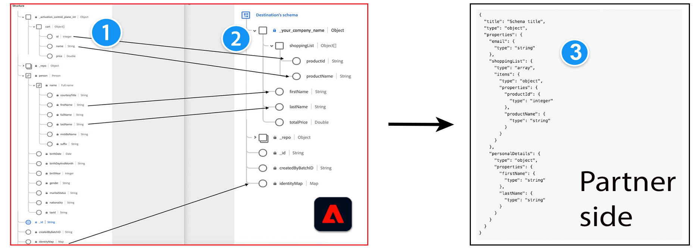

# Format des messages

## Conditions préalables - Concepts Adobe Experience Platform {#prerequisites}

Pour comprendre le format des messages, le processus de configuration et de transformation des profils du côté Adobe, familiarisez-vous avec les concepts Experience Platform suivants :

* **Modèle de données d’expérience (XDM)**. [Présentation de XDM](../../../../xdm/home.md) et [Création d’un schéma XDM dans Adobe Experience Platform](../../../../xdm/tutorials/create-schema-ui.md).
* **Classe**. [Création et modification de classes dans l’interface utilisateur](../../../../xdm/ui/resources/classes.md).
* **IdentityMap**. La map des identités représente toutes les identités des utilisateurs finaux dans Adobe Experience Platform. Consultez `xdm:identityMap` dans le [dictionnaire des champs XDM](../../../../xdm/schema/field-dictionary.md).
* **SegmentMembership**. L’attribut XDM [segmentMembership](../../../../xdm/schema/field-dictionary.md) indique les audiences dont un profil est membre. Pour découvrir les trois différentes valeurs du champ `status`, consultez la documentation relative au [groupe de champs de schéma Détails sur l’appartenance à une audience](../../../../xdm/field-groups/profile/segmentation.md).

>[!IMPORTANT]
>
>Tous les noms et toutes les valeurs de paramètre pris en charge par Destination SDK **sont sensibles à la casse**. Pour éviter les erreurs de respect de la casse, utilisez les noms et valeurs des paramètres exactement comme indiqué dans la documentation.

## Types d’intégration pris en charge {#supported-integration-types}

Pour en savoir plus sur les types d’intégration qui prennent en charge les fonctionnalités décrites sur cette page, consultez le tableau ci-dessous.

| Type d’intégration | Fonctionnalité de prise en charge |
|---|---|
| Intégrations en temps réel (streaming) | Oui |
| Intégrations basées sur des fichiers (par lots) | Oui (uniquement les étapes 1 et 2 du diagramme ci-dessous) |

## Vue d’ensemble {#overview}

Cette page traite du format du message et de la transformation des profils dans les données exportées d’Adobe Experience Platform vers les destinations.

Adobe Experience Platform exporte des données vers un nombre important de destinations, dans divers formats de données. Les plateformes publicitaires (Google), les réseaux sociaux (Facebook) et les espaces de stockage (Amazon S3, Azure Évent Hubs) constituent quelques exemples de types de destinations.

Experience Platform peut ajuster le format du message des profils exportés pour qu’il corresponde au format attendu de votre côté. Pour comprendre cette personnalisation, les concepts suivants sont importants :

* le schéma XDM source (1) et cible (2) dans Adobe Experience Platform ;
* le format de message attendu du côté partenaire (3) ; et
* la couche de transformation entre le schéma XDM et le format de message attendu, que vous pouvez définir en créant un [modèle de transformation des messages](#using-templating).



Experience Platform utilise des schémas XDM pour décrire la structure des données de manière cohérente et réutilisable.

<!--

Users who want to activate data to your destination need to map the fields in their Experience Platform datasets to a schema that translates to your destination's expected format. Adobe will create a custom field group for your company to add to the target schema. The fields in the field group depend on the profile attribute fields that you can receive.

-->

**Schéma XDM source (1)** : cet élément fait référence au schéma que la clientèle utilise dans Experience Platform. Dans Experience Platform, pendant l’[étape de mappage](../../../ui/activate-segment-streaming-destinations.md#mapping) du workflow d’activation de destination, la clientèle mappe les champs de leur schéma XDM au schéma cible de la destination (2).

**Schéma XDM Target (2)** : en fonction du schéma standard JSON (3) du format attendu de la destination et des attributs que la destination peut interpréter, vous pouvez définir des attributs de profil et des identités dans votre schéma XDM cible. Vous pouvez le faire dans la configuration des destinations, dans les objets [schemaConfig](../../functionality/destination-configuration/schema-configuration.md) et [identityNamespaces](../../functionality/destination-configuration/identity-namespace-configuration.md).

**Schéma standard JSON de vos attributs de profil de destination (3)** : cet exemple représente un [schéma JSON](https://json-schema.org/learn/miscellaneous-examples.html) de tous les attributs de profil pris en charge par votre plateforme et de leurs types (par exemple : objet, chaîne, tableau). Exemples de champs que la destination peut prendre en charge : `firstName`, `lastName`, `gender`, `email`, `phone`, `productId`, `productName`, etc. Vous avez besoin d’un [modèle de transformation des messages](#using-templating) pour adapter les données exportées depuis Experience Platform au format souhaité.

En fonction des transformations de schéma décrit ci-dessus, voici comment une configuration de profil change entre le schéma XDM source et un exemple de schéma du côté partenaire :


## Prise en main : transformation de trois attributs de base {#getting-started}

Pour démontrer le processus de transformation des profils, l’exemple ci-dessous utilise trois attributs de profil courants dans Adobe Experience Platform : **prénom**, **nom**, et **adresse e-mail**.

>[!NOTE]
>
>Le client mappe les attributs du schéma XDM source au schéma XDM du partenaire dans l’interface utilisateur d’Adobe Experience Platform à l’étape **Mappage** du [workflow d’activation de destination](../../../ui/activate-segment-streaming-destinations.md#mapping).

Supposons que votre plateforme puisse recevoir un format de message du type :

```shell
POST https://YOUR_REST_API_URL/users/
Content-Type: application/json
Authorization: Bearer YOUR_REST_API_KEY

{
  "attributes":
    {
      "first_name": "Yours",
      "last_name": "Truly",
      "external_id": "yourstruly@adobe.com"
    }
}
```

Au niveau du format du message, les transformations correspondantes sont les suivantes :

| Attribut dans le schéma XDM du partenaire côté Adobe | Transformation | Attribut dans le message HTTP de votre côté |
|---------|----------|---------|
| `_your_custom_schema.firstName` | ` attributes.first_name` | `first_name` |
| `_your_custom_schema.lastName` | `attributes.last_name` | `last_name` |
| `personalEmail.address` | `attributes.external_id` | `external_id` |

{style="table-layout:auto"}

## Structure de profil dans Experience Platform {#profile-structure}

Pour comprendre les exemples plus bas sur cette page, il est important de connaître la structure d’un profil dans Experience Platform.

Les profils comportent 3 sections :

* `segmentMembership` (toujours présente sur un profil)
   * cette section contient toutes les audiences présentes sur le profil. Les audiences peuvent avoir l’un des deux statuts suivants : `realized` ou `exited`.
* `identityMap` (toujours présente sur un profil)
   * cette section contient toutes les identités présentes sur le profil (e-mail, Google GAID, Apple IDFA, etc.) que l’utilisateur a mappées pour l’exportation dans le workflow d’activation.
* attributs (selon la configuration de la destination, ils peuvent être présents sur le profil). Il existe également une légère différence entre les attributs prédéfinis et les attributs libres :
   * les *attributs libres* contiennent un chemin `.value` si l’attribut est présent sur le profil (voir l’attribut `lastName` dans l’exemple 1). Dans le cas contraire, il ne contiendra pas le chemin `.value` (voir l’attribut `firstName` dans l’exemple 1).
   * Les *attributs prédéfinis* ne contiennent pas de chemin `.value`. Tous les attributs mappés présents sur un profil seront présents dans la map des attributs. Ceux qui ne le sont pas ne seront pas présents (voir exemple 2 : l’attribut `firstName` n’existe pas sur le profil).

Voir ci-dessous deux profils types dans Experience Platform :

### Exemple 1 avec `segmentMembership`, `identityMap` et les attributs pour les attributs libres {#example-1}

```json
{
  "segmentMembership": {
    "ups": {
      "11111111-1111-1111-1111-111111111111": {
        "lastQualificationTime": "2019-04-15T02:41:50.000+0000",
        "status": "realized"
      }
    }
  },
  "identityMap": {
    "mobileIds": [
      {
        "id": "e86fb215-0921-4537-bc77-969ff775752c"
      }
    ]
  },
  "attributes": {
    "firstName": {
    },
    "lastName": {
      "value": "lastName"
    }
  }
}
```

### Exemple 2 avec `segmentMembership`, `identityMap` et les attributs pour les attributs prédéfinis {#example-2}

```json
{
  "segmentMembership": {
    "ups": {
      "11111111-1111-1111-1111-111111111111": {
        "lastQualificationTime": "2019-04-15T02:41:50.000+0000",
        "status": "realized"
      }
    }
  },
  "identityMap": {
    "mobileIds": [
      {
        "id": "e86fb215-0921-4537-bc77-969ff775752c"
      }
    ]
  },
  "attributes": {
    "lastName": "lastName"
  }
}
```

## Utiliser une langue de modèle pour les transformations d’identité, d’attributs et d’appartenance aux audiences {#using-templating}

Adobe utilise des [modèles Pebble](https://pebbletemplates.io/), un langage de modèle similaire à [Jinja](https://jinja.palletsprojects.com/en/2.11.x/), pour transformer les champs du schéma Experience Platform XDM en un format pris en charge par la destination.

Cette section fournit plusieurs exemples de la manière dont ces transformations sont effectuées : à partir du schéma XDM d’entrée en passant par le modèle, et en sortant dans des formats de payload acceptés par la destination. Les exemples ci-dessous sont présentés par complexité croissante, comme suit :

1. Exemples de transformation simples. Découvrez comment le modèle fonctionne avec des transformations simples pour les champs [Attributs de profil](#attributes), [Appartenance à une audience](#segment-membership), et [Identité](#identities).
2. Exemples de modèles plus complexes combinant les champs ci-dessus : [Création d’un modèle qui envoie des audiences et des identités](./message-format.md#segments-and-identities) et [Création d’un modèle qui envoie des audiences, des identités et des attributs de profil](#segments-identities-attributes).
3. Modèles contenant la clé d’agrégation. Quand vous utilisez l’[agrégation configurable](../../functionality/destination-configuration/aggregation-policy.md#configurable-aggregation) dans la configuration de destination, Experience Platform groupe les profils exportés vers la destination en fonction de critères tels que l’identifiant de l’audience, le statut de l’audience ou les espaces de noms d’identité.

### Attributs de profil {#attributes}

Pour transformer les attributs de profil exportés vers la destination, consultez les exemples de code et JSON ci-dessous.

>[!IMPORTANT]
>
>Pour obtenir la liste de tous les attributs de profil disponibles dans Adobe Experience Platform, consultez le [dictionnaire des champs XDM](../../../../xdm/schema/field-dictionary.md).


**Entrée**

Profil 1 :

```json
{
    "attributes": {
        "firstName": {
            "value": "Hermione"
    },
    "birthDate": {}
  }
}
```

Profil 2 :

```json
{
  "attributes": {
    "firstName": {
      "value": "Harry"
    },
    "birthDate": {
        "value": "1980/07/31"
    }
  }
}
```

**Modèle**

>[!IMPORTANT]
>
>Pour tous les modèles que vous utilisez, vous devez ajouter une séquence d’échappement aux caractères interdits, tels que les guillemets doubles `""` avant d’insérer le [modèle](../../functionality/destination-server/templating-specs.md) dans la [configuration du serveur de destination](../../authoring-api/destination-server/create-destination-server.md). Pour plus d’informations sur l’échappement de guillemets doubles, consultez le chapitre 9 de la [norme JSON](https://www.ecma-international.org/publications-and-standards/standards/ecma-404/).

```python
{
    "profiles": [
        
        {
            
            "{{ attribute.key }}":
                
                    null
                
                    "{{ attribute.value.value }}"
                
            ,
            
        },
        
    ]
}
```

**Résultat**


```json
{
    "profiles": [
        {
            "firstName": "Hermione",
            "birthDate": null
        },
        {
            "firstName": "Harry",
            "birthDate": "1980/07/31"
        }
    ]
}
```

### Appartenance à une audience {#audience-membership}

L’attribut XDM [segmentMembership](../../../../xdm/schema/field-dictionary.md) indique les audiences dont un profil est membre.
Pour découvrir les trois différentes valeurs du champ `status`, consultez la documentation relative au [groupe de champs du schéma Détails sur l’appartenance à une audience](../../../../xdm/field-groups/profile/segmentation.md).

**Entrée**

Profil 1 :

```json
{
  "segmentMembership": {
    "ups": {
      "36a51c13-9dd6-4d2c-8aa3-07d785ea5075": {
        "lastQualificationTime": "2019-11-20T13:15:49Z",
        "status": "realized"
      },
      "788d8874-8007-4253-92b7-ee6b6c20c6f3": {
        "lastQualificationTime": "2019-11-20T13:15:49Z",
        "status": "realized"
      },
      "8f812592-3f06-416b-bd50-e7831848a31a": {
        "lastQualificationTime": "2019-11-20T13:15:49Z",
        "status": "exited"
      }
    }
  }
}
```

Profil 2 :

```json
{
  "segmentMembership": {
    "ups": {
      "32396e4b-16f6-4033-9702-fc69b5e24e7c": {
        "lastQualificationTime": "2021-08-20T17:23:04Z",
        "status": "realized"
      },
      "af854278-894a-4192-a96b-320fbf2623fd": {
        "lastQualificationTime": "2021-08-20T16:44:37Z",
        "status": "realized"
      },
      "66505bf9-bc08-4bac-afbc-8b6706650ea4": {
        "lastQualificationTime": "2019-08-20T17:23:04Z",
        "status": "realized"
      }
    }
  }
}
```

**Modèle**

>[!IMPORTANT]
>
>Pour tous les modèles que vous utilisez, vous devez ajouter une séquence d’échappement aux caractères interdits, tels que les guillemets doubles `""` avant d’insérer le [modèle](../../functionality/destination-server/templating-specs.md) dans la [configuration du serveur de destination](../../authoring-api/destination-server/create-destination-server.md). Pour plus d’informations sur l’échappement de guillemets doubles, consultez le chapitre 9 de la [norme JSON](https://www.ecma-international.org/publications-and-standards/standards/ecma-404/).


```python
{
    "profiles": [
        
        {
            "AdobeExperiencePlatformSegments": {
                "add": [
                
                "{{ segment.key }}",
                
                ],
                "remove": [
                {# Alternative syntax for filtering audiences by status: #}
                
                "{{ segment.key }}",
                
                ]
            }
        },
        
    ]
}
```

**Résultat**

```json
{
    "profiles": [
        {
            "AdobeExperiencePlatformSegments": {
                "add": [
                    "36a51c13-9dd6-4d2c-8aa3-07d785ea5075",
                    "788d8874-8007-4253-92b7-ee6b6c20c6f3"
                ],
                "remove": [
                    "8f812592-3f06-416b-bd50-e7831848a31a"
                ]
            }
        },
        {
            "AdobeExperiencePlatformSegments": {
                "add": [
                    "32396e4b-16f6-4033-9702-fc69b5e24e7c",
                    "af854278-894a-4192-a96b-320fbf2623fd",
                    "66505bf9-bc08-4bac-afbc-8b6706650ea4"
                ],
                "remove": [
                ]
            }
        }
    ]
}
```

### Identités {#identities}

Pour en savoir plus sur les identités dans Experience Platform, consultez la [vue d’ensemble de l’espace de noms d’identité](../../../../identity-service/features/namespaces.md).

**Entrée**

Profil 1 :

```json
{
    "identityMap": {
        "email": [
            {
                "id": "johndoe@example.com"
            },
            {
                "id": "jd@example.com"
            }
        ],
        "external_id": [
            {
                "id": "123456"
            }
        ]
    }
}
```

Profil 2 :

```json
{
    "identityMap": {
        "email": [
            {
                "id": "jane.doe@example.com"
            }
        ]
    }
}
```

**Modèle**

>[!IMPORTANT]
>
>Pour tous les modèles que vous utilisez, vous devez ajouter une séquence d’échappement aux caractères interdits, tels que les guillemets doubles `""` avant d’insérer le [modèle](../../functionality/destination-server/templating-specs.md) dans la [configuration du serveur de destination](../../authoring-api/destination-server/create-destination-server.md). Pour plus d’informations sur l’échappement de guillemets doubles, consultez le chapitre 9 de la [norme JSON](https://www.ecma-international.org/publications-and-standards/standards/ecma-404/).

```python
{
    "profiles": [
        
        {
            "identities": [
                
                {
                    "type": "email",
                    "id": "{{ email.id }}"
                },
                

                {# Add a comma only if you have both emails and external_ids. #}
                
                    ,
                

                
                {
                    "type": "external_id",
                    "id": "{{ external.id }}"
                },
                
            ]
        },
        
    ]
}
```

**Résultat**

```json
{
    "profiles": [
        {
            "identities": [
                {
                    "type": "email",
                    "id": "johndoe@example.com"
                },
                {
                    "type": "email",
                    "id": "jd@example.com"
                },
                {
                    "type": "external_id",
                    "id": "123456"
                }
            ]
        },
        {
            "identities": [
                {
                    "type": "email",
                    "id": "jane.doe@example.com"
                }
            ]
        }
    ]
}
```

### Créer un modèle qui envoie des audiences et des identités {#segments-and-identities}

Cette section fournit un exemple de transformation couramment utilisée entre le schéma XDM d’Adobe et le schéma de destination du partenaire.
L’exemple ci-dessous montre comment transformer l’appartenance à une audience et le format des identités et les générer vers la destination.

**Entrée**

Profil 1 :

```json
{
    "identityMap": {
        "email": [
            {
                "id": "johndoe@example.com"
            },
            {
                "id": "jd@example.com"
            }
        ],
        "external_id": [
            {
                "id": "123456"
            }
        ]
    },
    "segmentMembership": {
        "ups": {
            "36a51c13-9dd6-4d2c-8aa3-07d785ea5075": {
                "lastQualificationTime": "2019-11-20T13:15:49Z",
                "status": "realized"
            },
            "788d8874-8007-4253-92b7-ee6b6c20c6f3": {
              "lastQualificationTime": "2019-11-20T13:15:49Z",
              "status": "realized"
            },
            "8f812592-3f06-416b-bd50-e7831848a31a": {
                "lastQualificationTime": "2019-11-20T13:15:49Z",
                "status": "exited"
            }
        }
    }
}
```

Profil 2 :

```json
{
    "identityMap": {
        "email": [
            {
                "id": "jane.doe@example.com"
            }
        ]
    },
    "segmentMembership": {
        "ups": {
            "36a51c13-9dd6-4d2c-8aa3-07d785ea5075": {
                "lastQualificationTime": "2021-08-31T10:01:42Z",
                "status": "realized"
            }
        }
    }
}
```

**Modèle**

>[!IMPORTANT]
>
>Pour tous les modèles que vous utilisez, vous devez ajouter une séquence d’échappement aux caractères interdits, tels que les guillemets doubles `""` avant d’insérer le [modèle](../../functionality/destination-server/templating-specs.md) dans la [configuration du serveur de destination](../../authoring-api/destination-server/create-destination-server.md). Pour plus d’informations sur l’échappement de guillemets doubles, consultez le chapitre 9 de la [norme JSON](https://www.ecma-international.org/publications-and-standards/standards/ecma-404/).

```python
{
    "profiles": [
        
        {
            "identities": [
                
                {
                    "type": "email",
                    "id": "{{ email.id }}"
                },
                
                
                {# Add a comma only if you have both emails and external_ids. #}
                
                    ,
                
                
                
                {
                    "type": "external_id",
                    "id": "{{ external.id }}"
                },
                
            ],
            "AdobeExperiencePlatformSegments": {
                "add": [
                    
                    "{{ segment.key }}",
                    
                ],
                "remove": [
                    {# Alternative syntax for filtering audiences by status: #}
                    
                    "{{ segment.key }}",
                    
                ]
            }
        },
        
    ]
}
```

**Résultat**

Le `json` ci-dessous représente les données exportées depuis Adobe Experience Platform.

```json
{
    "profiles": [
        {
            "identities": [
                {
                    "type": "email",
                    "id": "johndoe@example.com"
                },
                {
                    "type": "email",
                    "id": "jd@example.com"
                },
                {
                    "type": "external_id",
                    "id": "123456"
                }
            ],
            "AdobeExperiencePlatformSegments": {
                "add": [
                    "36a51c13-9dd6-4d2c-8aa3-07d785ea5075",
                    "788d8874-8007-4253-92b7-ee6b6c20c6f3"
                ],
                "remove": [
                    "8f812592-3f06-416b-bd50-e7831848a31a"
                ]
            }
        },
        {
            "identities": [
                {
                    "type": "email",
                    "id": "jane.doe@example.com"
                }
            ],
            "AdobeExperiencePlatformSegments": {
                "add": [
                    "36a51c13-9dd6-4d2c-8aa3-07d785ea5075"
                ],
                "remove": []
            }
        }
    ]
}
```

### Création d’un modèle qui envoie des segments, des identités et des attributs de profil {#segments-identities-attributes}

Cette section fournit un exemple de transformation couramment utilisée entre le schéma XDM d’Adobe et le schéma de destination du partenaire.

Un autre cas d’utilisation courant consiste à exporter des données contenant l’appartenance à une audience, des identités (par exemple, une adresse e-mail, un numéro de téléphone, un identifiant de publicité) et des attributs de profil. Pour exporter les données de cette manière, consultez l’exemple ci-dessous :

**Entrée**

Profil 1 :

```json
{
    "attributes": {
        "firstName": {
            "value": "Hermione"
        },
        "birthDate": {}
    },
    "identityMap": {
        "email": [
            {
                "id": "johndoe@example.com"
            },
            {
                "id": "jd@example.com"
            }
        ],
        "external_id": [
            {
                "id": "123456"
            }
        ]
    },
    "segmentMembership": {
        "ups": {
            "36a51c13-9dd6-4d2c-8aa3-07d785ea5075": {
                "lastQualificationTime": "2019-11-20T13:15:49Z",
                "status": "realized"
            },
            "788d8874-8007-4253-92b7-ee6b6c20c6f3": {
              "lastQualificationTime": "2019-11-20T13:15:49Z",
              "status": "realized"
            },
            "8f812592-3f06-416b-bd50-e7831848a31a": {
                "lastQualificationTime": "2019-11-20T13:15:49Z",
                "status": "exited"
            }
        }
    }
}
```

Profil 2 :

```json
{
    "attributes": {
        "firstName": {
            "value": "Harry"
        },
        "birthDate": {
            "value": "1980/07/31"
        }
    },
    "identityMap": {
        "email": [
            {
                "id": "harry.p@example.com"
            }
        ]
    },
    "segmentMembership": {
        "ups": {
            "36a51c13-9dd6-4d2c-8aa3-07d785ea5075": {
                "lastQualificationTime": "2019-11-20T13:15:49Z",
                "status": "realized"
            }
        }
    }
}
```

**Modèle**

>[!IMPORTANT]
>
>Pour tous les modèles que vous utilisez, vous devez ajouter une séquence d’échappement aux caractères interdits, tels que les guillemets doubles `""` avant d’insérer le [modèle](../../functionality/destination-server/templating-specs.md) dans la [configuration du serveur de destination](../../authoring-api/destination-server/create-destination-server.md). Pour plus d’informations sur l’échappement de guillemets doubles, consultez le chapitre 9 de la [norme JSON](https://www.ecma-international.org/publications-and-standards/standards/ecma-404/).

```python
{
    "profiles": [
        
        {
            "attributes": {
            
                "{{ attribute.key }}":
                    
                        null
                    
                        "{{ attribute.value.value }}"
                    
                ,
            
            },
            "identities": [
                
                {
                    "type": "email",
                    "id": "{{ email.id }}"
                },
                

                {# Add a comma only if we have both emails and external_ids. #}
                
                    ,
                

                
                {
                    "type": "external_id",
                    "id": "{{ external.id }}"
                },
                
            ],
            "AdobeExperiencePlatformSegments": {
                "add": [
                
                    "{{ segment.key }}",
                
                ],
                "remove": [
                {# Alternative syntax for filtering audiences by status: #}
                
                    "{{ segment.key }}",
                
                ]
            }
        }
    ]
}
```

**Résultat**

Le `json` ci-dessous représente les données exportées depuis Adobe Experience Platform.

```json
{
    "profiles": [
        {
            "attributes": {
                "firstName": "Hermione",
                "birthDate": null
            },
            "identities": [
                {
                    "type": "email",
                    "id": "johndoe@example.com"
                },
                {
                    "type": "email",
                    "id": "jd@example.com"
                },
                {
                    "type": "external_id",
                    "id": "123456"
                }
            ],
            "AdobeExperiencePlatformSegments": {
                "add": [
                    "36a51c13-9dd6-4d2c-8aa3-07d785ea5075",
                    "788d8874-8007-4253-92b7-ee6b6c20c6f3"
                ],
                "remove": [
                    "8f812592-3f06-416b-bd50-e7831848a31a"
                ]
            }
        },
        {
            "attributes": {
                "firstName": "Harry",
                "birthDate": "1980/07/21"
            },
            "identities": [
                {
                    "type": "email",
                    "id": "harry.p@example.com"
                }
            ],
            "AdobeExperiencePlatformSegments": {
                "add": [
                    "36a51c13-9dd6-4d2c-8aa3-07d785ea5075"
                ],
                "remove": []
            }
        }
    ]
}
```

### Ajout de la clé d’agrégation dans votre modèle pour accéder aux profils exportés regroupés selon différents critères {#template-aggregation-key}

Quand vous utilisez l’[agrégation configurable](../../functionality/destination-configuration/aggregation-policy.md#configurable-aggregation) dans la configuration de destination, vous pouvez grouper les profils exportés vers la destination en fonction de critères tels que l’identifiant de l’audience, l’alias de l’audience, l’appartenance à une audience ou les espaces de noms d’identité.

Dans le modèle de transformation des messages, vous pouvez accéder aux clés d’agrégation mentionnées ci-dessus, comme illustré dans les exemples des sections suivantes. Utilisez des clés d’agrégation pour structurer le message HTTP exporté hors d’Experience Platform afin qu’il corresponde aux limites de format et de taux attendues par la destination.

#### Utiliser la clé d’agrégation des identifiants d’audience dans le modèle {#aggregation-key-segment-id}

Si vous utilisez l’[agrégation configurable](../../functionality/destination-configuration/aggregation-policy.md#configurable-aggregation) et définissez `includeSegmentId` sur « true », les profils dans les messages HTTP exportés vers la destination sont regroupés par identifiant d’audience. Consultez la section ci-dessous pour accéder à l’identifiant d’audience dans le modèle.

**Entrée**

Tenez compte des quatre profils ci-dessous, où :

* les deux premiers font partie de l’audience avec l’identifiant d’audience `788d8874-8007-4253-92b7-ee6b6c20c6f3` ;
* le troisième profil fait partie de l’audience avec l’identifiant d’audience `8f812592-3f06-416b-bd50-e7831848a31a` ;
* le quatrième profil fait partie des deux audiences ci-dessus.

Profil 1 :

```json
{
   "attributes":{
      "firstName":{
         "value":"Hermione"
      }
   },
   "segmentMembership":{
      "ups":{
         "788d8874-8007-4253-92b7-ee6b6c20c6f3":{
            "lastQualificationTime":"2020-11-20T13:15:49Z",
            "status":"realized"
         }
      }
   }
}
```

Profil 2 :

```json
{
   "attributes":{
      "firstName":{
         "value":"Harry"
      }
   },
   "segmentMembership":{
      "ups":{
         "788d8874-8007-4253-92b7-ee6b6c20c6f3":{
            "lastQualificationTime":"2020-11-20T13:15:49Z",
            "status":"realized"
         }
      }
   }
}
```

Profil 3 :

```json
{
   "attributes":{
      "firstName":{
         "value":"Tom"
      }
   },
   "segmentMembership":{
      "ups":{
         "8f812592-3f06-416b-bd50-e7831848a31a":{
            "lastQualificationTime":"2021-02-20T12:00:00Z",
            "status":"realized"
         }
      }
   }
}
```

Profil 4 :

```json
{
   "attributes":{
      "firstName":{
         "value":"Jerry"
      }
   },
   "segmentMembership":{
      "ups":{
         "8f812592-3f06-416b-bd50-e7831848a31a":{
            "lastQualificationTime":"2021-02-20T12:00:00Z",
            "status":"realized"
         },
         "788d8874-8007-4253-92b7-ee6b6c20c6f3":{
            "lastQualificationTime":"2020-11-20T13:15:49Z",
            "status":"realized"
         }
      }
   }
}
```

**Modèle**

>[!IMPORTANT]
>
>Pour tous les modèles que vous utilisez, vous devez ajouter une séquence d’échappement aux caractères interdits, tels que les guillemets doubles `""` avant d’insérer le [modèle](../../functionality/destination-server/templating-specs.md) dans la [configuration du serveur de destination](../../authoring-api/destination-server/create-destination-server.md). Pour plus d’informations sur l’échappement de guillemets doubles, consultez le chapitre 9 de la [norme JSON](https://www.ecma-international.org/publications-and-standards/standards/ecma-404/).

Remarquez ci-dessous comment `audienceId` est utilisé dans le modèle pour accéder aux identifiants d’audience. Cet exemple suppose que vous utilisez `audienceId` pour définir l’appartenance à une audience dans la taxonomie de destination. Au lieu de cela, vous pouvez utiliser n’importe quel autre nom de champ en fonction de votre propre taxonomie.

```python
{
    "audienceId": "{{ input.aggregationKey.segmentId }}",
    "profiles": [
        
        {
            "first_name": "{{ profile.attributes.firstName.value }}"
        },
        
    ]
}
```

**Résultat**

Quand ils sont exportés vers la destination, les profils sont divisés en deux groupes, en fonction de leur identifiant d’audience.

```json
{
   "audienceId":"788d8874-8007-4253-92b7-ee6b6c20c6f3",
   "profiles":[
      {
         "firstName":"Hermione"
      },
      {
         "firstName":"Harry"
      },
      {
         "firstName":"Jerry"
      }
   ]
}
```

```json
{
   "audienceId":"8f812592-3f06-416b-bd50-e7831848a31a",
   "profiles":[
      {
         "firstName":"Tom"
      },
      {
         "firstName":"Jerry"
      }
   ]
}
```

#### Utiliser la clé d’agrégation des alias d’audience dans le modèle {#aggregation-key-segment-alias}

Si vous utilisez l’[agrégation configurable](../../functionality/destination-configuration/aggregation-policy.md#configurable-aggregation) et définissez `includeSegmentId` sur « true », vous pouvez également accéder à l’alias de l’audience dans le modèle.

Ajoutez la ligne ci-dessous au modèle pour accéder aux profils exportés regroupés par alias d’audience.

```python
customerList={{input.aggregationKey.segmentAlias}}
```

#### Utiliser la clé d’agrégation des statuts d’audience dans le modèle {#aggregation-key-segment-status}

Si vous utilisez l’[agrégation configurable](../../functionality/destination-configuration/aggregation-policy.md#configurable-aggregation) et définissez `includeSegmentId` et `includeSegmentStatus` sur « true », vous pouvez également accéder au statut de l’audience dans le modèle. Ainsi, vous pouvez regrouper les profils dans les messages HTTP exportés vers la destination en fonction de l’ajout ou de la suppression de profils dans des segments.

Les valeurs possibles sont les suivantes :

* réalisé
* existant
* abandonné

Ajoutez la ligne ci-dessous au modèle pour ajouter ou supprimer des profils des segments en fonction des valeurs ci-dessus :

```python
action=REMOVEADD
```

#### Utilisation de la clé d’agrégation des espaces de noms d’identité dans le modèle {#aggregation-key-identity}

Vous trouverez ci-dessous un exemple où l’[agrégation configurable](../../functionality/destination-configuration/aggregation-policy.md#configurable-aggregation) dans la configuration de destination est définie pour agréger les profils exportés par espaces de noms d’identité, dans le formulaire `"namespaces": ["email", "phone"]` et `"namespaces": ["GAID", "IDFA"]`. Pour en savoir plus sur le regroupement, consultez le paramètre `groups` de la documentation [Création d’une configuration de destination](../../authoring-api/destination-configuration/create-destination-configuration.md).

**Entrée**

Profil 1 :

```json
{
   "identityMap":{
      "email":[
         {
            "id":"e1@example.com"
         },
         {
            "id":"e2@example.com"
         }
      ],
      "phone":[
         {
            "id":"+40744111222"
         }
      ],
      "IDFA":[
         {
            "id":"AEBE52E7-03EE-455A-B3C4-E57283966239"
         }
      ],
      "GAID":[
         {
            "id":"e4fe9bde-caa0-47b6-908d-ffba3fa184f2"
         }
      ]
   }
}
```

Profil 2 :

```json
{
   "identityMap":{
      "email":[
         {
            "id":"e3@example.com"
         }
      ],
      "phone":[
         {
            "id":"+40744333444"
         },
         {
            "id":"+40744555666"
         }
      ],
      "IDFA":[
         {
            "id":"134GHU45-34HH-GHJ7-K0H8-LHN665998NN0"
         }
      ],
      "GAID":[
         {
            "id":"47bh00i9-8jv6-334n-lll8-nb7f24sghg76"
         }
      ]
   }
}
```

**Modèle**

>[!IMPORTANT]
>
>Pour tous les modèles que vous utilisez, vous devez ajouter une séquence d’échappement aux caractères interdits, tels que les guillemets doubles `""` avant d’insérer le [modèle](../../functionality/destination-server/templating-specs.md) dans la [configuration du serveur de destination](../../authoring-api/destination-server/create-destination-server.md). Pour plus d’informations sur l’échappement de guillemets doubles, consultez le chapitre 9 de la [norme JSON](https://www.ecma-international.org/publications-and-standards/standards/ecma-404/).

Notez que `input.aggregationKey.identityNamespaces` est utilisé dans le modèle ci-dessous

```python
{
            "profiles": [
            
            {
                
                "{{ns}}": [
                    
                    "{{id.id}}",
                    
                ],
                
            },
            
        ]
}
```

**Résultat**

Quand ils sont exportés vers la destination, les profils sont divisés en deux groupes en fonction de leur espace de noms d’identité. Les courriers électroniques et les téléphones se trouvent dans un groupe, tandis que GAID et IDFA sont dans un autre.

```json
{
   "profiles":[
      {
         "email":[
            "e1@example.com",
            "e2@example.com"
         ],
         "phone":[
            "+40744111222"
         ]
      },
      {
         "email":[
            "e3@example.com"
         ],
         "phone":[
            "+40744333444",
            "+40744555666"
         ]
      }
   ]
}
```

```json
{
   "profiles":[
      {
         "IDFA":[
            "AEBE52E7-03EE-455A-B3C4-E57283966239"
         ],
         "GAID":[
            "e4fe9bde-caa0-47b6-908d-ffba3fa184f2"
         ]
      },
      {
         "IDFA":[
            "134GHU45-34HH-GHJ7-K0H8-LHN665998NN0"
         ],
         "GAID":[
            "47bh00i9-8jv6-334n-lll8-nb7f24sghg76"
         ]
      }
   ]
}
```

#### Utilisation de la clé d’agrégation dans un modèle d’URL {#aggregation-key-url-template}

Selon votre cas d’utilisation, vous pouvez également utiliser les clés d’agrégation décrites ici dans une URL, comme illustré ci-dessous :

```python
https://api.example.com/audience/{{input.aggregationKey.segmentId}}
```

### Référence : contexte et fonctions utilisées dans les modèles de transformation {#reference}

Le contexte fourni au modèle contient `input` (les profils/données exportés au cours de cet appel) et `destination` (données relatives à la destination vers laquelle Adobe envoie des données, valides pour tous les profils).

Le tableau ci-dessous décrit des fonctions dans les exemples ci-dessus.

| Fonction | Description | Exemple |
|---------|----------|----------|
| `input.profile` | Le profil, représenté en tant que [JsonNode](https://fasterxml.github.io/jackson-databind/javadoc/2.11/com/fasterxml/jackson/databind/node/JsonNodeType.html). Suit le schéma XDM du partenaire mentionné plus haut sur cette page. |
| `hasSegments` | Cette fonction utilise une carte des ID d’audience d’espace de noms comme paramètre. La fonction renvoie `true` s’il existe au moins une audience dans la carte (quel que soit son état), et `false` dans le cas contraire. Vous pouvez utiliser cette fonction pour décider d’effectuer une itération sur une carte d’audiences ou non. | `hasSegments(input.profile.segmentMembership)` |
| `destination.namespaceSegmentAliases` | Mappez les identifiants d’audience d’un espace de noms Adobe Experience Platform spécifique aux alias d’audience du système du partenaire. | `destination.namespaceSegmentAliases["ups"]["seg-id-1"]` |
| `destination.namespaceSegmentNames` | Mappage des noms d’audience dans des espaces de noms Adobe Experience Platform spécifiques aux noms d’audience dans le système du partenaire. | `destination.namespaceSegmentNames["ups"]["seg-name-1"]` |
| `destination.namespaceSegmentTimestamps` | Renvoie l’heure à laquelle une audience a été créée, mise à jour ou activée, au format d’horodatage UNIX. | <ul><li>`destination.namespaceSegmentTimestamps["ups"]["seg-id-1"].createdAt` : renvoie l’heure de création du segment avec l’ID `seg-id-1`, à partir de l’espace de noms `ups`, au format d’horodatage UNIX.</li><li>`destination.namespaceSegmentTimestamps["ups"]["seg-id-1"].updatedAt` : renvoie l’heure à laquelle l’audience avec l’ID `seg-id-1`, à partir de l’espace de noms `ups`, a été mise à jour au format d’horodatage UNIX.</li><li>`destination.namespaceSegmentTimestamps["ups"]["seg-id-1"].mappingCreatedAt` : renvoie l’heure à laquelle l’audience avec l’ID `seg-id-1`, de l’espace de noms `ups`, a été activée vers la destination, au format d’horodatage UNIX.</li><li>`destination.namespaceSegmentTimestamps["ups"]["seg-id-1"].mappingUpdatedAt` : renvoie l’heure à laquelle l’activation de l’audience a été mise à jour sur la destination, au format d’horodatage UNIX.</li></ul> |
| `addedSegments(mapOfNamespacedSegmentIds)` | Renvoie uniquement les audiences ayant l’état `realized`, sur tous les espaces de noms. | `addedSegments(input.profile.segmentMembership)` |
| `removedSegments(mapOfNamespacedSegmentIds)` | Renvoie uniquement les audiences ayant l’état `exited`, sur tous les espaces de noms. | `removedSegments(input.profile.segmentMembership)` |
| `destination.segmentAliases` | **Obsolète. Remplacé par`destination.namespaceSegmentAliases`** <br><br> Mappage des identifiants d’audience dans l’espace de noms Adobe Experience Platform aux alias d’audience dans le système du partenaire. | `destination.segmentAliases["seg-id-1"]` |
| `destination.segmentNames` | **Obsolète. Remplacé par`destination.namespaceSegmentNames`** <br><br> Associer les noms des audiences dans l’espace de noms Adobe Experience Platform aux noms des audiences dans le système du partenaire. | `destination.segmentNames["seg-name-1"]` |
| `destination.segmentTimestamps` | **Obsolète. Remplacé par`destination.namespaceSegmentTimestamps`** <br><br> Renvoie l’heure à laquelle une audience a été créée, mise à jour ou activée, au format d’horodatage UNIX. | <ul><li>`destination.segmentTimestamps["seg-id-1"].createdAt` : renvoie l’heure de création de l’audience avec l’ID `seg-id-1`, au format d’horodatage UNIX.</li><li>`destination.segmentTimestamps["seg-id-1"].updatedAt` : renvoie l’heure à laquelle l’audience avec l’ID `seg-id-1` a été mise à jour, au format d’horodatage UNIX.</li><li>`destination.segmentTimestamps["seg-id-1"].mappingCreatedAt` : renvoie l’heure à laquelle l’audience avec l’ID `seg-id-1` a été activée vers la destination, au format d’horodatage UNIX.</li><li>`destination.segmentTimestamps["seg-id-1"].mappingUpdatedAt` : renvoie l’heure à laquelle l’activation de l’audience a été mise à jour sur la destination, au format d’horodatage UNIX.</li></ul> |

{style="table-layout:auto"}

## Étapes suivantes {#next-steps}

Vous êtes arrivé au bout de ce document. À présent, vous savez comment les données exportées hors d’Experience Platform sont transformées. Vous pouvez désormais lire les pages suivantes pour acquérir des connaissances sur la création de modèles de transformation de messages pour la destination :

* [Création et test d’un modèle de transformation de message](../../testing-api/streaming-destinations/create-template.md)
* [Opérations de l’API de modèle de rendu](../../testing-api/streaming-destinations/render-template-api.md)
* [Fonctions de transformation prises en charge dans Destination SDK](../destination-server/supported-functions.md)

Pour en savoir plus sur les autres composants de serveur de destination, consultez les articles suivants :

* [Spécifications de serveur pour les destinations créées avec Destination SDK](server-specs.md)
* [Spécifications du modèle](templating-specs.md)
* [Configuration du formatage des fichiers](file-formatting.md)
