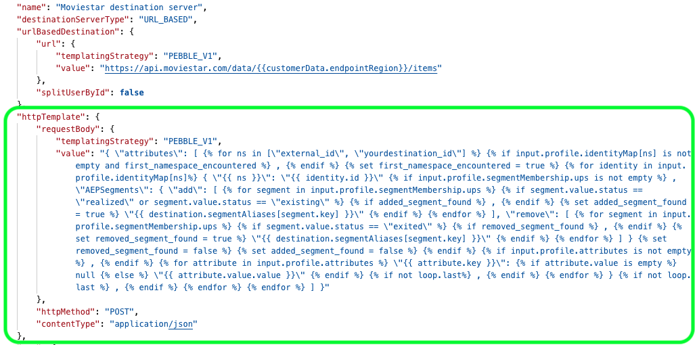

# Spécifications de modèle pour les destinations créées avec Destination SDK

Utilisez la partie de spécification du modèle de la configuration du serveur de destination pour configurer la manière de formater les requêtes HTTP envoyées à la destination.

Dans une spécification de modèle, vous pouvez définir comment transformer les champs d’attribut de profil entre le schéma XDM et le format pris en charge par votre plateforme.

Les spécifications de modèle font partie de la configuration du serveur de destination pour les destinations en temps réel (streaming).

Pour comprendre la place de ce composant dans une intégration créée avec Destination SDK, consultez le diagramme de la documentation [options de configuration](../configuration-options.md) ou consultez le guide sur la [utilisation de Destination SDK pour configurer une destination de diffusion en streaming](../../guides/configure-destination-instructions.md#create-server-template-configuration).

Vous pouvez configurer les spécifications du modèle pour la destination via le point d’entrée `/authoring/destination-servers`. Pour obtenir des exemples d’appels API détaillés dans lesquels vous pouvez configurer les composants affichés sur cette page, consultez les pages de référence de l’API suivantes.

* [Création d’une configuration de serveur de destination](../../authoring-api/destination-server/create-destination-server.md)
* [Mise à jour d’une configuration de serveur de destination](../../authoring-api/destination-server/update-destination-server.md)

>[!IMPORTANT]
>
>Tous les noms et toutes les valeurs de paramètre pris en charge par Destination SDK **sont sensibles à la casse**. Pour éviter les erreurs de respect de la casse, utilisez les noms et valeurs des paramètres exactement comme indiqué dans la documentation.

## Types d’intégration pris en charge {#supported-integration-types}

Pour en savoir plus sur les types d’intégration qui prennent en charge les fonctionnalités décrites sur cette page, consultez le tableau ci-dessous.

| Type d’intégration | Fonctionnalité de prise en charge |
|---|---|
| Intégrations en temps réel (streaming) | Oui |
| Intégrations basées sur des fichiers (par lots) | Non |

## Configuration d’une spécification de modèle {#configure-template-spec}

Adobe utilise un langage de modèle similaire à [Jinja](https://jinja.palletsprojects.com/en/2.11.x/) pour transformer les champs du schéma XDM en un format pris en charge par la destination.



Pour plus d’informations sur la transformation, consultez les liens ci-dessous :

* [Format des messages](message-format.md)
* [Utiliser une langue de modèle pour les transformations d’identité, d’attributs et d’appartenance aux audiences](message-format.md#using-templating)

>[!TIP]
>
>Adobe vous propose un [outil de développement](../../testing-api/streaming-destinations/create-template.md) pour créer et tester un modèle de transformation de messages.

Consultez ci-dessous un modèle type de requête HTTP, ainsi que des descriptions de chaque paramètre individuel.

```json
{
   "httpTemplate":{
      "httpMethod":"POST",
      "requestBody":{
         "templatingStrategy":"PEBBLE_V1",
         "value":"{ \"attributes\": [   ,    { \"{{ ns }}\": \"{{ identity.id }}\"  , \"AEPSegments\": { \"add\": [    ,   \"{{ destination.segmentAliases[segment.key] }}\"   ], \"remove\": [    ,   \"{{ destination.segmentAliases[segment.key] }}\"   ] }     ,   \"{{ attribute.key }}\":  null  \"{{ attribute.value.value }}\"   ,   }  ,    ] }"
      },
      "contentType":"application/json"
   }
}
```

| Paramètre | Type | Description |
|---|---|---|
| `httpMethod` | Chaîne | *Obligatoire.* Méthode qu’Adobe utilise dans les appels vers votre serveur. Méthodes prises en charge : `GET`, `PUT`, `POST`, `DELETE`, `PATCH`. |
| `templatingStrategy` | Chaîne | *Obligatoire.* Utilisez `PEBBLE_V1`. |
| `value` | Chaîne | *Obligatoire.* Cette chaîne est la version avec caractères d’échappement du modèle qui formate les requêtes HTTP envoyées par Experience Platform au format attendu par la destination. <br> Pour plus d’informations sur l’écriture du modèle, consultez la section [Utilisation des modèles](message-format.md#using-templating). <br> Pour plus d’informations sur les caractères d’échappement, consultez la section [Norme RFC JSON, section 7](https://tools.ietf.org/html/rfc8259#section-7). <br> Pour obtenir un exemple de transformation simple, consultez la transformation des [attributs de profil](message-format.md#attributes). |
| `contentType` | Chaîne | *Obligatoire.* Type de contenu que votre serveur accepte. Selon le type de sortie produit par votre modèle de transformation, il peut s’agir de l’un des [types de contenu d’applications HTTP](https://www.iana.org/assignments/media-types/media-types.xhtml#application) pris en charge. Dans la plupart des cas, cette valeur doit être définie sur `application/json`. |

{style="table-layout:auto"}

## Étapes suivantes {#next-steps}

Vous êtes arrivé au bout de cet article. À présent, vous devriez mieux comprendre ce qu’est une spécification de modèle et comment la configurer.

Pour en savoir plus sur les autres composants de serveur de destination, consultez les articles suivants :

* [Spécifications de serveur pour les destinations créées avec Destination SDK](server-specs.md)
* [Format des messages](message-format.md)
* [Configuration du formatage des fichiers](file-formatting.md)
