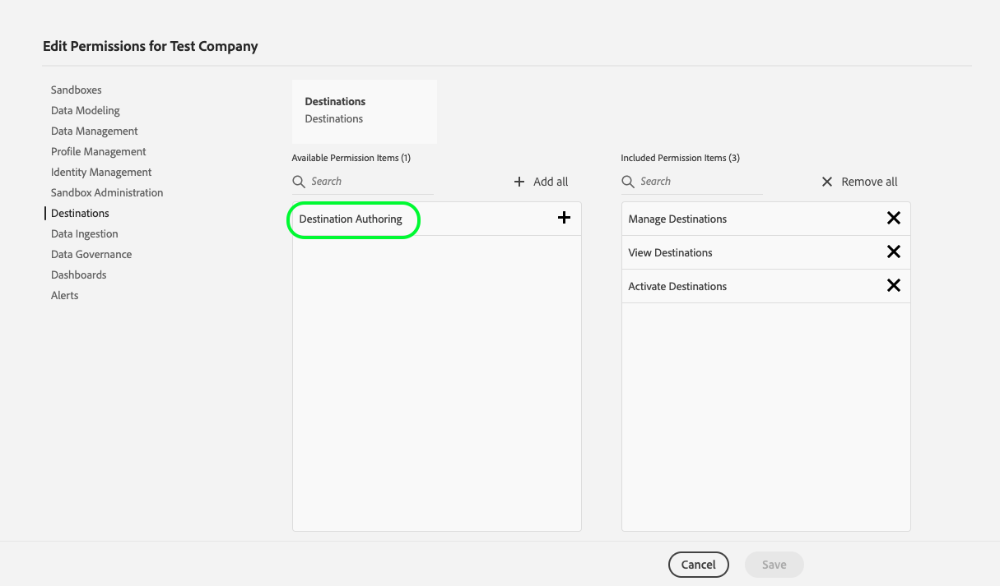

# Prise en main

## Présentation {#overview}

Cette page décrit comment vous authentifier et commencer à utiliser le SDK Adobe Experience Platform Destination. Elle comprend des instructions sur la manière d’obtenir des informations d’authentification d’Adobe I/O, un nom d’environnement de test et l’autorisation de contrôle d’accès de création de destination.

## Terminologie {#terminology}

Ce guide utilise des concepts spécifiques à Platform, tels que l’organisation IMS et les environnements de test. Consultez le [glossaire Experience Platform](https://experienceleague.adobe.com/docs/experience-platform/landing/glossary.html) pour connaître la définition de ces termes et d’autres termes.

## Obtention des informations d’authentification requises {#obtain-authentication-credentials}

Le SDK de destination utilise la passerelle [Adobe I/O](https://www.adobe.io/) pour l’authentification. Pour effectuer des appels API vers les points de terminaison du SDK de destination, vous devez fournir certains en-têtes dans vos appels API. Collaborez avec l’équipe Adobe Exchange pour configurer l’authentification pour vous dans la [console de développement des Adobes](http://console.adobe.io/).

Pour réussir les appels vers les points d’entrée de l’API du SDK de destination, suivez le [tutoriel sur l’authentification Experience Platform](https://experienceleague.adobe.com/docs/experience-platform/landing/platform-apis/api-authentication.html?lang=fr). Démarrez le tutoriel à partir de l’étape &quot;[Générer une clé API, l’identifiant de l’organisation IMS et le secret client](https://experienceleague.adobe.com/docs/experience-platform/landing/platform-apis/api-authentication.html#api-ims-secret)&quot;. L’équipe Adobe Exchange se chargera des étapes précédentes. Le tutoriel sur l’authentification indique les valeurs de chacun des en-têtes requis dans les appels API du SDK de destination, comme illustré ci-dessous :

* `x-api-key: {API_KEY}`, également appelé ID client
* `x-gw-ims-org-id: {IMS_ORG}`, également appelé ID d’organisation
* `Authorization: Bearer {ACCESS_TOKEN}`. Le jeton d’accès a un délai d’expiration de 24 heures, exprimé en millisecondes, vous devrez donc l’actualiser. Pour actualiser le jeton d’accès, répétez les étapes décrites dans le tutoriel sur l’authentification.

<!--

### Obtain `Authorization: Bearer {ACCESS_TOKEN}`

To obtain the `{ACCESS_TOKEN}`, you must generate a JWT token and exchange it for the access token. Follow the steps below:

1. Follow the instructions in the [Generate JWT section](https://www.adobe.io/apis/experienceplatform/console/docs.html#!AdobeDocs/adobeio-console/master/credentials.md) in the credentials guide.
2. Follow the instructions in [Step 3: try it](https://www.adobe.io/authentication/auth-methods.html#!AdobeDocs/adobeio-auth/master/AuthenticationOverview/ServiceAccountIntegration.md) in the Service account connection guide.

You now have the required authentication headers `x-api-key: {API_KEY}`, `x-gw-ims-org-id: {IMS_ORG}`, and `Authorization: Bearer {ACCESS_TOKEN}`.

>[!NOTE]
>
>The access token has an expiration time of 24 hours, expressed in milliseconds, so you will have to refresh it. To refresh the access token, repeat the steps outlined in this section.

-->

## Propriété de destination et environnements de test {#destination-ownership}

Dans Experience Platform, toutes les ressources sont isolées dans des environnements de test virtuels spécifiques. Les requêtes envoyées au SDK de destination nécessitent des en-têtes qui spécifient le nom de l’environnement de test dans lequel l’opération a lieu :

* `x-sandbox-name: {SANDBOX_NAME}`

L’équipe Adobe Exchange vous fournit votre nom d’environnement de test, que vous devez utiliser dans les appels aux points de terminaison de l’API du SDK de destination.

## Contrôle d’accès en fonction du rôle (RBAC) {#rbac}

Pour utiliser les points d’entrée de l’API du SDK de destination décrits dans la [documentation de référence](./configuration-options.md), vous devez disposer de l’autorisation de contrôle d’accès **[!UICONTROL Création de destination]**. Collaborez avec l’équipe Adobe Exchange pour que cette autorisation vous soit affectée dans [Adobe Admin Console](https://adminconsole.adobe.com/).

Pour plus d’informations, consultez les documents de contrôle d’accès Experience Platform suivants :

* [Gestion des autorisations d’un profil de produit](/help/access-control/ui/permissions.md)
* [Autorisations disponibles pour l’Experience Platform](/help/access-control/home.md#permissions)
* [Documentation Adobe Admin Console](https://helpx.adobe.com/fr/enterprise/using/admin-console.html)

## Remarques complémentaires {#additional-considerations}

* Toute modification apportée aux configurations de destination, que vous créiez ou modifiez une configuration de destination, doit être examinée et approuvée par Adobe. Vos modifications ne sont répercutées dans vos destinations qu’une fois la révision terminée.
* Seuls les utilisateurs appartenant à la même organisation et ayant accès à l’environnement de test peuvent modifier la configuration de destination.

## Étapes suivantes {#next-steps}

En suivant les étapes décrites dans cet article, vous obteniez des informations d’authentification pour Adobe I/O, un nom d’environnement de test et l’autorisation de contrôle d’accès de création de destination. Vous pouvez ensuite configurer une destination à l’aide du SDK de destination. Lisez [Utilisation du SDK de destination pour configurer votre destination](./configure-destination-instructions.md) pour les étapes suivantes.
