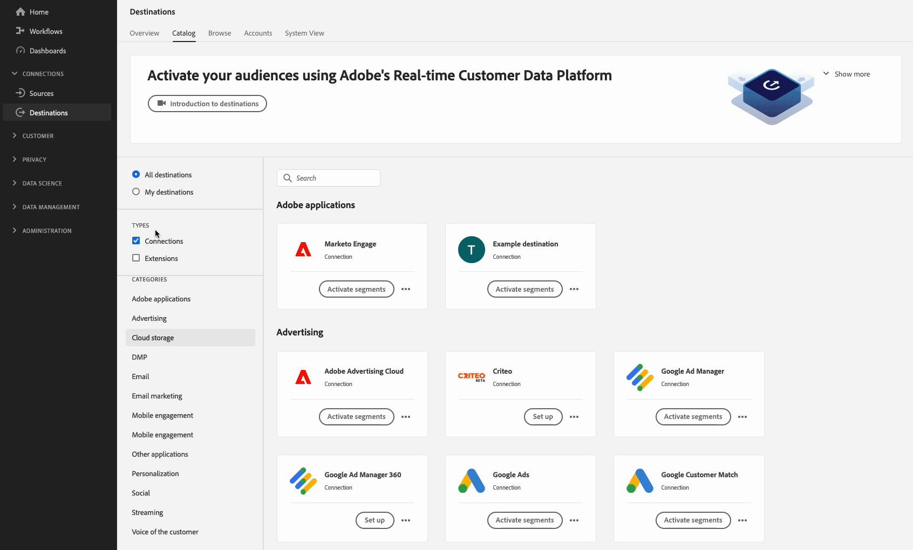
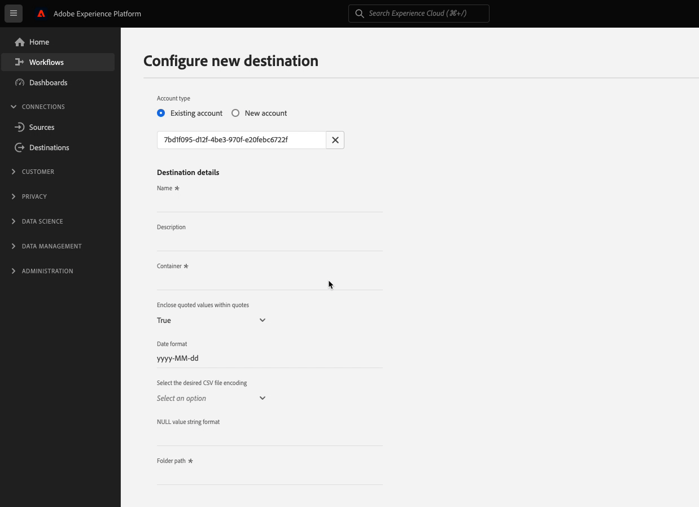
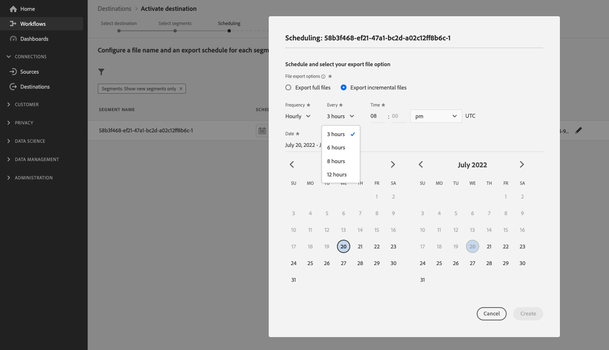
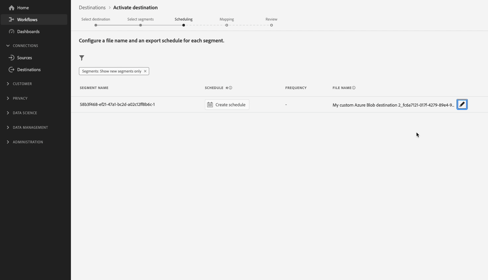

# Configurer une destination SFTP avec des options de formatage de fichiers prédéfinies et une configuration de noms de fichiers personnalisée

## Vue d’ensemble {#overview}

Cette page décrit comment utiliser Destination SDK pour configurer une destination SFTP avec des [options de formatage de fichier](configure-file-formatting-options.md) prédéfinies et par défaut, ainsi qu’une [configuration de nom de fichier](../../functionality/destination-configuration/batch-configuration.md#file-name-configuration) personnalisée.

Cette page présente toutes les options de configuration disponibles pour les destinations SFTP. Vous pouvez modifier les configurations présentées dans les étapes ci-dessous ou supprimer certaines parties des configurations, si nécessaire.

Pour une description détaillée des paramètres utilisés ci-dessous, voir [options de configuration dans Destinations SDK](../../functionality/configuration-options.md).

## Conditions préalables {#prerequisites}

Avant de passer aux étapes décrites ci-dessous, lisez la page de prise en main de Destination SDK [](../../getting-started.md) pour plus d’informations sur l’obtention des informations d’authentification Adobe I/O nécessaires et d’autres conditions préalables pour travailler avec les API Destination SDK.

## Étape 1 : créer une configuration de serveur et de fichier {#create-server-file-configuration}

Commencez par utiliser le point d’entrée `/destination-server` pour [créer une configuration de serveur et de fichier](../../authoring-api/destination-server/create-destination-server.md).

**Format d’API**

```http
POST platform.adobe.io/data/core/activation/authoring/destination-servers
```

**Requête**

La requête suivante crée une configuration de serveur de destination, configurée en fonction des paramètres fournis dans la payload.
La payload ci-dessous inclut une configuration SFTP générique, avec des paramètres de configuration prédéfinis par défaut [formatage de fichier CSV](../../functionality/destination-server/file-formatting.md) que les utilisateurs peuvent définir dans l’interface utilisateur d’Experience Platform.

```shell
curl -X POST https://platform.adobe.io/data/core/activation/authoring/destination-server \
 -H 'Authorization: Bearer {ACCESS_TOKEN}' \
 -H 'Content-Type: application/json' \
 -H 'x-gw-ims-org-id: {ORG_ID}' \
 -H 'x-api-key: {API_KEY}' \
 -H 'x-sandbox-name: {SANDBOX_NAME}' \
 -d '
{
    "name": "SFTP destination with predefined CSV formatting options",
    "destinationServerType": "FILE_BASED_SFTP",
    "fileBasedSFTPDestination": {
        "hostname": {
            "templatingStrategy": "NONE",
            "value": "{{customerData.hostname}}"
        },
        "rootDirectory": {
            "templatingStrategy": "PEBBLE_V1",
            "value": "{{customerData.remotePath}}"
        },
        "port": 22
    },
    "fileConfigurations": {
        "compression": {
            "templatingStrategy": "PEBBLE_V1",
            "value": "{{customerData.compression}}"
        },
        "fileType": {
            "templatingStrategy": "PEBBLE_V1",
            "value": "{{customerData.fileType}}"
        },
        "csvOptions": {
            "quote": {
                "templatingStrategy": "NONE",
                "value": "\""
            },
            "quoteAll": {
                "templatingStrategy": "NONE",
                "value": "false"
            },
            "escape": {
                "templatingStrategy": "NONE",
                "value": "\\"
            },
            "escapeQuotes": {
                "templatingStrategy": "NONE",
                "value": "true"
            },
            "header": {
                "templatingStrategy": "NONE",
                "value": "true"
            },
            "ignoreLeadingWhiteSpace": {
                "templatingStrategy": "NONE",
                "value": "true"
            },
            "ignoreTrailingWhiteSpace": {
                "templatingStrategy": "NONE",
                "value": "true"
            },
            "nullValue": {
                "templatingStrategy": "NONE",
                "value": ""
            },
            "dateFormat": {
                "templatingStrategy": "NONE",
                "value": "yyyy-MM-dd"
            },
            "timestampFormat": {
                "templatingStrategy": "NONE",
                "value": "yyyy-MM-dd'T':mm:ss[.SSS][XXX]"
            },
            "charToEscapeQuoteEscaping": {
                "templatingStrategy": "NONE",
                "value": "\\"
            },
            "emptyValue": {
                "templatingStrategy": "NONE",
                "value": ""
            }
        }
    }
}'
```

Une réponse réussie renvoie la nouvelle configuration du serveur de destination, y compris l’identifiant unique (`instanceId`) de la configuration. Conservez cette valeur car elle sera nécessaire à l’étape suivante.

## Étape 2 : créer une configuration de destination {#create-destination-configuration}

Après avoir créé la configuration de formatage du serveur de destination et des fichiers à l’étape précédente, vous pouvez maintenant utiliser le point d’entrée de l’API `/destinations` pour créer une configuration de destination.

Pour connecter la configuration de serveur de l’[étape 1](#create-server-file-configuration) à cette configuration de destination, remplacez la valeur `destinationServerId` dans la requête API ci-dessous par la valeur obtenue lors de la création de votre serveur de destination à l’[étape 1](#create-server-file-configuration).

**Format d’API**

```http
POST platform.adobe.io/data/core/activation/authoring/destinations
```

**Requête**

```shell
curl -X POST https://platform.adobe.io/data/core/activation/authoring/destinations \
 -H 'Authorization: Bearer {ACCESS_TOKEN}' \
 -H 'Content-Type: application/json' \
 -H 'x-gw-ims-org-id: {ORG_ID}' \
 -H 'x-api-key: {API_KEY}' \
 -H 'x-sandbox-name: {SANDBOX_NAME}' \
 -d '
{
   "name":"SFTP destination with predefined CSV formatting options",
   "description":"SFTP destination with predefined CSV formatting options",
   "status":"TEST",
   "customerAuthenticationConfigurations":[
      {
         "authType":"SFTP_WITH_PASSWORD"
      },
      {
         "authType":"SFTP_WITH_SSH_KEY"
      }
   ],
   "customerEncryptionConfigurations":[
       
   ],
   "customerDataFields":[
      {
         "name":"remotePath",
         "title":"Root directory",
         "description":"Enter root directory",
         "type":"string",
         "isRequired":true,
         "readOnly":false,
         "hidden":false
      },
      {
         "name":"hostname",
         "title":"Hostname",
         "description":"Enter hostname",
         "type":"string",
         "isRequired":true,
         "readOnly":false,
         "hidden":false
      }
   ],
   "uiAttributes":{
      "documentationLink":"https://www.adobe.com/go/destinations-sftp-en",
      "category":"SFTP",
      "connectionType":"SFTP",
      "monitoringSupported":true,
      "flowRunsSupported":true,
      "frequency":"Batch"
   },
   "destinationDelivery":[
      {
         "deliveryMatchers":[
            {
               "type":"SOURCE",
               "value":[
                  "batch"
               ]
            }
         ],
         "authenticationRule":"CUSTOMER_AUTHENTICATION",
         "destinationServerId":"{{instanceID of your destination server}}"
      }
   ],
   "schemaConfig":{
      "profileRequired":true,
      "segmentRequired":true,
      "identityRequired":true
   },
   "batchConfig":{
      "allowMandatoryFieldSelection":true,
      "allowDedupeKeyFieldSelection":true,
      "defaultExportMode":"DAILY_FULL_EXPORT",
      "allowedExportMode":[
         "DAILY_FULL_EXPORT",
         "FIRST_FULL_THEN_INCREMENTAL"
      ],
      "allowedScheduleFrequency":[
         "DAILY",
         "EVERY_3_HOURS",
         "EVERY_6_HOURS",
         "EVERY_8_HOURS",
         "EVERY_12_HOURS",
         "ONCE"
      ],
      "defaultFrequency":"DAILY",
      "defaultStartTime":"00:00",
      "filenameConfig":{
         "allowedFilenameAppendOptions":[
            "SEGMENT_NAME",
            "DESTINATION_INSTANCE_ID",
            "DESTINATION_INSTANCE_NAME",
            "ORGANIZATION_NAME",
            "SANDBOX_NAME",
            "DATETIME",
            "CUSTOM_TEXT"
         ],
         "defaultFilenameAppendOptions":[
            "DATETIME"
         ],
         "defaultFilename":"%DESTINATION%_%SEGMENT_ID%"
      },
      "backfillHistoricalProfileData":true
   }
}'
```

Une réponse réussie renvoie la nouvelle configuration de destination, y compris l’identifiant unique (`instanceId`) de la configuration. Conservez cette valeur, car elle est nécessaire si vous devez effectuer d’autres requêtes HTTP pour mettre à jour votre configuration de destination.

## Étape 3 : vérification de l’interface utilisateur d’Experience Platform {#verify-ui}

En fonction des configurations ci-dessus, le catalogue Experience Platform affichera désormais une nouvelle carte de destination privée que vous pourrez utiliser.



Dans les images et les enregistrements ci-dessous, remarquez comment les options du [ workflow d’activation pour les destinations basées sur des fichiers ](/help/destinations/ui/activate-batch-profile-destinations.md) correspondent aux options que vous avez sélectionnées dans la configuration de destination.

Lorsque vous renseignez les détails sur la destination, remarquez comment les champs surfacés sont les champs de données personnalisés que vous configurez dans la configuration.

>[!TIP]
>
>L’ordre dans lequel vous ajoutez les champs de données personnalisés à la configuration de destination n’est pas reflété dans l’interface utilisateur. Les champs de données personnalisés sont toujours affichés dans l’ordre affiché dans l’enregistrement d’écran ci-dessous.



Lors de la planification des intervalles d’exportation, notez que les champs qui apparaissent sont ceux que vous avez configurés dans la configuration de `batchConfig`.


Lors de l’affichage des options de configuration de nom de fichier, remarquez comment les champs affichés représentent les options de `filenameConfig` que vous avez configurées dans la configuration.


Si vous souhaitez ajuster l’un des champs mentionnés ci-dessus, répétez les [étapes 1](#create-server-file-configuration) et [2](#create-destination-configuration) pour modifier les configurations en fonction de vos besoins.

## Étape 4 : (Facultatif) Publier votre destination {#publish-destination}

>[!NOTE]
>
>Cette étape n’est pas obligatoire si vous créez une destination privée pour votre propre usage et que vous ne souhaitez pas la publier dans le catalogue des destinations pour que d’autres clients puissent l’utiliser.

Une fois la destination configurée, utilisez l’[API de publication de destination](../../publishing-api/create-publishing-request.md) pour envoyer votre configuration à Adobe pour révision.

## Étape 5 : documenter la destination (facultatif) {#document-destination}

>[!NOTE]
>
>Cette étape n’est pas obligatoire si vous créez une destination privée pour votre propre usage et que vous ne souhaitez pas la publier dans le catalogue des destinations pour que d’autres clients puissent l’utiliser.

Si vous êtes un fournisseur de logiciels indépendant (ISV) ou un intégrateur de système (SI) créant une [intégration personnalisée](../../overview.md#productized-custom-integrations), utilisez le [processus de documentation en libre-service](../../docs-framework/documentation-instructions.md) pour créer une page de documentation du produit pour votre destination dans le [Catalogue des destinations Experience Platform](../../../catalog/overview.md).

## Étapes suivantes {#next-steps}

Vous savez désormais comment créer une destination SFTP personnalisée à l’aide de Destination SDK. Ensuite, votre équipe peut utiliser le [workflow d’activation pour les destinations basées sur des fichiers](../../../ui/activate-batch-profile-destinations.md) pour exporter des données vers la destination.
