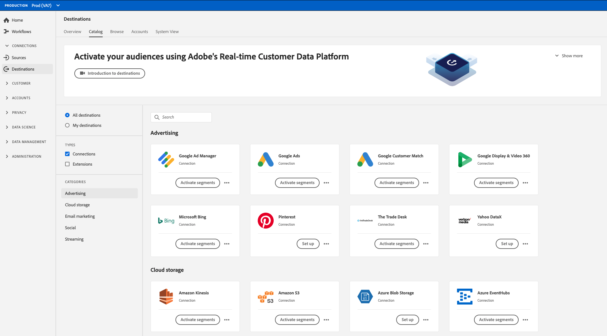

# [!DNL Adobe Experience Platform] Destination SDK

Utilisez [!DNL Adobe Experience Platform] Destination SDK pour créer des intégrations de destinations qui diffusent des données d’audience et de profil vers votre point d’entrée ou emplacement de stockage. Choisissez vos données et formats d’authentification, stockez les configurations dans Experience Platform et récupérez-les via l’API pour les mises à jour.

Consultez cette documentation pour configurer, tester et publier une intégration de destination personnalisée avec [!DNL Adobe Experience Platform] et la répertorier dans le [catalogue de destinations](/help/destinations/catalog/overview.md). Vous pouvez également utiliser Destination SDK pour créer une destination personnalisée privée afin d’exporter des données personnalisées en fonction de vos besoins.

## Démarrage rapide {#quick-start}

Utilisez ces ressources pour configurer et envoyer la destination via Destination SDK.

>[!BEGINSHADEBOX]

<table style="border: 0;">
  <tbody>
    <tr>
        <td>
            
<b>Pages de configuration</b>

            <ul>
                <li><a href="/help/destinations/destination-sdk/functionality/configuration-options.md">Explication de toutes les options de configuration</a></li>
                <li>Configuration du serveur de destination : <a href="/help/destinations/destination-sdk/functionality/destination-server/server-specs.md">spécifications du serveur</a> et <a href="/help/destinations/destination-sdk/functionality/destination-server/templating-specs.md">spécifications de modèle</a></li>
                <li><a href="/help/destinations/destination-sdk/functionality/destination-configuration/customer-data-fields.md">Champs de données client et autres composants de configuration de destination</a></li>
                <li><a href="https://experienceleague.adobe.com/en/docs/experience-platform/destinations/destination-sdk/functionality/destination-server/message-format">Modélisation et macros</a></li>
            </ul>
        </td>
        <td>
            
<b>Guides</b>

            <ul>
                <li><a href="/help/destinations/destination-sdk/overview.md#process">Processus d’intégration de haut niveau</a></li>
                <li><a href="/help/destinations/destination-sdk/guides/configure-destination-instructions.md">Configuration d’une destination de diffusion en continu</a></li>
                <li><a href="/help/destinations/destination-sdk/guides/configure-file-based-destination-instructions.md">Configuration d’une destination basée sur des fichiers</a></li>
                <li><a href="/help/destinations/destination-sdk/guides/batch/configure-prospect-audience-destination.md">Configurer une destination pour exporter des profils de prospects</a></li>
                <li><a href="/help/destinations/destination-sdk/guides/submit-destination.md">Envoyer la destination pour publication</a></li>
            </ul>
        </td>
        <td>
            
<b>Références d’API</b>

            <ul>
                <li><a href="https://developer.adobe.com/experience-platform-apis/references/destination-authoring/#tag/Destination-servers-and-templates">Référence de l’API du point d’entrée du serveur de destination</a></li>
                <li><a href="https://developer.adobe.com/experience-platform-apis/references/destination-authoring/#tag/Destination-configurations">Référence de l’API du point d’entrée de destination</a></li>
                <li><a href="https://developer.adobe.com/experience-platform-apis/references/destination-authoring/#tag/Audience-metadata-templates">Référence de l’API de métadonnées d’audience</a></li>
                <li><a href="https://developer.adobe.com/experience-platform-apis/references/destination-authoring/#tag/Destination-testing">Référence de l’API de test</a></li>
                <li><a href="https://developer.adobe.com/experience-platform-apis/references/destination-authoring/#tag/Destination-publishing">Référence de l’API de publication de destination</a></li>
            </ul>
        </td>
    </tr>
  </tbody>
</table>

<table style="border: 0;">
  <tbody>
    <tr>
        <td>
            
<b>Référence rapide sur la destination de diffusion en continu</b>

            <ul>
                <li><a href="/help/destinations/destination-sdk/guides/configure-destination-instructions.md">Configurer un guide complet de destination de diffusion en continu</a></li>
                <li><a href="/help/destinations/destination-sdk/functionality/destination-server/message-format.md">Comprendre la transformation des données par le biais des modèles Pebble</a> et <a href="/help/destinations/destination-sdk/functionality/destination-server/supported-functions.md">afficher les fonctions de modèle prises en charge</a></li>
                <li><a href="/help/destinations/destination-sdk/functionality/destination-configuration/aggregation-policy.md">Comprendre les politiques d’agrégation des données</a></li>
                <li><a href="https://experienceleague.adobe.com/en/docs/experience-platform/destinations/destination-sdk/functionality/destination-server/message-format">Exemple de configuration en direct</a></li>
                <li><a href="/help/destinations/destination-sdk/testing-api/streaming-destinations/streaming-destination-testing-overview.md">Test de la destination de diffusion en streaming</a></li>
            </ul>
        </td>
        <td>
            
<b>Référence rapide sur les destinations basées sur des fichiers</b>

            <ul>
                <li><a href="/help/destinations/destination-sdk/guides/configure-file-based-destination-instructions.md">Configurer un guide complet de destination basé sur des fichiers</a></li>
                <li><a href="/help/destinations/destination-sdk/guides/batch/configure-file-formatting-options.md">Configurer des formats de fichiers pour les fichiers exportés</a></li>
                <li><a href="/help/destinations/destination-sdk/guides/batch/configure-amazon-s3-destination-with-predefined-file-formatting.md">Exemple de configuration en direct pour une destination Amazon S3</a></li>
                <li><a href="/help/destinations/destination-sdk/functionality/destination-configuration/batch-configuration.md">Configuration par lots</a> pour le planning d’exportation et la dénomination des fichiers</li>
                <li><a href="/help/destinations/destination-sdk/testing-api/batch-destinations/file-based-destination-testing-overview.md">Test de la destination basée sur des fichiers</a></li>
            </ul>
        </td>
        <td>
            
<b>Autres informations essentielles</b>

            <ul>
                <li><a href="/help/destinations/destination-sdk/getting-started.md#obtain-authentication-credentials">Obtention des informations d’authentification requises pour utiliser l’API</a></li>
                <li><a href="/help/destinations/destination-sdk/integration-prerequisites.md">Conditions préalables à l’intégration</a></li>
                <li><a href="/help/destinations/destination-sdk/glossary.md">Glossaire des termes Destination SDK</a></li>
                <li><a href="/help/destinations/destination-sdk/functionality/rate-limiting-retry-policy.md">Limites de taux et politique de reprise</a></li>
                <li><a href="/help/destinations/destination-sdk/docs-framework/self-service-template.md">Modèle de libre-service pour documenter la destination</a></li>
            </ul>
        </td>
    </tr>
  </tbody>
</table>

>[!ENDSHADEBOX]

## Intégrations standardisées et personnalisées {#productized-custom-integrations}

>[!IMPORTANT]
>
> Cette fonctionnalité de création de destinations personnalisées privées est disponible uniquement pour les clients [Adobe Real-Time Customer Data Platform Ultimate](https://helpx.adobe.com/fr/legal/product-descriptions/real-time-customer-data-platform.html).

En tant que partenaire Destination SDK, vous pouvez ajouter votre destination personnalisée au [catalogue Experience Platform](/help/destinations/catalog/overview.md) afin de :

* Standardisez les configurations d’intégration entre les clients à l’aide de paramètres préconfigurés et simplifiez leur expérience de configuration.
* Fournissez aux clients une carte de destination de marque dans le catalogue pour une découverte et une configuration plus faciles.
* Être répertoriés comme une intégration personnalisée à [!DNL Adobe Experience Platform] et [!DNL Real-Time Customer Data Platform].

En tant que client Experience Platform, vous pouvez également créer une destination personnalisée privée pour répondre à vos besoins d’activation.

![Diagramme de présentation montrant comment les développeurs de destinations interagissent avec Destination SDK et comment [!DNL Real-Time CDP] clients bénéficient de destinations standardisées et privées.](assets/destination-sdk-visual.png)

## Types d’intégration pris en charge {#supported-integration-types}

### Intégrations en temps réel (streaming) {#real-time-integrations}

Par le biais de Destination SDK, [!DNL Adobe Experience Platform] prend en charge les intégrations en temps réel (streaming) avec les destinations qui ont un point d’entrée d’API REST. Ces intégrations prennent en charge les éléments suivants :

* [Transformation des messages](/help/destinations/destination-sdk/functionality/destination-server/message-format.md) et [agrégation](/help/destinations/destination-sdk/functionality/destination-configuration/aggregation-policy.md)
* [Renvoi des profils](/help/destinations/destination-sdk/functionality/destination-configuration/historical-profile-qualifications.md)
* [Intégration de métadonnées configurable](/help/destinations/destination-sdk/functionality/audience-metadata-management.md) pour initialiser la configuration de l’audience et le transfert de données
* [Authentification configurable](/help/destinations/destination-sdk/functionality/destination-configuration/customer-authentication.md)
* Une suite d’API de test et de validation pour tester et itérer les configurations de destination

### Intégrations basées sur des fichiers {#file-based-integrations}

Destination SDK vous permet également de configurer des intégrations afin d’exporter régulièrement des fichiers vers l’emplacement de stockage de votre choix. Les intégrations basées sur des fichiers prennent en charge les éléments suivants :

* Exportation de fichiers dans plusieurs [formats pris en charge](/help/destinations/destination-sdk/functionality/destination-server/file-formatting.md) (CSV, Parquet, JSON)
* Options de formatage de fichiers configurables pour structurer les fichiers exportés en fonction de vos besoins en aval.

Pour connaître les exigences techniques, voir [Conditions préalables à l’intégration](/help/destinations/destination-sdk/integration-prerequisites.md). Pour toutes les configurations prises en charge, voir [options de configuration](/help/destinations/destination-sdk/functionality/configuration-options.md).

## Accéder à Destination SDK {#get-access}

L’accès à Destination SDK dépend de votre statut en tant que partenaire ou client [!DNL Real-Time CDP].

| Type de partenaire ou de client | Accéder à Destination SDK |
|---------|----------|
| Fournisseur de logiciels indépendant (ISV) | Rejoignez le [Programme de partenariat technologique d’](https://partners.adobe.com/technologyprogram/experiencecloud.html) et demandez un sandbox Experience Platform pour accéder à Destination SDK. |
| Intégrateur système (SI) | Vous devez être au niveau Gold ou Platinum du [Programme Partenaires en solutions &#x200B;](https://solutionpartners.adobe.com/home.html) pour qu’un sandbox Experience Platform soit configuré et puisse accéder à Destination SDK. |
| Client Experience Platform sur le package Real-Time CDP Ultimate [&#128279;](https://helpx.adobe.com/fr/legal/product-descriptions/real-time-customer-data-platform.html) | Par défaut, vous avez accès aux sandbox Experience Platform et à Destination SDK, ce qui vous permet de créer des destinations privées pour votre organisation. |

{style="table-layout:auto"}

## Aperçu général de la configuration {#process}

Pour configurer la destination dans Experience Platform, procédez comme suit :

1. Si vous êtes un fournisseur de logiciels indépendant (ISV) ou un intégrateur de système (SI), consultez [Accès à Destination SDK](#get-access). [Package Real-Time CDP Ultimate &#x200B;](https://helpx.adobe.com/fr/legal/product-descriptions/real-time-customer-data-platform.html) les clients peuvent ignorer cette étape.
2. [Faites la demande dʼun sandbox Experience Platform](https://adobeexchangeec.zendesk.com/hc/en-us/articles/360037457812-Adobe-Experience-Platform-Sandbox-Accounts-Access-Adding-Users-and-Support) et activez l’autorisation de création de destination. Pour les informations d’authentification et la configuration du contrôle d’accès, voir [Prise en main de Destination SDK](/help/destinations/destination-sdk/getting-started.md).
3. Créez votre intégration. Suivez les instructions de la documentation du produit pour configurer les [destinations de diffusion en continu](/help/destinations/destination-sdk/guides/configure-destination-instructions.md) ou [destinations basées sur des fichiers](/help/destinations/destination-sdk/guides/configure-file-based-destination-instructions.md).
4. Testez votre intégration. Suivez les instructions de la documentation du produit pour tester les [destinations de diffusion en continu](/help/destinations/destination-sdk/testing-api/streaming-destinations/streaming-destination-testing-overview.md) ou [destinations basées sur des fichiers](/help/destinations/destination-sdk/testing-api/batch-destinations/file-based-destination-testing-overview.md).
5. Si vous êtes un fournisseur de logiciels indépendant (ISV) ou un intégrateur de système (SI) créant une intégration personnalisée, [soumettez votre intégration](/help/destinations/destination-sdk/guides/submit-destination.md) pour révision Adobe. Le temps de réponse standard est de cinq jours ouvrables.
6. Si vous êtes un fournisseur de logiciels indépendant (ISV) ou un intégrateur de système (SI) créant une intégration personnalisée, utilisez le processus de documentation en libre-service [&#128279;](/help/destinations/destination-sdk/docs-framework/documentation-instructions.md) pour créer une page de documentation du produit sur Experience League pour votre destination.
7. Pour les intégrations standardisées, une fois que Adobe a approuvé votre envoi, votre intégration apparaît dans le [catalogue Experience Platform](/help/destinations/catalog/overview.md).
8. Pour mettre à jour votre intégration, suivez le même processus.

## Référence {#reference}

Avant de créer votre intégration, consultez la documentation Experience Platform suivante :

* [Présentation des destinations Adobe Experience Platform](https://experienceleague.adobe.com/docs/experience-platform/destinations/home.html?lang=fr)
* [Principes de base de la composition des schémas XDM](https://experienceleague.adobe.com/docs/experience-platform/xdm/schema/composition.html?lang=fr)
* [Présentation des espaces de noms d’identité](https://experienceleague.adobe.com/docs/experience-platform/identity/namespaces.html?lang=fr)
