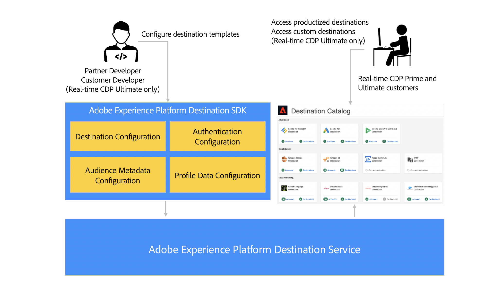

# Adobe Experience Platform Destination SDK

## Présentation {#destinations-sdk}

Adobe Experience Platform Destination SDK est une suite d’API de configuration qui vous permet de configurer des modèles d’intégration de destination pour qu’Experience Platform diffuse des données d’audience et de profil vers votre point de terminaison ou emplacement de stockage, en fonction des données et des formats d’authentification de votre choix. Les configurations sont stockées dans Experience Platform et peuvent être récupérées via lʼAPI pour des mises à jour supplémentaires.

La documentation du Destination SDK fournit des instructions pour utiliser Adobe Experience Platform Destination SDK afin de configurer, de tester et de publier une intégration de destination personnalisée avec Adobe Experience Platform. Votre destination pourra ensuite rejoindre le catalogue des destinations en constante évolution. En utilisant Destination SDK, vous pouvez également créer votre propre destination privée personnalisée pour exporter des données adaptées à vos besoins.

## Intégrations standardisées et personnalisées {#productized-custom-integrations}

>[!IMPORTANT]
>
> Cette fonctionnalité de création de destinations personnalisées privées est disponible uniquement pour [Real-time Customer Data Platform Ultimate](https://helpx.adobe.com/fr/legal/product-descriptions/real-time-customer-data-platform.html) clients.

En tant que partenaire du Destination SDK, l’ajout de votre destination personnalisée au [Catalogue Experience Platform](/help/destinations/catalog/overview.md) vous permet de bénéficier des avantages suivants :
1. Standardisez les configurations d’intégration entre les clients avec des paramètres préconfigurés et simplifiez l’expérience de configuration pour les clients.
2. Représentez votre destination sous forme de carte personnalisée dans le catalogue des destinations dʼExperience Platform, pour une visibilité et une configuration en toute facilité.
3. Recevez le statut dʼintégration de destination standardisée pour Adobe Experience Platform et Real-time Customer Data Platform.

En tant que client Experience Platform, vous pouvez également créer une destination personnalisée privée qui répond le mieux à vos besoins d’activation.

## Types d’intégrations pris en charge {#supported-integration-types}

Grâce au Destination SDK, Adobe Experience Platform prend en charge les intégrations en temps réel aux destinations qui ont un point dʼentrée API REST. L’intégration en temps réel à Experience Platform prend en charge des fonctionnalités telles que :
* Transformation et agrégation des messages
* Renvoi des profils
* Intégration de métadonnées configurable pour initialiser la configuration de l’audience et le transfert de données
* Authentification configurable
* Suite d’API de test et de validation permettant de tester et d’itérer les configurations de destination

Grâce à Destination SDK, vous pouvez également configurer des intégrations pour exporter régulièrement des fichiers vers l’emplacement de stockage de votre choix. L’intégration en temps réel à Experience Platform prend en charge des fonctionnalités telles que :
* Exportation de fichiers dans plusieurs formats pris en charge (CSV, Parquet, JSON)
* Options de formatage de fichier configurables, qui vous permettent de structurer le format des fichiers exportés pour répondre à vos besoins en aval.

Découvrez les exigences techniques du côté des destinations dans la section [Conditions préalables à l’intégration](./integration-prerequisites.md).

## Accéder à Destination SDK {#get-access}

L’accès aux Destinations SDK varie en fonction de votre statut de partenaire ou d’Experience Platform, client Real-Time CDP. Pour plus d’informations, consultez le tableau ci-dessous :

| Type de partenaire ou de client | Accéder à Destination SDK |
---------|----------|
| Fournisseur de logiciels indépendant (ISV) | Rejoignez le [Programme Adobe Exchange](https://partners.adobe.com/exchangeprogram/experiencecloud.html) et sollicitez une sandbox Experience Platform configurée pour accéder à Destination SDK. |
| Intégrateur système (SI) | Vous devez être au niveau Or ou Platine dans le [Programme Partenaires en solutions Adobe](https://solutionpartners.adobe.com/home.html) pour obtenir une sandbox Experience Platform configurée ainsi quʼun accès à Destination SDK. |
| Client Experience Platform sur la [Package Real-Time CDP Ultimate](https://helpx.adobe.com/legal/product-descriptions/real-time-customer-data-platform.html) | Par défaut, vous avez accès aux environnements de test et à la Destination SDK Experience Platform, ce qui vous permet de créer des destinations privées pour votre organisation. |

{style=&quot;table-layout:auto&quot;}

## Aperçu général de la configuration {#process}

Pour configurer votre destination dans Experience Platform, procédez comme suit :

1. Si vous êtes un fournisseur de logiciels indépendant (ISV) ou un intégrateur de système (SI), consultez la section ci-dessus relative à l’obtention des informations d’accès. Les clients [Adobe Experience Platform Activation](https://helpx.adobe.com/fr/legal/product-descriptions/adobe-experience-platform0.html) peuvent passer cette étape.
2. [Faites la demande dʼune sandbox Experience Platform](https://adobeexchangeec.zendesk.com/hc/en-us/articles/360037457812-Adobe-Experience-Platform-Sandbox-Accounts-Access-Adding-Users-and-Support) et activez l’autorisation de création de destination.
3. Créez votre intégration. Suivez les instructions de la documentation du produit pour configurer [destinations de diffusion en continu](./configure-destination-instructions.md) ou [destinations basées sur des fichiers](./configure-file-based-destination-instructions.md).
4. Testez votre intégration. Suivez les instructions de la documentation du produit pour tester [destinations de diffusion en continu](./test-destination.md) ou [destinations basées sur des fichiers](./file-based-destination-testing-overview.md).
5. Si vous êtes un logiciel de développement logiciel ou si vous créez une [intégration productive](./overview.md#productized-custom-integrations), [soumettre votre intégration](./submit-destination.md) pour la révision par l’Adobe (le temps de réponse standard est de cinq jours ouvrables).
6. Si vous êtes un fournisseur de logiciels indépendant (ISV) ou un intégrateur de système (SI) créant une intégration personnalisée, utilisez le [processus de documentation en libre-service](./docs-framework/documentation-instructions.md) pour créer une page de documentation du produit sur Experience League pour votre destination.
7. Pour les intégrations productives, une fois approuvées par Adobe, votre intégration s’affichera dans la variable [Catalogue des Experience Platform](/help/destinations/catalog/overview.md).
8. Si vous souhaitez mettre à jour votre intégration, procédez de la même manière.

## Référence {#reference}

Adobe recommande de lire et de comprendre la documentation dʼExperience Platform suivante :

* [Présentation des destinations d’Adobe Experience Platform](https://experienceleague.adobe.com/docs/experience-platform/destinations/home.html?lang=fr)
* [Principes de base de la composition des schémas XDM](https://experienceleague.adobe.com/docs/experience-platform/xdm/schema/composition.html?lang=fr)
* [Présentation des espaces de noms d’identité](https://experienceleague.adobe.com/docs/experience-platform/identity/namespaces.html?lang=fr)
