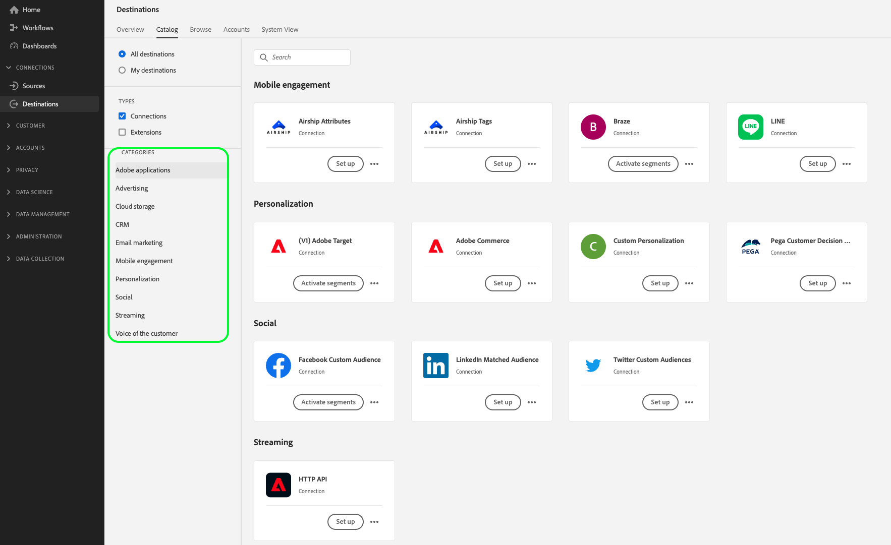

# Types et catégories de destination

Lisez cette page pour comprendre les différentes catégories et types de destinations d’Adobe Experience Platform.

## Types de destinations {#destination-types}

Dans Adobe Experience Platform, nous faisons la distinction entre différents types de destinations : connexions, exportations de jeux de données et extensions. Il existe plusieurs types de destinations de connexion, ce qui vous permet d’exporter des données vers des destinations basées sur des API, des destinations de réseaux sociaux, des plateformes CRM, etc.

Enfin, les connexions peuvent également être distinguées entre les destinations publiques disponibles dans toutes les organisations du catalogue des destinations, et les destinations privées que les clients Real-Time CDP Ultimate peuvent créer pour répondre à leurs cas d’utilisation d’exportation spécifiques.

>[!BEGINSHADEBOX]

Diagramme {zoomable="yes"}

>[!ENDSHADEBOX]

## Connexions {#connections}

Les destinations **[!UICONTROL Profile Export]**, **[!UICONTROL Streaming Audience Export]** et **[!DNL Edge Personalization]** de Adobe Experience Platform capturent des données d’événement, les combinent à d’autres sources de données pour former le [profil client en temps réel](../profile/home.md), appliquent une segmentation et exportent des audiences et des profils qualifiés vers des destinations.

## Destinations d’exportation de profils {#profile-export}

Les destinations d’exportation de profils reçoivent des données brutes, souvent avec l’adresse e-mail comme clé primaire. Experience Platform prend actuellement en charge deux types de destinations d’exportation de profils :

* [Destinations de lot (basées sur des fichiers)](#file-based)
* [Destinations d’entreprise avancées (destinations d’exportation de profils de streaming)](#advanced-enterprise-destinations)

### Destinations d’entreprise avancées (destinations d’exportation de profils de streaming) {#advanced-enterprise-destinations}

>[!IMPORTANT]
>
>Les destinations d’entreprise avancées, ou destinations d’exportation de profil de diffusion en continu, sont disponibles uniquement pour les clients [Adobe Real-Time Customer Data Platform Ultimate](https://helpx.adobe.com/fr/legal/product-descriptions/real-time-customer-data-platform.html).

Utilisez les connecteurs de données de destination d’entreprise avancés pour transmettre les profils Adobe Real-Time Customer Data Platform en temps quasi réel à des systèmes internes ou à des systèmes tiers à des fins de synchronisation des données, d’analyse et d’enrichissement des profils.

Ces destinations reçoivent des données d’audience et de profil en tant que flux de données Experience Platform.

Les destinations d’entreprise avancées sont les suivantes :

* [Destination de l’API HTTP](catalog/streaming/http-destination.md)
* [Amazon Kinesis](catalog/cloud-storage/amazon-kinesis.md)
* [Azure Event Hubs](catalog/cloud-storage/azure-event-hubs.md)

### Destinations de lot (basées sur des fichiers) {#file-based}

Les destinations basées sur des fichiers reçoivent des fichiers `.csv` contenant des profils et/ou des attributs. [Amazon S3](catalog/cloud-storage/amazon-s3.md) est un exemple de destination où vous pouvez exporter des fichiers contenant des exportations de profils.

## Destinations d’exportation d’audiences de diffusion en continu {#streaming-destinations}

Les destinations d’exportation d’audience reçoivent des données d’audience Experience Platform. Ces destinations utilisent des ID d’audience ou d’utilisateur. Les destinations publicitaires et sociales telles que [[!DNL Google Display & Video 360]](catalog/advertising/google-dv360.md), [[!DNL Google Ads]](catalog/advertising/google-ads-destination.md)ou [Facebook](catalog/social/facebook.md) sont des exemples de ces destinations.

## Destinations de personnalisation Edge {#edge-personalization-destinations}

Les destinations de personnalisation Edge dans Experience Platform comprennent [Adobe Target](/help/destinations/catalog/personalization/adobe-target-connection.md) et la [destination de personnalisation personnalisée](/help/destinations/catalog/personalization/custom-personalization.md). En utilisant ces destinations, vous pouvez permettre à vos clients d’utiliser la personnalisation sur la même page et sur la page suivante.

En savoir plus sur la façon de [configurer des destinations de personnalisation pour la personnalisation de la même page et de la page suivante](/help/destinations/ui/activate-edge-personalization-destinations.md).

## Destinations d’exportation de profils et d’audiences - présentation vidéo {#video}

La vidéo ci-dessous vous montre les particularités des deux types de destinations :

>[!VIDEO](https://video.tv.adobe.com/v/29707?quality=12)

## Types d’audiences exportées {#exported-audiences-types}

Vous pouvez exporter trois types d’audiences d’Experience Platform vers différentes destinations :

* Audiences de personnes
* Audiences de compte
* Audiences de prospects

En savoir plus sur les [différents types d’audiences](/help/segmentation/types/account-audiences.md#terminology).

Un symbole sur la carte de destination indique les types d’audiences que vous pouvez exporter vers chaque destination.

{zoomable="yes"}

## Destinations d’exportation de jeux de données {#dataset-export-destinations}

Certaines destinations d’espace de stockage dans le catalogue des destinations prennent en charge les exportations de jeux de données. Utilisez ces destinations pour exporter des jeux de données brutes vers des emplacements d’espace de stockage.

En savoir plus sur la façon d’[exporter des jeux de données](/help/destinations/ui/export-datasets.md).

## Extensions {#extensions}

Experience Platform tire parti de la puissance et de la flexibilité de la gestion des balises, ce qui vous permet de configurer des extensions de balises dans l’interface utilisateur.

>[!TIP]
>
>Pour plus d’informations détaillées sur les extensions de balises, y compris les cas d’utilisation et la façon de les trouver dans l’interface, consultez la [Présentation des extensions de balises](./catalog/launch-extensions/overview.md).

Les extensions de balises transfèrent les données brutes des événements vers plusieurs types de destinations. Considérez les extensions comme un type de destination **Transfert d’événement**. Il s’agit d’un type d’intégration aux plateformes de destination plus simple et qui ne transfère que les données d’événement brutes. Par exemple, l’[extension de personnalisation Gainsight](./catalog/personalization/gainsight.md) ou l’[extension de voix du client Confirmit](./catalog/voice/confirmit-digital-feedback.md).

## Utilisation des connexions et des extensions {#when-to-use}

En tant que spécialiste marketing, vous pouvez utiliser une combinaison de connexions et d’extensions pour répondre à vos cas d’utilisation.

Les connexions sont utiles lorsqu’il est nécessaire d’utiliser un profil client centralisé complet ou une audience client pour l’activation. Utilisez, par exemple, des connexions si vous joignez des données comportementales à partir d’un système d’analyse avec des données CRM chargées afin de qualifier un utilisateur pour une audience donnée avant de lui diffuser un message personnalisé.

Les extensions s’avèrent utiles lorsque des données d’événement sont utilisées pour déclencher une action ou pour effectuer une segmentation dans un environnement externe. Par exemple, si les données comportementales doivent être transférées vers un système externe sans être jointes à d’autres sources de données dans un fichier pour un utilisateur donné.

## Catégories de destination {#categories}

Les connexions et extensions du [catalogue des destinations](https://platform.adobe.com/destination/catalog) sont regroupées par catégorie de destination (**Publicité**, **Espace de stockage**, **Plateformes d’enquête**, **Marketing par e-mail**, etc.), selon l’action marketing qu’elles permettent de réaliser. Pour plus d’informations sur chaque catégorie, ainsi que sur les destinations incluses dans chaque catégorie, consultez la [documentation du catalogue des destinations](./catalog/overview.md).

{zoomable="yes"}
