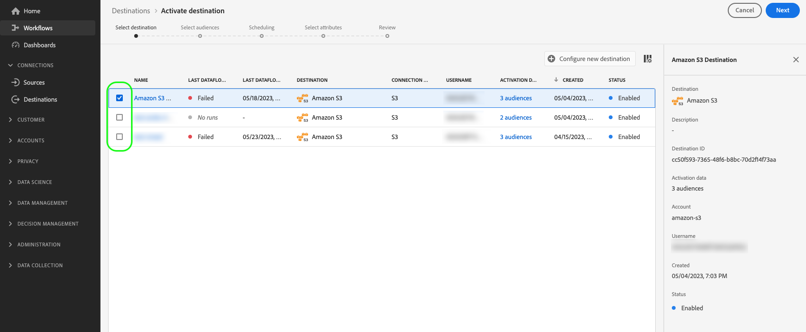

# Activer les audiences vers des destinations d’export de profils par lots

>[!IMPORTANT]
> 
> * Pour activer les audiences et activer la fonction [étape de mappage](#mapping) du workflow, vous avez besoin de l’événement **[!UICONTROL Affichage des destinations]**, **[!UICONTROL Activation des destinations]**, **[!UICONTROL Afficher les profils]**, et **[!UICONTROL Affichage de segments]** [autorisations de contrôle d’accès](/help/access-control/home.md#permissions).
> * Pour activer des audiences sans passer par la fonction [étape de mappage](#mapping) du workflow, vous avez besoin de l’événement **[!UICONTROL Affichage des destinations]**, **[!UICONTROL Activation du segment sans mappage]**, **[!UICONTROL Afficher les profils]**, et **[!UICONTROL Affichage de segments]** [autorisations de contrôle d’accès](/help/access-control/home.md#permissions).
>* Pour exporter *identités*, vous avez besoin de la fonction **[!UICONTROL Affichage du graphique des identités]** [autorisation de contrôle d’accès](/help/access-control/home.md#permissions). <br> {width="100" zoomable="yes"}
> 
> Lisez la [présentation du contrôle d’accès](/help/access-control/ui/overview.md) ou contactez votre administrateur de produit pour obtenir les autorisations requises.

## Présentation {#overview}

Cet article explique le processus requis pour activer les audiences dans Adobe Experience Platform vers des destinations basées sur des fichiers de profil par lot, telles que l’espace de stockage dans le cloud et les destinations de marketing par e-mail.

## Conditions préalables {#prerequisites}

Pour activer des audiences vers des destinations, vous devez avoir réussi [connecté à une destination](./connect-destination.md). Si vous ne l’avez pas déjà fait, accédez au [catalogue de destinations](../catalog/overview.md), parcourez les destinations prises en charge et configurez la destination que vous souhaitez utiliser.

## Formats de fichiers pris en charge pour l’exportation {#supported-file-formats-export}

Les formats de fichiers suivants sont pris en charge lors de l’exportation d’audiences :

* CSV
* JSON
* Parquet

Notez que l’exportation de fichiers CSV vous offre une plus grande flexibilité en termes de structure de vos fichiers exportés. En savoir plus sur [Configuration du formatage des fichiers pour les fichiers CSV](/help/destinations/ui/batch-destinations-file-formatting-options.md#file-configuration).

Sélectionnez le format de fichier souhaité à exporter lors de la [création d’une connexion à la destination basée sur les fichiers](/help/destinations/ui/connect-destination.md).

## Sélectionner votre destination {#select-destination}

1. Accédez à **[!UICONTROL Connexions et destinations]**, puis sélectionnez l’onglet **[!UICONTROL Catalogue]**.

   

1. Sélectionner **[!UICONTROL Activation des audiences]** sur la carte correspondant à la destination à laquelle vous souhaitez activer vos audiences, comme illustré dans l’image ci-dessous.

   

1. Sélectionnez la connexion de destination à utiliser pour activer vos audiences, puis sélectionnez **[!UICONTROL Suivant]**.

   

1. Accédez à la section suivante pour [sélectionner vos audiences](#select-audiences).

## Sélectionner vos audiences {#select-audiences}

Pour sélectionner les audiences que vous souhaitez activer vers la destination, utilisez les cases à cocher situées à gauche des noms d’audience, puis sélectionnez **[!UICONTROL Suivant]**.

Vous pouvez sélectionner plusieurs types d’audiences, selon leur origine :

* **[!UICONTROL Segmentation Service]**: audiences générées dans Experience Platform par le service de segmentation. Voir [documentation sur la segmentation](../../segmentation/ui/overview.md) pour plus d’informations.
* **[!UICONTROL Chargement personnalisé]**: audiences générées en dehors de l’Experience Platform et chargées dans Platform sous la forme de fichiers CSV. Pour en savoir plus sur les audiences externes, consultez la documentation sur [import d&#39;une audience](../../segmentation/ui/overview.md#import-audience).
* Autres types d’audiences, provenant d’autres solutions Adobe, telles que [!DNL Audience Manager].


>[!TIP]
>
>Sélection d’audiences provenant de **[!UICONTROL Chargements personnalisés]** active automatiquement la variable [Sélectionner les attributs d’enrichissement](#select-enrichment-attributes) étape .

>[!TIP]
>
>Vous pouvez supprimer des audiences des flux d’activation existants du **[!UICONTROL Données d’activation]** page. Voir [documentation dédiée](../ui/destination-details-page.md#bulk-remove) pour plus d’informations.

## Planification de l’exportation des audiences {#scheduling}

>[!CONTEXTUALHELP]
>id="platform_destinations_activate_schedule"
>title="Planning"
>abstract="Utilisez l’icône en forme de crayon pour définir le type d’exportation de fichier (fichiers complets ou incrémentiels) et la fréquence d’exportation."

[!DNL Adobe Experience Platform] exporte les données pour les destinations de marketing par e-mail et de stockage dans le cloud en tant que [types de fichiers différents](#supported-file-formats-export). Dans le **[!UICONTROL Planification]** , vous pouvez configurer le planning et les noms des fichiers pour chaque audience que vous exportez.

Experience Platform définit automatiquement un planning par défaut pour chaque export de fichier. Vous pouvez modifier la planification par défaut selon vos besoins, en cliquant sur l’icône en forme de crayon en regard de chaque planification, puis en définissant une planification personnalisée.


>[!TIP]
>
>Vous pouvez modifier les plannings d’activation de l’audience pour les flux d’activation existants à partir du **[!UICONTROL Données d’activation]** page. Consultez la documentation relative à [modification en masse des calendriers d’activation](../ui/destination-details-page.md#bulk-edit-schedule) pour plus d’informations.

>[!IMPORTANT]
>
>[!DNL Adobe Experience Platform] divise automatiquement les fichiers d’exportation à 5 millions d’enregistrements (lignes) par fichier. Chaque ligne représente un profil.
>
>Les noms de fichiers fractionnés sont ajoutés avec un nombre indiquant que le fichier fait partie d’une exportation plus importante, comme : `filename.csv`, `filename_2.csv`, `filename_3.csv`.

### Exporter des fichiers complets {#export-full-files}

>[!CONTEXTUALHELP]
>id="platform_destinations_activate_exportoptions"
>title="Options d’exportation de fichiers"
>abstract="Sélectionner **Exporter les fichiers complets** pour exporter un instantané complet de tous les profils éligibles à l’audience. Sélectionner **Exportation de fichiers incrémentiels** pour n&#39;exporter que les profils qualifiés pour l&#39;audience depuis le dernier export. <br> La première exportation de fichier incrémentielle comprend tous les profils qui remplissent les critères de l’audience, agissant comme un renvoi. Les prochains fichiers incrémentiels incluront uniquement les profils qualifiés pour l’audience depuis la première exportation incrémentielle de fichier."
>additional-url="https://experienceleague.adobe.com/docs/experience-platform/destinations/ui/activate/activate-batch-profile-destinations.html?lang=fr#export-incremental-files" text="Exporter des fichiers incrémentiels"

>[!CONTEXTUALHELP]
>id="platform_destinations_activationchaining_aftersegmentevaluation"
>title="Activer après l’évaluation de l’audience"
>abstract="L’activation s’exécute immédiatement une fois la tâche de segmentation quotidienne terminée. Ainsi, les profils les plus à jour sont exportés."

>[!CONTEXTUALHELP]
>id="platform_destinations_activationchaining_scheduled"
>title="Activation planifiée"
>abstract="L’activation s’exécute à une heure fixe de la journée."

Sélectionner **[!UICONTROL Exporter les fichiers complets]** pour déclencher l&#39;export d&#39;un fichier contenant un instantané complet de toutes les qualifications de profil pour l&#39;audience sélectionnée.


1. Utilisez le sélecteur **[!UICONTROL Fréquence]** pour sélectionner la fréquence d’exportation :

   * **[!UICONTROL Une fois]** : planifiez une exportation de fichiers complets sur demande unique.
   * **[!UICONTROL Tous les jours]** : planifiez des exportations de fichiers complets une fois par jour, tous les jours, au moment choisi.

2. Utilisez la variable **[!UICONTROL Heure]** bascule pour sélectionner si l’exportation doit avoir lieu immédiatement après l’évaluation de l’audience ou sur une base planifiée, à une heure donnée. Lorsque vous sélectionnez la variable **[!UICONTROL Planifié]**, vous pouvez utiliser le sélecteur pour choisir l’heure du jour à laquelle l’exportation doit avoir lieu, au format [!DNL UTC].

   >[!NOTE]
   >
   >La variable **[!UICONTROL Après l’évaluation du segment]** L’option décrite ci-dessous n’est disponible que pour sélectionner les clients bêta.

   Utiliser l’option **[!UICONTROL Après l’évaluation du segment]** pour que le traitement d’activation s’exécute immédiatement après la fin du traitement quotidien de segmentation par lots de Platform. Cette option garantit que lorsque la tâche d’activation s’exécute, les profils les plus récents sont exportés vers votre destination.

   <!-- Batch segmentation currently runs at {{insert time of day}} and lasts for an average {{x hours}}. Adobe reserves the right to modify this schedule. -->

   
Utilisez l’option **[!UICONTROL Planifié]** pour que la tâche d’activation s’exécute à une heure déterminée. Cette option garantit que les données de profil Experience Platform sont exportées simultanément chaque jour. Toutefois, les profils que vous exportez peuvent ne pas être les plus à jour, selon que la tâche de segmentation par lots est terminée avant le lancement de la tâche d’activation.

   

3. Utilisez le sélecteur **[!UICONTROL Date]** pour choisir le jour ou l’intervalle d’exportation. Pour les exportations quotidiennes, il est recommandé de définir les dates de début et de fin de sorte qu’elles correspondent à la durée de vos campagnes sur vos plateformes en aval.

   >[!IMPORTANT]
   >
   > Lors de la sélection d’un intervalle d’exportation, le dernier jour de l’intervalle n’est pas inclus dans les exportations. Par exemple, si vous sélectionnez un intervalle entre le 4 et le 11 janvier, la dernière exportation de fichier aura lieu le 10 janvier.

4. Sélectionnez **[!UICONTROL Créer]** pour enregistrer le planning.

### Exporter des fichiers incrémentiels

>[!CONTEXTUALHELP]
>id="platform_destinations_activate_something"
>title="Configurer le nom d’un fichier"
>abstract="Pour les destinations basées sur des fichiers, un nom de fichier unique est généré par audience. Utilisez l’éditeur de nom de fichier pour créer et modifier un nom de fichier unique ou conserver le nom par défaut."

Sélectionner **[!UICONTROL Exportation de fichiers incrémentiels]** pour déclencher une exportation où le premier fichier est un instantané complet de toutes les qualifications de profil pour l’audience sélectionnée, et les fichiers suivants sont des qualifications de profil incrémentielles depuis l’exportation précédente.

>[!IMPORTANT]
>
>Le premier fichier incrémentiel exporté comprend tous les profils qui remplissent les critères d’une audience et qui fonctionnent comme un renvoi.


1. Utilisez le sélecteur **[!UICONTROL Fréquence]** pour sélectionner la fréquence d’exportation :

   * **[!UICONTROL Tous les jours]** : planification d’exportations de fichiers incrémentiels une fois par jour, tous les jours, au moment choisi.
   * **[!UICONTROL Par heure]** : planification d’exportations de fichiers incrémentiels toutes les 3, 6, 8 ou 12 heures.

2. Utilisez le sélecteur **[!UICONTROL Heure]** pour choisir l’heure de la journée, au format [!DNL UTC], à laquelle l’exportation doit avoir lieu.

3. Utilisez le sélecteur **[!UICONTROL Date]** pour choisir l’intervalle au cours duquel l’exportation doit avoir lieu. La bonne pratique consiste à définir les dates de début et de fin de sorte qu’elles correspondent à la durée de vos campagnes sur vos plateformes en aval.

   >[!IMPORTANT]
   >
   >Le dernier jour de l’intervalle n’est pas inclus dans les exportations. Par exemple, si vous sélectionnez un intervalle entre le 4 et le 11 janvier, la dernière exportation de fichier aura lieu le 10 janvier.

4. Sélectionnez **[!UICONTROL Créer]** pour enregistrer le planning.

### Configurer les noms de fichiers

>[!CONTEXTUALHELP]
>id="platform_destinations_activate_filename"
>title="Configurer le nom d’un fichier"
>abstract="Pour les destinations basées sur des fichiers, un nom de fichier unique est généré par audience. Utilisez l’éditeur de nom de fichier pour créer et modifier un nom de fichier unique ou conserver le nom par défaut."

Pour la plupart des destinations, les noms de fichier par défaut se composent du nom de destination, de l’ID d’audience et d’un indicateur de date et d’heure. Vous pouvez, par exemple, modifier les noms des fichiers exportés afin de faire la distinction entre les différentes campagnes ou pour ajouter le temps d’exportation des données aux fichiers. Remarque : certains développeurs peuvent choisir d’ajouter différentes options de nom de fichier par défaut pour leurs destinations. 

Pour ouvrir une fenêtre modale et modifier les noms de fichier, sélectionnez l’icône représentant un crayon. Les noms de fichier sont limités à 255 caractères.

>[!NOTE]
>
>L’image ci-dessous montre comment les noms de fichiers peuvent être modifiés pour les destinations [!DNL Amazon S3], mais le processus est identique pour toutes les destinations par lots (par exemple, SFTP, [!DNL Azure Blob Storage] ou [!DNL Google Cloud Storage]).


Dans l’éditeur de nom de fichier, vous pouvez sélectionner différents composants à ajouter au nom du fichier.


Le nom de destination et l’ID d’audience ne peuvent pas être supprimés des noms de fichier. Outre ces options, vous pouvez ajouter les options suivantes :

| Option de nom de fichier | Description |
|---------|----------|
| **[!UICONTROL Nom de l’audience]** | Nom de l’audience exportée. |
| **[!UICONTROL Date et heure]** | Sélectionnez entre l’ajout d’une `MMDDYYYY_HHMMSS` format ou horodatage UNIX à 10 chiffres de l’heure de génération des fichiers. Choisissez l’une de ces options si vous souhaitez que vos fichiers aient un nom de fichier dynamique généré avec chaque exportation de fichier incrémentiel. |
| **[!UICONTROL Texte personnalisé]** | Tout texte personnalisé que vous souhaitez ajouter aux noms de fichier. |
| **[!UICONTROL Identifiant de destination]** | L’identifiant du flux de données de destination que vous utilisez pour exporter l’audience. |
| **[!UICONTROL Nom de la destination]** | Nom du flux de données de destination que vous utilisez pour exporter l’audience. |
| **[!UICONTROL Nom de l’organisation]** | Nom de votre organisation dans Experience Platform. |
| **[!UICONTROL Nom du sandbox]** | ID de l’environnement de test que vous utilisez pour exporter l’audience. |

{style="table-layout:auto"}

Sélectionnez **[!UICONTROL Appliquer les modifications]** pour confirmer votre sélection.

>[!IMPORTANT]
> 
>Si vous ne sélectionnez pas l’option **[!UICONTROL Date et heure]**, les noms de fichier seront statiques et le nouveau fichier exporté remplacera le fichier précédent de votre emplacement de stockage à chaque exportation. L’option recommandée consiste à exécuter une tâche d’importation récurrente depuis un emplacement de stockage vers une plateforme de marketing par e-mail.

Une fois que vous avez terminé de configurer toutes vos audiences, sélectionnez **[!UICONTROL Suivant]** pour continuer.

## Mappage {#mapping}

Au cours de cette étape, vous devez sélectionner les attributs de profil à ajouter aux fichiers exportés vers la destination cible. Pour sélectionner les attributs de profil et les identités à exporter :

1. Dans le **[!UICONTROL Mappage]** page, sélectionnez **[!UICONTROL Ajouter un nouveau mappage]**.

   

1. Sélectionnez la flèche située à droite de l’entrée **[!UICONTROL Champ source]**.

   

1. Sur la page **[!UICONTROL Sélectionner le champ source]**, sélectionnez les attributs et les identités de profil à inclure dans les fichiers exportés vers la destination, puis choisissez **[!UICONTROL Sélectionner]**.

   >[!TIP]
   > 
   >Vous pouvez utiliser le champ de recherche pour affiner votre sélection, comme illustré dans l’image ci-dessous.

   


1. Le champ que vous avez sélectionné pour l’exportation apparaît désormais dans la vue de mappage. Si vous le souhaitez, vous pouvez modifier le nom de l’en-tête dans le fichier exporté. Pour cela, sélectionnez l’icône dans le champ cible.

   

1. Sur la page **[!UICONTROL Sélectionner le champ cible]**, saisissez le nom souhaité de l’en-tête dans le fichier exporté, puis choisissez **[!UICONTROL Sélectionner]**.

   

1. Le champ que vous avez sélectionné pour l’exportation apparaît désormais dans la vue de mappage et affiche l’en-tête modifié dans le fichier exporté.

   

1. (Facultatif) L’ordre des champs mappés dans l’interface utilisateur se reflète dans l’ordre des colonnes du fichier CSV exporté, de haut en bas, la rangée supérieure étant la colonne la plus à gauche du fichier CSV. Vous pouvez réorganiser les champs mappés comme vous le souhaitez, en faisant glisser les lignes de mappage, comme illustré ci-dessous.

   >[!NOTE]
   >
   >Cette fonctionnalité est en version bêta et disponible uniquement pour certains clients. Pour demander l’accès à cette fonctionnalité, contactez votre représentant Adobe.

   

1. (Facultatif) Vous pouvez sélectionner le champ exporté en tant que [clé obligatoire](#mandatory-keys) ou [clé de déduplication](#deduplication-keys).

   

1. Pour ajouter d’autres champs à exporter, répétez les étapes ci-dessus.

### Attributs obligatoires {#mandatory-attributes}

>[!CONTEXTUALHELP]
>id="platform_destinations_activate_mandatorykey"
>title="À propos des attributs obligatoires"
>abstract="Sélectionnez les attributs de schéma XDM que tous les profils exportés doivent inclure. Les profils sans clé obligatoire ne sont pas exportés vers la destination. Si vous ne sélectionnez pas de clé obligatoire, tous les profils qualifiés sont exportés, quels que soient leurs attributs."

Un attribut obligatoire est une case à cocher activée par l’utilisateur qui garantit que tous les enregistrements de profil contiennent l’attribut sélectionné. Par exemple : tous les profils exportés contiennent une adresse e-mail.

Vous pouvez marquer les attributs comme étant obligatoires afin de vous assurer que [!DNL Platform] exporte uniquement les profils qui incluent l’attribut spécifique. Par conséquent, cette action peut être utilisée comme une forme supplémentaire de filtrage. Le marquage d’un attribut comme étant obligatoire **n’est pas** requis.

Si vous ne sélectionnez pas d’attribut obligatoire, tous les profils qualifiés sont exportés, quels que soient leurs attributs.

Il est recommandé que l’un des attributs soit un [identifiant unique](../../destinations/catalog/email-marketing/overview.md#identity) de votre schéma. Pour plus d’informations sur les attributs obligatoires, consultez la section Identité dans la documentation [Destinations de marketing par e-mail](../../destinations/catalog/email-marketing/overview.md#identity).

### Clés de déduplication {#deduplication-keys}

>[!CONTEXTUALHELP]
>id="platform_destinations_activate_deduplicationkey"
>title="À propos des clés de déduplication"
>abstract="Éliminez plusieurs occurrences du même profil dans les fichiers dʼexportation en sélectionnant une clé de déduplication. Sélectionnez un seul espace de noms ou jusquʼà deux attributs de schéma XDM comme clé de déduplication. Si vous ne sélectionnez pas de clé de déduplication, il se peut que des entrées de profil soient dupliquées dans les fichiers d’exportation."

Une clé de déduplication est une clé primaire définie par l’utilisateur qui détermine l’identité par laquelle les utilisateurs souhaitent dédupliquer leurs profils.

Les clés de déduplication empêchent dʼavoir plusieurs enregistrements du même profil dans un fichier dʼexportation.

Vous pouvez utiliser les clés de déduplication de trois manières différentes dans :[!DNL Platform]

* Utiliser un espace de noms d’identité unique comme [!UICONTROL clé de déduplication]
* Utiliser un attribut de profil unique à partir d’un profil [!DNL XDM] comme [!UICONTROL clé de déduplication]
* Utiliser une combinaison de deux attributs de profil à partir d’un profil [!DNL XDM] en tant que clé composite

>[!IMPORTANT]
>
> Vous pouvez exporter un espace de noms d’identité unique vers une destination, l’espace de noms étant alors automatiquement défini comme clé de déduplication. L’envoi de plusieurs espaces de noms vers une destination n’est pas pris en charge.
> 
> Vous ne pouvez pas utiliser une combinaison d’espaces de noms d’identité et d’attributs de profil comme clés de déduplication.

### Exemple de déduplication {#deduplication-example}

Cet exemple illustre le fonctionnement de la déduplication, en fonction des clés de déduplication sélectionnées.

Examinons les deux profils suivants.

**Profil A**

```json
{
  "identityMap": {
    "Email": [
      {
        "id": "johndoe_1@example.com"
      },
      {
        "id": "johndoe_2@example.com"
      }
    ]
  },
  "segmentMembership": {
    "ups": {
      "fa5c4622-6847-4199-8dd4-8b7c7c7ed1d6": {
        "status": "realized",
        "lastQualificationTime": "2021-03-10 10:03:08"
      }
    }
  },
  "person": {
    "name": {
      "lastName": "Doe",
      "firstName": "John"
    }
  },
  "personalEmail": {
    "address": "johndoe@example.com"
  }
}
```

**Profil B**

```json
{
  "identityMap": {
    "Email": [
      {
        "id": "johndoe_1@example.com"
      },
      {
        "id": "johndoe_2@example.com"
      }
    ]
  },
  "segmentMembership": {
    "ups": {
      "fa5c4622-6847-4199-8dd4-8b7c7c7ed1d6": {
        "status": "realized",
        "lastQualificationTime": "2021-04-10 11:33:28"
      }
    }
  },
  "person": {
    "name": {
      "lastName": "D",
      "firstName": "John"
    }
  },
  "personalEmail": {
    "address": "johndoe@example.com"
  }
}
```

### Cas d’utilisation 1 de la déduplication : pas de déduplication {#deduplication-use-case-1}

Sans déduplication, le fichier d’exportation contiendrait les entrées suivantes.

| E-mail personnel | Prénom | Nom |
|---|---|---|
| johndoe@example.com | John | Doe |
| johndoe@example.com | John | D |


### Cas d’utilisation 2 de la déduplication : déduplication basée sur l’espace de noms d’identité {#deduplication-use-case-2}

En supposant une déduplication par l’espace de noms [!DNL Email], le fichier d’exportation contiendra les entrées suivantes. Le profil B est le dernier qui s’est qualifié pour l’audience, c’est donc le seul à être exporté.

| Adresse e-mail* | E-mail personnel | Prénom | Nom |
|---|---|---|---|
| johndoe_1@example.com | johndoe@example.com | John | D |
| johndoe_2@example.com | johndoe@example.com | John | D |

### Cas d’utilisation 3 de la déduplication : déduplication basée sur un attribut de profil unique {#deduplication-use-case-3}

En supposant une déduplication par l’attribut `personal Email`, le fichier d’exportation contiendra l’entrée suivante. Le profil B est le dernier qui s’est qualifié pour l’audience, c’est donc le seul à être exporté.

| E-mail personnel* | Prénom | Nom |
|---|---|---|
| johndoe@example.com | John | D |


### Cas d’utilisation 4 de la déduplication : déduplication basée sur deux attributs de profil {#deduplication-use-case-4}

En supposant une déduplication par la clé composite `personalEmail + lastName`, le fichier d’exportation contiendra les entrées suivantes.

| E-mail personnel* | Nom* | Prénom |
|---|---|---|
| johndoe@example.com | D | John |
| johndoe@example.com | Doe | John |

Adobe recommande de sélectionner un espace de noms d’identité, tel qu’un [!DNL CRM ID] ou une adresse e-mail comme clé de déduplication, pour s’assurer que tous les enregistrements de profil sont identifiés de manière unique.

>[!NOTE]
> 
>Si des libellés d’utilisation des données ont été appliqués à certains champs d’un jeu de données (plutôt qu’à l’ensemble du jeu), l’application de ces libellés au niveau du champ sur l’activation se fait dans les conditions suivantes :
>
>* Les champs sont utilisés dans la définition de l’audience.
>* Les champs sont configurés en tant qu’attributs prévisionnels pour la destination cible.
>
> Par exemple, si le champ `person.name.firstName` comporte certains libellés d’utilisation des données entrant en conflit avec l’action marketing de la destination, une violation de la politique d’utilisation des données s’afficherait dans l’étape de révision. Pour plus d’informations, voir [Gouvernance des données dans Adobe Experience Platform](../../rtcdp/privacy/data-governance-overview.md#destinations).

### [!BADGE Beta]{type=Informative} Exporter des tableaux par le biais de champs calculés {#export-arrays-calculated-fields}

Certains clients bêta peuvent exporter des objets de tableau d’Experience Platform vers des destinations de stockage dans le cloud. En savoir plus sur [exportation de tableaux et de champs calculés](/help/destinations/ui/export-arrays-calculated-fields.md) et contactez votre représentant d’Adobe pour accéder à la fonctionnalité.

### Limites connues {#known-limitations}

La nouvelle page **[!UICONTROL Mappage]** présente les limitations connues suivantes :

#### L’attribut d’appartenance à une audience ne peut pas être sélectionné via le workflow de mappage.

En raison d’une limitation connue, vous ne pouvez actuellement pas utiliser la fenêtre **[!UICONTROL Sélectionner un champ]** pour ajouter `segmentMembership.status` à vos exportations de fichiers. Vous devez plutôt coller manuellement la valeur `xdm: segmentMembership.status` dans le champ de schéma, comme illustré ci-dessous.


Les exportations de fichiers varient comme suit, selon que `segmentMembership.status` est sélectionné :
* Si la variable `segmentMembership.status` champ sélectionné, les fichiers exportés incluent **[!UICONTROL Actif]** membres dans l’instantané complet initial et les nouveaux **[!UICONTROL Actif]** et **[!UICONTROL Expiré]** membres dans les exportations incrémentielles suivantes.
* Si le champ `segmentMembership.status` n’est pas sélectionné, les fichiers exportés incluent uniquement les membres **[!UICONTROL actifs]** dans l’instantané complet initial et dans les exportations incrémentielles suivantes.

En savoir plus sur [comportement d’exportation de profils pour les destinations basées sur des fichiers](/help/destinations/how-destinations-work/profile-export-behavior.md#file-based-destinations).

#### Les espaces de noms d’identité ne peuvent actuellement pas être sélectionnés pour les exportations.

La sélection des espaces de noms d’identité à exporter, comme illustrée dans l’image ci-dessous, n’est actuellement pas prise en charge. La sélection des espaces de noms d’identité à exporter entraîne une erreur dans l’étape **[!UICONTROL Révision]**.


En tant que solution temporaire, si vous devez ajouter des espaces de noms d’identité aux fichiers exportés au cours de la version bêta, vous pouvez effectuer l’une des opérations suivantes :
* Utiliser les destinations de stockage dans le cloud héritées pour les flux de données dans lesquels vous souhaitez inclure des espaces de noms d’identité dans les exportations.
* Charger les identités en tant qu’attributs dans Experience Platform, puis les exporter vers vos destinations de stockage dans le cloud.

## Sélectionner des attributs de profil {#select-attributes}

>[!IMPORTANT]
> 
Toutes les destinations de stockage dans le cloud du catalogue peuvent afficher une [[!UICONTROL Mappage] step](#mapping) qui remplace le **[!UICONTROL Sélectionner des attributs]** étape décrite dans cette section.
>
Ceci **[!UICONTROL Sélectionner des attributs]** L’étape s’affiche toujours pour les destinations Adobe Campaign, Oracle Responsys, Oracle Eloqua et Salesforce Marketing Cloud de marketing par e-mail.

Pour les destinations basées sur un profil, vous devez sélectionner les attributs de profil à envoyer à la destination cible.

1. Sur la page **[!UICONTROL Sélectionner des attributs]**, sélectionnez **[!UICONTROL Ajouter un nouveau champ]**.

   

2. Sélectionnez la flèche située à droite de l’entrée **[!UICONTROL Champ de schéma]**.

   

3. Dans le **[!UICONTROL Sélectionner un champ]** , sélectionnez les attributs XDM ou les espaces de noms d’identité à envoyer à la destination, puis choisissez **[!UICONTROL Sélectionner]**.

   

4. Pour ajouter d’autres mappages, répétez les étapes une à trois.

>[!NOTE]
>
Adobe Experience Platform préremplit votre sélection avec quatre attributs recommandés couramment utilisés de votre schéma : `person.name.firstName`, `person.name.lastName`, `personalEmail.address`, `segmentMembership.status`.


>[!IMPORTANT]
>
En raison d’une limitation connue, vous ne pouvez actuellement pas utiliser la fenêtre **[!UICONTROL Sélectionner un champ]** pour ajouter `segmentMembership.status` à vos exportations de fichiers. Vous devez plutôt coller manuellement la valeur. `xdm: segmentMembership.status` dans le champ de schéma, comme illustré ci-dessous.
>


Les exportations de fichiers varient comme suit, selon que `segmentMembership.status` est sélectionné :
* Si le champ `segmentMembership.status` est sélectionné, les fichiers exportés incluent les membres **[!UICONTROL actifs]** dans l’instantané complet initial ainsi que les membres **[!UICONTROL actifs]** et **[!UICONTROL expirés]** dans les exportations incrémentielles suivantes.
* Si le champ `segmentMembership.status` n’est pas sélectionné, les fichiers exportés incluent uniquement les membres **[!UICONTROL actifs]** dans l’instantané complet initial et dans les exportations incrémentielles suivantes.

## Sélectionner les attributs d’enrichissement {#select-enrichment-attributes}

[!CONTEXTUALHELP]
id="platform_destinations_activate_exclude_enrichment_attributes"
title="Exclure les attributs d’enrichissement"
abstract="Activez cette option pour exporter les profils des audiences chargées personnalisées sélectionnées vers votre destination, tout en excluant tous leurs attributs."
additional-url="https://experienceleague.adobe.com/docs/experience-platform/destinations/ui/activate/activate-batch-profile-destinations.html#select-enrichment-attributes" text="En savoir plus dans la documentation."

>[!IMPORTANT]
>
Cette étape s’affiche uniquement si vous avez sélectionné **[!UICONTROL Chargement personnalisé]** audiences pendant la [sélection d’audiences](#select-audiences) étape .

Les attributs d’enrichissement correspondent à des audiences téléchargées personnalisées ingérées dans Experience Platform en tant que **[!UICONTROL Chargements personnalisés]**. Au cours de cette étape, vous pouvez sélectionner les attributs à exporter vers votre destination, pour chaque audience externe sélectionnée.


Suivez les étapes ci-dessous pour sélectionner les attributs d’enrichissement pour chaque audience externe :

1. Dans le **[!UICONTROL Attributs d’enrichissement]** , sélectionnez la variable  (Modifier).
2. Sélectionner **[!UICONTROL Ajout d’un attribut d’enrichissement]**. Un nouveau champ de schéma vide s’affiche.
   
3. Sélectionnez le bouton situé à droite du champ vide pour ouvrir l’écran de sélection du champ.
4. Sélectionnez les attributs à exporter pour l’audience.
   
5. Après avoir ajouté tous les attributs à exporter, sélectionnez **[!UICONTROL Enregistrer et fermer]**.
6. Répétez ces étapes pour chaque audience externe.

Si vous souhaitez activer des audiences externes vers vos destinations sans exporter d’attribut, activez la variable **[!UICONTROL Exclusion des attributs d’enrichissement]** bascule. Cette option exporte les profils des audiences externes, mais aucun de leurs attributs correspondants n’est envoyé vers votre destination.


Sélectionner **[!UICONTROL Suivant]** pour accéder au [Réviser](#review) étape .

## Révision {#review}

Sur la page **[!UICONTROL Vérifier]**, vous pouvez voir un résumé de votre sélection. Sélectionnez **[!UICONTROL Annuler]** pour interrompre le flux, **[!UICONTROL Précédent]** pour modifier vos paramètres ou **[!UICONTROL Terminer]** pour confirmer votre sélection et commencer à envoyer les données à la destination.


### Évaluation des politiques de consentement {#consent-policy-evaluation}

[!CONTEXTUALHELP]
id="platform_governance_policies_viewApplicableConsentPolicies"
title="Afficher les politiques de consentement applicables"
abstract="Si votre entreprise a acheté **Adobe Health Care Shield** ou **Adobe de la confidentialité et de la sécurité**, sélectionnez **[!UICONTROL Affichage des stratégies de consentement applicables]** pour identifier les stratégies de consentement appliquées et le nombre de profils inclus dans l’activation qui en résulte. Ce contrôle est désactivé si votre entreprise n’a pas accès aux SKU mentionnés ci-dessus."

Si votre entreprise a acheté **Adobe Health Care Shield** ou **Adobe de la confidentialité et de la sécurité**, sélectionnez **[!UICONTROL Affichage des stratégies de consentement applicables]** pour identifier les stratégies de consentement appliquées et le nombre de profils inclus dans l’activation qui en résulte. En savoir plus [évaluation des stratégies de consentement](/help/data-governance/enforcement/auto-enforcement.md#consent-policy-evaluation) pour plus d’informations.

### Vérifications des stratégies d’utilisation des données {#data-usage-policy-checks}

Dans le **[!UICONTROL Réviser]** , Experience Platform recherche également les violations de stratégie d’utilisation des données. Vous trouverez ci-dessous un exemple de violation de la politique. Vous ne pouvez pas terminer le workflow d’activation de l’audience tant que vous n’avez pas résolu la violation. Pour plus d’informations sur la résolution des violations de stratégie, reportez-vous à la section [violations de la stratégie d’utilisation des données](/help/data-governance/enforcement/auto-enforcement.md#data-usage-violation) dans la section de documentation sur la gouvernance des données .


### Filtrage des audiences {#filter-audiences}

En outre, au cours de cette étape, vous pouvez utiliser les filtres disponibles sur la page pour afficher uniquement les audiences dont le planning ou le mapping a été mis à jour dans le cadre de ce workflow. Vous pouvez également basculer entre les colonnes du tableau que vous souhaitez afficher.


Si vous êtes satisfait de votre sélection et qu’aucune violation de stratégie n’a été détectée, sélectionnez **[!UICONTROL Terminer]** pour confirmer votre sélection et commencer à envoyer des données à la destination.

## Vérification de l’activation de l’audience {#verify}

Lors de l’exportation d’audiences vers des destinations de stockage dans le cloud, Adobe Experience Platform crée une `.csv`, `.json`, ou `.parquet` dans l’emplacement de stockage que vous avez fourni. Attendez-vous à ce qu’un nouveau fichier soit créé dans votre emplacement de stockage selon le planning défini dans le workflow. Le format de fichier par défaut est présenté ci-dessous, mais vous pouvez : [modifier les composants du nom de fichier ;](#file-names):
`<destinationName>_segment<segmentID>_<timestamp-yyyymmddhhmmss>.csv`

Par exemple, si vous avez sélectionné une fréquence d’exportation quotidienne, les fichiers que vous recevrez pendant trois jours consécutifs peuvent ressembler à ceci :

```console
Salesforce_Marketing_Cloud_segment12341e18-abcd-49c2-836d-123c88e76c39_20200408061804.csv
Salesforce_Marketing_Cloud_segment12341e18-abcd-49c2-836d-123c88e76c39_20200409052200.csv
Salesforce_Marketing_Cloud_segment12341e18-abcd-49c2-836d-123c88e76c39_20200410061130.csv
```

La présence de ces fichiers dans votre emplacement de stockage est la confirmation de la réussite de l’activation. Pour comprendre la structure des fichiers exportés, vous pouvez [télécharger un exemple de fichier .csv](../assets/common/sample_export_file_segment12341e18-abcd-49c2-836d-123c88e76c39_20200408061804.csv). Cet exemple de fichier comprend les attributs de profil `person.firstname`, `person.lastname`, `person.gender`, `person.birthyear` et `personalEmail.address`.
