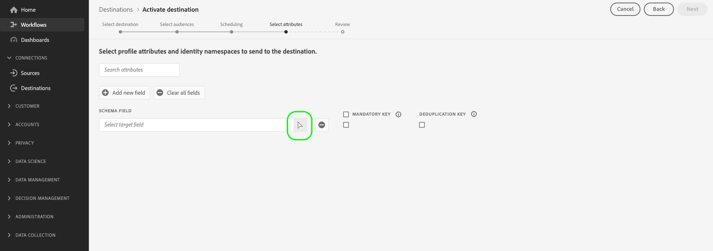

# Activer les données d’audience vers des destinations d’exportation de profils par lots

>[!IMPORTANT]
> 
>Pour activer les données, vous avez besoin des [autorisations de contrôle d’accès](/help/access-control/home.md#permissions) pour les fonctions **[!UICONTROL Gérer les destinations]**, **[!UICONTROL Activer les destinations]**, **[!UICONTROL Afficher les profils]**, et **[!UICONTROL Afficher les segments]**. Lisez la [présentation du contrôle d’accès](/help/access-control/ui/overview.md) ou contactez votre administrateur de produit pour obtenir les autorisations requises.
>
>Certains clients participant au programme bêta amélioré de la fonctionnalité d’exportation de fichiers voient le nouveau **[!UICONTROL Mappage]** dans le cadre de leur workflow d’activation à la fonction [nouvelles destinations de stockage dans le cloud bêta](/help/release-notes/2022/october-2022.md#destinations). Veuillez également noter que [limites connues](#known-limitations) dans le cadre de la version.

## Présentation {#overview}

Cet article explique le processus requis pour activer des données d’audience dans des destinations de profils par lots d’Adobe Experience Platform, telles que l’espace de stockage dans le cloud et les destinations de marketing par e-mail.

## Conditions préalables {#prerequisites}

Pour activer des données vers des destinations, vous devez avoir réussi à vous [connecter à une destination](./connect-destination.md). Si vous ne l’avez pas déjà fait, accédez au [catalogue de destinations](../catalog/overview.md), parcourez les destinations prises en charge et configurez la destination que vous souhaitez utiliser.

## Sélectionnez votre destination {#select-destination}

1. Accédez à **[!UICONTROL Connexions et destinations]**, puis sélectionnez l’onglet **[!UICONTROL Catalogue]**.

   

1. Sélectionnez **[!UICONTROL Activer des segments]** sur la vignette correspondant à la destination vers laquelle vous souhaitez activer des segments, tel qu’indiqué sur l’image ci-dessous.

   

1. Sélectionnez la connexion de destination à utiliser pour activer des segments, puis sélectionner **[!UICONTROL Suivant]**.

   

1. Accédez à la section suivante pour [sélectionner des segments](#select-segments).

## Sélectionnez vos segments {#select-segments}

Utilisez les cases à cocher situées à gauche des noms de segment pour sélectionner les segments que vous souhaitez activer vers la destination, puis sélectionnez **[!UICONTROL Suivant]**.


## Planifier l’exportation de segments {#scheduling}

>[!CONTEXTUALHELP]
>id="platform_destinations_activate_schedule"
>title="Planning"
>abstract="Utilisez l’icône en forme de crayon pour définir le type d’export de fichier (fichiers complets ou incrémentiels) et la fréquence d’export."

[!DNL Adobe Experience Platform] exporte des données pour les destinations de marketing par e-mail et d’espace de stockage dans le cloud sous forme de fichiers [!DNL CSV]. Sur la page **[!UICONTROL Planification]**, vous pouvez configurer le planning et les noms des fichiers pour chaque segment que vous exportez. La configuration du planning est obligatoire, mais la configuration du nom de fichier est facultative.

>[!IMPORTANT]
> 
>[!DNL Adobe Experience Platform] divise automatiquement les fichiers d’exportation à 5 millions d’enregistrements (lignes) par fichier. Chaque ligne représente un profil.
>
>Les noms des fichiers fractionnés sont ajoutés avec un nombre indiquant que le fichier fait partie d’une exportation plus importante, comme : `filename.csv`, `filename_2.csv`, `filename_3.csv`.

Sélectionnez le bouton **[!UICONTROL Créer un planning]** correspondant au segment que vous souhaitez envoyer à votre destination.


### Exporter des fichiers complets {#export-full-files}

>[!CONTEXTUALHELP]
>id="platform_destinations_activate_exportoptions"
>title="Options d’exportation de fichiers"
>abstract="Sélectionnez **Exporter des fichiers complets** pour exporter un cliché instantané complet de tous les profils qui remplissent les critères pour le segment. Sélectionnez **Exporter des fichiers incrémentiels** pour n’exporter que les profils qui remplissent les critères pour le segment depuis la dernière exportation. <br> La première exportation de fichier incrémentielle comprend tous les profils qui remplissent les critères pour le segment, agissant comme un renvoi. Les futurs fichiers incrémentiels incluent uniquement les profils qui remplissent les critères pour le segment depuis la première exportation de fichier incrémentiel."
>additional-url="https://experienceleague.adobe.com/docs/experience-platform/destinations/ui/activate/activate-batch-profile-destinations.html#export-incremental-files" text="Exporter des fichiers incrémentiels"

>[!CONTEXTUALHELP]
>id="platform_destinations_activationchaining_aftersegmentevaluation"
>title="Activer après l’évaluation des segments"
>abstract="L’activation s’exécute immédiatement une fois la tâche de segmentation quotidienne terminée. Ainsi, les profils les plus récents sont exportés."

>[!CONTEXTUALHELP]
>id="platform_destinations_activationchaining_scheduled"
>title="Activation planifiée"
>abstract="L’activation s’exécute à une heure fixe de la journée."

Sélectionnez **[!UICONTROL Exporter des fichiers complets]** pour exporter un fichier contenant un cliché instantané complet de toutes les qualifications de profil pour le segment sélectionné.


1. Utilisez le sélecteur **[!UICONTROL Fréquence]** pour sélectionner la fréquence d’exportation :

   * **[!UICONTROL Une fois]** : planifiez une exportation de fichiers complets sur demande unique.
   * **[!UICONTROL Tous les jours]** : planifiez des exportations de fichiers complets une fois par jour, tous les jours, au moment choisi.

1. Utilisez la variable **[!UICONTROL Heure]** bascule pour sélectionner si l’exportation doit avoir lieu immédiatement après l’évaluation du segment ou sur une base planifiée, à une heure donnée. Lorsque vous sélectionnez la variable **[!UICONTROL Planifié]** , vous pouvez utiliser le sélecteur pour choisir l’heure, dans [!DNL UTC] format, date à laquelle l’exportation doit avoir lieu.

   >[!NOTE]
   >
   >Le **[!UICONTROL Après l’évaluation du segment]** L’option décrite ci-dessous est actuellement disponible uniquement pour sélectionner les clients bêta.

   Utilisez la variable **[!UICONTROL Après l’évaluation du segment]** pour que la tâche d’activation s’exécute immédiatement après la fin de la tâche de segmentation par lots quotidienne de Platform. Ainsi, lorsque la tâche d’activation s’exécute, les profils les plus récents sont exportés vers votre destination.

   <!-- Batch segmentation currently runs at {{insert time of day}} and lasts for an average {{x hours}}. Adobe reserves the right to modify this schedule. -->

   
Utilisez la variable **[!UICONTROL Planifié]** pour que la tâche d’activation s’exécute à un moment donné. Cela garantit que les données de profil Experience Platform sont exportées simultanément chaque jour, mais les profils que vous exportez peuvent ne pas être les plus à jour, selon que la tâche de segmentation par lots est terminée ou non avant le lancement de la tâche d’activation.

   

   >[!IMPORTANT]
   >
   >De par la configuration des processus Experience Platform internes, la première exportation de fichier incrémentiel ou complet peut ne pas contenir toutes les données de renvoi. <br> <br> Pour garantir une exportation complète et à jour des données de renvoi pour les fichiers complets et incrémentiels, Adobe recommande de définir l’heure d’exportation du premier fichier après 12h GMT du jour suivant. Cette limitation sera corrigée dans les prochaines versions.

1. Utilisez le sélecteur **[!UICONTROL Date]** pour choisir le jour ou l’intervalle d’exportation. Pour les exportations quotidiennes, il est recommandé de définir les dates de début et de fin de sorte qu’elles correspondent à la durée de vos campagnes sur vos plateformes en aval.

   >[!IMPORTANT]
   >
   > Lors de la sélection d’un intervalle d’exportation, le dernier jour de l’intervalle n’est pas inclus dans les exportations. Par exemple, si vous sélectionnez un intervalle entre le 4 et le 11 janvier, la dernière exportation de fichier aura lieu le 10 janvier.

1. Sélectionnez **[!UICONTROL Créer]** pour enregistrer le planning.

### Exporter des fichiers incrémentiels {#export-incremental-files}

Sélectionnez **[!UICONTROL Exporter des fichiers incrémentiels]** pour une exportation où le premier fichier est un cliché instantané complet de toutes les qualifications de profil pour le segment sélectionné, et les fichiers suivants sont des qualifications de profil incrémentielles depuis l’exportation précédente.

>[!IMPORTANT]
>
>Le premier fichier incrémentiel exporté comprend tous les profils qui remplissent les critères d’un segment, agissant comme un renvoi.


1. Utilisez le sélecteur **[!UICONTROL Fréquence]** pour sélectionner la fréquence d’exportation :

   * **[!UICONTROL Tous les jours]** : planification d’exportations de fichiers incrémentiels une fois par jour, tous les jours, au moment choisi.
   * **[!UICONTROL Par heure]** : planification d’exportations de fichiers incrémentiels toutes les 3, 6, 8 ou 12 heures.

1. Utilisez le sélecteur **[!UICONTROL Heure]** pour choisir l’heure de la journée, au format [!DNL UTC], à laquelle l’exportation doit avoir lieu.

   >[!IMPORTANT]
   >
   >De par la configuration des processus Experience Platform internes, la première exportation de fichier incrémentiel ou complet peut ne pas contenir toutes les données de renvoi. <br> <br> Pour garantir une exportation complète et à jour des données de renvoi pour les fichiers complets et incrémentiels, Adobe recommande de définir l’heure d’exportation du premier fichier après 12h GMT du jour suivant. Cette limitation sera corrigée dans les prochaines versions.

1. Utilisez le sélecteur **[!UICONTROL Date]** pour choisir l’intervalle à partir duquel l’exportation doit avoir lieu. La bonne pratique consiste à définir les dates de début et de fin de sorte qu’elles correspondent à la durée de vos campagnes sur vos plateformes en aval.

   >[!IMPORTANT]
   >
   >Le dernier jour de l’intervalle n’est pas inclus dans les exportations. Par exemple, si vous sélectionnez un intervalle entre le 4 et le 11 janvier, la dernière exportation de fichier aura lieu le 10 janvier.

1. Sélectionnez **[!UICONTROL Créer]** pour enregistrer le planning.

### Configurer les noms de fichiers {#file-names}

>[!CONTEXTUALHELP]
>id="platform_destinations_activate_filename"
>title="Configurer le nom d’un fichier"
>abstract="Pour les destinations basées sur des fichiers, un nom de fichier unique est généré par segment. Utilisez l’éditeur de nom de fichier pour créer et modifier un nom de fichier unique ou conserver le nom par défaut."

Pour la plupart des destinations, les noms de fichier par défaut se composent du nom de destination, de l’identifiant de segment et d’un indicateur de date et d’heure. Vous pouvez, par exemple, modifier les noms des fichiers exportés afin de faire la distinction entre les différentes campagnes ou pour ajouter le temps d’exportation des données aux fichiers. Notez que certains développeurs de destinations peuvent choisir d’ajouter différentes options de nom de fichier par défaut pour leurs destinations.

Sélectionnez l’icône en forme de crayon pour ouvrir une fenêtre modale et modifier les noms des fichiers. Les noms de fichier sont limités à 255 caractères.

>[!NOTE]
>
>L’image ci-dessous montre comment les noms de fichiers peuvent être modifiés pour [!DNL Amazon S3] les destinations, mais le processus est identique pour toutes les destinations par lots (par exemple, SFTP, [!DNL Azure Blob Storage]ou [!DNL Google Cloud Storage]).


Dans l’éditeur de nom de fichier, vous pouvez sélectionner différents composants à ajouter au nom du fichier.


Le nom de destination et l’identifiant de segment ne peuvent pas être supprimés des noms de fichier. Vous pouvez en outre ajouter les éléments suivants :

| Option de nom de fichier | Description |
|---------|----------|
| **[!UICONTROL Nom du segment]** | Nom du segment exporté. |
| **[!UICONTROL Date et heure]** | Effectuez une sélection entre l’ajout d’une `MMDDYYYY_HHMMSS` format ou horodatage Unix à 10 chiffres de l’heure de génération des fichiers. Choisissez l’une de ces options si vous souhaitez que vos fichiers aient un nom de fichier dynamique généré avec chaque exportation de fichier incrémentiel. |
| **[!UICONTROL Texte personnalisé]** | Tout texte personnalisé que vous souhaitez ajouter aux noms de fichier. |
| **[!UICONTROL ID de destination]** | L’identifiant du flux de données de destination que vous utilisez pour exporter le segment. <br> **Remarque**: Cette option d’ajout de nom de fichier est disponible uniquement pour les clients bêta qui participent au programme bêta amélioré de fonctionnalité d’exportation de fichiers. Contactez votre représentant d’Adobe ou l’assistance clientèle si vous souhaitez accéder au programme bêta. |
| **[!UICONTROL Nom de la destination]** | Nom du flux de données de destination que vous utilisez pour exporter le segment. <br> **Remarque**: Cette option d’ajout de nom de fichier est disponible uniquement pour les clients bêta qui participent au programme bêta amélioré de fonctionnalité d’exportation de fichiers. Contactez votre représentant d’Adobe ou l’assistance clientèle si vous souhaitez accéder au programme bêta. |
| **[!UICONTROL Nom de l’organisation]** | Nom de votre organisation dans Experience Platform. <br> **Remarque**: Cette option d’ajout de nom de fichier est disponible uniquement pour les clients bêta qui participent au programme bêta amélioré de fonctionnalité d’exportation de fichiers. Contactez votre représentant d’Adobe ou l’assistance clientèle si vous souhaitez accéder au programme bêta. |
| **[!UICONTROL Nom du sandbox]** | L’identifiant de l’environnement de test que vous utilisez pour exporter le segment. <br> **Remarque**: Cette option d’ajout de nom de fichier est disponible uniquement pour les clients bêta qui participent au programme bêta amélioré de fonctionnalité d’exportation de fichiers. Contactez votre représentant d’Adobe ou l’assistance clientèle si vous souhaitez accéder au programme bêta. |

{style=&quot;table-layout:auto&quot;}

Sélectionnez **[!UICONTROL Appliquer les modifications]** pour confirmer votre sélection.

>[!IMPORTANT]
> 
>Si vous ne sélectionnez pas l’option **[!UICONTROL Date et heure]**, les noms de fichier seront statiques et le nouveau fichier exporté remplacera le fichier précédent de votre emplacement de stockage à chaque exportation. L’option recommandée consiste à exécuter une tâche d’importation récurrente depuis un emplacement de stockage vers une plateforme de marketing par e-mail.

Une fois tous les segments configurés, sélectionnez **[!UICONTROL Suivant]** pour continuer.

## Sélectionner des attributs de profil {#select-attributes}

Pour les destinations basées sur un profil, vous devez sélectionner les attributs de profil à envoyer à la destination cible.

1. Sur la page **[!UICONTROL Sélectionner des attributs]**, sélectionnez **[!UICONTROL Ajouter un nouveau champ]**.

   

1. Sélectionnez la flèche située à droite de l’entrée **[!UICONTROL Champ de schéma]**.

   

1. Sur la page **[!UICONTROL Sélectionner un champ]**, sélectionnez les attributs XDM à envoyer à la destination puis choisissez **[!UICONTROL Sélectionner]**.

   

1. Pour ajouter d’autres mappages, répétez les étapes 1 à 3.

>[!NOTE]
>
> Adobe Experience Platform préremplit votre sélection avec quatre attributs recommandés couramment utilisés de votre schéma : `person.name.firstName`, `person.name.lastName`, `personalEmail.address`, `segmentMembership.status`.

>[!IMPORTANT]
>
>En raison d’une limitation connue, vous ne pouvez actuellement pas utiliser la variable **[!UICONTROL Sélectionner un champ]** fenêtre à ajouter `segmentMembership.status` à vos exportations de fichiers. Vous devez plutôt coller manuellement la valeur. `xdm: segmentMembership.status` dans le champ de schéma, comme illustré ci-dessous.
>
>

Les exportations de fichiers varient comme suit, selon que `segmentMembership.status` est sélectionné :
* Si le champ `segmentMembership.status` est sélectionné, les fichiers exportés incluent les membres **[!UICONTROL actifs]** dans l’instantané complet initial ainsi que les membres **[!UICONTROL actifs]** et **[!UICONTROL expirés]** dans les exportations incrémentielles suivantes.
* Si le champ `segmentMembership.status` n’est pas sélectionné, les fichiers exportés incluent uniquement les membres **[!UICONTROL actifs]** dans l’instantané complet initial et dans les exportations incrémentielles suivantes.


### Attributs obligatoires {#mandatory-attributes}

>[!CONTEXTUALHELP]
>id="platform_destinations_activate_mandatorykey"
>title="À propos des attributs obligatoires"
>abstract="Sélectionnez les attributs de schéma XDM que tous les profils exportés doivent inclure. Les profils sans clé obligatoire ne sont pas exportés vers la destination. Si vous ne sélectionnez pas de clé obligatoire, tous les profils qualifiés sont exportés, quels que soient leurs attributs."

Un attribut obligatoire est une case à cocher activée par l’utilisateur qui garantit que tous les enregistrements de profil contiennent l’attribut sélectionné. Par exemple : tous les profils exportés contiennent une adresse e-mail.

Vous pouvez marquer les attributs comme étant obligatoires afin de vous assurer que [!DNL Platform] exporte uniquement les profils qui incluent l’attribut spécifique. Par conséquent, cette action peut être utilisée comme une forme supplémentaire de filtrage. Le marquage d’un attribut comme étant obligatoire **n’est pas** requis.

Si vous ne sélectionnez pas d’attribut obligatoire, tous les profils qualifiés sont exportés, quels que soient leurs attributs.

Il est recommandé que l’un des attributs soit un [identifiant unique](../../destinations/catalog/email-marketing/overview.md#identity) de votre schéma. Pour plus d’informations sur les attributs obligatoires, consultez la section Identité dans la documentation [Destinations de marketing par e-mail](../../destinations/catalog/email-marketing/overview.md#identity).

### Clés de déduplication {#deduplication-keys}

>[!CONTEXTUALHELP]
>id="platform_destinations_activate_deduplicationkey"
>title="À propos des clés de déduplication"
>abstract="Éliminez plusieurs occurrences du même profil dans les fichiers dʼexportation en sélectionnant une clé de déduplication. Sélectionnez un seul espace de noms ou jusquʼà deux attributs de schéma XDM comme clé de déduplication. Si vous ne sélectionnez pas de clé de déduplication, il se peut que des entrées de profil soient dupliquées dans les fichiers d’exportation."

Une clé de déduplication est une clé primaire définie par l’utilisateur qui détermine l’identité par laquelle les utilisateurs souhaitent dédupliquer leurs profils.

Les clés de déduplication empêchent dʼavoir plusieurs enregistrements du même profil dans un fichier dʼexportation.

Vous pouvez utiliser les clés de déduplication de trois manières différentes dans :[!DNL Platform]

* Utiliser un espace de noms d’identité unique comme [!UICONTROL clé de déduplication]
* Utiliser un attribut de profil unique à partir d’un profil [!DNL XDM] comme [!UICONTROL clé de déduplication]
* Utiliser une combinaison de deux attributs de profil à partir d’un profil [!DNL XDM] en tant que clé composite

>[!IMPORTANT]
>
> Vous pouvez exporter un espace de noms d’identité unique vers une destination, l’espace de noms étant alors automatiquement défini comme clé de déduplication. L’envoi de plusieurs espaces de noms vers une destination n’est pas pris en charge.
> 
> Vous ne pouvez pas utiliser une combinaison d’espaces de noms d’identité et d’attributs de profil comme clés de déduplication.

### Exemple de déduplication {#deduplication-example}

Cet exemple illustre le fonctionnement de la déduplication, en fonction des clés de déduplication sélectionnées.

Examinons les deux profils suivants.

**Profil A**

```json
{
  "identityMap": {
    "Email": [
      {
        "id": "johndoe_1@example.com"
      },
      {
        "id": "johndoe_2@example.com"
      }
    ]
  },
  "segmentMembership": {
    "ups": {
      "fa5c4622-6847-4199-8dd4-8b7c7c7ed1d6": {
        "status": "existing",
        "lastQualificationTime": "2021-03-10 10:03:08"
      }
    }
  },
  "person": {
    "name": {
      "lastName": "Doe",
      "firstName": "John"
    }
  },
  "personalEmail": {
    "address": "johndoe@example.com"
  }
}
```

**Profil B**

```json
{
  "identityMap": {
    "Email": [
      {
        "id": "johndoe_1@example.com"
      },
      {
        "id": "johndoe_2@example.com"
      }
    ]
  },
  "segmentMembership": {
    "ups": {
      "fa5c4622-6847-4199-8dd4-8b7c7c7ed1d6": {
        "status": "existing",
        "lastQualificationTime": "2021-04-10 11:33:28"
      }
    }
  },
  "person": {
    "name": {
      "lastName": "D",
      "firstName": "John"
    }
  },
  "personalEmail": {
    "address": "johndoe@example.com"
  }
}
```

### Cas d’utilisation 1 de la déduplication : pas de déduplication {#deduplication-use-case-1}

Sans déduplication, le fichier d’exportation contiendrait les entrées suivantes.

| E-mail personnel | Prénom | Nom |
|---|---|---|
| johndoe@example.com | John | Doe |
| johndoe@example.com | John | D |


### Cas d’utilisation 2 de la déduplication : déduplication basée sur l’espace de noms d’identité {#deduplication-use-case-2}

En supposant une déduplication par l’espace de noms [!DNL Email], le fichier d’exportation contiendra les entrées suivantes. Le profil B est le dernier ayant rempli les critères pour le segment et est donc le seul à être exporté.

| Adresse e-mail* | E-mail personnel | Prénom | Nom |
|---|---|---|---|
| johndoe_1@example.com | johndoe@example.com | John | D |
| johndoe_2@example.com | johndoe@example.com | John | D |

### Cas d’utilisation 3 de la déduplication : déduplication basée sur un attribut de profil unique {#deduplication-use-case-3}

En supposant une déduplication par l’attribut `personal Email`, le fichier d’exportation contiendra l’entrée suivante. Le profil B est le dernier ayant rempli les critères pour le segment et est donc le seul à être exporté.

| E-mail personnel* | Prénom | Nom |
|---|---|---|
| johndoe@example.com | John | D |


### Cas d’utilisation 4 de la déduplication : déduplication basée sur deux attributs de profil {#deduplication-use-case-4}

En supposant une déduplication par la clé composite `personalEmail + lastName`, le fichier d’exportation contiendra les entrées suivantes.

| E-mail personnel* | Nom* | Prénom |
|---|---|---|
| johndoe@example.com | D | John |
| johndoe@example.com | Doe | John |


Adobe recommande de sélectionner un espace de noms d’identité, tel qu’un [!DNL CRM ID] ou une adresse e-mail comme clé de déduplication, pour s’assurer que tous les enregistrements de profil sont identifiés de manière unique.

>[!NOTE]
> 
>Si des libellés d’utilisation des données ont été appliqués à certains champs d’un jeu de données (plutôt qu’à l’ensemble du jeu), l’application de ces libellés au niveau du champ sur l’activation se fait dans les conditions suivantes :
>
>* Les champs sont utilisés dans la définition de segment.
>* Les champs sont configurés en tant qu’attributs prévisionnels pour la destination cible.
>
> Par exemple, si le champ `person.name.firstName` comporte certains libellés d’utilisation des données entrant en conflit avec l’action marketing de la destination, une violation de la stratégie d’utilisation des données s’afficherait dans l’étape de révision. Pour plus d’informations, voir [Gouvernance des données dans Adobe Experience Platform](../../rtcdp/privacy/data-governance-overview.md#destinations).

## (Version bêta) Mappage {#mapping}

>[!IMPORTANT]
> 
>Certains clients bêta peuvent afficher une **[!UICONTROL Mappage]** qui remplace l’étape [Sélection des attributs de profil](#select-attributes) étape décrite plus haut. Cette nouvelle **[!UICONTROL Mappage]** vous permet de modifier les en-têtes des fichiers exportés vers les noms personnalisés de votre choix.
> 
> La fonctionnalité et la documentation peuvent être modifiées. Contactez votre représentant d’Adobe ou l’assistance clientèle si vous souhaitez accéder à ce programme bêta.

Au cours de cette étape, vous devez sélectionner les attributs de profil à ajouter aux fichiers exportés vers la destination cible. Pour sélectionner les attributs de profil et les identités à exporter :

1. Dans le **[!UICONTROL Mappage]** page, sélectionnez **[!UICONTROL Ajouter un nouveau champ]**.

   

1. Sélectionnez la flèche située à droite du **[!UICONTROL Champ source]** entrée .

   

1. Dans le **[!UICONTROL Sélectionner le champ source]** , sélectionnez les attributs de profil et les identités à inclure dans les fichiers exportés vers la destination, puis choisissez **[!UICONTROL Sélectionner]**.

   >[!TIP]
   > 
   >Vous pouvez utiliser le champ de recherche pour affiner votre sélection, comme illustré dans l’image ci-dessous.

   


1. Le champ que vous avez sélectionné pour l’exportation apparaît désormais dans la vue de mappage. Si vous le souhaitez, vous pouvez modifier le nom de l&#39;en-tête dans le fichier exporté. Pour cela, sélectionnez l&#39;icône dans le champ cible.

   

1. Dans le **[!UICONTROL Sélectionner le champ cible]** , saisissez le nom souhaité de l’en-tête dans le fichier exporté, puis choisissez **[!UICONTROL Sélectionner]**.

   

1. Le champ que vous avez sélectionné pour l’exportation apparaît désormais dans la vue de mappage et affiche l’en-tête modifié dans le fichier exporté.

   

1. (Facultatif) Vous pouvez sélectionner le champ exporté en tant que [clé obligatoire](#mandatory-keys) ou [clé de déduplication](#deduplication-keys).

   

1. Pour ajouter d’autres champs à exporter, répétez les étapes ci-dessus.

### Limites connues {#known-limitations}

La nouvelle **[!UICONTROL Mappage]** présente les limites connues suivantes :

#### L’attribut d’appartenance au segment ne peut pas être sélectionné par le biais du workflow de mappage.

En raison d’une limitation connue, vous ne pouvez actuellement pas utiliser la variable **[!UICONTROL Sélectionner un champ]** fenêtre à ajouter `segmentMembership.status` à vos exportations de fichiers. Vous devez plutôt coller manuellement la valeur. `xdm: segmentMembership.status` dans le champ de schéma, comme illustré ci-dessous.


Les exportations de fichiers varient comme suit, selon que `segmentMembership.status` est sélectionné :
* Si le champ `segmentMembership.status` est sélectionné, les fichiers exportés incluent les membres **[!UICONTROL actifs]** dans l’instantané complet initial ainsi que les membres **[!UICONTROL actifs]** et **[!UICONTROL expirés]** dans les exportations incrémentielles suivantes.
* Si le champ `segmentMembership.status` n’est pas sélectionné, les fichiers exportés incluent uniquement les membres **[!UICONTROL actifs]** dans l’instantané complet initial et dans les exportations incrémentielles suivantes.

#### Les espaces de noms d’identité ne peuvent actuellement pas être sélectionnés pour les exportations.

La sélection des espaces de noms d’identité à exporter, comme illustré dans l’image ci-dessous, n’est actuellement pas prise en charge. La sélection des espaces de noms d’identité à exporter entraîne une erreur dans la variable **[!UICONTROL Réviser]** étape .


En tant que solution temporaire, si vous devez ajouter des espaces de noms d’identité aux fichiers exportés au cours de la version bêta, vous pouvez effectuer l’une des opérations suivantes :
* Utilisez les destinations de stockage dans le cloud héritées pour les flux de données dans lesquels vous souhaitez inclure des espaces de noms d’identité dans les exportations.
* Chargez les identités en tant qu’attributs dans Experience Platform, puis exportez-les vers vos destinations de stockage dans le cloud.

## Révision {#review}

Sur la page **[!UICONTROL Vérifier]**, vous pouvez voir un résumé de votre sélection. Sélectionnez **[!UICONTROL Annuler]** pour interrompre le flux, **[!UICONTROL Précédent]** pour modifier vos paramètres ou **[!UICONTROL Terminer]** pour confirmer votre sélection et commencer à envoyer les données à la destination.

>[!IMPORTANT]
>
>Au cours de cette étape, Adobe Experience Platform recherche les violations de la stratégie d’utilisation des données. Vous trouverez ci-dessous un exemple de violation de la stratégie. Vous ne pouvez pas terminer le processus d’activation des segments tant que vous n’avez pas résolu la violation. Pour plus d’informations sur la résolution des violations de stratégie, voir [Application des stratégies](../../rtcdp/privacy/data-governance-overview.md#enforcement) dans la section documentation sur la gouvernance des données.


Si aucune violation de stratégie n’a été détectée, sélectionnez **[!UICONTROL Terminer]** pour confirmer la sélection et commencer à envoyer des données à la destination.


## Vérifier l’activation des segments {#verify}

Pour les destinations de marketing par e-mail et celles de stockage dans le cloud, Adobe Experience Platform crée un fichier `.csv` dans l’emplacement de stockage indiqué. Attendez-vous à ce qu’un nouveau fichier soit créé dans votre emplacement de stockage selon le planning défini dans le workflow. Le format de fichier par défaut est :
`<destinationName>_segment<segmentID>_<timestamp-yyyymmddhhmmss>.csv`

Par exemple, si vous avez sélectionné une fréquence d’exportation quotidienne, les fichiers que vous recevrez pendant trois jours consécutifs peuvent ressembler à ceci :

```console
Salesforce_Marketing_Cloud_segment12341e18-abcd-49c2-836d-123c88e76c39_20200408061804.csv
Salesforce_Marketing_Cloud_segment12341e18-abcd-49c2-836d-123c88e76c39_20200409052200.csv
Salesforce_Marketing_Cloud_segment12341e18-abcd-49c2-836d-123c88e76c39_20200410061130.csv
```

La présence de ces fichiers dans votre emplacement de stockage est la confirmation de la réussite de l’activation. Pour comprendre la structure des fichiers exportés, vous pouvez [télécharger un exemple de fichier .csv](../assets/common/sample_export_file_segment12341e18-abcd-49c2-836d-123c88e76c39_20200408061804.csv). Cet exemple de fichier comprend les attributs de profil `person.firstname`, `person.lastname`, `person.gender`, `person.birthyear` et `personalEmail.address`.
