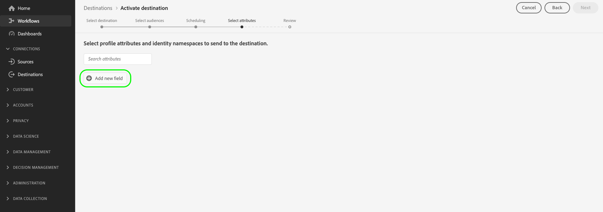

# Activer les audiences vers des destinations d’export de profils par lots

>[!IMPORTANT]
> 
>* Pour activer les audiences et activer l’[étape de mappage](#mapping) du workflow, vous avez besoin des autorisations de contrôle d’accès **[!UICONTROL View Destinations]**, **[!UICONTROL Activate Destinations]**, **[!UICONTROL View Profiles]** et **[!UICONTROL View Segments]** [](/help/access-control/home.md#permissions).
>* Pour activer les audiences sans passer par l’étape [mappage](#mapping) du workflow, vous avez besoin des autorisations de contrôle d’accès **[!UICONTROL View Destinations]**, **[!UICONTROL Activate Segment without Mapping]**, **[!UICONTROL View Profiles]** et **[!UICONTROL View Segments]** [](/help/access-control/home.md#permissions).
>* Pour exporter des *identités*, vous devez disposer de l’autorisation de contrôle d’accès **[!UICONTROL View Identity Graph]**[](/help/access-control/home.md#permissions). <br> {width="100" zoomable="yes"}
> 
> Lisez la [présentation du contrôle d’accès](/help/access-control/ui/overview.md) ou contactez votre administrateur de produit pour obtenir les autorisations requises.

## Vue d’ensemble {#overview}

Cet article explique le processus requis pour activer des audiences dans Adobe Experience Platform vers des destinations basées sur des fichiers de profils par lots, telles que l’espace de stockage dans le cloud et les destinations de marketing par e-mail.

## Conditions préalables {#prerequisites}

Pour activer des audiences vers des destinations, vous devez avoir réussi à vous [connecter à une destination](./connect-destination.md). Si vous ne l’avez pas déjà fait, accédez au [catalogue de destinations](../catalog/overview.md), parcourez les destinations prises en charge et configurez la destination que vous souhaitez utiliser.

## Formats de fichiers pris en charge pour l’export {#supported-file-formats-export}

Les formats de fichiers suivants sont pris en charge lors de l’exportation d’audiences :

* CSV
* JSON
* Parquet

Notez que l’exportation de fichiers CSV vous offre une plus grande flexibilité en termes de structure des fichiers exportés. En savoir plus sur [configuration du formatage des fichiers CSV](/help/destinations/ui/batch-destinations-file-formatting-options.md#file-configuration).

Sélectionnez le format de fichier que vous souhaitez exporter lors de la [création d’une connexion à la destination basée sur des fichiers](/help/destinations/ui/connect-destination.md).

## Sélectionner votre destination {#select-destination}

1. Accédez à **[!UICONTROL Connections > Destinations]**, puis sélectionnez l’onglet **[!UICONTROL Catalog]** .

   

1. Sélectionnez **[!UICONTROL Activate audiences]** sur la vignette correspondant à la destination vers laquelle vous souhaitez activer vos audiences, comme illustré dans l’image ci-dessous.

   

1. Sélectionnez la connexion de destination à utiliser pour activer des audiences, puis sélectionnez **[!UICONTROL Next]**.

   

1. Accédez à la section suivante pour [sélectionner vos audiences](#select-audiences).

## Sélectionner vos audiences {#select-audiences}

Pour sélectionner les audiences à activer vers la destination, utilisez les cases à cocher situées à gauche des noms d’audience, puis sélectionnez **[!UICONTROL Next]**.

Vous pouvez effectuer un choix parmi plusieurs types d’audiences, selon leur origine :

* **[!UICONTROL Segmentation Service]** : audiences générées dans Experience Platform par Segmentation Service. Voir la [documentation sur la segmentation](../../segmentation/ui/overview.md) pour plus d’informations.
* **[!UICONTROL Custom upload]** : audiences générées en dehors d’Experience Platform et chargées dans Experience Platform au format CSV. Pour en savoir plus sur les audiences externes, consultez la documentation sur [importation d’une audience](../../segmentation/ui/audience-portal.md#import-audience). La sélection des audiences issues de **[!UICONTROL Custom uploads]** active automatiquement l’étape [ Sélectionner des attributs d’enrichissement ](#select-enrichment-attributes).
* Autres types d’audiences, provenant d’autres solutions Adobe, telles que [!DNL Audience Manager].

>[!IMPORTANT]
>
>Lors de l’activation d’audiences de chargement personnalisées vers des destinations basées sur des fichiers par lots, il existe une limite de 10 audiences de ce type que vous pouvez activer dans un flux de données.


>[!TIP]
>
>Pour supprimer des audiences des flux d’activation existants, utilisez la page **[!UICONTROL Activation data]** . Pour plus d’informations, consultez la section sur la [suppression de plusieurs audiences des flux d’activation](../ui/destination-details-page.md#bulk-remove).

## Planifier l’export d’audience {#scheduling}

>[!CONTEXTUALHELP]
>id="platform_destinations_activate_schedule"
>title="Planning"
>abstract="Utilisez l’icône en forme de crayon pour définir le type d’exportation de fichier (fichiers complets ou incrémentiels) et la fréquence d’exportation."

>[!CONTEXTUALHELP]
>id="platform_destinations_activate_schedule_weekly_messaging"
>title="Exports hebdomadaires"
>abstract="<sup>*</sup> Sélectionnez la date de début et les exports suivants auront lieu ce jour de la semaine jusqu’à la date de fin sélectionnée."

>[!CONTEXTUALHELP]
>id="platform_destinations_activate_schedule_monthly_messaging"
>title="Exports mensuels"
>abstract="<sup>*</sup> Sélectionnez la date de début et les exports suivants auront lieu à cette date du mois jusqu’à la date de fin sélectionnée. Pour les mois de moins de 30 ou 31 jours, l’export a lieu le dernier jour du mois."

[!DNL Adobe Experience Platform] exporte des données pour les destinations de marketing par e-mail et d’espace de stockage dans le cloud sous [différents types de fichiers](#supported-file-formats-export). Dans la page **[!UICONTROL Scheduling]** , vous pouvez configurer le planning et les noms des fichiers pour chaque audience que vous exportez.

Experience Platform définit automatiquement un planning par défaut pour chaque exportation de fichier. Vous pouvez modifier la planification par défaut en fonction de vos besoins, en cliquant sur l’icône en forme de crayon en regard de chaque planification et en définissant une planification personnalisée.


Pour modifier plusieurs plannings en même temps, sélectionnez les audiences à l’aide des cases à cocher situées sur le côté gauche de l’écran, puis sélectionnez **[!UICONTROL Edit schedule]**. Le planning que vous configurez sera ensuite appliqué à tous les fichiers exportés pour les audiences sélectionnées.


>[!TIP]
>
>Vous pouvez modifier les plannings d’activation d’audience pour les flux d’activation existants à partir de la page **[!UICONTROL Activation data]** . Pour plus d’informations, consultez la documentation sur la [modification en bloc des plannings d’activation](../ui/destination-details-page.md#bulk-edit-schedule).

>[!IMPORTANT]
>
>[!DNL Adobe Experience Platform] divise automatiquement les fichiers d’exportation à 5 millions d’enregistrements (lignes) par fichier. Chaque ligne représente un profil.
>
>Les noms de fichiers fractionnés sont ajoutés avec un nombre indiquant que le fichier fait partie d’une exportation plus importante, comme : `filename.csv`, `filename_2.csv`, `filename_3.csv`.

### Exporter des fichiers complets {#export-full-files}

>[!CONTEXTUALHELP]
>id="platform_destinations_activate_exportoptions"
>title="Options d’exportation de fichiers"
>abstract="Sélectionnez **Exporter des fichiers complets** pour exporter une capture instantanée complète de tous les profils qui remplissent les critères pour l’audience. Sélectionnez **Exporter des fichiers incrémentiels** pour n’exporter que les profils qui remplissent les critères pour l’audience depuis le dernier export. <br> Le premier export de fichier incrémentiel comprend tous les profils qui remplissent les critères pour l’audience, agissant comme un renvoi. Les futurs fichiers incrémentiels incluent uniquement les profils qui remplissent les critères pour l’audience depuis le premier export de fichier incrémentiel."
>additional-url="https://experienceleague.adobe.com/docs/experience-platform/destinations/ui/activate/activate-batch-profile-destinations.html?lang=fr#export-incremental-files" text="Exporter des fichiers incrémentiels"

>[!CONTEXTUALHELP]
>id="platform_destinations_activationchaining_aftersegmentevaluation"
>title="Activer après l’évaluation des audiences"
>abstract="<p>L’activation s’exécute immédiatement une fois la tâche de segmentation quotidienne terminée. Ainsi, les profils les plus à jour sont exportés.</p><p>L’option permettant d’exporter des profils après l’évaluation de l’audience n’est <i>pas</i> disponible pour les fréquences d’export hebdomadaire et mensuelle.</p>"

>[!CONTEXTUALHELP]
>id="platform_destinations_activationchaining_scheduled"
>title="Activation planifiée"
>abstract="L’activation s’exécute à une heure fixe de la journée."

Sélectionnez **[!UICONTROL Export full files]** pour exporter un fichier contenant un cliché instantané complet de toutes les qualifications de profil pour l’audience sélectionnée.


1. Utilisez le sélecteur **[!UICONTROL Frequency]** pour sélectionner la fréquence d’exportation :

   * **[!UICONTROL Once]** : planifier une exportation de fichiers complets sur demande unique.
   * **[!UICONTROL Daily]** : planifiez des exportations de fichiers complets une fois par jour, tous les jours, au moment choisi.
   * **[!UICONTROL Weekly]** : sélectionnez la date de début et les exportations suivantes auront lieu ce jour de la semaine jusqu’à la date de fin sélectionnée.
   * **[!UICONTROL Monthly]** : sélectionnez la date de début et les exportations suivantes auront lieu à cette date du mois jusqu’à la date de fin sélectionnée. Pour les mois de moins de 30 ou 31 jours, l’export a lieu le dernier jour du mois.

   >[!NOTE]
   >
   > Les options de planification hebdomadaire et mensuelle ne sont actuellement prises en charge que pour les destinations d’espace de stockage cloud basées sur des fichiers suivantes, et uniquement lors de l’activation des [audiences de personnes](../../segmentation/types/overview.md#people-audience) et [audiences de prospects](../../segmentation/types/overview.md#prospect-audience).
   > 
   > * [Amazon S3](../catalog/cloud-storage/amazon-s3.md)
   > * [Stockage Azure Blob](../catalog/cloud-storage/azure-blob.md)
   > * [Zone d’atterrissage des données](../catalog/cloud-storage/data-landing-zone.md)
   > * [Google Cloud Storage](../catalog/cloud-storage/google-cloud-storage.md)
   > * [SFTP](../catalog/cloud-storage/sftp.md)
   > 
   > Les options de planification hebdomadaire et mensuelle ne sont pas disponibles pour les autres types de destination.

2. Utilisez le bouton **[!UICONTROL Time]** pour sélectionner si l’exportation doit avoir lieu immédiatement après l’évaluation de l’audience ou sur une base planifiée, à une heure spécifiée. Lorsque vous sélectionnez l’option **[!UICONTROL Scheduled]** , vous pouvez utiliser le sélecteur pour choisir l’heure du jour à laquelle l’exportation doit avoir lieu, au format [!DNL UTC].

   Utilisez l’option **[!UICONTROL After segment evaluation]** pour que le traitement d’activation s’exécute immédiatement une fois le traitement quotidien de segmentation par lots d’Experience Platform terminé. Cette option garantit que lorsque la tâche d’activation s’exécute, les profils les plus récents sont exportés vers votre destination. Cela peut entraîner l’exportation d’une audience plusieurs fois par jour, en fonction de vos actions.

   >[!IMPORTANT]
   >
   >Si vous exécutez l’[évaluation des audiences flexibles](../../segmentation/ui/audience-portal.md#flexible-audience-evaluation) sur des audiences déjà configurées pour être activées après l’évaluation des segments, les audiences seront activées dès que la tâche d’évaluation d’audience flexible sera terminée, quelles que soient les tâches d’activation quotidiennes précédentes. Cela peut entraîner l’exportation d’audiences plusieurs fois par jour, en fonction de vos actions.

   <!-- Batch segmentation currently runs at {{insert time of day}} and lasts for an average {{x hours}}. Adobe reserves the right to modify this schedule. -->

   
Utilisez l’option **[!UICONTROL Scheduled]** pour que la tâche d’activation s’exécute à une heure fixe. Cette option permet de s’assurer que les données de profil Experience Platform sont exportées simultanément chaque jour. Cependant, les profils que vous exportez peuvent ne pas être les plus récents, selon que la tâche de segmentation par lots est terminée ou non avant le lancement de la tâche d’activation.

   

   Lors du mappage d’une audience créée au cours des dernières 24 heures et évaluée via la [segmentation par lots](../../segmentation/methods/batch-segmentation.md), définissez votre planning d’exportation quotidien pour démarrer le jour suivant au plus tôt. Cela garantit que la tâche d’évaluation par lots quotidienne s’exécute en premier et que vous exportez des données d’audience complètes.

   Lors de la configuration des plannings d’exportation, définissez l’heure de début au moins **1 heure** après avoir terminé le flux d’activation. Les activations d’audience peuvent prendre jusqu’à 1 heure pour se propager dans le système. Si vous planifiez une exportation pour qu’elle s’exécute moins d’une heure après l’activation, l’exportation planifiée peut être manquée.

3. Utilisez le sélecteur **[!UICONTROL Date]** pour choisir le jour ou l’intervalle d’exportation. Pour les exports quotidiens, il est recommandé de définir les dates de début et de fin de sorte qu’elles correspondent à la durée de vos campagnes sur vos plateformes en aval.

   >[!IMPORTANT]
   >
   > Lors de la sélection d’un intervalle d’exportation, le dernier jour de l’intervalle n’est pas inclus dans les exportations. Par exemple, si vous sélectionnez un intervalle entre le 4 et le 11 janvier, la dernière exportation de fichier aura lieu le 10 janvier.

4. Sélectionnez **[!UICONTROL Create]** pour enregistrer le planning.

### Exporter des fichiers incrémentiels

>[!CONTEXTUALHELP]
>id="platform_destinations_activate_something"
>title="Configurer le nom d’un fichier"
>abstract="Pour les destinations basées sur des fichiers, un nom de fichier unique est généré par audience. Utilisez l’éditeur de nom de fichier pour créer et modifier un nom de fichier unique ou conserver le nom par défaut."

Sélectionnez **[!UICONTROL Export incremental files]** pour déclencher une exportation où le premier fichier est un cliché instantané complet de toutes les qualifications de profil pour l’audience sélectionnée, et les fichiers suivants sont des qualifications de profil incrémentielles depuis l’exportation précédente.

>[!IMPORTANT]
>
>Le premier fichier incrémentiel exporté comprend tous les profils qui remplissent les critères d’une audience, agissant comme un renvoi.


1. Utilisez le sélecteur **[!UICONTROL Frequency]** pour sélectionner la fréquence d’exportation :

   * **[!UICONTROL Daily]** : planification d’exportations de fichiers incrémentiels une fois par jour, tous les jours, au moment choisi.
   * **[!UICONTROL Hourly]** : planification d’exportations de fichiers incrémentiels toutes les 3, 6, 8 ou 12 heures.


2. Utilisez le sélecteur **[!UICONTROL Time]** pour choisir l’heure de la journée à laquelle l’exportation doit avoir lieu, au format [!DNL UTC].

3. Utilisez le sélecteur **[!UICONTROL Date]** pour choisir l’intervalle à partir duquel l’exportation doit avoir lieu. La bonne pratique consiste à définir les dates de début et de fin de sorte qu’elles correspondent à la durée de vos campagnes sur vos plateformes en aval.

   >[!IMPORTANT]
   >
   >Le dernier jour de l’intervalle n’est pas inclus dans les exportations. Par exemple, si vous sélectionnez un intervalle entre le 4 et le 11 janvier, la dernière exportation de fichier aura lieu le 10 janvier.

4. Sélectionnez **[!UICONTROL Create]** pour enregistrer le planning.

### Configurer les noms de fichiers {#configure-file-names}

>[!CONTEXTUALHELP]
>id="platform_destinations_activate_filename"
>title="Configurer le nom d’un fichier"
>abstract="Pour les destinations basées sur des fichiers, un nom de fichier unique est généré par audience. Utilisez l’éditeur de nom de fichier pour créer et modifier un nom de fichier unique ou conserver le nom par défaut."

Pour la plupart des destinations, les noms de fichier par défaut se composent d’un nom de destination, d’un identifiant d’audience et d’un indicateur de date et d’heure. Vous pouvez, par exemple, modifier les noms des fichiers exportés afin de faire la distinction entre les différentes campagnes ou pour ajouter le temps d’exportation des données aux fichiers. Remarque : certains développeurs peuvent choisir d’ajouter différentes options de nom de fichier par défaut pour leurs destinations. 

Pour ouvrir une fenêtre modale et modifier les noms des fichiers, sélectionnez l’icône en forme de crayon. Les noms de fichier sont limités à 255 caractères.

>[!NOTE]
>
>L’image ci-dessous montre comment les noms de fichiers peuvent être modifiés pour les destinations [!DNL Amazon S3], mais le processus est identique pour toutes les destinations par lots (par exemple, SFTP, [!DNL Azure Blob Storage] ou [!DNL Google Cloud Storage]).


Dans l’éditeur de nom de fichier, vous pouvez sélectionner différents composants à ajouter au nom du fichier.


Le nom de destination et l’ID d’audience ne peuvent pas être supprimés des noms de fichier. Outre ces options, vous pouvez ajouter les options suivantes :

| Option de nom de fichier | Description |
|---------|----------|
| **[!UICONTROL Audience name]** | Nom de l’audience exportée. |
| **[!UICONTROL Date and time]** | Choisissez entre ajouter un format `MMDDYYYY_HHMMSS` ou un horodatage UNIX à 10 chiffres indiquant l’heure de génération des fichiers. Choisissez l’une de ces options si vous souhaitez que vos fichiers aient un nom de fichier dynamique généré avec chaque exportation de fichier incrémentiel. |
| **[!UICONTROL Custom text]** | Tout texte personnalisé que vous souhaitez ajouter aux noms de fichier. |
| **[!UICONTROL Destination ID]** | Identifiant du flux de données de destination que vous utilisez pour exporter l’audience. |
| **[!UICONTROL Destination name]** | Nom du flux de données de destination que vous utilisez pour exporter l’audience. |
| **[!UICONTROL Organization name]** | Nom de votre organisation dans Experience Platform. |
| **[!UICONTROL Sandbox name]** | Identifiant du sandbox que vous utilisez pour exporter l’audience. |

{style="table-layout:auto"}

Pour modifier plusieurs noms de fichier en même temps, sélectionnez les audiences à l’aide des cases à cocher situées sur le côté gauche de l’écran, puis sélectionnez **[!UICONTROL Edit file name]**. Les options de nom de fichier que vous configurez seront ensuite appliquées à tous les fichiers exportés pour les audiences sélectionnées.


Sélectionnez **[!UICONTROL Apply changes]** pour confirmer votre sélection.

>[!IMPORTANT]
> 
>Si vous ne sélectionnez pas le composant **[!UICONTROL Date and Time]**, les noms de fichier seront statiques et le nouveau fichier exporté remplacera le fichier précédent de votre emplacement de stockage à chaque exportation. L’option recommandée consiste à exécuter une tâche d’importation récurrente depuis un emplacement de stockage vers une plateforme de marketing par e-mail.

Une fois toutes les audiences configurées, sélectionnez **[!UICONTROL Next]** pour continuer.

## Mappage {#mapping}

Au cours de cette étape, vous devez sélectionner les attributs de profil à ajouter aux fichiers exportés vers la destination cible. Pour sélectionner les attributs de profil et les identités à exporter :

1. Dans la page **[!UICONTROL Mapping]**, sélectionnez **[!UICONTROL Add new mapping]**.

   

1. Sélectionnez la flèche située à droite de l’entrée **[!UICONTROL Source field]**.

   

1. Dans la page **[!UICONTROL Select source field]**, sélectionnez les attributs et les identités de profil à inclure dans les fichiers exportés vers la destination, puis choisissez **[!UICONTROL Select]**.

   >[!TIP]
   > 
   >Vous pouvez utiliser le champ de recherche pour affiner votre sélection, comme illustré dans l’image ci-dessous.

   Utilisez le bouton **[!UICONTROL Show only fields with data]** pour afficher uniquement les champs de schéma remplis de valeurs. Par défaut, seuls les champs de schéma renseignés s’affichent.

   

   Utilisez le bouton **[!UICONTROL Show display names for fields]** pour afficher les noms conviviaux des champs, au lieu des noms des champs de schéma.

   

1. Le champ que vous avez sélectionné pour l’exportation apparaît désormais dans la vue de mappage. Si vous le souhaitez, vous pouvez modifier le nom de l’en-tête dans le fichier exporté. Pour cela, sélectionnez l’icône dans le champ cible.

   >[!NOTE]
   >
   >Les points (`.`) ne sont pas pris en charge dans les noms de champ des fichiers exportés. Si un nom de champ contient des points (par exemple, `person.name.firstName`), chaque point est remplacé par un trait de soulignement (`_`) dans le nom de la colonne exportée. Par exemple, `person.name.firstName` sera `person_name_firstName` dans votre fichier exporté.

   

1. Dans la page **[!UICONTROL Select target field]**, saisissez le nom souhaité de l’en-tête dans le fichier exporté, puis choisissez **[!UICONTROL Select]**.

   

1. Le champ que vous avez sélectionné pour l’exportation apparaît désormais dans la vue de mappage et affiche l’en-tête modifié dans le fichier exporté.

   

1. (Facultatif) L’ordre des champs mappés dans l’interface utilisateur est reflété dans l’ordre des colonnes dans le fichier CSV exporté, du haut vers le bas, la ligne supérieure étant la colonne la plus à gauche du fichier CSV. Vous pouvez réorganiser les champs mappés comme vous le souhaitez, en faisant glisser et en déposant les lignes de mappage, comme illustré ci-dessous.

   >[!NOTE]
   >
   >Cette fonctionnalité est en version bêta et disponible uniquement pour certains clients et clientes. Pour demander l’accès à cette fonctionnalité, contactez votre représentant Adobe.

   

1. (Facultatif) Vous pouvez sélectionner le champ exporté en tant que [clé obligatoire](#mandatory-keys) ou [clé de déduplication](#deduplication-keys).

   

1. Pour ajouter d’autres champs à exporter, répétez les étapes ci-dessus.

### Attributs obligatoires {#mandatory-attributes}

>[!CONTEXTUALHELP]
>id="platform_destinations_activate_mandatorykey"
>title="À propos des attributs obligatoires"
>abstract="Sélectionnez les attributs de schéma XDM que tous les profils exportés doivent inclure. Les profils sans clé obligatoire ne sont pas exportés vers la destination. Si vous ne sélectionnez pas de clé obligatoire, tous les profils qualifiés sont exportés, quels que soient leurs attributs."

Un attribut obligatoire est une case à cocher activée par l’utilisateur qui garantit que tous les enregistrements de profil contiennent l’attribut sélectionné. Par exemple : tous les profils exportés contiennent une adresse e-mail.

Vous pouvez marquer les attributs comme étant obligatoires afin de vous assurer que [!DNL Experience Platform] exporte uniquement les profils qui incluent l’attribut spécifique. Par conséquent, cette action peut être utilisée comme une forme supplémentaire de filtrage. Le marquage d’un attribut comme étant obligatoire **n’est pas** requis.

Si vous ne sélectionnez pas d’attribut obligatoire, tous les profils qualifiés sont exportés, quels que soient leurs attributs.

Il est recommandé que l’un des attributs soit un [identifiant unique](../../destinations/catalog/email-marketing/overview.md#identity) de votre schéma. Pour plus d’informations sur les attributs obligatoires, consultez la section Identité dans la documentation [Destinations de marketing par e-mail](../../destinations/catalog/email-marketing/overview.md#identity).

### Clés de déduplication {#deduplication-keys}

>[!CONTEXTUALHELP]
>id="platform_destinations_activate_deduplicationkey"
>title="À propos des clés de déduplication"
>abstract="Éliminez plusieurs occurrences du même profil dans les fichiers dʼexportation en sélectionnant une clé de déduplication. Sélectionnez un seul espace de noms ou jusquʼà deux attributs de schéma XDM comme clé de déduplication. Si vous ne sélectionnez pas de clé de déduplication, il se peut que des entrées de profil soient dupliquées dans les fichiers d’exportation."

Une clé de déduplication est une clé primaire définie par l’utilisateur qui détermine l’identité par laquelle les utilisateurs souhaitent dédupliquer leurs profils.

Les clés de déduplication empêchent dʼavoir plusieurs enregistrements du même profil dans un fichier dʼexportation.

Vous pouvez utiliser les clés de déduplication de trois manières différentes dans :[!DNL Experience Platform]

* Utilisation d’un espace de noms d’identité unique en tant que [!UICONTROL deduplication key]
* Utilisation d’un attribut de profil unique à partir d’un profil [!DNL XDM] en tant que [!UICONTROL deduplication key]
* Utiliser une combinaison de deux attributs de profil à partir d’un profil [!DNL XDM] en tant que clé composite

>[!IMPORTANT]
>
> Vous pouvez exporter un espace de noms d’identité unique vers une destination, l’espace de noms étant alors automatiquement défini comme clé de déduplication. L’envoi de plusieurs espaces de noms vers une destination n’est pas pris en charge.
> 
> Vous ne pouvez pas utiliser une combinaison d’espaces de noms d’identité et d’attributs de profil comme clés de déduplication.

### Exemple de déduplication {#deduplication-example}

Cet exemple illustre le fonctionnement de la déduplication, en fonction des clés de déduplication sélectionnées.

Examinons les deux profils suivants.

**Profil A**

```json
{
  "identityMap": {
    "Email": [
      {
        "id": "johndoe@example.com"
      },
      {
        "id": "doejohn_1@example.com"
      }
    ]
  },
  "segmentMembership": {
    "ups": {
      "fa5c4622-6847-4199-8dd4-8b7c7c7ed1d6": {
        "status": "realized",
        "lastQualificationTime": "2021-03-10 10:03:08"
      }
    }
  },
  "person": {
    "name": {
      "lastName": "Doe",
      "firstName": "John"
    }
  },
  "personalEmail": {
    "address": "johndoe@example.com"
  }
}
```

**Profil B**

```json
{
  "identityMap": {
    "Email": [
      {
        "id": "johndoe@example.com"
      },
      {
        "id": "doejohn_2@example.com"
      }
    ]
  },
  "segmentMembership": {
    "ups": {
      "fa5c4622-6847-4199-8dd4-8b7c7c7ed1d6": {
        "status": "realized",
        "lastQualificationTime": "2021-04-10 11:33:28"
      }
    }
  },
  "person": {
    "name": {
      "lastName": "D",
      "firstName": "John"
    }
  },
  "personalEmail": {
    "address": "johndoe@example.com"
  }
}
```

### Cas d’utilisation 1 de la déduplication : pas de déduplication {#deduplication-use-case-1}

Sans déduplication, le fichier d’exportation contiendrait les entrées suivantes.

| E-mail personnel | Prénom | Nom |
|---|---|---|
| johndoe@example.com | John | Doe |
| johndoe@example.com | John | D |


### Cas d’utilisation 2 de la déduplication : déduplication basée sur l’espace de noms d’identité {#deduplication-use-case-2}

En supposant une déduplication par l’espace de noms [!DNL Email], le fichier d’exportation contiendra les entrées suivantes. Le profil B est le dernier ayant rempli les critères de l’audience. Il est donc le seul à être exporté.

| Adresse e-mail* | E-mail personnel | Prénom | Nom |
|---|---|---|---|
| johndoe@example.com | johndoe@example.com | John | D |
| doejohn_2@example.com | johndoe@example.com | John | D |

### Cas d’utilisation 3 de la déduplication : déduplication basée sur un attribut de profil unique {#deduplication-use-case-3}

En supposant une déduplication par l’attribut `personal Email`, le fichier d’exportation contiendra l’entrée suivante. Le profil B est le dernier ayant rempli les critères de l’audience. Il est donc le seul à être exporté.

| E-mail personnel* | Prénom | Nom |
|---|---|---|
| johndoe@example.com | John | D |


### Cas d’utilisation 4 de la déduplication : déduplication basée sur deux attributs de profil {#deduplication-use-case-4}

En supposant une déduplication par la clé composite `personalEmail + lastName`, le fichier d’exportation contiendra les entrées suivantes.

| E-mail personnel* | Nom* | Prénom |
|---|---|---|
| johndoe@example.com | D | John |
| johndoe@example.com | Doe | John |

Adobe recommande de sélectionner un espace de noms d’identité, tel qu’un [!DNL CRM ID] ou une adresse e-mail comme clé de déduplication, pour s’assurer que tous les enregistrements de profil sont identifiés de manière unique.

### Comportement de déduplication pour les profils ayant le même horodatage {#deduplication-same-timestamp}

Lors de l’export de profils vers des destinations basées sur des fichiers, la déduplication garantit qu’un seul profil est exporté lorsque plusieurs profils partagent la même clé de déduplication et le même horodatage de référence. Cet horodatage représente le moment où l’appartenance à l’audience ou le graphique d’identité d’un profil a été mis à jour pour la dernière fois. Pour plus d’informations sur la mise à jour et l’exportation des profils, consultez le document [comportement d’exportation des profils](https://experienceleague.adobe.com/en/docs/experience-platform/destinations/how-destinations-work/profile-export-behavior#what-determines-a-data-export-and-what-is-included-in-the-export-2).

#### Considérations principales

* **Sélection déterministe** : lorsque plusieurs profils ont des clés de déduplication identiques et la même date et heure de référence, la logique de déduplication détermine le profil à exporter en triant les valeurs d’autres colonnes sélectionnées (à l’exclusion des types complexes tels que les tableaux, les mappages ou les objets). Les valeurs triées sont évaluées dans l&#39;ordre lexicographique, et le premier profil est sélectionné.

* **Exemple de scénario**

Tenez compte des données suivantes, où la clé de déduplication est la colonne `Email` :

| Adresse e-mail* | first_name | nom_de_famille | date et heure |
|---|---|---|---|  
| `test1@test.com` | John | Morris | 2024-10-12T09:50 |
| `test1@test.com` | John | Doe | 2024-10-12T09:50 |
| `test2@test.com` | Frank | Smith | 2024-10-12T09:50 |

{style="table-layout:auto"}

Après déduplication, le fichier d&#39;export contiendra :

| Adresse e-mail* | first_name | nom_de_famille | date et heure |
|---|---|---|---|  
| `test1@test.com` | John | Doe | 2024-10-12T09:50 |
| `test2@test.com` | Frank | Smith | 2024-10-12T09:50 |

{style="table-layout:auto"}

**Explication** : par `test1@test.com`, les deux profils partagent la même clé de déduplication et le même horodatage. L’algorithme trie les valeurs des colonnes `first_name` et `last_name` de manière lexicographique. Puisque les prénoms sont identiques, l&#39;égalité est résolue en utilisant la colonne `last_name`, où « Doe » vient avant « Morris ».

**Fiabilité améliorée** : ce processus de déduplication mis à jour garantit que les exécutions successives avec les mêmes coordonnées produiront toujours les mêmes résultats, ce qui améliore la cohérence.

### Effectuer des transformations de données via des champs calculés {#calculated-fields}

Vous pouvez utiliser le contrôle [Champs calculés](/help/destinations/ui/data-transformations-calculated-fields.md) pour effectuer diverses transformations de données sur les données exportées vers des destinations basées sur des fichiers.

### Limites connues {#known-limitations}

La nouvelle page **[!UICONTROL Mapping]** présente les limites connues suivantes :

#### L’attribut d’appartenance à une audience ne peut pas être sélectionné par le biais du workflow de mappage

En raison d’une limitation connue, vous ne pouvez actuellement pas utiliser la fenêtre **[!UICONTROL Select field]** pour ajouter des `segmentMembership.seg_namespace.seg_id.status` à vos exportations de fichiers. Vous devez plutôt coller manuellement la valeur `xdm: segmentMembership.seg_namespace.seg_id.status` dans le champ de schéma, comme illustré ci-dessous.


>[!NOTE]
>
>Pour les destinations d’espace de stockage, les attributs suivants sont ajoutés par défaut au mappage :
>
>* `segmentMembership.seg_namespace.seg_id.status`
>* `segmentMembership.seg_namespace.seg_id.lastQualificationTime`

Les exportations de fichiers varient comme suit, selon que `segmentMembership.seg_namespace.seg_id.status` est sélectionné :

* Si le champ `segmentMembership.seg_namespace.seg_id.status` est sélectionné, les fichiers exportés incluent les membres **[!UICONTROL Active]** dans l’instantané complet initial et les membres nouvellement **[!UICONTROL Active]** et **[!UICONTROL Expired]** dans les exportations incrémentielles suivantes.
* Si le champ `segmentMembership.seg_namespace.seg_id.status` n’est pas sélectionné, les fichiers exportés incluent uniquement les membres **[!UICONTROL Active]** dans l’instantané complet initial et dans les exportations incrémentielles suivantes.

En savoir plus sur [le comportement d’exportation de profils pour les destinations basées sur des fichiers](/help/destinations/how-destinations-work/profile-export-behavior.md#file-based-destinations).

#### Les espaces de noms d’identité ne peuvent actuellement pas être sélectionnés pour les exportations.

La sélection des espaces de noms d’identité à exporter, comme illustrée dans l’image ci-dessous, n’est actuellement pas prise en charge. La sélection des espaces de noms d’identité à exporter entraîne une erreur dans l’étape de **[!UICONTROL Review]**.


En tant que solution temporaire, si vous devez ajouter des espaces de noms d’identité aux fichiers exportés au cours de la version Beta, vous pouvez effectuer l’une des opérations suivantes :

* Utiliser les destinations de stockage dans le cloud héritées pour les flux de données dans lesquels vous souhaitez inclure des espaces de noms d’identité dans les exportations.
* Charger les identités en tant qu’attributs dans Experience Platform, puis les exporter vers vos destinations de stockage dans le cloud.

## Sélectionner des attributs de profil {#select-attributes}

>[!IMPORTANT]
> 
>Toutes les destinations de stockage dans le cloud du catalogue peuvent afficher une étape de [[!UICONTROL Mapping] améliorée](#mapping) qui remplace l’étape **[!UICONTROL Select attributes]** décrite dans cette section.
>
>Cette étape **[!UICONTROL Select attributes]** s’affiche toujours pour les destinations de marketing par e-mail d’Adobe Campaign, d’Oracle Responsys, d’Oracle Eloqua et de Salesforce Marketing Cloud.

Pour les destinations basées sur un profil, vous devez sélectionner les attributs de profil à envoyer à la destination cible.

1. Dans la page **[!UICONTROL Select attributes]**, sélectionnez **[!UICONTROL Add new field]**.

   

2. Sélectionnez la flèche située à droite de l’entrée **[!UICONTROL Schema field]**.

   

3. Dans la page **[!UICONTROL Select field]**, sélectionnez les attributs XDM ou les espaces de noms d’identité à envoyer à la destination, puis choisissez **[!UICONTROL Select]**.

   

4. Pour ajouter d’autres mappages, répétez les étapes une à trois.

>[!NOTE]
>
> Adobe Experience Platform préremplit votre sélection avec quatre attributs recommandés couramment utilisés de votre schéma : `person.name.firstName`, `person.name.lastName`, `personalEmail.address`, `segmentMembership.seg_namespace.seg_id.status`.


>[!IMPORTANT]
>
>En raison d’une limitation connue, vous ne pouvez actuellement pas utiliser la fenêtre **[!UICONTROL Select field]** pour ajouter des `segmentMembership.seg_namespace.seg_id.status` à vos exportations de fichiers. Au lieu de cela, vous devez coller manuellement la valeur `xdm: segmentMembership.seg_namespace.seg_id.status` dans le champ de schéma, comme illustré ci-dessous.
>
>

Les exportations de fichiers varient comme suit, selon que `segmentMembership.seg_namespace.seg_id.status` est sélectionné :

* Si le champ `segmentMembership.seg_namespace.seg_id.status` est sélectionné, les fichiers exportés incluent les membres **[!UICONTROL Active]** dans l’instantané complet initial et les membres **[!UICONTROL Active]** et **[!UICONTROL Expired]** dans les exportations incrémentielles suivantes.
* Si le champ `segmentMembership.seg_namespace.seg_id.status` n’est pas sélectionné, les fichiers exportés incluent uniquement les membres **[!UICONTROL Active]** dans l’instantané complet initial et dans les exportations incrémentielles suivantes.

## Sélectionner les attributs d’enrichissement {#select-enrichment-attributes}

>[!CONTEXTUALHELP]
>id="platform_destinations_activate_exclude_enrichment_attributes"
>title="Exclure les attributs d’enrichissement"
>abstract="Activez cette option pour exporter les profils des audiences chargées personnalisées sélectionnées vers votre destination, tout en excluant leurs attributs."

>[!IMPORTANT]
>
>Cette étape ne s’affiche que si vous avez sélectionné des audiences **[!UICONTROL Custom upload]** lors de l’étape [sélection des audiences](#select-audiences).

Les attributs d’enrichissement correspondent aux audiences chargées personnalisées ingérées dans Experience Platform en tant que **[!UICONTROL Custom uploads]**. Au cours de cette étape, vous pouvez sélectionner les attributs à exporter vers votre destination, pour chaque audience externe sélectionnée.


Pour sélectionner des attributs d’enrichissement pour chaque audience externe, procédez comme suit :

1. Dans la colonne **[!UICONTROL Enrichment attributes]**, sélectionnez le bouton  (Modifier).
1. Sélectionnez **[!UICONTROL Add enrichment attribute]**. Un nouveau champ de schéma vide s’affiche.
   
1. Sélectionnez le bouton situé à droite du champ vide pour ouvrir l’écran de sélection des champs.
1. Sélectionnez les attributs que vous souhaitez exporter pour l’audience.
   
1. Après avoir ajouté tous les attributs à exporter, sélectionnez **[!UICONTROL Save and close]**.
1. Répétez ces étapes pour chaque audience externe.

Si vous souhaitez activer des audiences externes vers vos destinations sans exporter d’attribut, activez le bouton (bascule) **[!UICONTROL Exclude enrichment attributes]** . Cette option exporte les profils des audiences externes, mais aucun de leurs attributs correspondants n’est envoyé à votre destination.

.

Sélectionnez **[!UICONTROL Next]** pour passer à l’étape [Révision](#review).

## Réviser {#review}

>[!NOTE]
> 
>Si des libellés d’utilisation des données ont été appliqués à certains champs d’un jeu de données (plutôt qu’à l’ensemble du jeu), l’application de ces libellés au niveau du champ sur l’activation se fait dans les conditions suivantes :
>
>* Les champs sont utilisés dans la définition de l’audience.
>* Les champs sont configurés en tant qu’attributs prévisionnels pour la destination cible.
>
> Par exemple, si le champ `person.name.firstName` comporte certains libellés d’utilisation des données entrant en conflit avec l’action marketing de la destination, une violation de la politique d’utilisation des données s’afficherait dans l’étape de révision. Pour plus d’informations, voir [Gouvernance des données dans Adobe Experience Platform](../../rtcdp/privacy/data-governance-overview.md#destinations).

Sur la page **[!UICONTROL Review]**, vous pouvez voir un résumé de votre sélection. Sélectionnez **[!UICONTROL Cancel]** pour interrompre le flux, **[!UICONTROL Back]** pour modifier vos paramètres ou **[!UICONTROL Finish]** pour confirmer votre sélection et commencer à envoyer des données à la destination.


### Évaluation des politiques de consentement {#consent-policy-evaluation}

>[!CONTEXTUALHELP]
>id="platform_governance_policies_viewApplicableConsentPolicies"
>title="Affichage des politiques de consentement applicables"
>abstract="Si votre organisation a acheté **Adobe Healthcare Shield** ou **Adobe Privacy &amp; Security Shield**, sélectionnez **[!UICONTROL View applicable consent policies]** pour identifier les politiques de consentement appliquées et le nombre de profils inclus dans l’activation qui en résulte. Ce contrôle est désactivé si votre entreprise n&#39;a pas accès aux SKU mentionnés ci-dessus."

Si votre organisation a acheté **Adobe Healthcare Shield** ou **Adobe Privacy &amp; Security Shield**, sélectionnez **[!UICONTROL View applicable consent policies]** pour identifier les politiques de consentement appliquées et le nombre de profils inclus dans l’activation qui en résulte. Pour plus d’informations, consultez [ Évaluation des politiques de consentement ](/help/data-governance/enforcement/auto-enforcement.md#consent-policy-evaluation) .

### Vérifications des politiques d’utilisation des données {#data-usage-policy-checks}

À l’étape **[!UICONTROL Review]**, Experience Platform vérifie également les violations de la politique d’utilisation des données. Vous trouverez ci-dessous un exemple de violation de la politique. Vous ne pouvez pas terminer le workflow d’activation de l’audience tant que vous n’avez pas résolu la violation. Pour plus d’informations sur la résolution des violations de politique, consultez la section sur les violations de politique d’utilisation des données [data usage policy violations](/help/data-governance/enforcement/auto-enforcement.md#data-usage-violation) dans la documentation sur la gouvernance des données .


### Filtrer les audiences {#filter-audiences}

Au cours de cette étape également, vous pouvez utiliser les filtres disponibles sur la page pour afficher uniquement les audiences dont le planning ou le mappage a été mis à jour dans le cadre de ce workflow. Vous pouvez également activer/désactiver les colonnes du tableau à afficher.


Si vous êtes satisfait(e) de votre sélection et qu’aucune violation de politique n’a été détectée, sélectionnez **[!UICONTROL Finish]** pour confirmer votre sélection et commencer à envoyer des données à la destination.

## Vérifier l’activation de l’audience {#verify}

Lors de l’exportation d’audiences vers des destinations d’espace de stockage, Adobe Experience Platform crée un fichier `.csv`, `.json` ou `.parquet` à l’emplacement de stockage indiqué. Attendez-vous à ce qu’un nouveau fichier soit créé dans votre emplacement de stockage selon le planning défini dans le workflow. Le format de fichier par défaut est illustré ci-dessous, mais vous pouvez [modifier les composants du nom de fichier](#configure-file-names) :
`<destinationName>_segment<segmentID>_<timestamp-yyyymmddhhmmss>.csv`

Par exemple, si vous avez sélectionné une fréquence d’exportation quotidienne, les fichiers que vous recevrez pendant trois jours consécutifs peuvent ressembler à ceci :

```console
Salesforce_Marketing_Cloud_segment12341e18-abcd-49c2-836d-123c88e76c39_20200408061804.csv
Salesforce_Marketing_Cloud_segment12341e18-abcd-49c2-836d-123c88e76c39_20200409052200.csv
Salesforce_Marketing_Cloud_segment12341e18-abcd-49c2-836d-123c88e76c39_20200410061130.csv
```

La présence de ces fichiers dans votre emplacement de stockage est la confirmation de la réussite de l’activation. Pour comprendre la structure des fichiers exportés, vous pouvez [télécharger un exemple de fichier .csv](../assets/common/sample_export_file_segment12341e18-abcd-49c2-836d-123c88e76c39_20200408061804.csv). Cet exemple de fichier comprend les attributs de profil `person.firstname`, `person.lastname`, `person.gender`, `person.birthyear` et `personalEmail.address`.
