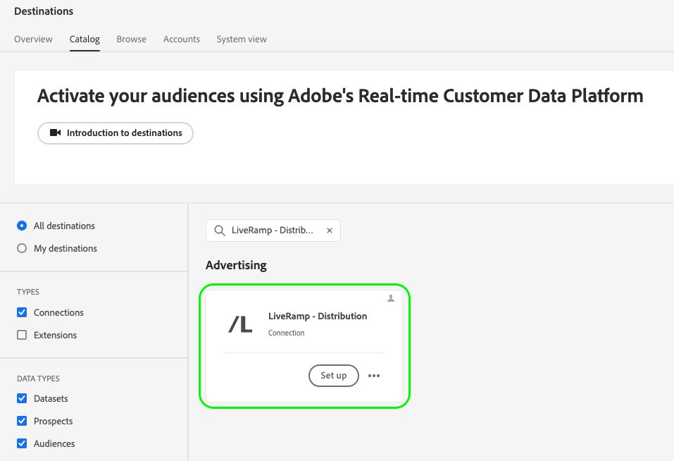

# Activer les audiences vers des destinations sélectionnées en fonction des identifiants LiveRamp

Utilisez l’intégration d’Adobe [!DNL Real-Time CDP] à [!DNL LiveRamp] pour activer les audiences vers une liste sélectionnée de destinations qui utilisent [!DNL [LiveRamp RampID]](https://docs.liveramp.com/connect/en/interpreting-rampid,-liveramp-s-people-based-identifier.html) pour l’activation, y compris les destinations TV et audio connectées, telles que celles répertoriées ci-dessous.

>[!IMPORTANT]
>
>Vous n’avez pas besoin d’ingérer ni de travailler avec les LiveRamp RampID dans l’interface d’Experience Platform.
>
> Vous pouvez exporter des identités à partir de [!DNL Real-Time CDP], telles que des identifiants basés sur des informations d’identification personnelles, des identifiants connus et des identifiants personnalisés, comme décrit dans la documentation officielle de [LiveRamp](https://docs.liveramp.com/connect/en/identity-and-identifier-terms-and-concepts.html#known-identifiers). Ces identités sont ensuite mises en correspondance avec d’autres [!DNL LiveRamp RampIDs] en aval du processus d’activation.

* [[!DNL 4C Insights]](#insights)
* [[!DNL Acast]](#acast)
* [[!DNL Ampersand.tv]](#ampersand-tv)
* [[!DNL Captify]](#captify)
* [[!DNL Cardlytics]](#cardlytics)
* [[!DNL Disney (Hulu/ESPN/ABC)]](#disney)
* [[!DNL iHeartMedia]](#iheartmedia)
* [[!DNL Index Exchange]](#index-exchange)
* [[!DNL Magnite CTV Platform]](#magnite)
* [[!DNL Magnite DV+ (Rubicon Project)]](#magnite-dv)
* [[!DNL Nexxen]](#nexxen)
* [[!DNL One Fox]](#fox)
* [[!DNL Pandora]](#pandora)
* [[!DNL Reddit]](#reddit)
* [[!DNL Roku]](#roku)
* [[!DNL Spotify]](#spotify)
* [[!DNL Taboola]](#taboola)
* [[!DNL TargetSpot]](#targetspot)
* [[!DNL Teads]](#teads)
* [[!DNL WB Discovery]](#wb-discovery)

Cet article explique le processus requis pour activer des audiences d’[!DNL Real-Time CDP] vers les destinations répertoriées ci-dessus, directement à partir de l’interface utilisateur de [!DNL Real-Time CDP].

## Workflow d’activation {#workflow}

Vous activez les audiences vers des destinations TV et audio connectées en suivant un processus en deux étapes, et en utilisant les destinations [LiveRamp - Intégration](../catalog/advertising/liveramp-onboarding.md) et [LiveRamp - Distribution](../catalog/advertising/liveramp-distribution.md), comme illustré dans l’image ci-dessous.

{width="1920" zoomable="yes"}

Tout d’abord, vous exportez vos audiences de [!DNL Real-Time CDP] vers la destination [[!DNL LiveRamp - Onboarding]](../catalog/advertising/liveramp-onboarding.md), sous forme de fichiers CSV.

Après avoir exporté vos audiences, vous pouvez les activer à l’aide de la destination [[!DNL LiveRamp - Distribution]](../catalog/advertising/liveramp-distribution.md) .

>[!TIP]
>
>Ce processus vous permet d’activer vos audiences vers des destinations telles que [[!DNL Roku]](../catalog/advertising/liveramp-distribution.md#roku), [[!DNL Disney]](../catalog/advertising/liveramp-distribution.md#disney), etc., directement à partir de l’interface utilisateur de [!DNL Real-Time CDP], sans avoir à vous connecter à votre compte [!DNL LiveRamp] pour l’activation.

### Tutoriel vidéo {#video}

Regardez la vidéo ci-dessous pour une explication de bout en bout du workflow décrit dans cette page.

>[!VIDEO](https://video.tv.adobe.com/v/3425367)

### Étape 1 : envoyer vos audiences d’Experience Platform vers LiveRamp, via la destination [!DNL LiveRamp - Onboarding] {#onboarding}

La première chose à faire pour activer vos audiences vers des destinations sélectionnées basées sur les ID de rampe LiveRamp est d’**exporter vos audiences d’Experience Platform vers[!DNL LiveRamp]**.

Pour ce faire, utilisez la destination **[!DNL LiveRamp - Onboarding]** .

Pour savoir comment configurer la destination [!DNL LiveRamp - Onboarding] et exporter vos audiences à partir d’Experience Platform, consultez la documentation sur les destinations [[!DNL LiveRamp - Onboarding]](../catalog/advertising/liveramp-onboarding.md) .

>[!IMPORTANT]
>
>Lors de l’exportation de fichiers vers la destination [!DNL LiveRamp - Onboarding], Experience Platform génère un fichier CSV pour chaque [ID de politique de fusion](../../profile/merge-policies/overview.md). Consultez la documentation sur la destination [[!DNL LiveRamp - Onboarding]](../catalog/advertising/liveramp-onboarding.md) pour obtenir des informations détaillées sur la validation de l’exportation des données vers LiveRamp.

Une fois vos audiences exportées vers LiveRamp, passez à l’[étape 2](#distribution).

>[!TIP]
>
>Avant de passer à l’[étape 2](#distribution), [validez](../catalog/advertising/liveramp-onboarding.md#exported-data) pour vous assurer que vos audiences ont bien été exportées vers LiveRamp. Consultez la documentation sur la [surveillance des flux de données de destination](../../dataflows/ui/monitor-destinations.md#dataflow-runs-for-batch-destinations) et découvrez les détails de surveillance spécifiques à [[!DNL LiveRamp - Onboarding]](../catalog/advertising/liveramp-onboarding.md#exported-data).

### Étape 2 : activer les audiences intégrées vers des destinations TV et audio connectées, via la destination [!DNL LiveRamp - Distribution] {#distribution}

Une fois que vous avez [validé](../catalog/advertising/liveramp-onboarding.md#exported-data) que vos audiences ont bien été exportées vers LiveRamp, il est temps d’activer les audiences vers vos destinations préférées, telles que [[!DNL Roku]](../catalog/advertising/liveramp-distribution.md#roku), [[!DNL Disney]](../catalog/advertising/liveramp-distribution.md#disney), etc.

Activez les audiences (exportées à l’étape [1](#onboarding)) à l’aide de la destination **[!DNL LiveRamp - Distribution]**.

Pour savoir comment configurer la destination **[!DNL LiveRamp - Distribution]** et activer les audiences que vous avez exportées à l’[étape 1](#onboarding), consultez la documentation sur la destination [[!DNL LiveRamp - Distribution]](../catalog/advertising/liveramp-distribution.md).

>[!IMPORTANT]
>
>Dans l’étape **sélection d’audiences** de la destination **[!DNL LiveRamp - Distribution]**, vous devez sélectionner les *audiences identiques* que vous avez exportées vers la destination [LiveRamp - Intégration](../catalog/advertising/liveramp-onboarding.md) à l’[étape 1](#onboarding).

Lorsque vous configurez la destination **[!DNL LiveRamp - Distribution]**, vous devez créer une connexion dédiée pour chaque destination en aval que vous souhaitez utiliser (Roku, Disney, etc.).

>[!TIP]
>
>Lorsque vous attribuez un nom à une destination, Adobe recommande de suivre le format suivant : `LiveRamp - Downstream Destination Name`. Ce modèle de dénomination vous permet d’identifier rapidement vos destinations dans l’onglet [ Parcourir ](../ui/destinations-workspace.md#browse) de l’espace de travail des destinations.
> >Exemple : `LiveRamp - Roku`.

## Données exportées / Valider l’exportation des données {#exported-data}

Pour valider l’exportation réussie de vos audiences vers la destination [[!DNL LiveRamp - Onboarding]](../catalog/advertising/liveramp-onboarding.md), consultez la documentation sur la [surveillance des flux de données de destination](../../dataflows/ui/monitor-destinations.md#dataflow-runs-for-batch-destinations) et découvrez les détails de surveillance spécifiques à [[!DNL LiveRamp - Onboarding]](../catalog/advertising/liveramp-onboarding.md#exported-data).

Pour valider l’activation réussie de vos audiences sur la plateforme publicitaire de votre choix (telle que Roku, Disney et d’autres), connectez-vous à votre compte de plateforme de destination et vérifiez les mesures d’activation.
