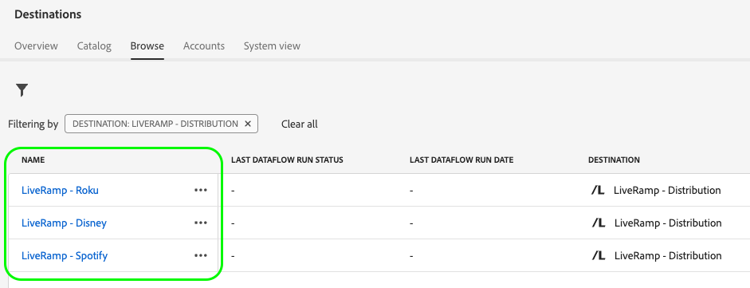

# Activation des audiences vers des destinations traitées en fonction des identifiants LiveRamp

Utilisation de l’intégration Adobe Real-Time CDP avec [!DNL LiveRamp] pour activer les audiences vers une liste organisée de destinations qui utilisent [!DNL [LiveRamp RampID]](https://docs.liveramp.com/connect/en/interpreting-rampid,-liveramp-s-people-based-identifier.html) pour l’activation, y compris les destinations audio et TV connectées, telles que celles répertoriées ci-dessous.

>[!IMPORTANT]
>
>Vous n’avez pas besoin d’ingérer des LiveRamp Ramp ID ni de les utiliser de quelque manière que ce soit dans l’interface de l’Experience Platform.
>
> Vous pouvez exporter des identités à partir de Real-Time CDP, telles que des identifiants basés sur des informations d’identification personnelles, des identifiants connus et des identifiants personnalisés, comme décrit dans la section [Documentation LiveRamp](https://docs.liveramp.com/connect/en/identity-and-identifier-terms-and-concepts.html#known-identifiers). Ces identités sont ensuite associées à [!DNL LiveRamp RampIDs] plus en aval dans le processus d’activation.

* [[!DNL 4C Insights]](#insights)
* [[!DNL Acast]](#acast)
* [[!DNL Ampersand.tv]](#ampersand-tv)
* [[!DNL Captify]](#captify)
* [[!DNL Cardlytics]](#cardlytics)
* [[!DNL Disney (Hulu/ESPN/ABC)]](#disney)
* [[!DNL iHeartMedia]](#iheartmedia)
* [[!DNL Index Exchange]](#index-exchange)
* [[!DNL Magnite CTV Platform]](#magnite)
* [[!DNL Magnite DV+ (Rubicon Project)]](#magnite-dv)
* [[!DNL Nexxen]](#nexxen)
* [[!DNL One Fox]](#fox)
* [[!DNL Pandora]](#pandora)
* [[!DNL Reddit]](#reddit)
* [[!DNL Roku]](#roku)
* [[!DNL Spotify]](#spotify)
* [[!DNL Taboola]](#taboola)
* [[!DNL TargetSpot]](#targetspot)
* [[!DNL Teads]](#teads)
* [[!DNL WB Discovery]](#wb-discovery)

Cet article explique le processus requis pour activer les audiences de Real-Time CDP vers les destinations répertoriées ci-dessus, directement depuis l’interface utilisateur de Real-Time CDP.

## Workflow d’activation {#workflow}

Vous activez des audiences vers des destinations audio et TV connectées en effectuant un processus en deux étapes, puis en utilisant la variable [LiveRamp - Intégration](../catalog/advertising/liveramp-onboarding.md) et la variable [LiveRamp - Distribution](../catalog/advertising/liveramp-distribution.md) destinations, comme illustré dans l’image ci-dessous.

{width="1920" zoomable="yes"}

Tout d’abord, vous exportez vos audiences de Real-Time CDP vers le [[!DNL LiveRamp - Onboarding]](../catalog/advertising/liveramp-onboarding.md) destination, sous la forme de fichiers CSV.

Une fois les audiences exportées, vous pouvez les activer à l’aide de la fonction [[!DNL LiveRamp - Distribution]](../catalog/advertising/liveramp-distribution.md) destination.

>[!TIP]
>
>Ce processus vous permet d’activer vos audiences vers des destinations telles que [[!DNL Roku]](../catalog/advertising/liveramp-distribution.md#roku), [[!DNL Disney]](../catalog/advertising/liveramp-distribution.md#disney), etc., directement depuis l’interface utilisateur de Real-Time CDP, sans avoir à se connecter à [!DNL LiveRamp] compte pour l’activation.

### Étape 1 : envoyez vos audiences de l’Experience Platform vers LiveRamp, via le [!DNL LiveRamp - Onboarding] destination {#onboarding}

Pour activer vos audiences vers des destinations traitées basées sur les LiveRamp Ramp ID, vous devez d’abord procéder comme suit : **exporter vos audiences de l’Experience Platform vers[!DNL LiveRamp]**.

Pour ce faire, utilisez la méthode **[!DNL LiveRamp - Onboarding]** destination.

Pour savoir comment configurer la variable [!DNL LiveRamp - Onboarding] destination et exportation de vos audiences à partir d’un Experience Platform, lisez la [[!DNL LiveRamp - Onboarding]](../catalog/advertising/liveramp-onboarding.md) documentation de destination.

>[!IMPORTANT]
>
>Lors de l’exportation de fichiers vers la destination [!DNL LiveRamp - Onboarding], Platform génère un fichier CSV pour chaque [ID de stratégie de fusion](../../profile/merge-policies/overview.md). Voir [[!DNL LiveRamp - Onboarding]](../catalog/advertising/liveramp-onboarding.md) documentation de destination pour obtenir des informations détaillées sur la validation de l’exportation des données vers LiveRamp.

Une fois que vous avez correctement exporté vos audiences vers LiveRamp, continuez à [étape 2](#distribution).

>[!TIP]
>
>Avant de passer à [étape 2](#distribution), [valider](../catalog/advertising/liveramp-onboarding.md#exported-data) que vos audiences ont bien été exportées vers LiveRamp. Consultez la documentation relative à [surveillance des flux de données de destination](../../dataflows/ui/monitor-destinations.md#dataflow-runs-for-batch-destinations) et découvrez les détails spécifiques de la surveillance pour [[!DNL LiveRamp - Onboarding]](../catalog/advertising/liveramp-onboarding.md#exported-data).

### Étape 2 : activation des audiences intégrées vers les destinations audio et télévisées connectées via la [!DNL LiveRamp - Distribution] destination {#distribution}

Après avoir [validé](../catalog/advertising/liveramp-onboarding.md#exported-data) que vos audiences ont bien été exportées vers LiveRamp, il est temps d’activer les audiences vers les destinations de votre choix, telles que [[!DNL Roku]](../catalog/advertising/liveramp-distribution.md#roku), [[!DNL Disney]](../catalog/advertising/liveramp-distribution.md#disney), etc.

Vous activez les audiences (exportées dans [étape 1](#onboarding)) en utilisant la variable **[!DNL LiveRamp - Distribution]** destination.

Pour savoir comment configurer la variable **[!DNL LiveRamp - Distribution]** destination et activation des audiences que vous avez exportées dans [étape 1](#onboarding), lisez le [[!DNL LiveRamp - Distribution]](../catalog/advertising/liveramp-distribution.md) documentation de destination.

>[!IMPORTANT]
>
>Dans le **sélection d’audiences** de la **[!DNL LiveRamp - Distribution]** destination, vous devez sélectionner la variable *audiences identiques* que vous avez exporté vers le [LiveRamp - Intégration](../catalog/advertising/liveramp-onboarding.md) destination dans [étape 1](#onboarding).

Lorsque vous configurez la variable **[!DNL LiveRamp - Distribution]** destination, vous devez créer une connexion dédiée pour chaque destination en aval que vous souhaitez utiliser (Roku, Disney, etc.).

>[!TIP]
>
>Lorsque vous nommez votre destination, Adobe recommande le format suivant : `LiveRamp - Downstream Destination Name`. Ce modèle de dénomination vous permet d’identifier rapidement vos destinations dans la variable [Parcourir](../ui/destinations-workspace.md#browse) de l’espace de travail des destinations.
> 
>Exemple : `LiveRamp - Roku`.

## Données exportées / Valider l’exportation des données {#exported-data}

Pour valider l’exportation réussie de vos audiences vers le [[!DNL LiveRamp - Onboarding]](../catalog/advertising/liveramp-onboarding.md) destination, consultez la documentation sur [surveillance des flux de données de destination](../../dataflows/ui/monitor-destinations.md#dataflow-runs-for-batch-destinations) et découvrez les détails spécifiques de la surveillance pour [[!DNL LiveRamp - Onboarding]](../catalog/advertising/liveramp-onboarding.md#exported-data).

Pour valider l’activation réussie de vos audiences sur votre plateforme publicitaire de votre choix (Roku, Disney, etc.), connectez-vous à votre compte de plateforme de destination et vérifiez les mesures d’activation.
