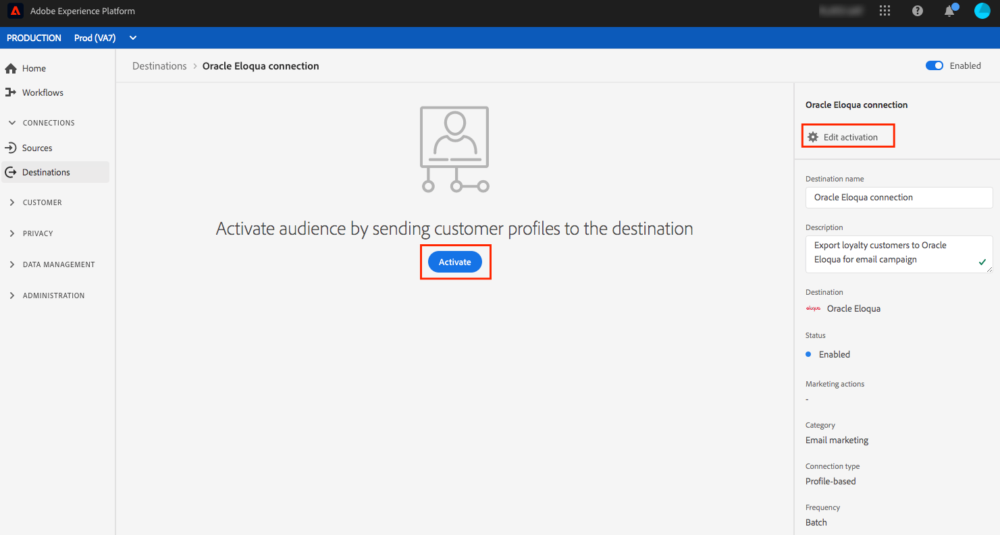

# Activation de profils et de segments vers une destination

Activez les données que vous avez dans [!DNL Adobe Experience Platform] en mappant les segments aux destinations. Pour ce faire, suivez la procédure décrite ci-après.

## Conditions préalables  {#prerequisites}

Pour activer des données vers des destinations, vous devez avoir réussi à vous [connecter à une destination](./connect-destination.md). Si vous ne l’avez pas déjà fait, accédez au [catalogue des destinations](../catalog/overview.md), parcourez les destinations prises en charge et configurez une ou plusieurs destinations.

## Activation des données {#activate-data}

Les étapes du processus d’activation varient légèrement d’un type de destination à l’autre. Le processus complet pour tous les types de destination est décrit ci-dessous.

### Sélectionnez la destination pour laquelle activer les données dans {#select-destination}.

S&#39;applique à : Toutes les destinations

Dans l’interface utilisateur de Adobe Experience Platform, accédez à **[!UICONTROL Destinations]** > **[!UICONTROL Parcourir]**, puis sélectionnez la destination à laquelle vous souhaitez activer vos segments.


Sélectionnez le nom de la destination pour accéder au processus d’activation.



>[!NOTE]
>
>Si un processus d’activation existe déjà pour une destination, vous pouvez voir les segments qui sont actuellement activés pour la destination. Sélectionnez **[!UICONTROL Modifier l’activation]** dans le rail de droite et suivez les étapes ci-dessous pour modifier les informations sur l’activation.

Une fois que vous avez sélectionné une destination, sélectionnez **[!UICONTROL Activer]**.

### [!UICONTROL Sélectionner les ] segments, étape  {#select-segments}

S&#39;applique à : Toutes les destinations


Dans le flux de travaux **[!UICONTROL Activer la destination]**, sur la page **[!UICONTROL Sélectionner des segments]**, sélectionnez un ou plusieurs segments à activer vers la destination. Sélectionnez **[!UICONTROL Suivant]** pour passer à l’étape suivante.


### [!UICONTROL Etape de ] mappage d’identité  {#identity-mapping}

S&#39;applique à : destinations sociales et destination publicitaire Google Customer Match


Pour les destinations sociales, vous devez sélectionner des attributs source ou des espaces de nommage d’identité à mapper en tant qu’identités de cible dans la destination.

#### Exemple : activation des données d&#39;audience dans [!DNL Facebook Custom Audience] {#example-facebook}

Vous trouverez ci-dessous un exemple de mappage d&#39;identité correct lors de l&#39;activation des données d&#39;audience dans [!DNL Facebook].

Sélection des champs source :

* Sélectionnez l&#39;espace de nommage `Email` comme identité source si les adresses électroniques que vous utilisez ne sont pas hachées.
* Sélectionnez l&#39;espace de nommage `Email_LC_SHA256` en tant qu&#39;identité source si vous avez haché les adresses électroniques du client lors de l&#39;assimilation de données dans [!DNL Platform], conformément aux [!DNL Facebook] [exigences de hachage de courrier électronique](../catalog/social/facebook.md#email-hashing-requirements).
* Sélectionnez l&#39;espace de nommage `PHONE_E.164` comme identité source si vos données sont constituées de numéros de téléphone non hachés. [!DNL Platform] hachera les numéros de téléphone pour se conformer aux  [!DNL Facebook] exigences.
* Sélectionnez l&#39;espace de nommage `Phone_SHA256` comme identité source si vous avez haché des numéros de téléphone lors de l&#39;assimilation de données dans [!DNL Platform], conformément aux [!DNL Facebook] [exigences de hachage des numéros de téléphone](../catalog/social/facebook.md#phone-number-hashing-requirements).
* Sélectionnez l&#39;espace de nommage `IDFA` en tant qu&#39;identité source si vos données sont composées d&#39;ID de périphérique [!DNL Apple].
* Sélectionnez l&#39;espace de nommage `GAID` en tant qu&#39;identité source si vos données sont composées d&#39;ID de périphérique [!DNL Android].
* Sélectionnez l&#39;espace de nommage `Custom` en tant qu&#39;identité source si vos données se composent d&#39;autres types d&#39;identifiants.

Sélection de champs de cible :

* Sélectionnez l&#39;espace de nommage `Email_LC_SHA256` comme identité de cible lorsque vos espaces de nommage sources sont `Email` ou `Email_LC_SHA256`.
* Sélectionnez l&#39;espace de nommage `Phone_SHA256` comme identité de cible lorsque vos espaces de nommage sources sont `PHONE_E.164` ou `Phone_SHA256`.
* Sélectionnez les espaces de nommage `IDFA` ou `GAID` comme identité de cible lorsque vos espaces de nommage sources sont `IDFA` ou `GAID`.
* Sélectionnez l&#39;espace de nommage `Extern_ID` comme identité de cible lorsque votre espace de nommage source est personnalisé.


Les données des espaces de nommage non hachés sont automatiquement hachées par [!DNL Platform] à l&#39;activation.

Les données de la source d’attributs ne sont pas automatiquement hachées. Lorsque votre champ source contient des attributs non hachés, cochez l’option **[!UICONTROL Appliquer la transformation]** pour que [!DNL Platform] hachage automatiquement les données sur l’activation.


 

#### Exemple : activation des données d&#39;audience dans [!DNL Google Customer Match] {#example-gcm}

Il s&#39;agit d&#39;un exemple de mappage d&#39;identité correct lors de l&#39;activation des données d&#39;audience dans [!DNL Google Customer Match].

Sélection des champs source :

* Sélectionnez l&#39;espace de nommage `Email` comme identité source si les adresses électroniques que vous utilisez ne sont pas hachées.
* Sélectionnez l&#39;espace de nommage `Email_LC_SHA256` en tant qu&#39;identité source si vous avez haché les adresses électroniques du client lors de l&#39;assimilation de données dans [!DNL Platform], conformément aux [!DNL Google Customer Match] [exigences de hachage de courrier électronique](../catalog/social/../advertising/google-customer-match.md).
* Sélectionnez l&#39;espace de nommage `PHONE_E.164` comme identité source si vos données sont constituées de numéros de téléphone non hachés. [!DNL Platform] hachera les numéros de téléphone pour se conformer aux  [!DNL Google Customer Match] exigences.
* Sélectionnez l&#39;espace de nommage `Phone_SHA256_E.164` comme identité source si vous avez haché des numéros de téléphone lors de l&#39;assimilation de données dans [!DNL Platform], conformément aux [!DNL Facebook] [exigences de hachage des numéros de téléphone](../catalog/social/../advertising/google-customer-match.md).
* Sélectionnez l&#39;espace de nommage `IDFA` en tant qu&#39;identité source si vos données sont composées d&#39;ID de périphérique [!DNL Apple].
* Sélectionnez l&#39;espace de nommage `GAID` en tant qu&#39;identité source si vos données sont composées d&#39;ID de périphérique [!DNL Android].
* Sélectionnez l&#39;espace de nommage `Custom` en tant qu&#39;identité source si vos données se composent d&#39;autres types d&#39;identifiants.

Sélection de champs de cible :

* Sélectionnez l&#39;espace de nommage `Email_LC_SHA256` en tant qu&#39;identité de cible lorsque vos espaces de nommage sources sont soit `Email`, soit `Email_LC_SHA256`.
* Sélectionnez l&#39;espace de nommage `Phone_SHA256_E.164` comme identité de cible lorsque vos espaces de nommage sources sont `PHONE_E.164` ou `Phone_SHA256_E.164`.
* Sélectionnez les espaces de nommage `IDFA` ou `GAID` comme identité de cible lorsque vos espaces de nommage sources sont `IDFA` ou `GAID`.
* Sélectionnez l&#39;espace de nommage `User_ID` comme identité de cible lorsque votre espace de nommage source est personnalisé.


Les données des espaces de nommage non hachés sont automatiquement hachées par [!DNL Platform] à l&#39;activation.

Les données de la source d’attributs ne sont pas automatiquement hachées. Lorsque votre champ source contient des attributs non hachés, cochez l’option **[!UICONTROL Appliquer la transformation]** pour que [!DNL Platform] hachage automatiquement les données sur l’activation.


<!-- 
`IDFA` IDs will be mapped to:

* [MADID](https://developers.facebook.com/docs/marketing-api/audiences/guides/custom-audiences#hash) if you are activating audiences in [[!DNL Facebook]](../../destinations/catalog/social/facebook.md).
* [mobileId](https://developers.google.com/adwords/api/docs/reference/v201809/AdwordsUserListService.Member#mobileid) if you are activating audiences in [[!DNL Google Customer Match]](../../destinations/catalog/advertising/google-customer-match.md).

Select `GAID` as target identity if your data consists of Android device IDs. `GAID` IDs will be mapped to:

* [MADID](https://developers.facebook.com/docs/marketing-api/audiences/guides/custom-audiences#hash) if you are activating audiences in [[!DNL Facebook]](../../destinations/catalog/social/facebook.md).
* [mobileId](https://developers.google.com/adwords/api/docs/reference/v201809/AdwordsUserListService.Member#mobileid) if you are activating audiences in [[!DNL Google Customer Match]](../../destinations/catalog/advertising/google-customer-match.md).

If you are using another ID, such as "Rewards ID" or "Loyalty ID", as primary identity in your schema, you need to map it to the following target identities:

* [EXTERN_ID](https://developers.facebook.com/docs/marketing-api/audiences/guides/custom-audiences#external_identifiers) if you are activating audiences in [[!DNL Facebook]](../../destinations/catalog/social/facebook.md).
* [USER_ID](https://developers.google.com/adwords/api/docs/reference/v201809/AdwordsUserListService.Member#userid) if you are activating audiences in [[!DNL Google Customer Match]](../../destinations/catalog/advertising/google-customer-match.md). -->

### **** Configurestep  {#configure}

S&#39;applique à : Destinations marketing par courriel et destinations d’enregistrement par cloud


[!DNL Adobe Experience Platform] exporte des données pour le marketing par courrier électronique et les destinations d’enregistrement cloud sous la forme de  [!DNL CSV] fichiers. À l&#39;étape **[!UICONTROL Configurer]**, vous pouvez configurer la planification et les noms de fichier pour chaque segment que vous exportez. La configuration de la planification est obligatoire, mais la configuration du nom de fichier est facultative.

>[!IMPORTANT]
> 
>[!DNL Adobe Experience Platform] sépare automatiquement les fichiers d’exportation à 5 millions d’enregistrements (lignes) par fichier. Chaque ligne représente un profil.

Pour ajouter une planification pour le segment, sélectionnez **[!UICONTROL Créer une planification]**.


Une boîte de dialogue s’affiche, présentant les options permettant de créer la planification des segments.

* **Exportation** de fichier : Vous avez la possibilité d’exporter des fichiers complets ou des fichiers incrémentiels. L’exportation d’un fichier complet publie un instantané complet de tous les profils admissibles pour ce segment. L’exportation d’un fichier incrémentiel publie le delta des profils qui remplissent les critères pour ce segment depuis la dernière exportation.
* **Fréquence** : Si  **[!UICONTROL Exporter la]** fichiers complète est sélectionné, vous avez la possibilité d’exporter  **** une fois par  **[!UICONTROL jour]** ou une fois. Si **[!UICONTROL Exporter des fichiers incrémentiels]** est sélectionné, vous avez la possibilité d’exporter **[!UICONTROL Quotidien]**. L’exportation d’un fichier **[!UICONTROL Une fois]** exporte le fichier une seule fois. L’exportation d’un fichier **[!UICONTROL Quotidien]** exporte le fichier tous les jours de la date du début à la date de fin à 12h00 UTC (19h00 HNE) si des fichiers complets sont sélectionnés et à 12h00 UTC (7h00 HNE) si des fichiers incrémentiels sont sélectionnés.
* **Date** : Si  **** l’option Une fois sélectionnée, vous pouvez sélectionner la date de l’exportation unique. Si **[!UICONTROL Quotidien]** est sélectionné, vous pouvez sélectionner les dates de début et de fin des exportations.


Les noms de fichier par défaut se composent du nom de destination, de l’ID de segment et d’un indicateur de date et d’heure. Vous pouvez, par exemple, modifier les noms de fichiers exportés pour faire la distinction entre les différentes campagnes ou pour que le temps d’exportation des données soit annexé aux fichiers.

Sélectionnez l&#39;icône représentant un crayon pour ouvrir une fenêtre modale et modifier les noms de fichier. Notez que les noms de fichier sont limités à 255 caractères.


Dans l’éditeur de noms de fichier, vous pouvez sélectionner différents composants à ajouter au nom de fichier. Le nom de destination et l&#39;ID de segment ne peuvent pas être supprimés des noms de fichier. Outre ces éléments, vous pouvez ajouter les éléments suivants :

* **[!UICONTROL Nom]** du segment : Vous pouvez ajouter le nom du segment au nom du fichier.
* **[!UICONTROL Date et heure]** : Choisissez entre l’ajout d’un  `MMDDYYYY_HHMMSS` format ou d’un horodatage Unix de 10 chiffres de l’heure de génération des fichiers. Choisissez l’une de ces options si vous souhaitez que vos fichiers aient un nom de fichier dynamique généré avec chaque exportation incrémentielle.
* **[!UICONTROL Texte]** personnalisé : Ajoutez du texte personnalisé aux noms de fichier.

Sélectionnez **[!UICONTROL Appliquer les modifications]** pour confirmer votre sélection.

>[!IMPORTANT]
> 
>Si vous ne sélectionnez pas le composant **[!UICONTROL Date et heure]**, les noms de fichier seront statiques et le nouveau fichier exporté remplacera le fichier précédent à l&#39;emplacement de votre enregistrement par chaque exportation. Lors de l’exécution d’une tâche d’importation périodique depuis un emplacement d’enregistrement vers une plateforme de marketing par courrier électronique, il s’agit de l’option recommandée.


Une fois que vous avez terminé de configurer tous vos segments, sélectionnez **[!UICONTROL Suivant]** pour continuer.

### **[!UICONTROL Procédure de]** planification des segments  {#segment-schedule}

S&#39;applique à : destinations publicitaires, destinations sociales


Sur la page **[!UICONTROL Planification du segment]**, vous pouvez définir la date de début pour l’envoi des données vers la destination et la fréquence d’envoi des données vers la destination.

>[!IMPORTANT]
>
>Pour les destinations sociales, vous devez sélectionner l’origine de votre audience à cette étape. Vous ne pouvez passer à l’étape suivante qu’après avoir sélectionné l’une des options de l’image ci-dessous.


>[!IMPORTANT]
>
>Pour la correspondance client Google, vous devez fournir l’[!UICONTROL ID d’application] dans cette étape, lors de l’activation des segments [!DNL IDFA] ou [!DNL GAID].


### **** Etape de planification  {#scheduling}

S&#39;applique à : destinations de marketing par courrier électronique et destinations d’enregistrement dans le cloud


Sur la page **[!UICONTROL Planification]**, vous pouvez voir la date de début d’envoi des données vers la destination ainsi que la fréquence d’envoi des données vers la destination. Ces valeurs ne peuvent pas être modifiées.

### **[!UICONTROL Sélectionner]** attribut, étape  {#select-attributes}

S&#39;applique à : destinations de marketing par courrier électronique et destinations d’enregistrement dans le cloud


Sur la page **[!UICONTROL Sélectionner des attributs]**, sélectionnez **[!UICONTROL Ajouter un nouveau champ]** et choisissez les attributs à envoyer à la destination.

>[!NOTE]
>
> Adobe Experience Platform préremplit votre sélection à l’aide de quatre attributs recommandés couramment utilisés de votre schéma : `person.name.firstName`, `person.name.lastName`, `personalEmail.address`, `segmentMembership.status`.

Les exportations de fichiers varient comme suit, selon que `segmentMembership.status` est sélectionné ou non :
* Si le champ `segmentMembership.status` est sélectionné, les fichiers exportés incluent des membres **[!UICONTROL Principal]** dans l&#39;instantané complet initial et **[!UICONTROL Principal]** et **[!UICONTROL expirés]** dans les exportations incrémentielles suivantes.
* Si le champ `segmentMembership.status` n&#39;est pas sélectionné, les fichiers exportés n&#39;incluent que des membres **[!UICONTROL Principal]** dans l&#39;instantané complet initial et dans les exportations incrémentielles suivantes.


De plus, vous pouvez marquer différents attributs comme obligatoires. Le fait de marquer un attribut comme obligatoire le rend de sorte que le segment exporté doit contenir cet attribut. Par conséquent, il peut être utilisé comme une autre forme de filtrage. Le marquage d’un attribut comme obligatoire est **non** obligatoire.

Il est recommandé que l’un des attributs soit un [identifiant unique](../../destinations/catalog/email-marketing/overview.md#identity) de votre schéma. Pour plus d’informations sur les attributs obligatoires, voir la section d’identité de la documentation [Destinations marketing par courriel](../../destinations/catalog/email-marketing/overview.md#identity).

>[!NOTE]
> 
>Si des étiquettes d’utilisation de données ont été appliquées à certains champs d’un jeu de données (plutôt qu’à l’ensemble du jeu de données), l’application de ces étiquettes de niveau champ à l’activation se fait dans les conditions suivantes :
>* Les champs sont utilisés dans la définition de segment.
>* Les champs sont configurés en tant qu’attributs prévisionnels pour la destination de la cible.

>
> 
Par exemple, si le champ `person.name.firstName` contient certains libellés d&#39;utilisation des données qui entrent en conflit avec l&#39;action marketing de la destination, une violation de la stratégie d&#39;utilisation des données s&#39;affichera à l&#39;étape de révision. Pour plus d’informations, voir [Gouvernance des données à Adobe Experience Platform](../../rtcdp/privacy/data-governance-overview.md#destinations).

### **** Révision  {#review}

S&#39;applique à : toutes les destinations


Sur la page **[!UICONTROL Vérifier]**, vous pouvez voir un résumé de votre sélection. Sélectionnez **[!UICONTROL Annuler]** pour interrompre le flux, **[!UICONTROL Précédent]** pour modifier vos paramètres ou **[!UICONTROL Terminer]** pour confirmer votre sélection et commencer à envoyer les données à la destination.

>[!IMPORTANT]
>
>Au cours de cette étape, Adobe Experience Platform recherche les violations de stratégie d’utilisation des données. Vous trouverez ci-dessous un exemple de violation d’une stratégie. Vous ne pouvez pas terminer le processus d’activation de segments tant que vous n’avez pas résolu la violation. Pour plus d&#39;informations sur la manière de résoudre les violations de stratégie, voir [Application de la stratégie](../../rtcdp/privacy/data-governance-overview.md#enforcement) dans la section de documentation sur la gouvernance des données.


Si aucune violation de stratégie n&#39;a été détectée, sélectionnez **[!UICONTROL Terminer]** pour confirmer votre sélection et l&#39;envoi de données par début vers la destination.


## Modification de l’activation {#edit-activation}

Suivez les étapes ci-dessous pour modifier les flux d’activation existants dans Adobe Experience Platform :

1. Sélectionnez **[!UICONTROL Destinations]** dans la barre de navigation de gauche, cliquez sur l’onglet **[!UICONTROL Parcourir]**, puis sur le nom de la destination.
2. Sélectionnez **[!UICONTROL Modifier l’activation]** dans le rail de droite pour modifier les segments à envoyer à la destination.

## Vérification de la réussite de l’activation du segment {#verify-activation}

### Destinations de marketing par e-mail  et destinations de stockage dans le cloud  {#esp-and-cloud-storage}

Pour les destinations de marketing par courrier électronique et les destinations d’enregistrement cloud, Adobe Experience Platform crée un fichier délimité par des tabulations `.csv` ou `.txt` à l’emplacement d’enregistrement que vous avez fourni. Attendez-vous à ce qu’un nouveau fichier soit créé chaque jour à votre emplacement de stockage. Le format de fichier par défaut est le suivant :
`<destinationName>_segment<segmentID>_<timestamp-yyyymmddhhmmss>.csv|txt`

Notez que vous pouvez modifier le format de fichier. Pour plus d’informations, reportez-vous à l’étape [Configurer](#configure) pour les destinations d’enregistrement cloud et les destinations de marketing par courrier électronique.

Avec le format de fichier par défaut, les fichiers que vous recevriez trois jours consécutifs peuvent ressembler à ceci :

```console
Salesforce_Marketing_Cloud_segment12341e18-abcd-49c2-836d-123c88e76c39_20200408061804.csv
Salesforce_Marketing_Cloud_segment12341e18-abcd-49c2-836d-123c88e76c39_20200409052200.csv
Salesforce_Marketing_Cloud_segment12341e18-abcd-49c2-836d-123c88e76c39_20200410061130.csv
```

La présence de ces fichiers dans votre emplacement de stockage est la confirmation de la réussite de l’activation. Pour comprendre comment les fichiers exportés sont structurés, vous pouvez [télécharger un exemple de fichier .csv](../assets/common/sample_export_file_segment12341e18-abcd-49c2-836d-123c88e76c39_20200408061804.csv). Cet exemple de fichier comprend les attributs de profil `person.firstname`, `person.lastname`, `person.gender`, `person.birthyear` et `personalEmail.address`.

### Destinations publicitaires

Vérifiez votre compte dans la destination publicitaire vers laquelle vous activez vos données. Si l’activation a réussi, les audiences sont renseignées dans votre plateforme publicitaire.

### Destinations de réseau social

Pour [!DNL Facebook], une activation réussie signifie qu’une [!DNL Facebook] audience personnalisée serait créée par programmation dans [[!UICONTROL le Gestionnaire d’annonces Facebook]](https://www.facebook.com/adsmanager/manage/). L’adhésion au segment dans l’audience est ajoutée ou supprimée selon que les utilisateurs sont qualifiés ou disqualifiés pour les segments activés.

>[!TIP]
>
>L’intégration entre Adobe Experience Platform et [!DNL Facebook] prend en charge les remplissages d’audiences historiques. Toutes les qualifications des segments historiques sont envoyées à [!DNL Facebook] lorsque vous activez les segments vers la destination.

## Désactivation de l’activation {#disable-activation}

Pour désactiver un flux d’activation existant, procédez comme suit :

1. Sélectionnez **[!UICONTROL Destinations]** dans la barre de navigation de gauche, cliquez sur l’onglet **[!UICONTROL Parcourir]**, puis sur le nom de la destination.
2. Cliquez sur la commande **[!UICONTROL Activé]** dans le rail de droite pour modifier l’état du flux d’activation.
3. Dans la fenêtre **Mettre à jour l’état du flux de données**, sélectionnez **Confirmer** pour désactiver le flux d’activation.
