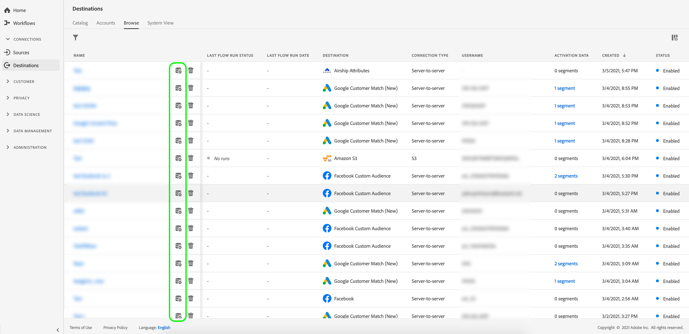
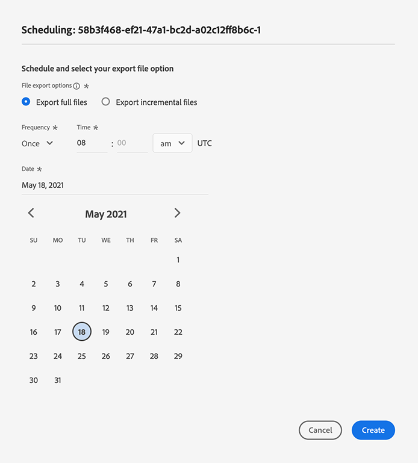

# Activation de profils et de segments vers une destination

## Présentation {#overview}

Activez les données que vous avez dans [!DNL Adobe Experience Platform] en mappant les segments aux destinations. Pour ce faire, suivez la procédure décrite ci-après.

## Conditions préalables  {#prerequisites}

Pour activer des données vers des destinations, vous devez avoir réussi à vous [connecter à une destination](./connect-destination.md). Si vous ne l’avez pas déjà fait, accédez au [catalogue des destinations](../catalog/overview.md), parcourez les destinations prises en charge et configurez une ou plusieurs destinations.

## Activation des données {#activate-data}

Les étapes du processus d’activation varient légèrement d’un type de destination à l’autre. Le processus complet pour tous les types de destination est décrit ci-dessous.

## Sélectionnez la destination pour laquelle activer les données dans {#select-destination}.

S&#39;applique à : Toutes les destinations

Dans l’interface utilisateur de Adobe Experience Platform, accédez à **[!UICONTROL Destinations]** > **[!UICONTROL Parcourir]**, puis cliquez sur le bouton **[!UICONTROL Activer]** correspondant à la destination à laquelle vous souhaitez activer vos segments, comme illustré dans l’image ci-dessous.



Suivez les étapes de la section suivante pour sélectionner les segments à activer.

## [!UICONTROL Sélectionner les ] segments, étape  {#select-segments}

S&#39;applique à : Toutes les destinations


Dans le flux de travaux **[!UICONTROL Activer la destination]**, sur la page **[!UICONTROL Sélectionner des segments]**, sélectionnez un ou plusieurs segments à activer vers la destination. Sélectionnez **[!UICONTROL Suivant]** pour passer à l’étape suivante.


## [!UICONTROL Etape de ] mappage d’identité  {#identity-mapping}

S&#39;applique à : destinations sociales et destination publicitaire Google Customer Match


Pour les destinations sociales, vous devez sélectionner des attributs source ou des espaces de nommage d’identité à mapper en tant qu’identités de cible dans la destination.

## Exemple : activation des données d&#39;audience dans [!DNL Facebook Custom Audience] {#example-facebook}

Vous trouverez ci-dessous un exemple de mappage d&#39;identité correct lors de l&#39;activation des données d&#39;audience dans [!DNL Facebook].

Sélection des champs source :

* Sélectionnez l&#39;espace de nommage `Email` comme identité source si les adresses électroniques que vous utilisez ne sont pas hachées.
* Sélectionnez l&#39;espace de nommage `Email_LC_SHA256` en tant qu&#39;identité source si vous avez haché les adresses électroniques du client lors de l&#39;assimilation de données dans [!DNL Platform], conformément aux [!DNL Facebook] [exigences de hachage de courrier électronique](../catalog/social/facebook.md#email-hashing-requirements).
* Sélectionnez l&#39;espace de nommage `PHONE_E.164` comme identité source si vos données sont constituées de numéros de téléphone non hachés. [!DNL Platform] hachera les numéros de téléphone pour se conformer aux  [!DNL Facebook] exigences.
* Sélectionnez l&#39;espace de nommage `Phone_SHA256` comme identité source si vous avez haché des numéros de téléphone lors de l&#39;assimilation de données dans [!DNL Platform], conformément aux [!DNL Facebook] [exigences de hachage des numéros de téléphone](../catalog/social/facebook.md#phone-number-hashing-requirements).
* Sélectionnez l&#39;espace de nommage `IDFA` en tant qu&#39;identité source si vos données sont composées d&#39;ID de périphérique [!DNL Apple].
* Sélectionnez l&#39;espace de nommage `GAID` en tant qu&#39;identité source si vos données sont composées d&#39;ID de périphérique [!DNL Android].
* Sélectionnez l&#39;espace de nommage `Custom` en tant qu&#39;identité source si vos données se composent d&#39;autres types d&#39;identifiants.

Sélection de champs de cible :

* Sélectionnez l&#39;espace de nommage `Email_LC_SHA256` comme identité de cible lorsque vos espaces de nommage sources sont `Email` ou `Email_LC_SHA256`.
* Sélectionnez l&#39;espace de nommage `Phone_SHA256` comme identité de cible lorsque vos espaces de nommage sources sont `PHONE_E.164` ou `Phone_SHA256`.
* Sélectionnez les espaces de nommage `IDFA` ou `GAID` comme identité de cible lorsque vos espaces de nommage sources sont `IDFA` ou `GAID`.
* Sélectionnez l&#39;espace de nommage `Extern_ID` comme identité de cible lorsque votre espace de nommage source est personnalisé.


Les données des espaces de nommage non hachés sont automatiquement hachées par [!DNL Platform] à l&#39;activation.

Les données de la source d’attributs ne sont pas automatiquement hachées. Lorsque votre champ source contient des attributs non hachés, cochez l’option **[!UICONTROL Appliquer la transformation]** pour que [!DNL Platform] hachage automatiquement les données sur l’activation.


 

## Exemple : activation des données d&#39;audience dans [!DNL Google Customer Match] {#example-gcm}

Il s&#39;agit d&#39;un exemple de mappage d&#39;identité correct lors de l&#39;activation des données d&#39;audience dans [!DNL Google Customer Match].

Sélection des champs source :

* Sélectionnez l&#39;espace de nommage `Email` comme identité source si les adresses électroniques que vous utilisez ne sont pas hachées.
* Sélectionnez l&#39;espace de nommage `Email_LC_SHA256` en tant qu&#39;identité source si vous avez haché les adresses électroniques du client lors de l&#39;assimilation de données dans [!DNL Platform], conformément aux [!DNL Google Customer Match] [exigences de hachage de courrier électronique](../catalog/social/../advertising/google-customer-match.md).
* Sélectionnez l&#39;espace de nommage `PHONE_E.164` comme identité source si vos données sont constituées de numéros de téléphone non hachés. [!DNL Platform] hachera les numéros de téléphone pour se conformer aux  [!DNL Google Customer Match] exigences.
* Sélectionnez l&#39;espace de nommage `Phone_SHA256_E.164` comme identité source si vous avez haché des numéros de téléphone lors de l&#39;assimilation de données dans [!DNL Platform], conformément aux [!DNL Facebook] [exigences de hachage des numéros de téléphone](../catalog/social/../advertising/google-customer-match.md).
* Sélectionnez l&#39;espace de nommage `IDFA` en tant qu&#39;identité source si vos données sont composées d&#39;ID de périphérique [!DNL Apple].
* Sélectionnez l&#39;espace de nommage `GAID` en tant qu&#39;identité source si vos données sont composées d&#39;ID de périphérique [!DNL Android].
* Sélectionnez l&#39;espace de nommage `Custom` en tant qu&#39;identité source si vos données se composent d&#39;autres types d&#39;identifiants.

Sélection de champs de cible :

* Sélectionnez l&#39;espace de nommage `Email_LC_SHA256` comme identité de cible lorsque vos espaces de nommage sources sont `Email` ou `Email_LC_SHA256`.
* Sélectionnez l&#39;espace de nommage `Phone_SHA256_E.164` comme identité de cible lorsque vos espaces de nommage sources sont `PHONE_E.164` ou `Phone_SHA256_E.164`.
* Sélectionnez les espaces de nommage `IDFA` ou `GAID` comme identité de cible lorsque vos espaces de nommage sources sont `IDFA` ou `GAID`.
* Sélectionnez l&#39;espace de nommage `User_ID` comme identité de cible lorsque votre espace de nommage source est personnalisé.


Les données des espaces de nommage non hachés sont automatiquement hachées par [!DNL Platform] à l&#39;activation.

Les données de la source d’attributs ne sont pas automatiquement hachées. Lorsque votre champ source contient des attributs non hachés, cochez l’option **[!UICONTROL Appliquer la transformation]** pour que [!DNL Platform] hachage automatiquement les données sur l’activation.


## **** Etape de planification {#scheduling}

S&#39;applique à : Destinations marketing par courriel et destinations d’enregistrement par cloud


[!DNL Adobe Experience Platform] exporte des données pour le marketing par courrier électronique et les destinations d’enregistrement cloud sous la forme de  [!DNL CSV] fichiers. À l&#39;étape **[!UICONTROL Planification]**, vous pouvez configurer la planification et les noms de fichier pour chaque segment que vous exportez. La configuration de la planification est obligatoire, mais la configuration du nom de fichier est facultative.

>[!IMPORTANT]
> 
>[!DNL Adobe Experience Platform] sépare automatiquement les fichiers d’exportation à 5 millions d’enregistrements (lignes) par fichier. Chaque ligne représente un profil.
>
>Les noms de fichier fractionnés sont ajoutés avec un nombre indiquant que le fichier fait partie d’une exportation plus importante, en tant que tel : `filename.csv`, `filename_2.csv`, `filename_3.csv`.

Cliquez sur le bouton **[!UICONTROL Créer une planification]** correspondant au segment à envoyer à votre destination.


### Exporter des fichiers complets {#export-full-files}

Sélectionnez **[!UICONTROL Exporter les fichiers complets]** pour que vos fichiers exportés contiennent un instantané complet de tous les profils admissibles pour ce segment.



1. Utilisez le sélecteur **[!UICONTROL Fréquence]** pour choisir entre les exportations une fois (**[!UICONTROL Une fois]**) ou **[!UICONTROL Quotidien]**. L’exportation d’un fichier complet **[!UICONTROL Quotidien]** exporte le fichier tous les jours de la date du début à la date de fin à 12h00 UTC (19h00 HNE).
2. Utilisez le sélecteur **[!UICONTROL Heure]** pour choisir l’heure de la journée, au format [!DNL UTC], au moment de l’exportation. L’exportation d’un fichier **[!UICONTROL Quotidien]** exporte le fichier tous les jours de la date de début à la date de fin au moment de votre sélection.

   >[!IMPORTANT]
   >
   >L’option permettant d’exporter des fichiers à un certain moment de la journée est actuellement en version bêta et n’est disponible que pour un nombre restreint de clients.

3. Utilisez le sélecteur **[!UICONTROL Date]** pour choisir le jour ou l’intervalle d’exportation.
4. Sélectionnez **[!UICONTROL Créer]** pour enregistrer la planification.

### Exporter des fichiers incrémentiels {#export-incremental-files}

Sélectionnez **[!UICONTROL Exporter les fichiers incrémentiels]** pour que vos fichiers exportés contiennent uniquement les profils qui se sont qualifiés pour ce segment depuis la dernière exportation.

>[!IMPORTANT]
>
>Le premier fichier incrémentiel exporté comprend tous les profils qui remplissent les critères d’un segment et qui fonctionnent comme un renvoi.


1. Utilisez le sélecteur **[!UICONTROL Fréquence]** pour choisir entre les exportations **[!UICONTROL Quotidien]** ou **[!UICONTROL Horaire]**. L’exportation d’un fichier incrémentiel **[!UICONTROL Quotidien]** exporte le fichier tous les jours de la date du début à la date de fin à 12h00 UTC (7h00 HNE).
   * Lorsque vous sélectionnez **[!UICONTROL Horaire]**, utilisez le sélecteur **[!UICONTROL Chaque]** pour choisir entre les options **[!UICONTROL 3]**, **[!UICONTROL 6]**, **[!UICONTROL 8]** et **[!UICONTROL 12]** heure.

      >[!IMPORTANT]
      >
      >L’option permettant d’exporter des fichiers incrémentiels toutes les 3, 6, 8 ou 12 heures est actuellement en version bêta et n’est disponible que pour un nombre restreint de clients. Les clients non bêta peuvent exporter des fichiers incrémentiels une fois par jour.

2. Utilisez le sélecteur **[!UICONTROL Heure]** pour choisir l’heure de la journée, au format [!DNL UTC], au moment de l’exportation.

   >[!IMPORTANT]
   >
   >L’option permettant de sélectionner l’heure de la journée pour l’exportation n’est disponible que pour un certain nombre de clients. Les clients non bêta peuvent exporter des fichiers incrémentiels une fois par jour, à 12h00 UTC (7h00 HNE).

3. Utilisez le sélecteur **[!UICONTROL Date]** pour choisir le jour ou l’intervalle d’exportation.
4. Sélectionnez **[!UICONTROL Créer]** pour enregistrer la planification.

### Configurer les noms de fichier {#file-names}

Les noms de fichier par défaut se composent du nom de destination, de l’ID de segment et d’un indicateur de date et d’heure. Vous pouvez, par exemple, modifier les noms de fichiers exportés pour faire la distinction entre les différentes campagnes ou pour que le temps d’exportation des données soit annexé aux fichiers.

Sélectionnez l&#39;icône représentant un crayon pour ouvrir une fenêtre modale et modifier les noms de fichier. Les noms de fichier sont limités à 255 caractères.


Dans l’éditeur de noms de fichier, vous pouvez sélectionner différents composants à ajouter au nom de fichier.


Le nom de destination et l&#39;ID de segment ne peuvent pas être supprimés des noms de fichier. Outre ces éléments, vous pouvez ajouter les éléments suivants :

* **[!UICONTROL Nom]** du segment : Vous pouvez ajouter le nom du segment au nom du fichier.
* **[!UICONTROL Date et heure]** : Choisissez entre l’ajout d’un  `MMDDYYYY_HHMMSS` format ou d’un horodatage Unix de 10 chiffres de l’heure de génération des fichiers. Choisissez l’une de ces options si vous souhaitez que vos fichiers aient un nom de fichier dynamique généré avec chaque exportation incrémentielle.
* **[!UICONTROL Texte]** personnalisé : Ajoutez du texte personnalisé aux noms de fichier.

Sélectionnez **[!UICONTROL Appliquer les modifications]** pour confirmer votre sélection.

>[!IMPORTANT]
> 
>Si vous ne sélectionnez pas le composant **[!UICONTROL Date et heure]**, les noms de fichier seront statiques et le nouveau fichier exporté remplacera le fichier précédent à l&#39;emplacement de votre enregistrement par chaque exportation. Lors de l’exécution d’une tâche d’importation périodique depuis un emplacement d’enregistrement vers une plateforme de marketing par courrier électronique, il s’agit de l’option recommandée.

Une fois tous les segments configurés, sélectionnez **[!UICONTROL Suivant]** pour continuer.

## **[!UICONTROL Procédure de]** planification des segments  {#segment-schedule}

S&#39;applique à : destinations publicitaires, destinations sociales


Sur la page **[!UICONTROL Planification du segment]**, vous pouvez définir la date de début pour l’envoi des données vers la destination et la fréquence d’envoi des données vers la destination.

>[!IMPORTANT]
>
>Pour les destinations sociales, vous devez sélectionner l’origine de votre audience à cette étape. Vous ne pouvez passer à l’étape suivante qu’après avoir sélectionné l’une des options de l’image ci-dessous.


>[!IMPORTANT]
>
>Pour la correspondance client Google, vous devez fournir l’[!UICONTROL ID d’application] dans cette étape, lors de l’activation des segments [!DNL IDFA] ou [!DNL GAID].


## **[!UICONTROL Sélectionner]** attribut, étape  {#select-attributes}

S&#39;applique à : destinations de marketing par courrier électronique et destinations d’enregistrement dans le cloud


Sur la page **[!UICONTROL Sélectionner des attributs]**, sélectionnez **[!UICONTROL Ajouter un nouveau champ]** et choisissez les attributs à envoyer à la destination.

>[!NOTE]
>
> Adobe Experience Platform préremplit votre sélection à l’aide de quatre attributs recommandés couramment utilisés de votre schéma : `person.name.firstName`, `person.name.lastName`, `personalEmail.address`, `segmentMembership.status`.

Les exportations de fichiers varient comme suit, selon que `segmentMembership.status` est sélectionné ou non :
* Si le champ `segmentMembership.status` est sélectionné, les fichiers exportés incluent des membres **[!UICONTROL Principal]** dans l&#39;instantané complet initial et **[!UICONTROL Principal]** et **[!UICONTROL expirés]** dans les exportations incrémentielles suivantes.
* Si le champ `segmentMembership.status` n&#39;est pas sélectionné, les fichiers exportés n&#39;incluent que des membres **[!UICONTROL Principal]** dans l&#39;instantané complet initial et dans les exportations incrémentielles suivantes.


### Attributs obligatoires {#mandatory-attributes}

Vous pouvez marquer les attributs comme obligatoires pour vous assurer que [!DNL Platform] exporte uniquement les profils qui incluent l&#39;attribut spécifique. Par conséquent, il peut être utilisé comme une autre forme de filtrage. Le marquage d’un attribut comme obligatoire est **non** obligatoire.

Le fait de ne pas sélectionner un attribut obligatoire exporte tous les profils qualifiés, quels que soient leurs attributs.

Il est recommandé que l’un des attributs soit un [identifiant unique](../../destinations/catalog/email-marketing/overview.md#identity) de votre schéma. Pour plus d’informations sur les attributs obligatoires, voir la section d’identité de la documentation [Destinations marketing par courriel](../../destinations/catalog/email-marketing/overview.md#identity).

### Clés de déduplication {#deduplication-keys}

>[!IMPORTANT]
>
>L’option permettant d’utiliser les clés de déduplication est actuellement en version bêta et n’est disponible que pour un nombre restreint de clients.

Les clés de déduplication éliminent la possibilité d’avoir plusieurs enregistrements du même profil dans un fichier d’exportation.

Vous pouvez utiliser les clés de déduplication de trois manières dans [!DNL Platform] :

* Utilisation d&#39;un espace de nommage d&#39;identité unique en tant que [!UICONTROL clé de déduplication]
* Utilisation d’un attribut de profil unique d’un profil [!DNL XDM] en tant que clé de déduplication 
* Utilisation d’une combinaison de deux attributs de profil d’un profil [!DNL XDM] en tant que clé composite

>[!IMPORTANT]
>
> Vous pouvez exporter un espace de nommage d&#39;identité unique vers une destination et l&#39;espace de nommage est automatiquement défini comme clé de déduplication. L’envoi de plusieurs espaces de nommage à une destination n’est pas pris en charge.
> 
> Vous ne pouvez pas utiliser une combinaison d&#39;espaces de nommage d&#39;identité et d&#39;attributs de profil comme clés de déduplication.

### Exemple de déduplication {#deduplication-example}

Cet exemple illustre le fonctionnement de la déduplication, en fonction des clés de déduplication sélectionnées.

Examinons les deux profils suivants.

**Profil A**

```json
{
  "identityMap": {
    "Email": [
      {
        "id": "johndoe_1@example.com"
      },
      {
        "id": "johndoe_2@example.com"
      }
    ]
  },
  "segmentMembership": {
    "ups": {
      "fa5c4622-6847-4199-8dd4-8b7c7c7ed1d6": {
        "status": "existing",
        "lastQualificationTime": "2021-03-10 10:03:08"
      }
    }
  },
  "person": {
    "name": {
      "lastName": "Doe",
      "firstName": "John"
    }
  },
  "personalEmail": {
    "address": "johndoe@example.com"
  }
}
```

**Profil B**

```json
{
  "identityMap": {
    "Email": [
      {
        "id": "johndoe_1@example.com"
      },
      {
        "id": "johndoe_2@example.com"
      }
    ]
  },
  "segmentMembership": {
    "ups": {
      "fa5c4622-6847-4199-8dd4-8b7c7c7ed1d6": {
        "status": "existing",
        "lastQualificationTime": "2021-04-10 11:33:28"
      }
    }
  },
  "person": {
    "name": {
      "lastName": "D",
      "firstName": "John"
    }
  },
  "personalEmail": {
    "address": "johndoe@example.com"
  }
}
```

### Cas d&#39;utilisation de la déduplication 1 : aucune déduplication

En l’absence de déduplication, le fichier d’exportation contiendra les entrées suivantes.

| personalEmail | firstName | lastName |
|---|---|---|
| johndoe@example.com | John | Doe |
| johndoe@example.com | John | D |


### Cas d&#39;utilisation de la déduplication 2 : déduplication basée sur l&#39;espace de nommage d&#39;identité

En supposant que l&#39;espace de nommage [!DNL Email] ait déduplication, le fichier d&#39;exportation contiendra les entrées suivantes. Le profil B est le dernier qui a été qualifié pour le segment, c’est donc le seul à être exporté.

| E-mail* | personalEmail | firstName | lastName |
|---|---|---|---|
| johndoe_1@example.com | johndoe@example.com | John | D |
| johndoe_2@example.com | johndoe@example.com | John | D |

### Cas d&#39;utilisation de la déduplication 3 : déduplication basée sur un attribut de profil unique

En supposant une déduplication par l&#39;attribut `personal Email`, le fichier d&#39;exportation contiendra l&#39;entrée suivante. Le profil B est le dernier qui a été qualifié pour le segment, c’est donc le seul à être exporté.

| personalEmail* | firstName | lastName |
|---|---|---|
| johndoe@example.com | John | D |


### Cas d&#39;utilisation de la déduplication 4 : déduplication basée sur deux attributs de profil (clé de déduplication composite)

En supposant une déduplication de la clé composite `personalEmail + lastName`, le fichier d&#39;exportation contiendra les entrées suivantes.

| personalEmail* | lastName* | firstName |
|---|---|---|
| johndoe@example.com | D | John |
| johndoe@example.com | Doe | John |


L&#39;Adobe recommande de sélectionner un espace de nommage d&#39;identité tel que [!DNL CRM ID] ou une adresse électronique comme clé de déduplication, afin de s&#39;assurer que tous les enregistrements de profil sont identifiés de manière unique.

>[!NOTE]
> 
>Si des étiquettes d’utilisation de données ont été appliquées à certains champs d’un jeu de données (plutôt qu’à l’ensemble du jeu de données), l’application de ces étiquettes de niveau champ à l’activation se fait dans les conditions suivantes :
>
>* Les champs sont utilisés dans la définition de segment.
>* Les champs sont configurés en tant qu’attributs prévisionnels pour la destination de la cible.

>
> 
Par exemple, si le champ `person.name.firstName` contient certains libellés d&#39;utilisation des données qui entrent en conflit avec l&#39;action marketing de la destination, une violation de la stratégie d&#39;utilisation des données s&#39;affichera à l&#39;étape de révision. Pour plus d’informations, voir [Gouvernance des données à Adobe Experience Platform](../../rtcdp/privacy/data-governance-overview.md#destinations).

## **** Révision {#review}

S&#39;applique à : toutes les destinations


Sur la page **[!UICONTROL Vérifier]**, vous pouvez voir un résumé de votre sélection. Sélectionnez **[!UICONTROL Annuler]** pour interrompre le flux, **[!UICONTROL Précédent]** pour modifier vos paramètres ou **[!UICONTROL Terminer]** pour confirmer votre sélection et commencer à envoyer les données à la destination.

>[!IMPORTANT]
>
>Au cours de cette étape, Adobe Experience Platform recherche les violations de stratégie d’utilisation des données. Vous trouverez ci-dessous un exemple de violation d’une stratégie. Vous ne pouvez pas terminer le processus d’activation de segments tant que vous n’avez pas résolu la violation. Pour plus d&#39;informations sur la manière de résoudre les violations de stratégie, voir [Application de la stratégie](../../rtcdp/privacy/data-governance-overview.md#enforcement) dans la section de documentation sur la gouvernance des données.


Si aucune violation de stratégie n&#39;a été détectée, sélectionnez **[!UICONTROL Terminer]** pour confirmer votre sélection et l&#39;envoi de données par début vers la destination.


## Vérification de la réussite de l’activation du segment {#verify-activation}

### Destinations de marketing par e-mail  et destinations de stockage dans le cloud  {#esp-and-cloud-storage}

Pour les destinations de marketing par courrier électronique et les destinations d’enregistrement cloud, Adobe Experience Platform crée un fichier `.csv` délimité par des tabulations à l’emplacement de l’enregistrement que vous avez fourni. Attendez-vous à ce qu’un nouveau fichier soit créé chaque jour à votre emplacement de stockage. Le format de fichier par défaut est le suivant :
`<destinationName>_segment<segmentID>_<timestamp-yyyymmddhhmmss>.csv`

Les fichiers que vous pouvez recevoir pendant trois jours consécutifs peuvent ressembler à ceux-ci :

```console
Salesforce_Marketing_Cloud_segment12341e18-abcd-49c2-836d-123c88e76c39_20200408061804.csv
Salesforce_Marketing_Cloud_segment12341e18-abcd-49c2-836d-123c88e76c39_20200409052200.csv
Salesforce_Marketing_Cloud_segment12341e18-abcd-49c2-836d-123c88e76c39_20200410061130.csv
```

La présence de ces fichiers dans votre emplacement de stockage est la confirmation de la réussite de l’activation. Pour comprendre comment les fichiers exportés sont structurés, vous pouvez [télécharger un exemple de fichier .csv](../assets/common/sample_export_file_segment12341e18-abcd-49c2-836d-123c88e76c39_20200408061804.csv). Cet exemple de fichier comprend les attributs de profil `person.firstname`, `person.lastname`, `person.gender`, `person.birthyear` et `personalEmail.address`.

## Destinations publicitaires

Vérifiez votre compte dans la destination publicitaire vers laquelle vous activez vos données. Si l’activation a réussi, les audiences sont renseignées dans votre plateforme publicitaire.

## Destinations sociales

Pour [!DNL Facebook], une activation réussie signifie qu&#39;une audience personnalisée [!DNL Facebook] serait créée par programmation dans [[!UICONTROL Facebook Ads Manager]](https://www.facebook.com/adsmanager/manage/). L’adhésion au segment dans l’audience est ajoutée ou supprimée selon que les utilisateurs sont qualifiés ou disqualifiés pour les segments activés.

>[!TIP]
>
>L’intégration entre Adobe Experience Platform et [!DNL Facebook] prend en charge les remplissages d’audiences historiques. Toutes les qualifications des segments historiques sont envoyées à [!DNL Facebook] lorsque vous activez les segments vers la destination.

## Désactivation de l’activation {#disable-activation}

Pour désactiver un flux d’activation existant, procédez comme suit :

1. Sélectionnez **[!UICONTROL Destinations]** dans la barre de navigation de gauche, cliquez sur l’onglet **[!UICONTROL Parcourir]**, puis sur le nom de la destination.
2. Cliquez sur la commande **[!UICONTROL Activé]** dans le rail de droite pour modifier l’état du flux d’activation.
3. Dans la fenêtre **Mettre à jour l’état du flux de données**, sélectionnez **Confirmer** pour désactiver le flux d’activation.
