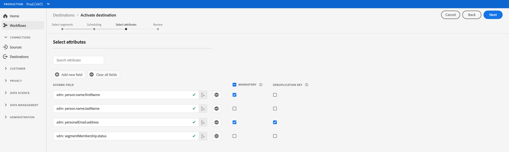

# Activation de profils et de segments vers une destination

## Présentation {#overview}

Activez les données que vous avez dans [!DNL Adobe Experience Platform] en mappant les segments aux destinations. Pour ce faire, suivez la procédure décrite ci-après.

## Conditions préalables  {#prerequisites}

Pour activer des données vers des destinations, vous devez avoir réussi à vous [connecter à une destination](./connect-destination.md). Si vous ne l’avez pas déjà fait, accédez au [catalogue des destinations](../catalog/overview.md), parcourez les destinations prises en charge et configurez une ou plusieurs destinations.

## Activation des données {#activate-data}

Les étapes du workflow d’activation varient légèrement d’un type de destination à l’autre. Le workflow complet de tous les types de destination est présenté ci-dessous.

## Sélectionner la destination vers laquelle activer les données {#select-destination}

S’applique à : Toutes les destinations

Dans l’interface utilisateur de Adobe Experience Platform, accédez à **[!UICONTROL Destinations]** > **[!UICONTROL Parcourir]**, puis cliquez sur le bouton **[!UICONTROL Activer]** correspondant à la destination vers laquelle vous souhaitez activer vos segments, comme illustré dans l’image ci-dessous.


Suivez les étapes de la section suivante pour sélectionner les segments que vous souhaitez activer.

## [!UICONTROL Étape Sélectionner les ] segments {#select-segments}

S’applique à : Toutes les destinations


Dans le workflow **[!UICONTROL Activer la destination]**, sur la page **[!UICONTROL Sélectionner des segments]**, sélectionnez un ou plusieurs segments à activer vers la destination. Sélectionnez **[!UICONTROL Suivant]** pour passer à l’étape suivante.


##  Etape de mappage {#mapping}

>[!CONTEXTUALHELP]
>id="platform_destinations_activate_applytransformation"
>title="Appliquer la transformation"
>abstract="Cochez cette option lorsque vous utilisez des champs source non hachés afin que Adobe Experience Platform les hache automatiquement lors de l’activation."

S’applique à : Destinations sociales et destination publicitaire de correspondance client Google


Pour les destinations sociales, vous devez sélectionner des attributs source ou des espaces de noms d’identité à mapper en tant qu’identités cibles dans la destination.

## Exemple : activation des données d’audience dans [!DNL Facebook Custom Audience] {#example-facebook}

Vous trouverez ci-dessous un exemple de mappage d’identité correct lors de l’activation des données d’audience dans [!DNL Facebook].

Sélection des champs sources :

* Sélectionnez l’espace de noms `Email` comme identité source si les adresses électroniques que vous utilisez ne sont pas hachées.
* Sélectionnez l’espace de noms `Email_LC_SHA256` comme identité source si vous avez haché les adresses électroniques du client lors de l’ingestion des données dans [!DNL Platform], conformément aux [!DNL Facebook] [exigences de hachage des emails](../catalog/social/facebook.md#email-hashing-requirements).
* Sélectionnez l’espace de noms `PHONE_E.164` comme identité source si vos données se composent de numéros de téléphone non hachés. [!DNL Platform] hachera les numéros de téléphone pour se conformer aux  [!DNL Facebook] exigences.
* Sélectionnez l’espace de noms `Phone_SHA256` comme identité source si vous avez haché des numéros de téléphone lors de l’ingestion de données dans [!DNL Platform], conformément aux [!DNL Facebook] [exigences de hachage des numéros de téléphone](../catalog/social/facebook.md#phone-number-hashing-requirements).
* Sélectionnez l’espace de noms `IDFA` comme identité source si vos données se composent d’identifiants d’appareil [!DNL Apple].
* Sélectionnez l’espace de noms `GAID` comme identité source si vos données se composent d’identifiants d’appareil [!DNL Android].
* Sélectionnez l’espace de noms `Custom` comme identité source si vos données sont composées d’autres types d’identifiants.

Sélection des champs cibles :

* Sélectionnez l’espace de noms `Email_LC_SHA256` comme identité cible lorsque vos espaces de noms source sont `Email` ou `Email_LC_SHA256`.
* Sélectionnez l’espace de noms `Phone_SHA256` comme identité cible lorsque vos espaces de noms source sont `PHONE_E.164` ou `Phone_SHA256`.
* Sélectionnez les espaces de noms `IDFA` ou `GAID` comme identité cible lorsque vos espaces de noms source sont `IDFA` ou `GAID`.
* Sélectionnez l’espace de noms `Extern_ID` comme identité cible lorsque l’espace de noms source est personnalisé.


Les données des espaces de noms non hachés sont automatiquement hachées par [!DNL Platform] lors de l’activation.

Les données de la source d’attributs ne sont pas automatiquement hachées. Lorsque votre champ source contient des attributs non hachés, cochez l&#39;option **[!UICONTROL Appliquer la transformation]** pour que [!DNL Platform] hache automatiquement les données lors de l&#39;activation.


 

## Exemple : activation des données d’audience dans [!DNL Google Customer Match] {#example-gcm}

Il s’agit d’un exemple de mappage d’identité correct lors de l’activation des données d’audience dans [!DNL Google Customer Match].

Sélection des champs sources :

* Sélectionnez l’espace de noms `Email` comme identité source si les adresses électroniques que vous utilisez ne sont pas hachées.
* Sélectionnez l’espace de noms `Email_LC_SHA256` comme identité source si vous avez haché les adresses électroniques du client lors de l’ingestion des données dans [!DNL Platform], conformément aux [!DNL Google Customer Match] [exigences de hachage des emails](../catalog/social/../advertising/google-customer-match.md).
* Sélectionnez l’espace de noms `PHONE_E.164` comme identité source si vos données se composent de numéros de téléphone non hachés. [!DNL Platform] hachera les numéros de téléphone pour se conformer aux  [!DNL Google Customer Match] exigences.
* Sélectionnez l’espace de noms `Phone_SHA256_E.164` comme identité source si vous avez haché des numéros de téléphone lors de l’ingestion de données dans [!DNL Platform], conformément aux [!DNL Facebook] [exigences de hachage des numéros de téléphone](../catalog/social/../advertising/google-customer-match.md).
* Sélectionnez l’espace de noms `IDFA` comme identité source si vos données se composent d’identifiants d’appareil [!DNL Apple].
* Sélectionnez l’espace de noms `GAID` comme identité source si vos données se composent d’identifiants d’appareil [!DNL Android].
* Sélectionnez l’espace de noms `Custom` comme identité source si vos données sont composées d’autres types d’identifiants.

Sélection des champs cibles :

* Sélectionnez l’espace de noms `Email_LC_SHA256` comme identité cible lorsque vos espaces de noms source sont `Email` ou `Email_LC_SHA256`.
* Sélectionnez l’espace de noms `Phone_SHA256_E.164` comme identité cible lorsque vos espaces de noms source sont `PHONE_E.164` ou `Phone_SHA256_E.164`.
* Sélectionnez les espaces de noms `IDFA` ou `GAID` comme identité cible lorsque vos espaces de noms source sont `IDFA` ou `GAID`.
* Sélectionnez l’espace de noms `User_ID` comme identité cible lorsque l’espace de noms source est personnalisé.


Les données des espaces de noms non hachés sont automatiquement hachées par [!DNL Platform] lors de l’activation.

Les données de la source d’attributs ne sont pas automatiquement hachées. Lorsque votre champ source contient des attributs non hachés, cochez l&#39;option **[!UICONTROL Appliquer la transformation]** pour que [!DNL Platform] hache automatiquement les données lors de l&#39;activation.


## **** Étape de planification {#scheduling}

S’applique à : Destinations de marketing par e-mail et destinations de stockage dans le cloud


[!DNL Adobe Experience Platform] exporte les données pour les destinations de marketing par e-mail et de stockage dans le cloud sous la forme de  [!DNL CSV] fichiers. À l’étape **[!UICONTROL Planification]**, vous pouvez configurer le planning et les noms des fichiers pour chaque segment que vous exportez. La configuration du planning est obligatoire, mais la configuration du nom de fichier est facultative.

>[!IMPORTANT]
> 
>[!DNL Adobe Experience Platform] divise automatiquement les fichiers d’exportation à 5 millions d’enregistrements (lignes) par fichier. Chaque ligne représente un profil.
>
>Les noms de fichiers fractionnés sont ajoutés avec un nombre indiquant que le fichier fait partie d’un export plus important, en tant que tel : `filename.csv`, `filename_2.csv`, `filename_3.csv`.

Sélectionnez le bouton **[!UICONTROL Créer un planning]** correspondant au segment que vous souhaitez envoyer à votre destination.


### Exporter les fichiers complets {#export-full-files}

Sélectionnez **[!UICONTROL Exporter les fichiers complets]** pour que les fichiers exportés contiennent un instantané complet de tous les profils qui remplissent les critères pour ce segment.


1. Utilisez le sélecteur **[!UICONTROL Fréquence]** pour choisir entre des exportations ponctuelles (**[!UICONTROL Une]**) ou **[!UICONTROL Quotidiennes]**. L’exportation d’un fichier complet **[!UICONTROL Quotidien]** exporte le fichier tous les jours de la date de début à la date de fin à 00h00 UTC (19h00 HNE).
2. Utilisez le sélecteur **[!UICONTROL Heure]** pour choisir l’heure de la journée, au format [!DNL UTC], où doit avoir lieu l’exportation. L’export d’un fichier **[!UICONTROL Quotidien]** exporte le fichier tous les jours de la date de début à la date de fin au moment sélectionné.

   >[!IMPORTANT]
   >
   >L’option permettant d’exporter des fichiers à un certain moment de la journée est actuellement en version bêta et n’est disponible que pour un certain nombre de clients.<br> <br> En raison de la configuration des processus Experience Platform internes, la première exportation incrémentielle ou complète de fichier peut ne pas contenir toutes les données de renvoi.  <br> <br> Pour garantir une exportation complète et à jour des données de renvoi pour les fichiers complets et incrémentiels, Adobe recommande de définir l’heure d’exportation du premier fichier après 12h GMT le jour suivant. Il s’agit d’une limitation qui sera corrigée dans les prochaines versions.

3. Utilisez le sélecteur **[!UICONTROL Date]** pour choisir le jour ou l’intervalle au cours duquel l’exportation doit avoir lieu.
4. Sélectionnez **[!UICONTROL Créer]** pour enregistrer le planning.

>[!IMPORTANT]
>
>La modification du planning d’exportation de fichiers pour les segments qui ont déjà été exportés n’est actuellement pas prise en charge. Pour réexporter des segments avec un planning différent, vous devez créer une nouvelle instance de destination. Il s’agit d’une limitation qui sera corrigée dans les prochaines versions.

### Exportation de fichiers incrémentiels {#export-incremental-files}

Sélectionnez **[!UICONTROL Exporter les fichiers incrémentiels]** pour que vos fichiers exportés ne contiennent que les profils qualifiés pour ce segment depuis le dernier export.

>[!IMPORTANT]
>
>Le premier fichier incrémentiel exporté comprend tous les profils qui remplissent les critères d’un segment et qui fonctionnent comme un renvoi.


1. Utilisez le sélecteur **[!UICONTROL Fréquence]** pour choisir entre **[!UICONTROL Quotidien]** ou **[!UICONTROL Horaire]** exportations. L’exportation d’un fichier incrémentiel **[!UICONTROL Quotidien]** exporte le fichier tous les jours de la date de début à la date de fin à 12h00 UTC (7h00 HNE).
   * Lorsque vous sélectionnez **[!UICONTROL Horaire]**, utilisez le sélecteur **[!UICONTROL Chaque]** pour choisir entre les options **[!UICONTROL 3]**, **[!UICONTROL 6]**, **[!UICONTROL 8]** et **[!UICONTROL 12]** heure.

      >[!IMPORTANT]
      >
      >L’option permettant d’exporter des fichiers incrémentiels toutes les 3, 6, 8 ou 12 heures est actuellement en version bêta et n’est disponible que pour un nombre restreint de clients. Les clients de la version non bêta peuvent exporter des fichiers incrémentiels une fois par jour.

2. Utilisez le sélecteur **[!UICONTROL Heure]** pour choisir l’heure de la journée, au format [!DNL UTC], où doit avoir lieu l’exportation.

   >[!IMPORTANT]
   >
   >L&#39;option permettant de sélectionner l&#39;heure de la journée pour l&#39;export n&#39;est disponible que pour un nombre restreint de clients. <br> <br> En raison de la configuration des processus Experience Platform internes, la première exportation incrémentielle ou complète de fichier peut ne pas contenir toutes les données de renvoi.  <br> <br> Pour garantir une exportation complète et à jour des données de renvoi pour les fichiers complets et incrémentiels, Adobe recommande de définir l’heure d’exportation du premier fichier après 12h GMT le jour suivant. Il s’agit d’une limitation qui sera corrigée dans les prochaines versions.

3. Utilisez le sélecteur **[!UICONTROL Date]** pour choisir le jour ou l’intervalle au cours duquel l’exportation doit avoir lieu.
4. Sélectionnez **[!UICONTROL Créer]** pour enregistrer le planning.

>[!IMPORTANT]
>
>La modification du planning d’exportation de fichiers pour les segments qui ont déjà été exportés n’est actuellement pas prise en charge. Pour réexporter des segments avec un planning différent, vous devez créer une nouvelle instance de destination. Il s’agit d’une limitation qui sera corrigée dans les prochaines versions.

### Configuration des noms de fichier {#file-names}

Les noms de fichier par défaut sont composés du nom de destination, de l’identifiant de segment et d’un indicateur de date et d’heure. Vous pouvez, par exemple, modifier les noms des fichiers exportés afin de faire la distinction entre les différentes campagnes ou d’ajouter le temps d’exportation des données aux fichiers.

Sélectionnez l’icône en forme de crayon pour ouvrir une fenêtre modale et modifier les noms des fichiers. Les noms de fichier sont limités à 255 caractères.


Dans l’éditeur de nom de fichier, vous pouvez sélectionner différents composants à ajouter au nom du fichier.


Le nom de destination et l’identifiant de segment ne peuvent pas être supprimés des noms de fichier. Vous pouvez en outre ajouter les éléments suivants :

* **[!UICONTROL Nom]** du segment : Vous pouvez ajouter le nom du segment au nom du fichier.
* **[!UICONTROL Date et heure]** : Choisissez entre l’ajout d’un  `MMDDYYYY_HHMMSS` format ou d’un horodatage Unix à 10 chiffres de l’heure de génération des fichiers. Choisissez l’une de ces options si vous souhaitez que vos fichiers aient un nom de fichier dynamique généré avec chaque export incrémentiel.
* **[!UICONTROL Texte personnalisé]** : Ajoutez du texte personnalisé aux noms des fichiers.

Sélectionnez **[!UICONTROL Appliquer les modifications]** pour confirmer votre sélection.

>[!IMPORTANT]
> 
>Si vous ne sélectionnez pas le composant **[!UICONTROL Date et heure]** , les noms de fichier seront statiques et le nouveau fichier exporté remplacera le fichier précédent dans votre emplacement de stockage par chaque exportation. Lors de l’exécution d’une tâche d’importation récurrente depuis un emplacement de stockage vers une plateforme de marketing par e-mail, il s’agit de l’option recommandée.

Une fois la configuration de tous les segments terminée, sélectionnez **[!UICONTROL Suivant]** pour continuer.

## **[!UICONTROL Étape]** Planifications de segment {#segment-schedule}

S’applique à : destinations publicitaires, destinations sociales


Sur la page **[!UICONTROL Planification du segment]** , vous pouvez définir la date de début de l’envoi des données à la destination et la fréquence d’envoi.

>[!IMPORTANT]
>
>Pour les destinations sociales, vous devez sélectionner l’origine de votre audience à cette étape. Vous ne pouvez passer à l’étape suivante qu’après avoir sélectionné l’une des options de l’image ci-dessous.


>[!IMPORTANT]
>
>Pour la correspondance client Google, vous devez fournir l’[!UICONTROL ID d’application] dans cette étape, lors de l’activation des segments [!DNL IDFA] ou [!DNL GAID].


## **[!UICONTROL Sélectionner]** Attributesstep {#select-attributes}

S’applique à : destinations de marketing par e-mail et destinations de stockage dans le cloud


Sur la page **[!UICONTROL Sélectionner les attributs]**, sélectionnez **[!UICONTROL Ajouter un nouveau champ]** et choisissez les attributs à envoyer à la destination.

>[!NOTE]
>
> Adobe Experience Platform préremplit votre sélection avec quatre attributs recommandés couramment utilisés de votre schéma : `person.name.firstName`, `person.name.lastName`, `personalEmail.address`, `segmentMembership.status`.

Les exportations de fichiers varient comme suit, selon que `segmentMembership.status` est sélectionné ou non :
* Si le champ `segmentMembership.status` est sélectionné, les fichiers exportés incluent des membres **[!UICONTROL Principal]** dans l’instantané complet initial et **[!UICONTROL Principal]** et des membres **[!UICONTROL expirés]** dans les exportations incrémentielles suivantes.
* Si le champ `segmentMembership.status` n’est pas sélectionné, les fichiers exportés incluent uniquement les membres **[!UICONTROL Principal]** dans l’instantané complet initial et dans les exportations incrémentielles suivantes.



### Attributs obligatoires {#mandatory-attributes}

>[!CONTEXTUALHELP]
>id="platform_destinations_activate_mandatorykey"
>title="A propos des attributs obligatoires"
>abstract="Sélectionnez les attributs de schéma XDM que tous les profils exportés doivent inclure. Les profils sans clé obligatoire ne sont pas exportés vers la destination. Si vous ne sélectionnez pas de clé obligatoire, tous les profils qualifiés sont exportés, quels que soient leurs attributs."
>additional-url="http://www.adobe.com/go/destinations-mandatory-attributes-en" text="En savoir plus dans la documentation"

Vous pouvez marquer les attributs comme obligatoires pour vous assurer que [!DNL Platform] exporte uniquement les profils qui incluent l’attribut spécifique. Par conséquent, il peut être utilisé comme une forme supplémentaire de filtrage. Le marquage d’un attribut comme obligatoire est **non** obligatoire.

Si vous ne sélectionnez pas d’attribut obligatoire, tous les profils qualifiés sont exportés, quels que soient leurs attributs.

Il est recommandé que l’un des attributs soit un [identifiant unique](../../destinations/catalog/email-marketing/overview.md#identity) de votre schéma. Pour plus d’informations sur les attributs obligatoires, consultez la section Identité de la documentation [Destinations de marketing par e-mail](../../destinations/catalog/email-marketing/overview.md#identity) .

### Clés de déduplication {#deduplication-keys}

>[!CONTEXTUALHELP]
>id="platform_destinations_activate_deduplicationkey"
>title="A propos des clés de déduplication"
>abstract="Éliminez plusieurs enregistrements du même profil dans les fichiers d&#39;export en sélectionnant une clé de déduplication. Sélectionnez un espace de noms unique ou jusqu’à deux attributs de schéma XDM comme clé de déduplication. Si vous ne sélectionnez pas de clé de déduplication, il se peut que des entrées de profil soient dupliquées dans les fichiers d’exportation."
>additional-url="http://www.adobe.com/go/destinations-deduplication-keys-en" text="En savoir plus dans la documentation"

>[!IMPORTANT]
>
>L’option permettant d’utiliser les clés de déduplication est actuellement en version bêta et n’est disponible que pour un certain nombre de clients.

Les clés de déduplication éliminent la possibilité dʼavoir plusieurs enregistrements du même profil dans un fichier dʼexportation.

Il existe trois façons d’utiliser les clés de déduplication dans [!DNL Platform] :

* Utilisation d’un espace de noms d’identité unique comme [!UICONTROL clé de déduplication]
* Utilisation d’un attribut de profil unique à partir d’un profil [!DNL XDM] en tant que [!UICONTROL clé de déduplication]
* Utilisation de deux attributs de profil d’un profil [!DNL XDM] comme clé composite

>[!IMPORTANT]
>
> Vous pouvez exporter un espace de noms d’identité unique vers une destination et l’espace de noms est automatiquement défini comme clé de déduplication. L’envoi de plusieurs espaces de noms à une destination n’est pas pris en charge.
> 
> Vous ne pouvez pas utiliser une combinaison d’espaces de noms d’identité et d’attributs de profil comme clés de déduplication.

### Exemple de déduplication {#deduplication-example}

Cet exemple illustre le fonctionnement de la déduplication, en fonction des clés de déduplication sélectionnées.

Examinons les deux profils suivants.

**Profil A**

```json
{
  "identityMap": {
    "Email": [
      {
        "id": "johndoe_1@example.com"
      },
      {
        "id": "johndoe_2@example.com"
      }
    ]
  },
  "segmentMembership": {
    "ups": {
      "fa5c4622-6847-4199-8dd4-8b7c7c7ed1d6": {
        "status": "existing",
        "lastQualificationTime": "2021-03-10 10:03:08"
      }
    }
  },
  "person": {
    "name": {
      "lastName": "Doe",
      "firstName": "John"
    }
  },
  "personalEmail": {
    "address": "johndoe@example.com"
  }
}
```

**Profil B**

```json
{
  "identityMap": {
    "Email": [
      {
        "id": "johndoe_1@example.com"
      },
      {
        "id": "johndoe_2@example.com"
      }
    ]
  },
  "segmentMembership": {
    "ups": {
      "fa5c4622-6847-4199-8dd4-8b7c7c7ed1d6": {
        "status": "existing",
        "lastQualificationTime": "2021-04-10 11:33:28"
      }
    }
  },
  "person": {
    "name": {
      "lastName": "D",
      "firstName": "John"
    }
  },
  "personalEmail": {
    "address": "johndoe@example.com"
  }
}
```

### Cas d’utilisation 1 de la déduplication : pas de déduplication

Sans dédoublonnage, le fichier d&#39;export contiendrait les entrées suivantes.

| personalEmail | firstName | lastName |
|---|---|---|
| johndoe@example.com | John | Doe |
| johndoe@example.com | John | D |


### Cas d’utilisation 2 de la déduplication : déduplication basée sur l’espace de noms d’identité

En supposant une déduplication par l’espace de noms [!DNL Email], le fichier d’exportation contiendra les entrées suivantes. Le profil B est le dernier qui a rempli les critères pour le segment. Il est donc le seul à être exporté.

| Email* | personalEmail | firstName | lastName |
|---|---|---|---|
| johndoe_1@example.com | johndoe@example.com | John | D |
| johndoe_2@example.com | johndoe@example.com | John | D |

### Cas d’utilisation 3 de la déduplication : déduplication basée sur un attribut de profil unique

En supposant une déduplication par l’attribut `personal Email` , le fichier d’exportation contiendra l’entrée suivante. Le profil B est le dernier qui a rempli les critères pour le segment. Il est donc le seul à être exporté.

| personalEmail* | firstName | lastName |
|---|---|---|
| johndoe@example.com | John | D |


### Cas d’utilisation 4 de la déduplication : déduplication basée sur deux attributs de profil (clé de déduplication composite)

En supposant une déduplication par la clé composite `personalEmail + lastName`, le fichier d’exportation contiendra les entrées suivantes.

| personalEmail* | lastName* | firstName |
|---|---|---|
| johndoe@example.com | D | John |
| johndoe@example.com | Doe | John |


Adobe recommande de sélectionner un espace de noms d’identité tel qu’une [!DNL CRM ID] ou une adresse électronique comme clé de déduplication, afin de s’assurer que tous les enregistrements de profil sont identifiés de manière unique.

>[!NOTE]
> 
>Si des libellés d’utilisation des données ont été appliqués à certains champs d’un jeu de données (plutôt qu’à l’ensemble du jeu de données), l’application de ces libellés au niveau du champ lors de l’activation se produit dans les conditions suivantes :
>
>* Les champs sont utilisés dans la définition de segment.
>* Les champs sont configurés en tant qu’attributs prévisionnels pour la destination cible.

>
> 
Par exemple, si le champ `person.name.firstName` contient certains libellés d’utilisation des données qui entrent en conflit avec l’action marketing de la destination, une violation de la politique d’utilisation des données s’affichera à l’étape de révision. Pour plus d’informations, voir [Gouvernance des données dans Adobe Experience Platform](../../rtcdp/privacy/data-governance-overview.md#destinations).

## **** Étape de révision {#review}

S’applique à : toutes les destinations


Sur la page **[!UICONTROL Vérifier]**, vous pouvez voir un résumé de votre sélection. Sélectionnez **[!UICONTROL Annuler]** pour interrompre le flux, **[!UICONTROL Précédent]** pour modifier vos paramètres ou **[!UICONTROL Terminer]** pour confirmer votre sélection et commencer à envoyer les données à la destination.

>[!IMPORTANT]
>
>Au cours de cette étape, Adobe Experience Platform recherche les violations de stratégie d’utilisation des données. Vous trouverez ci-dessous un exemple de violation d’une stratégie. Vous ne pouvez pas terminer le workflow d’activation du segment tant que vous n’avez pas résolu la violation. Pour plus d’informations sur la manière de résoudre les violations de stratégie, voir [Application de la stratégie](../../rtcdp/privacy/data-governance-overview.md#enforcement) dans la section de documentation sur la gouvernance des données.


Si aucune violation de stratégie n’a été détectée, sélectionnez **[!UICONTROL Terminer]** pour confirmer votre sélection et commencer à envoyer les données à la destination.


## Vérification de la réussite de l’activation du segment {#verify-activation}

### Destinations de marketing par e-mail  et destinations de stockage dans le cloud {#esp-and-cloud-storage}

Pour les destinations de marketing par e-mail et de stockage dans le cloud, Adobe Experience Platform crée un fichier `.csv` délimité par des tabulations dans l’emplacement de stockage que vous avez fourni. Attendez-vous à ce qu’un nouveau fichier soit créé chaque jour à votre emplacement de stockage. Le format de fichier par défaut est le suivant :
`<destinationName>_segment<segmentID>_<timestamp-yyyymmddhhmmss>.csv`

Les fichiers que vous pouvez recevoir pendant trois jours consécutifs peuvent ressembler à ceux-ci :

```console
Salesforce_Marketing_Cloud_segment12341e18-abcd-49c2-836d-123c88e76c39_20200408061804.csv
Salesforce_Marketing_Cloud_segment12341e18-abcd-49c2-836d-123c88e76c39_20200409052200.csv
Salesforce_Marketing_Cloud_segment12341e18-abcd-49c2-836d-123c88e76c39_20200410061130.csv
```

La présence de ces fichiers dans votre emplacement de stockage est la confirmation de la réussite de l’activation. Pour comprendre la structure des fichiers exportés, vous pouvez [télécharger un exemple de fichier .csv](../assets/common/sample_export_file_segment12341e18-abcd-49c2-836d-123c88e76c39_20200408061804.csv). Ce fichier d’exemple comprend les attributs de profil `person.firstname`, `person.lastname`, `person.gender`, `person.birthyear` et `personalEmail.address`.

## Destinations publicitaires

Vérifiez votre compte dans la destination publicitaire vers laquelle vous activez vos données. Si l’activation a réussi, les audiences sont renseignées dans votre plateforme publicitaire.

## Destinations sociales

Pour [!DNL Facebook], une activation réussie signifie qu’une audience personnalisée [!DNL Facebook] serait créée par programmation dans [[!UICONTROL Facebook Ads Manager]](https://www.facebook.com/adsmanager/manage/). L’adhésion au segment dans l’audience est ajoutée ou supprimée selon que les utilisateurs sont qualifiés ou disqualifiés pour les segments activés.

>[!TIP]
>
>L’intégration entre Adobe Experience Platform et [!DNL Facebook] prend en charge les renvoi d’audience historiques. Toutes les qualifications de segments historiques sont envoyées à [!DNL Facebook] lorsque vous activez les segments vers la destination.

## Désactivation de l’activation {#disable-activation}

Pour désactiver un flux d’activation existant, procédez comme suit :

1. Sélectionnez **[!UICONTROL Destinations]** dans la barre de navigation de gauche, cliquez sur l’onglet **[!UICONTROL Parcourir]**, puis sur le nom de la destination.
2. Cliquez sur la commande **[!UICONTROL Activé]** dans le rail de droite pour modifier l’état du flux d’activation.
3. Dans la fenêtre **Mettre à jour l’état du flux de données**, sélectionnez **Confirmer** pour désactiver le flux d’activation.
