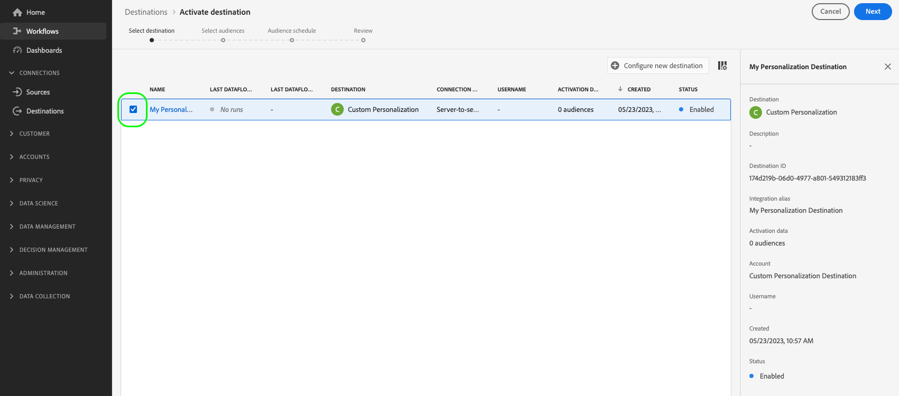

# Activer les audiences vers des destinations de personnalisation Edge

## Vue d’ensemble {#overview}

Adobe Experience Platform utilise la [segmentation edge](../../segmentation/methods/edge-segmentation.md) ainsi que les [destinations edge](/help/destinations/destination-types.md#edge-personalization-destinations) pour permettre aux clients de créer et de cibler des audiences à grande échelle et en temps réel. Cette fonctionnalité vous permet de configurer des cas d’utilisation de personnalisation de la même page et de la page suivante.

Les connexions [Adobe Target](../../destinations/catalog/personalization/adobe-target-connection.md) et [Personnalisation personnalisée](../../destinations/catalog/personalization/custom-personalization.md) sont des exemples de destinations Edge.

>[!NOTE]
>
>Lors de la [configuration de la connexion Adobe Target](../catalog/personalization/adobe-target-connection.md) *sans* à l’aide d’un identifiant de flux de données, les cas d’utilisation décrits dans cet article ne sont pas pris en charge. Seuls les cas d’utilisation de la personnalisation de session suivante sont pris en charge en l’absence de flux de données.

>[!IMPORTANT]
> 
> * Pour activer les données et activer l’[étape de mappage](#mapping) du workflow, vous devez disposer des autorisations de contrôle d’accès **[!UICONTROL Afficher les destinations]**, **[!UICONTROL Activer les destinations]**, **[!UICONTROL Afficher les profils]** et **[!UICONTROL Afficher les segments]** .
> * Pour activer les données sans passer par l’étape [mappage](#mapping) du workflow, vous devez disposer des **[!UICONTROL Affichage des destinations]**, **[!UICONTROL Activation du segment sans mappage]**, **[!UICONTROL Affichage des profils]** et **[!UICONTROL Affichage des segments]** [autorisations de contrôle d’accès](/help/access-control/home.md#permissions).
>* Pour exporter des *identités*, vous devez disposer de l’autorisation de contrôle d’accès **[!UICONTROL Afficher le graphique d’identités]** .   {width="100" zoomable="yes"}
> 
> Lisez la [présentation du contrôle d’accès](/help/access-control/ui/overview.md) ou contactez votre administrateur ou administratrice du produit pour obtenir les autorisations requises.

Cet article explique le processus requis pour activer des audiences vers des destinations Edge de Adobe Experience Platform. Utilisées conjointement avec la [segmentation Edge](../../segmentation/methods/edge-segmentation.md) et le mappage facultatif [attributs de profil](#mapping), ces destinations permettent des cas d’utilisation de la personnalisation sur une même page et sur la page suivante sur vos propriétés web et mobiles.

Pour un bref aperçu sur la configuration de la connexion Adobe Target pour la personnalisation Edge, regardez la vidéo ci-dessous.

>[!NOTE]
>
>L’interface utilisateur d’Experience Platform est fréquemment mise à jour et peut avoir changé depuis l’enregistrement de cette vidéo. Pour obtenir les informations les plus récentes, reportez-vous aux étapes de configuration décrites dans les sections ci-dessous.

>[!VIDEO](https://video.tv.adobe.com/v/3418799/?quality=12&learn=on)

Pour un bref aperçu sur le partage d’audiences et d’attributs de profil vers des destinations Adobe Target et de personnalisation personnalisée, regardez la vidéo ci-dessous.

>[!VIDEO](https://video.tv.adobe.com/v/3419036/?quality=12&learn=on)

## Cas d’utilisation {#use-cases}

Utilisez les solutions de personnalisation Adobe, telles qu’Adobe Target, ou vos propres plateformes de partenaires de personnalisation (par exemple, [!DNL Optimizely], [!DNL Pega]), ainsi que des systèmes propriétaires (par exemple, CMS interne) pour améliorer l’expérience de personnalisation des clients via la destination [Custom Personalization](../catalog/personalization/custom-personalization.md). Tout cela en exploitant les fonctionnalités de collecte de données et de segmentation d’Experience Platform Edge Network.

Les cas d’utilisation décrits ci-dessous incluent à la fois la personnalisation du site et la publicité sur site ciblée.

Pour activer ces cas d’utilisation, les clients ont besoin d’un moyen rapide et simplifié de récupérer les audiences et les informations d’attribut de profil d’Experience Platform, et d’envoyer ces informations aux connexions [Adobe Target](../catalog/personalization/adobe-target-connection.md) ou [Custom Personalization](../catalog/personalization/custom-personalization.md) dans l’interface utilisateur d’Experience Platform.

### Personnalisation de la même page {#same-page}

Un utilisateur visite une page de votre site web. Vous pouvez utiliser les informations de visite de la page en cours (par exemple, l’URL de référence, la langue du navigateur, les informations de produit incorporées) pour sélectionner l’action ou la décision suivante (par exemple, la personnalisation) à l’aide de la connexion [Personnalisation personnalisée](../catalog/personalization/custom-personalization.md) pour les plateformes non Adobe (par exemple, [!DNL Pega], [!DNL Optimizely] ou autres).

### Personnalisation de la page suivante {#next-page}

Un utilisateur visite la page A de votre site web. En fonction de cette interaction, l’utilisateur s’est qualifié pour un ensemble d’audiences. L’utilisateur clique ensuite sur un lien qui le mène de la page A à la page B. Les audiences pour lesquelles l’utilisateur s’est qualifié lors de l’interaction précédente sur la page A, ainsi que les mises à jour de profil déterminées par la visite actuelle du site web, seront utilisées pour alimenter l’action ou la décision suivante (par exemple, la bannière publicitaire à afficher pour le visiteur ou, dans le cas de tests A/B, la version de la page à afficher).

### Personnalisation de la prochaine session {#next-session}

Un utilisateur visite plusieurs pages de votre site web. En fonction de ces interactions, l’utilisateur s’est qualifié pour un ensemble d’audiences. L’utilisateur met ensuite fin à la session de navigation en cours.

Le lendemain, l’utilisateur revient sur le même site web client. Les audiences pour lesquelles ils se sont qualifiés lors de l’interaction précédente avec toutes les pages du site web visitées, ainsi que les mises à jour de profil déterminées par la visite actuelle du site web, seront utilisées pour sélectionner l’action/la décision suivante (par exemple, la bannière publicitaire à afficher pour le visiteur ou, dans le cas de tests A/B, la version de la page à afficher).

### Personnaliser une bannière de page d’accueil {#home-page-banner}

Une société de location et de vente d’habitations souhaite personnaliser sa page d’accueil avec une bannière, en fonction des qualifications d’audience dans Adobe Experience Platform. L’entreprise peut sélectionner les audiences qui doivent bénéficier d’une expérience personnalisée et les envoyer à Adobe Target en tant que critères de ciblage pour son offre Target.

## Conditions préalables {#prerequisites}

### Configurer un flux de données dans l’interface utilisateur de collecte de données {#configure-datastream}

La première étape de la configuration de votre destination de personnalisation consiste à configurer un flux de données pour le SDK web Experience Platform. Cette opération est effectuée dans l’interface utilisateur de la collecte de données.

Lors de la configuration du flux de données, sous **[!UICONTROL Adobe Experience Platform]** assurez-vous que la **[!UICONTROL Segmentation Edge]** et les **[!UICONTROL Destinations de personnalisation]** sont bien sélectionnées.

>[!TIP]
>
>À compter de la version d’avril 2024, il n’est pas nécessaire de cocher la case Segmentation Edge lors de la [configuration de la connexion à Adobe Target](/help/destinations/catalog/personalization/adobe-target-connection.md). Dans ce cas, la [personnalisation de session suivante](#next-session) est le seul cas d’utilisation de personnalisation disponible.

Pour plus d’informations sur la configuration d’un flux de données, suivez les instructions décrites dans la section [Documentation du SDK web Platform](../../datastreams/configure.md#aep).

### Création d’une politique de fusion [!DNL Active-On-Edge] {#create-merge-policy}

Une fois la connexion de destination créée, vous devez créer une politique de fusion [!DNL Active-On-Edge]. La politique de fusion [!DNL Active-On-Edge] garantit que les audiences sont constamment évaluées [à la périphérie](../../segmentation/methods/edge-segmentation.md) et sont disponibles pour les cas d’utilisation de la personnalisation en temps réel et de la page suivante.

>[!IMPORTANT]
>
>Actuellement, les destinations Edge ne prennent en charge que l’activation des audiences qui utilisent la [politique de fusion Active-on-Edge](../../segmentation/ui/segment-builder.md#merge-policies) définie par défaut. Si vous mappez des audiences qui utilisent une politique de fusion différente avec des destinations Edge, ces audiences ne seront pas évaluées.

Suivez les instructions de la section [création d’une politique de fusion](../../profile/merge-policies/ui-guide.md#create-a-merge-policy) et assurez-vous d’activer le bouton **[!UICONTROL Politique de fusion Active-On-Edge]**.

### Création d’une audience dans Platform {#create-audience}

Après avoir créé la politique de fusion [!DNL Active-On-Edge], vous devez créer une nouvelle audience dans Platform.

Suivez le guide [créateur d’audiences](../../segmentation/ui/segment-builder.md) pour créer votre audience et veillez à [lui attribuer](../../segmentation/ui/segment-builder.md#merge-policies) la politique de fusion [!DNL Active-On-Edge] que vous avez créée à l’étape précédente.

### Créer une connexion de destination {#connect-destination}

Après avoir configuré votre flux de données, vous pouvez commencer à configurer votre destination de personnalisation.

Suivez le [tutoriel sur la création de connexion de destination](../ui/connect-destination.md) pour obtenir des instructions détaillées sur la création d’une connexion de destination.

Selon la destination configurée, reportez-vous aux articles suivants pour connaître les conditions préalables spécifiques à une destination et les informations connexes :

* [Connexion Adobe Target](../catalog/personalization/adobe-target-connection.md#parameters)
* [Connexion de personnalisation personnalisée](../catalog/personalization/custom-personalization.md#parameters)

## Sélectionner votre destination {#select-destination}

Une fois les conditions préalables remplies, vous pouvez sélectionner la destination de personnalisation Edge à utiliser pour la personnalisation de la même page et de la page suivante.

1. Accédez à **[!UICONTROL Connexions > Destinations]**, puis sélectionnez l’onglet **[!UICONTROL Catalogue]**.

   

1. Sélectionnez **[!UICONTROL Activer les audiences]** sur la vignette correspondant à la destination de personnalisation vers laquelle vous souhaitez activer vos audiences, comme illustré dans l’image ci-dessous.

   

1. Sélectionnez la connexion de destination à utiliser pour activer les audiences, puis sélectionnez **[!UICONTROL Suivant]**.

   

1. Accédez à la section suivante pour [sélectionner vos audiences](#select-audiences).

## Sélectionner vos audiences {#select-audiences}

Utilisez les cases à cocher situées à gauche des noms d’audience pour sélectionner les audiences à activer vers la destination, puis sélectionnez **[!UICONTROL Suivant]**.

Pour sélectionner les audiences à activer vers la destination, utilisez les cases à cocher situées à gauche des noms d’audience, puis sélectionnez **[!UICONTROL Suivant]**.

Vous pouvez effectuer un choix parmi plusieurs types d’audiences, selon leur origine :

* **[!UICONTROL Segmentation Service]** : audiences générées dans Experience Platform par le service de segmentation. Voir la [documentation sur la segmentation](../../segmentation/ui/overview.md) pour plus d’informations.
* **[!UICONTROL Chargement personnalisé]** : audiences générées en dehors d’Experience Platform et chargées dans Platform au format CSV. Pour en savoir plus sur les audiences externes, consultez la documentation sur [importation d’une audience](../../segmentation/ui/audience-portal.md#import-audience).
* Autres types d’audiences, provenant d’autres solutions Adobe, telles que [!DNL Audience Manager].

## Attributs de mappage {#mapping}

>[!IMPORTANT]
>
>Les attributs de profil peuvent contenir des données sensibles. Pour protéger ces données, la destination **[!UICONTROL Custom Personalization]** nécessite que vous utilisiez l’API du serveur Edge Network  lors de la configuration de la destination pour la personnalisation basée sur les attributs. Tous les appels de l’API du serveur doivent être effectués dans un [ contexte authentifié ](../../server-api/authentication.md).
>
> Si vous utilisez déjà Web SDK ou Mobile SDK pour votre intégration, vous pouvez récupérer les attributs via l’API du serveur en ajoutant une intégration côté serveur.
>
> Si vous ne suivez pas les exigences ci-dessus, la personnalisation sera basée sur l’appartenance à l’audience uniquement.

Sélectionnez les attributs en fonction desquels vous souhaitez activer les cas d’utilisation de personnalisation pour vos utilisateurs. Cela signifie que si la valeur d’un attribut change ou si un attribut est ajouté à un profil, ce profil devient membre de l’audience et est activé vers la destination de personnalisation.

L’ajout d’attributs est facultatif et vous pouvez toujours passer à l’étape suivante et activer la personnalisation de la même page et de la page suivante sans sélectionner d’attributs. Si vous n’ajoutez aucun attribut à cette étape, la personnalisation se produira toujours en fonction de l’appartenance à l’audience et des qualifications de mappage d’identité pour les profils.

### Sélectionner les attributs sources {#select-source-attributes}

Pour ajouter des attributs sources, sélectionnez le contrôle **[!UICONTROL Ajouter un nouveau champ]** dans la colonne **[!UICONTROL Source]** et recherchez ou accédez au champ d’attribut XDM de votre choix, comme illustré ci-dessous.

### Sélectionner les attributs cibles {#select-target-attributes}

Pour ajouter des attributs cibles, sélectionnez le contrôle **[!UICONTROL Ajouter un nouveau champ]** dans la colonne **[!UICONTROL Champ cible]** et saisissez le nom de l’attribut personnalisé auquel vous souhaitez mapper l’attribut source.

>[!NOTE]
>
>La sélection des attributs de la cible s’applique uniquement au workflow d’activation [Custom Personalization](../catalog/personalization/custom-personalization.md), afin de prendre en charge le mappage des champs de nom convivial dans la plateforme de destination.

## Planifier l’export d’audience {#scheduling}

Par défaut, la page [!UICONTROL Planning des audiences] affiche uniquement les audiences nouvellement sélectionnées que vous avez sélectionnées dans le flux d’activation actuel.

Pour afficher toutes les audiences activées vers la destination, utilisez l’option de filtrage et désactivez le filtre **[!UICONTROL Afficher les nouvelles audiences uniquement]**.

Sur la page **[!UICONTROL Planning des audiences]**, sélectionnez chaque audience, puis utilisez les sélecteurs **[!UICONTROL Date de début]** et **[!UICONTROL Date de fin]** pour configurer l’intervalle de temps pour l’envoi des données vers la destination.

Sélectionnez **[!UICONTROL Suivant]** pour accéder à la page [!UICONTROL Réviser].

## Révision {#review}

Sur la page **[!UICONTROL Vérifier]**, vous pouvez voir un résumé de votre sélection. Sélectionnez **[!UICONTROL Annuler]** pour interrompre le flux, **[!UICONTROL Précédent]** pour modifier vos paramètres ou **[!UICONTROL Terminer]** pour confirmer votre sélection et commencer à envoyer les données à la destination.

### Évaluation des politiques de consentement {#consent-policy-evaluation}

Si votre organisation a acheté **Adobe HealthCare Shield** ou **Adobe Privacy &amp; Security Shield**, sélectionnez **[!UICONTROL Afficher les politiques de consentement applicables]** pour identifier les politiques de consentement appliquées et le nombre de profils inclus dans l&#39;activation qui en résulte. Pour plus d’informations, consultez [ Évaluation des politiques de consentement ](/help/data-governance/enforcement/auto-enforcement.md#consent-policy-evaluation) .

### Vérifications des politiques d’utilisation des données {#data-usage-policy-checks}

À l’étape **[!UICONTROL Révision]**, Experience Platform vérifie également les violations de la politique d’utilisation des données. Vous trouverez ci-dessous un exemple de violation de la politique. Vous ne pouvez pas terminer le workflow d’activation de l’audience tant que vous n’avez pas résolu la violation. Pour plus d’informations sur la résolution des violations de politique, consultez la section sur les violations de politique d’utilisation des données [data usage policy violations](/help/data-governance/enforcement/auto-enforcement.md#data-usage-violation) dans la documentation sur la gouvernance des données .

### Filtrer les audiences {#filter-audiences}

Au cours de cette étape, vous pouvez utiliser les filtres disponibles sur la page pour afficher uniquement les audiences dont le planning ou le mappage a été mis à jour dans le cadre de ce workflow. Vous pouvez également activer/désactiver les colonnes du tableau à afficher.

Si vous êtes satisfait(e) de votre sélection et qu’aucune violation de politique n’a été détectée, sélectionnez **[!UICONTROL Terminer]** pour confirmer votre sélection et commencer à envoyer des données à la destination.

<!--

Commenting out this part since destination monitoring is not available currently for the Adobe Target and Custom Personalization destinations.

## Verify audience activation {#verify}

Check the [destination monitoring documentation](../../dataflows/ui/monitor-destinations.md) for detailed information on how to monitor the flow of data to your destinations.

-->
