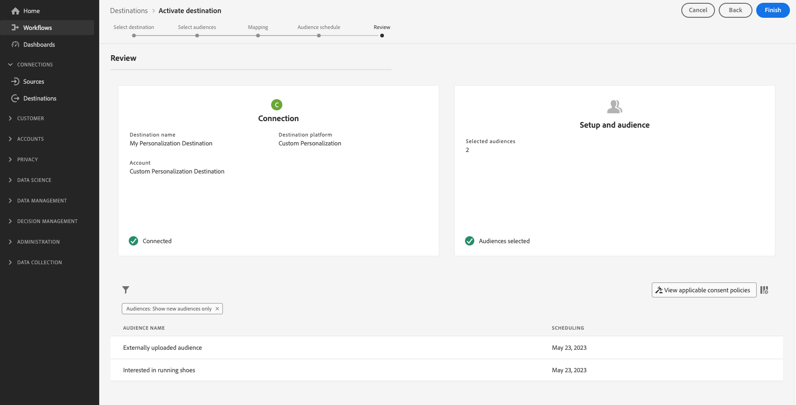

# Activer les audiences vers des destinations de personnalisation Edge

## Vue d’ensemble {#overview}

Utilisation de Adobe Experience Platform [segmentation de périphérie](../../segmentation/ui/edge-segmentation.md) ensemble avec [destinations de périphérie](/help/destinations/destination-types.md#edge-personalization-destinations) pour permettre aux clients de créer et de cibler des audiences à grande échelle, en temps réel. Cette fonctionnalité vous permet de configurer des cas d’utilisation de personnalisation de la même page et de la page suivante.

Voici des exemples de destinations de périphérie : [Adobe Target](../../destinations/catalog/personalization/adobe-target-connection.md) et la variable [Personnalisation personnalisée](../../destinations/catalog/personalization/custom-personalization.md) connexions.

>[!NOTE]
>
>When [configuration de la connexion Adobe Target](../catalog/personalization/adobe-target-connection.md) *without* à l’aide d’un identifiant de flux de données, les cas d’utilisation décrits dans cet article ne sont pas pris en charge. Seuls les cas d’utilisation de la personnalisation de session suivante sont pris en charge en l’absence de flux de données.

>[!IMPORTANT]
> 
> * Pour activer les données et activer la variable [étape de mappage](#mapping) du workflow, vous avez besoin de l’événement **[!UICONTROL Affichage des destinations]**, **[!UICONTROL Activation des destinations]**, **[!UICONTROL Afficher les profils]**, et **[!UICONTROL Affichage de segments]** [autorisations de contrôle d’accès](/help/access-control/home.md#permissions).
> * Pour activer les données sans passer par la fonction [étape de mappage](#mapping) du workflow, vous avez besoin de l’événement **[!UICONTROL Affichage des destinations]**, **[!UICONTROL Activation du segment sans mappage]**, **[!UICONTROL Afficher les profils]**, et **[!UICONTROL Affichage de segments]** [autorisations de contrôle d’accès](/help/access-control/home.md#permissions).
>* Pour exporter *identités*, vous avez besoin de la fonction **[!UICONTROL Affichage du graphique des identités]** [autorisation de contrôle d’accès](/help/access-control/home.md#permissions).   {width="100" zoomable="yes"}
> 
> Lisez la [présentation du contrôle d’accès](/help/access-control/ui/overview.md) ou contactez votre administrateur ou administratrice du produit pour obtenir les autorisations requises.

Cet article explique le processus requis pour activer les audiences vers les destinations Adobe Experience Platform Edge. Utilisé conjointement avec [segmentation de périphérie](../../segmentation/ui/edge-segmentation.md) et le paramètre facultatif [mapping des attributs de profil](#mapping), ces destinations activent des cas d’utilisation de la personnalisation de la même page et de la page suivante sur vos propriétés web et mobiles.

Pour un bref aperçu de la configuration de la connexion Adobe Target pour la personnalisation Edge, regardez la vidéo ci-dessous.

>[!NOTE]
>
>L’interface utilisateur d’Experience Platform est fréquemment mise à jour et peut avoir changé depuis l’enregistrement de cette vidéo. Pour obtenir les informations les plus récentes, reportez-vous aux étapes de configuration décrites dans les sections ci-dessous.

>[!VIDEO](https://video.tv.adobe.com/v/3418799/?quality=12&learn=on)

Pour une brève présentation du partage d’audiences et d’attributs de profil vers Adobe Target et des destinations de personnalisation personnalisées, regardez la vidéo ci-dessous.

>[!VIDEO](https://video.tv.adobe.com/v/3419036/?quality=12&learn=on)

## Cas d’utilisation {#use-cases}

Utilisez des solutions de personnalisation d’Adobe, telles qu’Adobe Target, ou vos propres plateformes de partenaire de personnalisation (par exemple, [!DNL Optimizely], [!DNL Pega]), ainsi que les systèmes propriétaires (par exemple, les systèmes de gestion de contenu intégrés) pour offrir une expérience de personnalisation plus approfondie aux clients via la fonction [Personalization personnalisée](../catalog/personalization/custom-personalization.md) destination. Tout cela tout en tirant parti des fonctionnalités Experience Platform de collecte et de segmentation des données Edge Network.

Les cas d’utilisation décrits ci-dessous incluent à la fois la personnalisation du site et la publicité ciblée sur site.

Pour activer ces cas d’utilisation, les clients ont besoin d’une méthode rapide et simplifiée pour récupérer à la fois les audiences et les informations d’attribut de profil de l’Experience Platform, puis envoyer ces informations à l’une des méthodes suivantes : [Adobe Target](../catalog/personalization/adobe-target-connection.md) ou le [Personalization personnalisée](../catalog/personalization/custom-personalization.md) connexions dans l’interface utilisateur de l’Experience Platform.

### Personnalisation de la même page {#same-page}

Un utilisateur visite une page de votre site web. Vous pouvez utiliser les informations actuelles sur la visite de la page (par exemple, l’URL de référence, la langue du navigateur, les informations sur les produits incorporés) pour sélectionner l’action ou la décision suivante (par exemple, la personnalisation), en utilisant la variable [Personnalisation personnalisée](../catalog/personalization/custom-personalization.md) connexion pour les plateformes non Adobes (par exemple, [!DNL Pega], [!DNL Optimizely] ou autres.)

### Personnalisation de la page suivante {#next-page}

Un utilisateur visite la page A de votre site web. En fonction de cette interaction, l’utilisateur a rempli les critères d’un ensemble d’audiences. L’utilisateur clique ensuite sur un lien qui le mène de la page A à la page B. Les audiences auxquelles l’utilisateur s’était qualifié lors de l’interaction précédente sur la page A, ainsi que les mises à jour de profil déterminées par la visite actuelle du site web, seront utilisées pour alimenter l’action ou la décision suivante (par exemple, la bannière publicitaire à afficher au visiteur ou, dans le cas de tests A/B, la version de la page à afficher).

### Personnalisation de la prochaine session {#next-session}

Un utilisateur visite plusieurs pages de votre site web. En fonction de ces interactions, l’utilisateur s’est qualifié pour un ensemble d’audiences. L’utilisateur met ensuite fin à la session de navigation actuelle.

Le lendemain, l’utilisateur revient au même site web client. Les audiences pour lesquelles ils avaient rempli les critères lors de l’interaction précédente avec toutes les pages du site web visitées, ainsi que les mises à jour de profil déterminées par la visite du site web en cours, seront utilisées pour sélectionner l’action/la décision suivante (par exemple, la bannière publicitaire à afficher au visiteur ou, dans le cas d’un test A/B, la version de la page à afficher).

### Personnalisation d’une bannière de page d’accueil {#home-page-banner}

Une société de location et de vente d’habitations souhaite personnaliser sa page d’accueil avec une bannière, en fonction des qualifications d’audience dans Adobe Experience Platform. L’entreprise peut sélectionner les audiences qui doivent bénéficier d’une expérience personnalisée et les envoyer à Adobe Target en tant que critères de ciblage pour leur offre Target.

## Conditions préalables {#prerequisites}

### Configuration d’un flux de données dans l’interface utilisateur de la collecte de données {#configure-datastream}

La première étape de la configuration de votre destination de personnalisation consiste à configurer un flux de données pour le SDK web Experience Platform. Cette opération est effectuée dans l’interface utilisateur de la collecte de données.

Lors de la configuration du flux de données, sous **[!UICONTROL Adobe Experience Platform]** assurez-vous que la **[!UICONTROL Segmentation Edge]** et les **[!UICONTROL Destinations de personnalisation]** sont bien sélectionnées.

>[!TIP]
>
>À compter de la version d’avril 2024, il n’est plus nécessaire de cocher la case Segmentation d’Edge lorsque [configuration de la connexion à Adobe Target](/help/destinations/catalog/personalization/adobe-target-connection.md). Dans ce cas, [personnalisation de session suivante](#next-session) est le seul cas d’utilisation de personnalisation disponible.

Pour plus d’informations sur la configuration d’un flux de données, suivez les instructions décrites dans la section [Documentation du SDK web Platform](../../datastreams/configure.md#aep).

### Créez un [!DNL Active-On-Edge] stratégie de fusion {#create-merge-policy}

Après avoir créé votre connexion de destination, vous devez créer une [!DNL Active-On-Edge] stratégie de fusion. La variable [!DNL Active-On-Edge] la stratégie de fusion garantit que les audiences sont constamment évaluées. [sur le bord](../../segmentation/ui/edge-segmentation.md) et sont disponibles pour les cas d’utilisation de la personnalisation en temps réel et de la page suivante.

>[!IMPORTANT]
>
>Actuellement, les destinations Edge ne prennent en charge que l’activation des audiences qui utilisent la variable [Stratégie de fusion active sur Edge](../../segmentation/ui/segment-builder.md#merge-policies) définie par défaut. Si vous mappez des audiences qui utilisent une autre stratégie de fusion avec des destinations de périphérie, ces audiences ne seront pas évaluées.

Suivez les instructions de la section [création d’une politique de fusion](../../profile/merge-policies/ui-guide.md#create-a-merge-policy) et assurez-vous d’activer le bouton **[!UICONTROL Politique de fusion Active-On-Edge]**.

### Création d’une audience dans Platform {#create-audience}

Après avoir créé la variable [!DNL Active-On-Edge] stratégie de fusion, vous devez créer une audience dans Platform.

Suivez la [créateur d’audiences](../../segmentation/ui/segment-builder.md) pour créer votre nouvelle audience et veillez à [affecter](../../segmentation/ui/segment-builder.md#merge-policies) la valeur [!DNL Active-On-Edge] stratégie de fusion créée à l’étape précédente.

### Création d’une connexion de destination {#connect-destination}

Après avoir configuré votre flux de données, vous pouvez commencer à configurer votre destination de personnalisation.

Suivez le [tutoriel sur la création de connexion de destination](../ui/connect-destination.md) pour obtenir des instructions détaillées sur la création d’une connexion de destination.

Selon la destination que vous configurez, reportez-vous aux articles suivants pour connaître les conditions préalables spécifiques à une destination et les informations connexes :

* [Connexion Adobe Target](../catalog/personalization/adobe-target-connection.md#parameters)
* [Connexion de personnalisation personnalisée](../catalog/personalization/custom-personalization.md##parameters)

## Sélectionner votre destination {#select-destination}

Une fois les conditions préalables remplies, vous pouvez sélectionner la destination de personnalisation Edge à utiliser pour la personnalisation de la même page et de la page suivante.

1. Accédez à **[!UICONTROL Connexions > Destinations]**, puis sélectionnez l’onglet **[!UICONTROL Catalogue]**.

   

1. Sélectionner **[!UICONTROL Activation des audiences]** sur la carte correspondant à la destination de personnalisation dans laquelle vous souhaitez activer vos audiences, comme illustré dans l’image ci-dessous.

   

1. Sélectionnez la connexion de destination à utiliser pour activer vos audiences, puis sélectionnez **[!UICONTROL Suivant]**.

   

1. Accédez à la section suivante pour [sélectionner vos audiences](#select-audiences).

## Sélectionner vos audiences {#select-audiences}

Utilisez les cases à cocher situées à gauche des noms d’audience pour sélectionner les audiences que vous souhaitez activer vers la destination, puis sélectionnez **[!UICONTROL Suivant]**.

Pour sélectionner les audiences que vous souhaitez activer vers la destination, utilisez les cases à cocher situées à gauche des noms d’audience, puis sélectionnez **[!UICONTROL Suivant]**.

Vous pouvez sélectionner plusieurs types d’audiences, selon leur origine :

* **[!UICONTROL Segmentation Service]**: audiences générées dans Experience Platform par le service de segmentation. Voir [documentation sur la segmentation](../../segmentation/ui/overview.md) pour plus d’informations.
* **[!UICONTROL Chargement personnalisé]**: audiences générées en dehors de l’Experience Platform et chargées dans Platform sous la forme de fichiers CSV. Pour en savoir plus sur les audiences externes, consultez la documentation sur [import d&#39;une audience](../../segmentation/ui/audience-portal.md#import-audience).
* Autres types d’audiences, provenant d’autres solutions Adobe, telles que [!DNL Audience Manager].

## Attributs de mappage {#mapping}

>[!IMPORTANT]
>
>Les attributs de profil peuvent contenir des données sensibles. Pour protéger ces données, la variable **[!UICONTROL Personalization personnalisée]** La destination requiert que vous utilisiez la variable [API du serveur Edge Network](../../server-api/overview.md) lors de la configuration de la destination pour la personnalisation basée sur les attributs. Tous les appels de l’API du serveur doivent être effectués dans une [contexte authentifié](../../server-api/authentication.md).
>
> Si vous utilisez déjà le SDK Web ou le SDK mobile pour votre intégration, vous pouvez récupérer les attributs via l’API serveur en ajoutant une intégration côté serveur.
>
> Si vous ne respectez pas les exigences ci-dessus, la personnalisation sera basée uniquement sur l’appartenance à l’audience.

Sélectionnez les attributs sur lesquels vous souhaitez activer des cas d’utilisation de personnalisation pour vos utilisateurs. Cela signifie que si la valeur d’un attribut change ou qu’un attribut est ajouté à un profil, ce profil devient membre de l’audience et est activé sur la destination de personnalisation.

L’ajout d’attributs est facultatif. Vous pouvez toujours passer à l’étape suivante et activer la personnalisation de la même page et de la page suivante sans sélectionner d’attributs. Si vous n’ajoutez pas d’attributs à cette étape, la personnalisation continuera à se produire en fonction des qualifications d’appartenance à l’audience et de mappage d’identité pour les profils.

### Sélectionner les attributs source {#select-source-attributes}

Pour ajouter des attributs source, sélectionnez l’option **[!UICONTROL Ajouter un nouveau champ]** du contrôle **[!UICONTROL Champ Source]** et recherchez ou accédez au champ d’attribut XDM de votre choix, comme illustré ci-dessous.

### Sélectionner les attributs de cible {#select-target-attributes}

Pour ajouter des attributs de cible, sélectionnez la variable **[!UICONTROL Ajouter un nouveau champ]** du contrôle **[!UICONTROL Champ cible]** et saisissez le nom de l’attribut personnalisé auquel vous souhaitez mapper l’attribut source.

>[!NOTE]
>
>La sélection des attributs de la cible s’applique uniquement au [Personalization personnalisée](../catalog/personalization/custom-personalization.md) workflow d’activation, afin de prendre en charge le mappage de champs de nom convivial dans la plateforme de destination.

## Planifier l’export d’audience {#scheduling}

Par défaut, la variable [!UICONTROL Planification de l’audience] n’affiche que les audiences nouvellement sélectionnées dans le flux d’activation actuel.

Pour afficher toutes les audiences activées vers votre destination, utilisez l’option de filtrage et désactivez la variable **[!UICONTROL Afficher uniquement les nouvelles audiences]** filtre.

Sur le **[!UICONTROL Planification de l’audience]** , sélectionnez chaque audience, puis utilisez la méthode **[!UICONTROL Date de début]** et **[!UICONTROL Date de fin]** sélecteurs pour configurer l’intervalle d’envoi des données à votre destination.

Sélectionner **[!UICONTROL Suivant]** pour accéder au [!UICONTROL Réviser] page.

## Révision {#review}

Sur la page **[!UICONTROL Vérifier]**, vous pouvez voir un résumé de votre sélection. Sélectionnez **[!UICONTROL Annuler]** pour interrompre le flux, **[!UICONTROL Précédent]** pour modifier vos paramètres ou **[!UICONTROL Terminer]** pour confirmer votre sélection et commencer à envoyer les données à la destination.

### Évaluation des politiques de consentement {#consent-policy-evaluation}

Si votre organisation a acheté **Adobe HealthCare Shield** ou **Adobe Privacy &amp; Security Shield**, sélectionnez **[!UICONTROL Afficher les politiques de consentement applicables]** pour identifier les politiques de consentement appliquées et le nombre de profils inclus dans l&#39;activation qui en résulte. En savoir plus [évaluation des stratégies de consentement](/help/data-governance/enforcement/auto-enforcement.md#consent-policy-evaluation) pour plus d’informations.

### Vérifications des stratégies d’utilisation des données {#data-usage-policy-checks}

Dans le **[!UICONTROL Réviser]** , Experience Platform recherche également les violations de stratégie d’utilisation des données. Vous trouverez ci-dessous un exemple de violation de la politique. Vous ne pouvez pas terminer le workflow d’activation de l’audience tant que vous n’avez pas résolu la violation. Pour plus d’informations sur la résolution des violations de stratégie, reportez-vous à la section [violations de la stratégie d’utilisation des données](/help/data-governance/enforcement/auto-enforcement.md#data-usage-violation) dans la section de documentation sur la gouvernance des données .

### Filtrage des audiences {#filter-audiences}

Au cours de cette étape, vous pouvez utiliser les filtres disponibles sur la page pour afficher uniquement les audiences dont le planning ou le mapping a été mis à jour dans le cadre de ce workflow. Vous pouvez également basculer entre les colonnes du tableau que vous souhaitez afficher.

Si vous êtes satisfait de votre sélection et qu’aucune violation de stratégie n’a été détectée, sélectionnez **[!UICONTROL Terminer]** pour confirmer votre sélection et commencer à envoyer des données à la destination.

<!--

Commenting out this part since destination monitoring is not available currently for the Adobe Target and Custom Personalization destinations.

## Verify audience activation {#verify}

Check the [destination monitoring documentation](../../dataflows/ui/monitor-destinations.md) for detailed information on how to monitor the flow of data to your destinations.

-->
