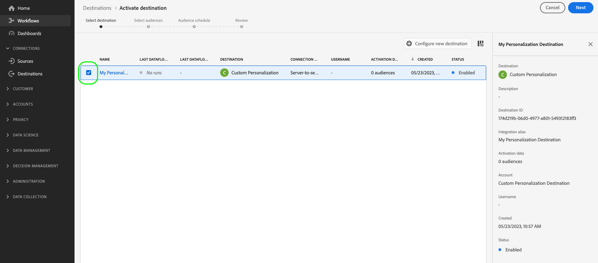

# Recherche des attributs de profil en temps réel sur la périphérie

Adobe Experience Platform utilise le [profil client en temps réel](../../profile/home.md) comme source unique de vérité pour toutes les données de profil. Pour une récupération rapide des données en temps réel, il utilise les [profils Edge](../../profile/edge-profiles.md), qui sont des profils légers distribués dans tout l’Edge Network [. ](../../collection/home.md#edge) Cela permet des cas d’utilisation de la personnalisation en temps réel et rapide.

## Cas d’utilisation {#use-cases}

Vous trouverez ci-dessous deux cas d’utilisation où la recherche de profil de périphérie peut vous aider.

* **Personalization en temps réel** : récupérez rapidement les informations de profil du profil Edge pour personnaliser l’expérience d’un utilisateur sur votre site web.
* **Service clientèle** : récupérez des informations de profil en temps réel lorsqu’un client appelle un agent du centre d’assistance.

Cette page décrit les étapes à suivre pour rechercher des données de profil de périphérie en temps réel, pour fournir des expériences de personnalisation ou pour informer les règles de prise de décision par le biais d’applications en aval.

## Terminologie et conditions préalables {#prerequisites}

Lors de la configuration du cas d’utilisation décrit dans cette page, vous utiliserez les composants Platform suivants :

* [Datastreams](../../datastreams/overview.md) : un flux de données reçoit les données d’événement entrantes du SDK Web et répond avec les données de profil de périphérie.
* [Stratégies de fusion](../../segmentation/ui/segment-builder.md#merge-policies) : vous allez créer une stratégie de fusion [!UICONTROL Active-On-Edge] pour vous assurer que les profils Edge utilisent les données de profil correctes.
* [Connexion Personalization personnalisée](../catalog/personalization/custom-personalization.md) : vous allez configurer une nouvelle connexion de personnalisation personnalisée qui enverra les attributs de profil à l’Edge Network.
* [API Edge Network](../../server-api/overview.md) : vous utiliserez la fonctionnalité de [collecte de données interactive](../../server-api/interactive-data-collection.md) de l’API Edge Network pour récupérer rapidement les attributs de profil des profils Edge.

## Mécanismes de sécurisation des performances {#guardrails}

Les cas d’utilisation de la recherche de profil Edge sont soumis aux barrières de performance spécifiques décrites dans le tableau ci-dessous. Pour plus d’informations sur les barrières de sécurité de l’API Edge Network, consultez la [page de documentation](https://developer.adobe.com/data-collection-apis/docs/getting-started/guardrails/) sur les barrières de sécurité.

| Edge Network Service | Segmentation Edge | Demandes par seconde |
|---------|----------|---------|
| [Destination de personnalisation personnalisée](../catalog/personalization/custom-personalization.md) via [l’API Edge Network](https://developer.adobe.com/data-collection-apis/docs/api/) | Oui | 1500 |
| [Destination de personnalisation personnalisée](../catalog/personalization/custom-personalization.md) via [l’API Edge Network](https://developer.adobe.com/data-collection-apis/docs/api/) | Non | 1500 |

## Étape 1 : créer et configurer un flux de données {#create-datastream}

Suivez les étapes de la documentation [configuration du flux de données](../../datastreams/configure.md#create-a-datastream) pour créer un flux de données avec les paramètres **[!UICONTROL Service]** suivants :

* **[!UICONTROL Service]** : [!UICONTROL Adobe Experience Platform]
* **[!UICONTROL Destinations Personalization]** : activé
* **[!UICONTROL Segmentation Edge]** : si vous avez besoin de segmentation Edge, activez cette option. Si vous souhaitez uniquement rechercher les attributs de profil sur la périphérie, mais ne souhaitez pas effectuer de segmentation basée sur les profils de périphérie, laissez cette option désactivée.


  <!-- >[!IMPORTANT]
    >
    >Enabling edge segmentation limits the maximum number of lookup requests to 1500 request per second. If you need a higher request throughput, disable edge segmentation for your datastream. See the [guardrails documentation](../guardrails.md#edge-destinations-activation) for detailed information. -->

  


## Étape 2 : configuration des audiences pour l’évaluation Edge {#audience-edge-evaluation}

La recherche d’attributs de profil sur le serveur Edge nécessite que vos audiences soient configurées pour l’évaluation du serveur Edge.

Assurez-vous que les audiences que vous prévoyez d’activer ont la [stratégie de fusion active sur Edge](../../segmentation/ui/segment-builder.md#merge-policies) définie par défaut. La stratégie de fusion [!DNL Active-On-Edge] garantit que les audiences sont constamment évaluées [sur le serveur Edge](../../segmentation/ui/edge-segmentation.md) et sont disponibles pour les cas d’utilisation de la personnalisation en temps réel.

Suivez les instructions de la section [création d’une politique de fusion](../../profile/merge-policies/ui-guide.md#create-a-merge-policy) et assurez-vous d’activer le bouton **[!UICONTROL Politique de fusion Active-On-Edge]**.

>[!IMPORTANT]
>
>Si vos audiences utilisent une autre stratégie de fusion, vous ne pourrez pas récupérer les attributs de profil du serveur Edge et vous ne pourrez pas effectuer de recherche de profil Edge.

## Étape 3 : envoi des données d’attribut de profil à l’Edge Network{#configure-custom-personalization-connection}

Pour rechercher en temps réel les profils de périphérie, y compris les attributs et les données d’appartenance à l’audience, les données doivent être mises à disposition sur l’Edge Network. Pour ce faire, vous devez créer une connexion à une destination **[!UICONTROL Personalization personnalisée avec des attributs]** et activer les audiences, y compris les attributs que vous souhaitez rechercher sur les profils Edge.

+++ Configuration d’une connexion Personalization personnalisée avec des attributs

Suivez le [tutoriel sur la création de connexion de destination](../ui/connect-destination.md) pour obtenir des instructions détaillées sur la création d’une connexion de destination.

Lors de la configuration de la nouvelle destination, sélectionnez la banque de données que vous avez créée à l’[étape 1](#create-datastream) dans le champ **[!UICONTROL ID de la banque de données]** . Pour **[!UICONTROL Integration alias]**, vous pouvez utiliser n’importe quelle valeur qui vous aidera à identifier cette connexion de destination à l’avenir, comme le nom de la destination.


+++

+++Activation de vos audiences vers le Personalization personnalisé avec la connexion Attributs

Après avoir créé une connexion **[!UICONTROL Personalization personnalisée avec attributs]**, vous êtes prêt à envoyer des données de profil à l’Edge Network.

>[!IMPORTANT]
> 
> * Pour activer les données et activer l’[ étape de mappage](#mapping) du workflow, vous avez besoin des **** **[!UICONTROL Visualiser les destinations]**, **[!UICONTROL Afficher les profils]** et **[!UICONTROL Afficher les segments]** [ ](/help/access-control/home.md#permissions) autorisations de contrôle d’accès.
> 
> Lisez la [présentation du contrôle d’accès](/help/access-control/ui/overview.md) ou contactez votre administrateur ou administratrice du produit pour obtenir les autorisations requises.

1. Accédez à **[!UICONTROL Connexions > Destinations]**, puis sélectionnez l’onglet **[!UICONTROL Catalogue]**.

   

1. Recherchez la carte de destination **[!UICONTROL Personalization personnalisée avec attributs]**, puis sélectionnez **[!UICONTROL Activer les audiences]**, comme illustré dans l’image ci-dessous.

   

1. Sélectionnez la connexion de destination que vous avez précédemment configurée, puis sélectionnez **[!UICONTROL Suivant]**.

   

1. Sélectionnez vos audiences. Utilisez les cases à cocher situées à gauche des noms d’audience pour sélectionner les audiences que vous souhaitez activer vers la destination, puis sélectionnez **[!UICONTROL Suivant]**.

   Vous pouvez sélectionner plusieurs types d’audiences, selon leur origine :

   * **[!UICONTROL Service de segmentation]** : audiences générées dans Experience Platform par le service de segmentation. Pour plus d’informations, consultez la [documentation sur la segmentation](../../segmentation/ui/overview.md) .
   * **[!UICONTROL Téléchargement personnalisé]** : audiences générées en dehors de l’Experience Platform et téléchargées dans Platform sous la forme de fichiers CSV. Pour en savoir plus sur les audiences externes, consultez la documentation sur l&#39; [import d&#39;une audience](../../segmentation/ui/overview.md#import-audience).
   * Autres types d’audiences, provenant d’autres solutions d’Adobe, telles que [!DNL Audience Manager].

     

1. Sélectionnez les attributs de profil que vous souhaitez rendre disponibles pour les profils Edge.

   * **Sélectionner les attributs source**. Pour ajouter des attributs source, sélectionnez le contrôle **[!UICONTROL Ajouter un nouveau champ]** sur la colonne **[!UICONTROL Champ Source]** et recherchez ou accédez au champ d’attribut XDM de votre choix, comme illustré ci-dessous.

     

   * **Sélectionner les attributs de la cible**. Pour ajouter des attributs de cible, sélectionnez le contrôle **[!UICONTROL Ajouter un nouveau champ]** sur la colonne **[!UICONTROL Champ cible]** et saisissez le nom de l’attribut personnalisé auquel vous souhaitez mapper l’attribut source.

     


Lorsque vous avez terminé de mapper les attributs de profil, sélectionnez **[!UICONTROL Suivant]**.

Sur la page **[!UICONTROL Vérifier]**, vous pouvez voir un résumé de votre sélection. Sélectionnez **[!UICONTROL Annuler]** pour interrompre le flux, **[!UICONTROL Précédent]** pour modifier vos paramètres ou **[!UICONTROL Terminer]** pour confirmer votre sélection et commencer à envoyer les données de profil à l’Edge Network.


+++

+++Évaluation des stratégies de consentement

Si votre organisation a acheté **Adobe HealthCare Shield** ou **Adobe Privacy &amp; Security Shield**, sélectionnez **[!UICONTROL Afficher les politiques de consentement applicables]** pour identifier les politiques de consentement appliquées et le nombre de profils inclus dans l&#39;activation qui en résulte. Pour plus d’informations, consultez la section [Évaluation de la stratégie de consentement](/help/data-governance/enforcement/auto-enforcement.md#consent-policy-evaluation) .

**Vérifications des stratégies d’utilisation des données**

À l’étape **[!UICONTROL Réviser]**, Experience Platform recherche également toutes les violations de stratégie d’utilisation des données. Vous trouverez ci-dessous un exemple de violation de la politique. Vous ne pouvez pas terminer le workflow d’activation de l’audience tant que vous n’avez pas résolu la violation. Pour plus d’informations sur la façon de résoudre les violations de stratégie, reportez-vous à la section [Violations de stratégie d’utilisation des données](/help/data-governance/enforcement/auto-enforcement.md#data-usage-violation) de la documentation sur la gouvernance des données.


+++

+++Filtrage des audiences

À l’étape **[!UICONTROL Réviser]** , vous pouvez utiliser les filtres disponibles sur la page pour afficher uniquement les audiences dont le planning ou le mappage a été mis à jour dans le cadre de ce workflow. Vous pouvez également basculer entre les colonnes du tableau que vous souhaitez afficher.


Si votre sélection vous satisfait et qu’aucune violation de stratégie n’a été détectée, sélectionnez **[!UICONTROL Terminer]** pour confirmer votre sélection.

+++

## Étape 4 : recherche des attributs de profil sur le serveur Edge {#configure-edge-profile-lookup}

À l’heure qu’il est, [vous avez fini de configurer votre flux de données](#create-datastream), vous avez [ créé une nouvelle Personalization personnalisée avec connexion de destination Attributs](#configure-destination) et vous avez utilisé cette connexion à [envoyer les attributs de profil](#activate-audiences) que vous pourrez consulter l’Edge Network.

L’étape suivante consiste à configurer votre solution de personnalisation pour récupérer les attributs de profil des profils Edge.

>[!IMPORTANT]
>
>Les attributs de profil peuvent contenir des données sensibles. Pour protéger ces données, vous devez récupérer les attributs de profil par le biais de l’ [API Edge Network](../../server-api/overview.md). De plus, vous devez récupérer les attributs de profil par le biais de l’API Edge Network [point de terminaison de collecte de données interactive](../../server-api/interactive-data-collection.md), pour que les appels d’API soient authentifiés.
><br>Si vous ne respectez pas les exigences ci-dessus, la personnalisation sera basée uniquement sur l’appartenance à l’audience et les attributs de profil ne seront pas disponibles pour vous.

La banque de données que vous avez configurée à l’ [étape 1](#create-datastream) est maintenant prête à accepter les données d’événement entrantes et à répondre avec des informations de profil de périphérie.

Configurez votre intégration pour récupérer les informations de profil Edge comme illustré dans les exemples ci-dessous.

### Requête {#request}

Pour récupérer les données de profil de périphérie, envoyez un appel `POST` vide au point de terminaison `/interact`, avec l’identité principale pour laquelle vous recherchez les attributs de profil inclus dans l’événement, comme illustré ci-dessous.

```shell
curl -X POST "https://server.adobedc.net/ee/v2/interact?dataStreamId={DATASTREAM_ID}" 
-H "Authorization: Bearer {TOKEN}" 
-H "x-gw-ims-org-id: {ORG_ID}" 
-H "x-api-key: {API_KEY}" 
-H "Content-Type: application/json" 
-d '{
    "event":
    {
        "xdm": {
            "identityMap": {
                "Email": [
                    {  
                        "id":"test123@adobetest.com",
                        "primary":true
                    }
                ]
            }
        }
    }
    
}'
```

| Paramètre | Type | Obligatoire | Description |
| --- | --- | --- | --- |
| `dataStreamId` | `String` | Oui. | L’identifiant de la banque de données de la banque de données que vous avez créée à l’ [étape 1](#create-datastream). |

### Réponse {#response}

Une réponse réussie renvoie un état HTTP `200 OK`, avec un objet `Handle` qui inclut des informations similaires aux exemples des onglets ci-dessous, selon que le profil est trouvé sur le serveur Edge ou non.

>[!NOTE]
>
>Les réponses de l’API sont modulaires et l’objet `handle` peut inclure plusieurs objets `payload` de différents types. Les informations relatives à la recherche de profil Edge sont regroupées sous l’objet `payload` avec `"type": "activation:pull"`,

>[!BEGINTABS]

>[!TAB Le profil existe sur la périphérie]

Si le profil existe sur le serveur Edge, en fonction des attributs de profil et des audiences activés sur le serveur Edge, vous pouvez vous attendre à une réponse avec des attributs et des appartenances à l’audience similaires à celui ci-dessous.

```json
{
  "requestId": "3c600138-d785-42ca-a025-bb725f4b5da9",
  "handle": [
    {
      "payload": [
        {
          "type": "profileLookup",
          "destinationId": "9218b727-ec59-4a46-b8b9-05503f138c5d",
          "alias": "rk-demo-custom-personalization-XXXX",
          "attributes": {
            "zip": {
              "value": "19000"
            },
            "firstName": {
              "value": "Test"
            },
            "lastName": {
              "value": "User123"
            },
            "gender": {
              "value": "male"
            },
            "city": {
              "value": "Philadelphia"
            },
            "state": {
              "value": "PA"
            },
            "email": {
              "value": "test123@adobetest.com"
            }
          },
          "segments": [
            {
              "id": "85018bd8-7ad1-4e17-ae30-8389c04bd3c0",
              "namespace": "ups"
            },
            {
              "id": "d09a8159-8b30-4178-b2f2-7a8c5e3168d9",
              "namespace": "ups"
            }
          ]
        }
      ],
      "type": "activation:pull",
      "eventIndex": 0
    }
  ]
}
```

L’objet `handle` fournit les informations décrites dans le tableau ci-dessous.

| Paramètre | Description |
|---------|----------|
| `payload` | L’objet `payload` qui inclut les informations de recherche de périphérie. La réponse peut contenir plusieurs objets `payload` supplémentaires, sans rapport avec la recherche de périphérie. |
| `type` | Les charges utiles sont regroupées dans la réponse par type. Le type de payload pour la recherche de profil Edge est toujours défini sur `profileLookup`. |
| `destinationId` | L’identifiant de l’instance de connexion **[!UICONTROL Personalization personnalisé]** que vous avez créée à l’ [étape 3](#configure-custom-personalization-connection). |
| `alias` | L’alias de la connexion de destination, configuré par l’utilisateur lors de la création de la connexion de destination [Personalization personnalisée](../catalog/personalization/custom-personalization.md). |
| `attributes` | Ce tableau comprend les attributs de profil Edge des audiences que vous avez activées à l’ [étape 3](#configure-custom-personalization-connection). |
| `segments` | Ce tableau comprend les audiences que vous avez activées à l’ [étape 3](#configure-custom-personalization-connection). |
| `type` | Les objets `handle` sont regroupés par type. Pour les cas d’utilisation de la recherche de profil Edge, le type de l’objet `handle` est toujours `activation:pull`. |
| `eventIndex` | L’Edge Network reçoit des événements du client sous la forme de tableaux. L’ordre des événements dans le tableau est conservé pendant leur traitement et reflété par cet index. L’indexation des événements commence par `0`. |

>[!TAB Le profil n’existe pas sur la périphérie]

Si le profil n’existe pas sur le serveur Edge, vous pouvez vous attendre à une réponse similaire à celle ci-dessous.

```json
{
  "requestId": "531b541a-4541-419e-ac99-fd7e452f0c0f",
  "handle": [
    {
      "payload": [],
      "type": "activation:pull",
      "eventIndex": 0
    }
  ]
}
```

L’objet `handle` fournit les informations décrites dans le tableau ci-dessous.

| Paramètre | Description |
|---------|----------|
| `payload` | Lorsque le profil n’est pas présent sur le bord, l’objet `payload` est vide. |
| `type` | Les objets `payload` sont regroupés par type. Pour les cas d’utilisation de la recherche de profil Edge, le type de l’objet `payload` est toujours `activation:pull`. |
| `eventIndex` | L’Edge Network reçoit des événements du client sous la forme de tableaux. L’ordre des événements dans le tableau est conservé pendant leur traitement et reflété par cet index. L’indexation des événements commence par `0`. |

>[!ENDTABS]

>[!SUCCESS]
>
>Si vous avez correctement configuré l’intégration, vous avez désormais accès aux données de profil Edge et vous pouvez utiliser les attributs et l’appartenance à l’audience de vos profils Edge pour déclencher la personnalisation en temps réel dans votre moteur de personnalisation en aval.

## Conclusion {#conclusion}

En suivant les étapes ci-dessus, vous pouvez rechercher efficacement les attributs de profil de périphérie en temps réel, ce qui permet d’offrir des expériences personnalisées et une prise de décision éclairée par le biais d’applications en aval.
