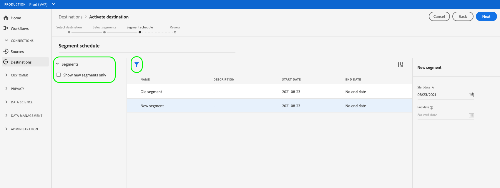

# Activer les données d’audience vers les destinations de requête de profil

>[!IMPORTANT]
> 
> * Pour activer les données et activer la variable [étape de mappage](#mapping) du workflow, vous avez besoin de l’événement **[!UICONTROL Gestion des destinations]**, **[!UICONTROL Activation des destinations]**, **[!UICONTROL Afficher les profils]**, et **[!UICONTROL Affichage de segments]** [autorisations de contrôle d’accès](/help/access-control/home.md#permissions).
> * Pour activer les données sans passer par la fonction [étape de mappage](#mapping) du workflow, vous avez besoin de l’événement **[!UICONTROL Gestion des destinations]**, **[!UICONTROL Activation du segment sans mappage]**, **[!UICONTROL Afficher les profils]**, et **[!UICONTROL Affichage de segments]** [autorisations de contrôle d’accès](/help/access-control/home.md#permissions).
> 
> Lisez la [présentation du contrôle d’accès](/help/access-control/ui/overview.md) ou contactez votre administrateur de produit pour obtenir les autorisations requises.

## Présentation {#overview}

Cet article explique le workflow requis pour activer les données d’audience dans les destinations de demande de profil Adobe Experience Platform. Utilisé conjointement avec [segmentation de périphérie](../../segmentation/ui/edge-segmentation.md), ces destinations activent des cas d’utilisation de la personnalisation de la même page et de la page suivante sur vos propriétés web et mobiles. En savoir plus sur [activation des cas d’utilisation de la personnalisation de la même page et de la page suivante](/help/destinations/ui/configure-personalization-destinations.md).

Voici des exemples de destinations de requête de profil : [Adobe Target](../../destinations/catalog/personalization/adobe-target-connection.md) et le [Personnalisation personnalisée](../../destinations/catalog/personalization/custom-personalization.md) connexions.

## Conditions préalables {#prerequisites}

Pour activer des données vers des destinations, vous devez avoir réussi à vous [connecter à une destination](./connect-destination.md). Si vous ne l’avez pas déjà fait, accédez au [destinations](../catalog/overview.md), parcourez les destinations de personnalisation prises en charge et configurez la destination que vous souhaitez utiliser.

### Stratégie de fusion de segments {#merge-policy}

Actuellement, les destinations de requête de profil ne prennent en charge que l’activation des segments qui utilisent la variable [Stratégie de fusion principale sur périphérie](../../segmentation/ui/segment-builder.md#merge-policies) défini comme valeur par défaut.

## Sélectionner votre destination {#select-destination}

1. Accédez à **[!UICONTROL Connexions et destinations]**, puis sélectionnez l’onglet **[!UICONTROL Catalogue]**.

   

1. Sélectionner **[!UICONTROL Activation des segments]** sur la carte correspondant à la destination de personnalisation à laquelle vous souhaitez activer vos segments, comme illustré dans l’image ci-dessous.

   

1. Sélectionnez la connexion de destination à utiliser pour activer des segments, puis sélectionner **[!UICONTROL Suivant]**.

   

1. Accédez à la section suivante pour [sélectionner des segments](#select-segments).

## Sélectionnez vos segments {#select-segments}

Utilisez les cases à cocher situées à gauche des noms de segment pour sélectionner les segments que vous souhaitez activer vers la destination, puis sélectionnez **[!UICONTROL Suivant]**.

## (Version bêta) Mise en correspondance des attributs {#map-attributes}

>[!IMPORTANT]
>
>L’étape de mappage qui active la personnalisation basée sur les attributs pour [Adobe Target](/help/destinations/catalog/personalization/adobe-target-connection.md) et [destinations de personnalisation générique](/help/destinations/catalog/personalization/custom-personalization.md), est actuellement en version bêta et votre entreprise n’y a peut-être pas encore accès. Cette documentation peut être modifiée.

Sélectionnez les attributs sur lesquels vous souhaitez activer des cas d’utilisation de personnalisation pour vos utilisateurs. Cela signifie que si la valeur d’un attribut change ou qu’un attribut est ajouté à un profil, ce profil devient membre du segment et est activé sur la destination de personnalisation.

L’ajout d’attributs est facultatif. Vous pouvez toujours passer à l’étape suivante et activer la personnalisation de la même page et de la page suivante sans sélectionner d’attributs. Si vous n’ajoutez pas d’attributs à cette étape, la personnalisation continuera à se produire en fonction des qualifications d’appartenance aux segments et de mappage d’identité pour les profils.

### Sélectionner les attributs source {#select-source-attributes}

Pour ajouter des attributs source, sélectionnez l’option **[!UICONTROL Ajouter un nouveau champ]** du contrôle **[!UICONTROL Champ source]** et recherchez ou accédez au champ d’attribut XDM de votre choix, comme illustré ci-dessous.

### Sélectionner les attributs de cible {#select-target-attributes}

>[!NOTE]
>
>Certaines destinations exigent que vous sélectionniez uniquement les attributs source, tandis que d’autres requièrent les attributs source et cible.
>
>Actuellement, la variable [Adobe Target V2](../catalog/personalization/adobe-target-connection.md) La destination nécessite uniquement des attributs source, tandis que [Personnalisation personnalisée avec des attributs](../catalog/personalization/custom-personalization.md) nécessite les attributs source et cible.

Pour ajouter des attributs de cible, sélectionnez la variable **[!UICONTROL Ajouter un nouveau champ]** du contrôle **[!UICONTROL Champ cible]** et saisissez le nom de l’attribut personnalisé auquel vous souhaitez mapper l’attribut source.

## Planifier l’exportation de segments {#scheduling}

Par défaut, la variable [!UICONTROL Planification du segment] affiche uniquement les segments que vous avez sélectionnés dans le flux d’activation actuel.

Pour afficher tous les segments activés vers votre destination, utilisez l’option de filtrage et désactivez la variable **[!UICONTROL Afficher les nouveaux segments uniquement]** filtre.

Sur le **[!UICONTROL Planification du segment]** , sélectionnez chaque segment, puis utilisez la méthode **[!UICONTROL Date de début]** et **[!UICONTROL Date de fin]** sélecteurs pour configurer l’intervalle d’envoi des données à votre destination.

Sélectionner **[!UICONTROL Suivant]** pour accéder au [!UICONTROL Réviser] page.

## Révision {#review}

Sur la page **[!UICONTROL Vérifier]**, vous pouvez voir un résumé de votre sélection. Sélectionnez **[!UICONTROL Annuler]** pour interrompre le flux, **[!UICONTROL Précédent]** pour modifier vos paramètres ou **[!UICONTROL Terminer]** pour confirmer votre sélection et commencer à envoyer les données à la destination.

### Évaluation des politiques de consentement {#consent-policy-evaluation}

Si votre entreprise a acheté **Adobe Health Care Shield** ou **Adobe de la confidentialité et de la sécurité**, sélectionnez **[!UICONTROL Affichage des stratégies de consentement applicables]** pour identifier les stratégies de consentement appliquées et le nombre de profils inclus dans l’activation qui en résulte. En savoir plus [évaluation des stratégies de consentement](/help/data-governance/enforcement/auto-enforcement.md#consent-policy-evaluation) pour plus d’informations.

### Vérifications des stratégies d’utilisation des données {#data-usage-policy-checks}

Dans le **[!UICONTROL Réviser]** , Experience Platform recherche également les violations de stratégie d’utilisation des données. Vous trouverez ci-dessous un exemple de violation de la stratégie. Vous ne pouvez pas terminer le processus d’activation des segments tant que vous n’avez pas résolu la violation. Pour plus d’informations sur la résolution des violations de stratégie, reportez-vous à la section [violations de la stratégie d’utilisation des données](/help/data-governance/enforcement/auto-enforcement.md#data-usage-violation) dans la section documentation sur la gouvernance des données .

### Filtrer des segments {#filter-segments}

En outre, au cours de cette étape, vous pouvez utiliser les filtres disponibles sur la page pour afficher uniquement les segments dont la planification ou le mappage a été mis à jour dans le cadre de ce workflow. Vous pouvez également basculer entre les colonnes du tableau que vous souhaitez afficher.

Si vous êtes satisfait de votre sélection et qu’aucune violation de stratégie n’a été détectée, sélectionnez **[!UICONTROL Terminer]** pour confirmer votre sélection et commencer à envoyer des données à la destination.

<!--

Commenting out this part since destination monitoring is not available currently for the Adobe Target and Custom Personalization destinations.

## Verify segment activation {#verify}

Check the [destination monitoring documentation](../../dataflows/ui/monitor-destinations.md) for detailed information on how to monitor the flow of data to your destinations.

-->