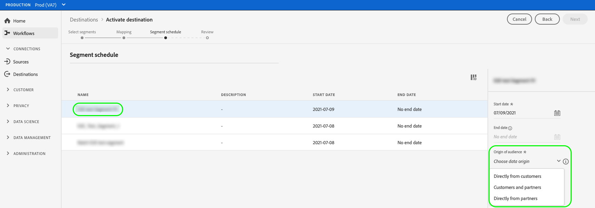

# Activer les audiences vers des destinations de diffusion en continu

>[!IMPORTANT]
> 
> * Pour activer les audiences et activer l’[étape de mappage](#mapping) du workflow, vous devez disposer des autorisations de contrôle d’accès **[!UICONTROL Afficher les destinations]**, **[!UICONTROL Activer les destinations]**, **[!UICONTROL Afficher les profils]** et **[!UICONTROL Afficher les segments]**.
> * Pour activer les audiences sans passer par l’étape [mappage](#mapping) du workflow, vous devez disposer des **[!UICONTROL Affichage des destinations]**, **[!UICONTROL Activation du segment sans mappage]**, **[!UICONTROL Affichage des profils]** et **[!UICONTROL Affichage des segments]** [autorisations de contrôle d’accès](/help/access-control/home.md#permissions).
>* Pour exporter des *identités*, vous devez disposer de l’autorisation de contrôle d’accès **[!UICONTROL Afficher le graphique d’identités]** .   {width="100" zoomable="yes"}
> 
> Lisez la [présentation du contrôle d’accès](/help/access-control/ui/overview.md) ou contactez votre administrateur de produit pour obtenir les autorisations requises.

## Présentation {#overview}

Cet article explique le processus requis pour activer des audiences dans les destinations de diffusion en streaming Adobe Experience Platform.

## Conditions préalables {#prerequisites}

Pour activer des audiences vers des destinations, vous devez avoir réussi à vous [connecter à une destination](./connect-destination.md). Si vous ne l’avez pas déjà fait, accédez au [catalogue de destinations](../catalog/overview.md), parcourez les destinations prises en charge et configurez la destination que vous souhaitez utiliser.

## Sélectionner votre destination {#select-destination}

1. Accédez à **[!UICONTROL Connexions et destinations]**, puis sélectionnez l’onglet **[!UICONTROL Catalogue]**.

   

1. Sélectionnez **[!UICONTROL Activer les audiences]** sur la vignette correspondant à la destination vers laquelle vous souhaitez activer vos audiences, comme illustré dans l’image ci-dessous.

   

1. Sélectionnez la connexion de destination à utiliser pour activer les audiences, puis sélectionnez **[!UICONTROL Suivant]**.

   

1. Accédez à la section suivante pour [sélectionner vos audiences](#select-audiences).

## Sélectionner vos audiences {#select-audiences}

Pour sélectionner les audiences à activer vers la destination, utilisez les cases à cocher situées à gauche des noms d’audience, puis sélectionnez **[!UICONTROL Suivant]**.

Vous pouvez effectuer un choix parmi plusieurs types d’audiences, selon leur origine :

* **[!UICONTROL Segmentation Service]** : audiences générées dans Experience Platform par le service de segmentation. Voir la [documentation sur la segmentation](../../segmentation/ui/overview.md) pour plus d’informations.
* **[!UICONTROL Chargement personnalisé]** : audiences générées en dehors d’Experience Platform et chargées dans Experience Platform au format CSV. Pour en savoir plus sur les audiences externes, consultez la documentation sur [importation d’une audience](../../segmentation/ui/audience-portal.md#import-audience).
* Autres types d’audiences, provenant d’autres solutions Adobe, telles que [!DNL Audience Manager].

## Mapper les attributs et les identités {#mapping}

>[!IMPORTANT]
>
>Cette étape s’applique uniquement à certaines destinations de diffusion en continu d’audience. Si votre destination ne comporte pas d’étape **[!UICONTROL Mappage]**, passez à la [planification des audiences](#scheduling).
>
>Lors de l’activation des audiences vers des destinations de diffusion en continu, vous devez également mapper *au moins un espace de noms d’identité cible*, en plus des attributs de profil cible. Sinon, les audiences ne seront pas activées vers la plateforme de destination.
>  {zoomable="yes"}

Certaines destinations de diffusion en continu d’audience nécessitent que vous sélectionniez des attributs sources ou des espaces de noms d’identité à mapper en tant qu’identités cibles dans la destination.

1. Sur la page **[!UICONTROL Mappage]**, sélectionnez **[!UICONTROL Ajouter un nouveau mappage]**.

   

1. Sélectionnez la flèche située à droite de l’entrée **[!UICONTROL Champ source]**.

   

1. Sur la page **[!UICONTROL Sélectionner le champ source]**, utilisez les options **[!UICONTROL Sélectionner les attributs]** ou **[!UICONTROL Sélectionner l’espace de noms d’identité]** pour basculer entre les deux catégories de champs source disponibles. Dans les attributs de profil [!DNL XDM] et les espaces de noms d’identité disponibles, sélectionnez ceux que vous souhaitez mapper à la destination, puis choisissez **[!UICONTROL Sélectionner]**.

   Utilisez le bouton (bascule) **[!UICONTROL Afficher uniquement les champs contenant des données]** pour afficher uniquement les champs de schéma remplis de valeurs. Par défaut, seuls les champs de schéma renseignés s’affichent.

   

1. Sélectionnez le bouton situé à droite de l’entrée **[!UICONTROL Champ cible]**.

   

1. Sur la page **[!UICONTROL Sélectionner le champ cible]**, sélectionnez l’espace de noms d’identité cible vers lequel vous souhaitez mapper le champ source, puis choisissez **[!UICONTROL Sélectionner]**.

   

1. Pour ajouter d’autres mappages, répétez les étapes 1 à 5.

### Appliquer la transformation {#apply-transformation}

>[!CONTEXTUALHELP]
>id="platform_destinations_activate_applytransformation"
>title="Appliquer la transformation"
>abstract="Cochez cette option lorsque vous utilisez des champs sources non hachés afin qu’Adobe Experience Platform les hache automatiquement au moment de l’activation."

Quand vous mappez des attributs source non hachés avec des attributs cibles qui sont censés être hachés (par exemple, `email_lc_sha256` ou `phone_sha256`), cochez l’option **Apply transformation** (Appliquer la transformation) pour qu’Adobe Experience Platform hache automatiquement les attributs source au moment de l’activation.

## Planifier l’export d’audience {#scheduling}

>[!CONTEXTUALHELP]
>id="platform_destinations_activate_enddate"
>title="Date de fin"
>abstract="L’ajout d’une date de fin pour le planning des audiences n’est pas disponible."

Par défaut, la page **[!UICONTROL Planning des audiences]** affiche uniquement les audiences nouvellement sélectionnées que vous avez sélectionnées dans le flux d’activation actuel.

Pour afficher toutes les audiences activées vers la destination, utilisez l’option de filtrage et désactivez le filtre **[!UICONTROL Afficher les nouvelles audiences uniquement]**.

1. Sur la page **[!UICONTROL Planning des audiences]**, sélectionnez chaque audience, puis utilisez les sélecteurs **[!UICONTROL Date de début]** et **[!UICONTROL Date de fin]** pour configurer l’intervalle de temps pour l’envoi des données vers la destination.

   

   * Certaines destinations nécessitent de sélectionner le **[!UICONTROL origine de l’audience]** pour chaque audience, à l’aide du menu déroulant situé sous les sélecteurs de calendrier. Si la destination n’inclut pas ce sélecteur, ignorez cette étape.

     

   * Certaines destinations nécessitent que vous mappiez manuellement des audiences [!DNL Experience Platform] à leur homologue dans la destination cible. Pour ce faire, sélectionnez chaque audience, puis saisissez l’identifiant d’audience correspondant à partir de la plateforme de destination dans le champ **[!UICONTROL Identifiant de mappage]**. Si la destination n’inclut pas ce champ, ignorez cette étape.

     

   * Certaines destinations nécessitent de saisir un **[!UICONTROL ID d’application]** lors de l’activation d’audiences [!DNL IDFA] ou [!DNL GAID]. Si la destination n’inclut pas ce champ, ignorez cette étape.

     

1. Sélectionnez **[!UICONTROL Suivant]** pour accéder à la page [!UICONTROL Réviser].

## Révision {#review}

Sur la page **[!UICONTROL Vérifier]**, vous pouvez voir un résumé de votre sélection. Sélectionnez **[!UICONTROL Annuler]** pour interrompre le flux, **[!UICONTROL Précédent]** pour modifier vos paramètres ou **[!UICONTROL Terminer]** pour confirmer votre sélection et commencer à envoyer les données à la destination.

### Évaluation des politiques de consentement {#consent-policy-evaluation}

Si votre organisation a acheté **Adobe HealthCare Shield** ou **Adobe Privacy &amp; Security Shield**, sélectionnez **[!UICONTROL Afficher les politiques de consentement applicables]** pour identifier les politiques de consentement appliquées et le nombre de profils inclus dans l&#39;activation qui en résulte. Pour plus d’informations, consultez [ Évaluation des politiques de consentement ](/help/data-governance/enforcement/auto-enforcement.md#consent-policy-evaluation) .

### Vérifications des politiques d’utilisation des données {#data-usage-policy-checks}

À l’étape **[!UICONTROL Révision]**, Experience Platform vérifie également les violations de la politique d’utilisation des données. Vous trouverez ci-dessous un exemple de violation de la politique. Vous ne pouvez pas terminer le workflow d’activation de l’audience tant que vous n’avez pas résolu la violation. Pour plus d’informations sur la résolution des violations de politique, consultez la section sur les violations de politique d’utilisation des données [data usage policy violations](/help/data-governance/enforcement/auto-enforcement.md#data-usage-violation) dans la documentation sur la gouvernance des données .

### Filtrer les audiences {#filter-audiences}

Au cours de cette étape également, vous pouvez utiliser les filtres disponibles sur la page pour afficher uniquement les audiences dont le planning ou le mappage a été mis à jour dans le cadre de ce workflow. Vous pouvez également activer/désactiver les colonnes du tableau à afficher.

Si vous êtes satisfait(e) de votre sélection et qu’aucune violation de politique n’a été détectée, sélectionnez **[!UICONTROL Terminer]** pour confirmer votre sélection et commencer à envoyer des données à la destination.

## Vérifier l’activation de l’audience {#verify}

Consultez la [documentation sur la surveillance des destinations](../../dataflows/ui/monitor-destinations.md) pour obtenir des informations détaillées sur la surveillance du flux de données vers les destinations.

<!-- 
For [!DNL Facebook Custom Audience], a successful activation means that a [!DNL Facebook] custom audience would be created programmatically in [[!UICONTROL Facebook Ads Manager]](https://www.facebook.com/adsmanager/manage/). Audience membership in the audience would be added and removed as users are qualified or disqualified for the activated audiences.

>[!TIP]
>
>The integration between Adobe Experience Platform and [!DNL Facebook] supports historical audience backfills. All historical audience qualifications are sent to [!DNL Facebook] when you activate the audiences to the destination.
-->
