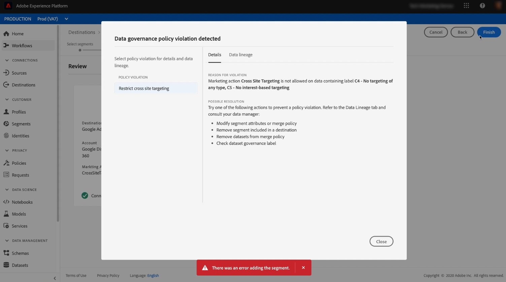

# Activer les données d’audience vers des destinations d’exportation de segments de diffusion en continu

>[!IMPORTANT]
> 
> * Pour activer les données et activer la variable [étape de mappage](#mapping) du workflow, vous avez besoin de l’événement **[!UICONTROL Gestion des destinations]**, **[!UICONTROL Activation des destinations]**, **[!UICONTROL Afficher les profils]**, et **[!UICONTROL Affichage de segments]** [autorisations de contrôle d’accès](/help/access-control/home.md#permissions).
> * Pour activer les données sans passer par la fonction [étape de mappage](#mapping) du workflow, vous avez besoin de l’événement **[!UICONTROL Gestion des destinations]**, **[!UICONTROL Activation du segment sans mappage]**, **[!UICONTROL Afficher les profils]**, et **[!UICONTROL Affichage de segments]** [autorisations de contrôle d’accès](/help/access-control/home.md#permissions).
> 
> Lisez la [présentation du contrôle d’accès](/help/access-control/ui/overview.md) ou contactez votre administrateur de produit pour obtenir les autorisations requises.

## Présentation {#overview}

Cet article explique le workflow requis pour activer les données d’audience dans les destinations de diffusion en continu de segments Adobe Experience Platform.

## Conditions préalables {#prerequisites}

Pour activer des données vers des destinations, vous devez avoir réussi à vous [connecter à une destination](./connect-destination.md). Si vous ne l’avez pas déjà fait, accédez au [catalogue de destinations](../catalog/overview.md), parcourez les destinations prises en charge et configurez la destination que vous souhaitez utiliser.

## Sélectionner votre destination {#select-destination}

1. Accédez à **[!UICONTROL Connexions et destinations]**, puis sélectionnez l’onglet **[!UICONTROL Catalogue]**.

   

1. Sélectionnez **[!UICONTROL Activer des segments]** sur la vignette correspondant à la destination vers laquelle vous souhaitez activer des segments, tel qu’indiqué sur l’image ci-dessous.

   

1. Sélectionnez la connexion de destination à utiliser pour activer des segments, puis sélectionner **[!UICONTROL Suivant]**.

   

1. Accédez à la section suivante pour [sélectionner des segments](#select-segments).

## Sélectionnez vos segments {#select-segments}

Utilisez les cases à cocher situées à gauche des noms de segment pour sélectionner les segments que vous souhaitez activer vers la destination, puis sélectionnez **[!UICONTROL Suivant]**.

## Mapper les attributs et les identités {#mapping}

>[!IMPORTANT]
>
>Cette étape s’applique uniquement à certaines destinations de diffusion en continu de segments. Si votre destination n’a pas de **[!UICONTROL Mappage]** étape, passez à [Planification de l’exportation de segments](#scheduling).

Certaines destinations de diffusion en continu de segments nécessitent que vous sélectionniez des attributs source ou des espaces de noms d’identité à mapper en tant qu’identités cibles dans la destination.

1. Dans le **[!UICONTROL Mappage]** page, sélectionnez **[!UICONTROL Ajouter un nouveau mappage]**.

   

1. Sélectionnez la flèche située à droite de l’entrée **[!UICONTROL Champ source]**.

   

1. Dans le **[!UICONTROL Sélectionner le champ source]** , utilisez la méthode **[!UICONTROL Sélectionner des attributs]** ou le **[!UICONTROL Sélectionner un espace de noms d’identité]** pour basculer entre les deux catégories de champs sources disponibles. Disponible [!DNL XDM] attributs de profil et espaces de noms d’identité, sélectionnez ceux que vous souhaitez mapper à la destination, puis choisissez **[!UICONTROL Sélectionner]**.

   

1. Sélectionnez le bouton situé à droite du **[!UICONTROL Champ cible]** entrée .

   

1. Dans le **[!UICONTROL Sélectionner le champ cible]** , sélectionnez l’espace de noms de l’identité cible vers lequel vous souhaitez mapper le champ source, puis choisissez **[!UICONTROL Sélectionner]**.

   

1. Pour ajouter d’autres mappages, répétez les étapes 1 à 5.

### Appliquer la transformation {#apply-transformation}

>[!CONTEXTUALHELP]
>id="platform_destinations_activate_applytransformation"
>title="Appliquer la transformation"
>abstract="Cochez cette option lorsque vous utilisez des champs sources non hachés afin qu&#39;Adobe Experience Platform les hache automatiquement lors de l&#39;activation."

Lorsque vous mappez des attributs source non hachés avec des attributs cibles que la destination s’attend à être hachée (par exemple : `email_lc_sha256` ou `phone_sha256`), cochez la variable **Appliquer la transformation** pour que Adobe Experience Platform hache automatiquement les attributs source lors de l’activation.

## Planifier l’exportation de segments {#scheduling}

>[!CONTEXTUALHELP]
>id="platform_destinations_activate_enddate"
>title="Date de fin"
>abstract="L&#39;ajout d&#39;une date de fin pour la planification des segments n&#39;est pas disponible."

Par défaut, la variable [!UICONTROL Planification du segment] affiche uniquement les segments que vous avez sélectionnés dans le flux d’activation actuel.

Pour afficher tous les segments activés vers votre destination, utilisez l’option de filtrage et désactivez la variable **[!UICONTROL Afficher les nouveaux segments uniquement]** filtre.

1. Sur le **[!UICONTROL Planification du segment]** , sélectionnez chaque segment, puis utilisez la méthode **[!UICONTROL Date de début]** et **[!UICONTROL Date de fin]** sélecteurs pour configurer l’intervalle d’envoi des données à votre destination.

   

   * Pour certaines destinations, vous devez sélectionner la variable **[!UICONTROL Origine de l’audience]** pour chaque segment, à l’aide du menu déroulant sous les sélecteurs de calendrier. Si votre destination n’inclut pas ce sélecteur, ignorez cette étape.

      

   * Certaines destinations nécessitent une mise en correspondance manuelle. [!DNL Platform] segments à leur contrepartie dans la destination cible. Pour ce faire, sélectionnez chaque segment, puis saisissez l’identifiant de segment correspondant à partir de la plateforme de destination dans la variable **[!UICONTROL ID de mappage]** champ . Si votre destination n’inclut pas ce champ, ignorez cette étape.

      

   * Pour certaines destinations, vous devez entrer une **[!UICONTROL ID de l’application]** lors de l’activation [!DNL IDFA] ou [!DNL GAID] segments. Si votre destination n’inclut pas ce champ, ignorez cette étape.

      

1. Sélectionner **[!UICONTROL Suivant]** pour accéder au [!UICONTROL Réviser] page.

## Révision {#review}

Sur la page **[!UICONTROL Vérifier]**, vous pouvez voir un résumé de votre sélection. Sélectionnez **[!UICONTROL Annuler]** pour interrompre le flux, **[!UICONTROL Précédent]** pour modifier vos paramètres ou **[!UICONTROL Terminer]** pour confirmer votre sélection et commencer à envoyer les données à la destination.

### Évaluation des politiques de consentement {#consent-policy-evaluation}

Si votre organisation a acheté **Adobe HealthCare Shield** ou **Adobe Privacy &amp; Security Shield**, sélectionnez **[!UICONTROL Afficher les politiques de consentement applicables]** pour identifier les politiques de consentement appliquées et le nombre de profils inclus dans l&#39;activation qui en résulte. En savoir plus [évaluation des stratégies de consentement](/help/data-governance/enforcement/auto-enforcement.md#consent-policy-evaluation) pour plus d’informations.

### Vérifications des stratégies d’utilisation des données {#data-usage-policy-checks}

Dans le **[!UICONTROL Réviser]** , Experience Platform recherche également les violations de stratégie d’utilisation des données. Vous trouverez ci-dessous un exemple de violation de la politique. Vous ne pouvez pas terminer le processus d’activation des segments tant que vous n’avez pas résolu la violation. Pour plus d’informations sur la résolution des violations de stratégie, reportez-vous à la section [violations de la stratégie d’utilisation des données](/help/data-governance/enforcement/auto-enforcement.md#data-usage-violation) dans la section documentation sur la gouvernance des données .

### Filtrer des segments {#filter-segments}

En outre, au cours de cette étape, vous pouvez utiliser les filtres disponibles sur la page pour afficher uniquement les segments dont la planification ou le mappage a été mis à jour dans le cadre de ce workflow. Vous pouvez également basculer entre les colonnes du tableau que vous souhaitez afficher.

Si vous êtes satisfait de votre sélection et qu’aucune violation de stratégie n’a été détectée, sélectionnez **[!UICONTROL Terminer]** pour confirmer votre sélection et commencer à envoyer des données à la destination.

## Vérifier l’activation des segments {#verify}

Vérifiez les [documentation sur la surveillance des destinations](../../dataflows/ui/monitor-destinations.md) pour obtenir des informations détaillées sur la manière de surveiller le flux de données vers vos destinations.

<!-- 
For [!DNL Facebook Custom Audience], a successful activation means that a [!DNL Facebook] custom audience would be created programmatically in [[!UICONTROL Facebook Ads Manager]](https://www.facebook.com/adsmanager/manage/). Segment membership in the audience would be added and removed as users are qualified or disqualified for the activated segments.

>[!TIP]
>
>The integration between Adobe Experience Platform and [!DNL Facebook] supports historical audience backfills. All historical segment qualifications are sent to [!DNL Facebook] when you activate the segments to the destination.
-->
