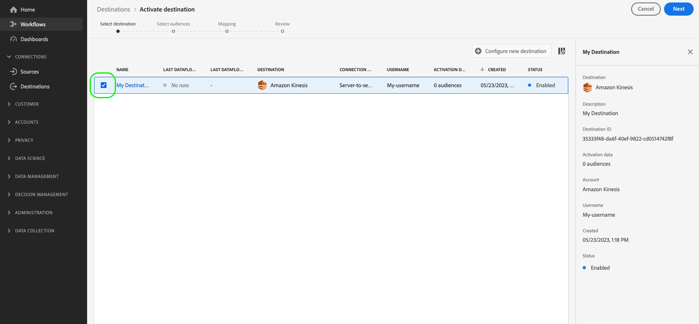

# Activer les audiences vers des destinations d’export de profils en flux continu

>[!IMPORTANT]
> 
> * Pour activer les données et activer l’[étape de mappage](#mapping) du workflow, vous avez besoin des autorisations de contrôle d’accès **[!UICONTROL View Destinations]**, **[!UICONTROL Activate Destinations]**, **[!UICONTROL View Profiles]** et **[!UICONTROL View Segments]** [&#128279;](/help/access-control/home.md#permissions).
> * Pour activer les données sans passer par l’étape [mappage](#mapping) du workflow, vous avez besoin des autorisations de contrôle d’accès **[!UICONTROL View Destinations]**, **[!UICONTROL Activate Segment without Mapping]**, **[!UICONTROL View Profiles]** et **[!UICONTROL View Segments]** [&#128279;](/help/access-control/home.md#permissions).
> 
> Lisez la [présentation du contrôle d’accès](/help/access-control/ui/overview.md) ou contactez votre administrateur de produit pour obtenir les autorisations requises.

## Vue d’ensemble {#overview}

Cet article explique le processus requis pour activer des données d’audience dans Adobe Experience Platform vers des destinations basées sur des profils de diffusion en continu (également appelées [destinations d’entreprise](/help/destinations/destination-types.md#advanced-enterprise-destinations)).

Cet article s’applique aux trois destinations suivantes :

* [Amazon Kinesis](/help/destinations/catalog/cloud-storage/amazon-kinesis.md)
* [Azure Event Hubs](/help/destinations/catalog/cloud-storage/azure-event-hubs.md)
* [Destination de l’API HTTP](/help/destinations/catalog/streaming/http-destination.md).

## Conditions préalables {#prerequisites}

Pour activer des données vers des destinations, vous devez avoir réussi à vous [connecter à une destination](./connect-destination.md). Si vous ne l’avez pas déjà fait, accédez au [catalogue de destinations](../catalog/overview.md), parcourez les destinations prises en charge et configurez la destination que vous souhaitez utiliser.

## Sélectionner votre destination {#select-destination}

1. Accédez à **[!UICONTROL Connections > Destinations]**, puis sélectionnez l’onglet **[!UICONTROL Catalog]** .

   

1. Sélectionnez **[!UICONTROL Activate audiences]** sur la vignette correspondant à la destination vers laquelle vous souhaitez activer vos audiences, comme illustré dans l’image ci-dessous.

   

1. Sélectionnez la connexion de destination à utiliser pour activer des audiences, puis sélectionnez **[!UICONTROL Next]**.

   

1. Accédez à la section suivante pour [sélectionner vos audiences](#select-audiences).

## Sélectionner vos audiences {#select-audiences}

Pour sélectionner les audiences à activer vers la destination, utilisez les cases à cocher situées à gauche des noms d’audience, puis sélectionnez **[!UICONTROL Next]**.

Vous pouvez effectuer un choix parmi plusieurs types d’audiences, selon leur origine :

* **[!UICONTROL Segmentation Service]** : audiences générées dans Experience Platform par Segmentation Service. Pour plus d’informations, consultez la [documentation d’Audience Portal](../../segmentation/ui/audience-portal.md).
* **[!UICONTROL Custom upload]** : audiences générées en dehors d’Experience Platform et chargées dans Experience Platform au format CSV. Pour en savoir plus sur les audiences externes, consultez la documentation sur [importation d’une audience](../../segmentation/ui/audience-portal.md#import-audience).
* Autres types d’audiences, provenant d’autres solutions Adobe, telles que [!DNL Audience Manager].


## Sélectionner des attributs de profil {#select-attributes}

À l’étape **[!UICONTROL Mapping]**, sélectionnez les attributs de profil à envoyer à la destination cible.

1. Dans la page **[!UICONTROL Select attributes]**, sélectionnez **[!UICONTROL Add new field]**.

   

1. Sélectionnez la flèche située à droite de l’entrée **[!UICONTROL Schema field]**.

   

1. Dans la page **[!UICONTROL Select source field]**, sélectionnez les attributs XDM à envoyer à la destination, puis choisissez **[!UICONTROL Save]**.

   

   Utilisez le bouton **[!UICONTROL Show only fields with data]** pour afficher uniquement les champs de schéma remplis de valeurs. Par défaut, seuls les champs de schéma renseignés s’affichent.

   Utilisez le bouton **[!UICONTROL Show display names for fields]** pour afficher les noms conviviaux des champs, au lieu des noms des champs de schéma.

   

1. Pour ajouter d’autres champs, répétez les étapes 1 à 3, puis sélectionnez **[!UICONTROL Next]**.

## Réviser {#review}

Sur la page **[!UICONTROL Review]**, vous pouvez voir un résumé de votre sélection. Sélectionnez **[!UICONTROL Cancel]** pour interrompre le flux, **[!UICONTROL Back]** pour modifier vos paramètres ou **[!UICONTROL Finish]** pour confirmer votre sélection et commencer à envoyer des données à la destination.


### Évaluation des politiques de consentement {#consent-policy-evaluation}

L’[évaluation de la politique de consentement](/help/data-governance/enforcement/auto-enforcement.md#consent-policy-evaluation) n’est actuellement pas prise en charge dans les exportations vers les trois destinations d’entreprise : Amazon Kinesis, Azure Event Hubs et l’API HTTP.

Cela signifie que les profils qui n’ont pas consenti à être ciblés *sont inclus* dans les exportations vers ces trois destinations.

<!--

If your organization purchased **Adobe Healthcare Shield** or **Adobe Privacy & Security Shield**, select **[!UICONTROL View applicable consent policies]** to see which consent policies are applied and how many profiles are included in the activation as a result of them. Read about [consent policy evaluation](/help/data-governance/enforcement/auto-enforcement.md#consent-policy-evaluation) for more information.

-->

### Vérifications des politiques d’utilisation des données {#data-usage-policy-checks}

À l’étape **[!UICONTROL Review]**, Experience Platform vérifie également les violations de la politique d’utilisation des données. Vous trouverez ci-dessous un exemple de violation de la politique. Vous ne pouvez pas terminer le workflow d’activation de l’audience tant que vous n’avez pas résolu la violation. Pour plus d’informations sur la résolution des violations de politique, consultez la section sur les violations de politique d’utilisation des données [data usage policy violations](/help/data-governance/enforcement/auto-enforcement.md#data-usage-violation) dans la documentation sur la gouvernance des données .


### Filtrer les audiences {#filter-audiences}

Au cours de cette étape également, vous pouvez utiliser les filtres disponibles sur la page pour afficher uniquement les audiences dont le planning ou le mappage a été mis à jour dans le cadre de ce workflow.


Si vous êtes satisfait(e) de votre sélection et qu’aucune violation de politique n’a été détectée, sélectionnez **[!UICONTROL Finish]** pour confirmer votre sélection et commencer à envoyer des données à la destination.

## Vérifier l’activation de l’audience {#verify}

Les données [!DNL Experience Platform] exportées arrivent dans votre destination cible au format JSON. Par exemple, l’événement ci-dessous contient l’attribut d’adresse e-mail d’un profil qui s’est qualifié pour une certaine audience et qui a quitté une autre audience. Les identités de ce prospect sont `ECID` et `email_lc_sha256`.

```json
{
  "person": {
    "email": "yourstruly@adobe.com"
  },
  "segmentMembership": {
    "ups": {
      "7841ba61-23c1-4bb3-a495-00d3g5fe1e93": {
        "lastQualificationTime": "2020-05-25T21:24:39Z",
        "status": "exited"
      },
      "59bd2fkd-3c48-4b18-bf56-4f5c5e6967ae": {
        "lastQualificationTime": "2020-05-25T23:37:33Z",
        "status": "realized"
      }
    }
  },
  "identityMap": {
    "ecid": [
      {
        "id": "14575006536349286404619648085736425115"
      },
      {
        "id": "66478888669296734530114754794777368480"
      }
    ],
    "email_lc_sha256": [
      {
        "id": "655332b5fa2aea4498bf7a290cff017cb4"
      },
      {
        "id": "66baf76ef9de8b42df8903f00e0e3dc0b7"
      }
    ]
  }
}
```
