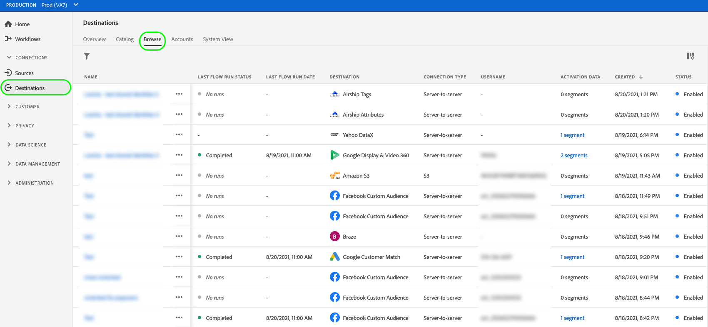

# Présentation de l’activation

>[!IMPORTANT]
>
>* Pour activer les données, vous avez besoin des autorisations de contrôle d’accès **[!UICONTROL View Destinations]**, **[!UICONTROL Activate Destinations]**, **[!UICONTROL View Profiles]** et **[!UICONTROL View Segments]** [Access control](/help/access-control/home.md#permissions). Lisez la [présentation du contrôle d’accès](/help/access-control/ui/overview.md) ou contactez votre administrateur ou administratrice du produit pour obtenir les autorisations requises.
>* Pour exporter des *identités*, vous devez disposer de l’autorisation de contrôle d’accès **[!UICONTROL View Identity Graph]**&#x200B;[&#128279;](/help/access-control/home.md#permissions).   {width="100" zoomable="yes"}

Adobe Experience Platform prend en charge un large éventail de destinations. Le workflow d’activation des audiences varie entre les destinations, en fonction du type de données d’audience qu’elles prennent en charge, et de la fréquence d’exportation des données.

## Méthodes d’activation {#activation-methods}

Après avoir [configuré la destination](connect-destination.md), vous pouvez activer les audiences de plusieurs manières :

### Activer des audiences à partir du catalogue des destinations {#activate-from-catalog}

Consultez les guides suivants pour obtenir des informations détaillées sur l’activation des audiences vers la destination à partir du catalogue des destinations :

* [Activer les données d’audience vers des destinations d’export d’audiences en flux continu](activate-segment-streaming-destinations.md)
* [Activer les données d’audience vers des destinations d’exportation de profils de diffusion en continu](activate-streaming-profile-destinations.md)
* [Activer les données d’audience vers des destinations d’exportation de profils par lots](activate-batch-profile-destinations.md)

### Activer des audiences à partir de la page [!UICONTROL Browse] {#activate-from-browse}

Suivez les étapes ci-dessous pour activer des données vers vos destinations à partir de la page **[!UICONTROL Browse]** .

1. Accédez à **[!UICONTROL Connections > Destinations]**, puis sélectionnez l’onglet **[!UICONTROL Browse]** .

   

1. Recherchez la connexion de destination à utiliser pour activer des segments, sélectionnez les trois points de la colonne [!UICONTROL Name], puis sélectionnez **[!UICONTROL Activate audiences]**.

   

1. En fonction de la destination sélectionnée, suivez les étapes décrites dans les articles ci-dessous, en commençant par l’étape **[!UICONTROL Select segments]**, pour terminer le workflow d’activation :

   * [Activer les données d’audience vers des destinations d’export d’audiences en flux continu](activate-segment-streaming-destinations.md)
   * [Activer les données d’audience vers des destinations d’exportation de profils de diffusion en continu](activate-streaming-profile-destinations.md)
   * [Activer les données d’audience vers des destinations d’exportation de profils par lots](activate-batch-profile-destinations.md)

### Activer des audiences à partir de la page des détails de l’audience {#activate-audience-details}

Vous pouvez activer des audiences vers des destinations à partir de la page des détails de l’audience. Voir [Détails de l’audience](../../segmentation/ui/audience-portal.md#audience-details) pour plus d’informations.

Selon la destination sélectionnée, suivez les étapes décrites dans les articles ci-dessous pour terminer le workflow d’activation :

* [Activer les données d’audience vers des destinations d’export d’audiences en flux continu](activate-segment-streaming-destinations.md)
* [Activer les données d’audience vers des destinations d’exportation de profils de diffusion en continu](activate-streaming-profile-destinations.md)
* [Activer les données d’audience vers des destinations d’exportation de profils par lots](activate-batch-profile-destinations.md)
