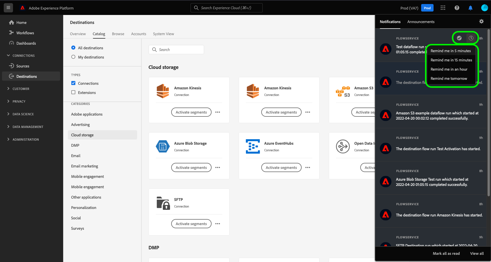

# S’abonner aux alertes de destination contextuelles

Adobe Experience Platform vous permet de vous abonner à des alertes basées sur des événements concernant les activités Adobe Experience Platform. Les alertes réduisent ou éliminent la nécessité d’interroger l’[[!DNL Observability Insights] API](../../observability/api/overview.md) afin de vérifier si une tâche est terminée, si un certain jalon a été atteint dans un processus ou si des erreurs se sont produites.

Vous pouvez vous abonner à des alertes lors de la création d’un flux de données pour recevoir des messages d’alerte concernant le statut, le succès ou l’échec de l’exécution de votre flux.

Ce document décrit les étapes à suivre pour vous abonner à des messages d’alerte pour vos flux de données de destination.

## Commencer

Ce document nécessite une compréhension du fonctionnement des composants suivants de Adobe Experience Platform :

* [Destinations](../home.md) : intégrations préconfigurées à des plateformes de destination qui permettent d’activer facilement des données provenant de Adobe Experience Platform. Vous pouvez utiliser les destinations pour activer vos données connues et inconnues pour les campagnes marketing cross-canal, les campagnes par e-mail, la publicité ciblée et de nombreux autres cas d’utilisation.
* [Observability](../../observability/home.md) : [!DNL Observability Insights] permet de surveiller les activités d’Experience Platform à l’aide de mesures statistiques et de notifications d’événement.
   * [Alertes](../../observability/alerts/overview.md) : lorsqu’un certain ensemble de conditions de vos opérations Experience Platform est atteint (par exemple, un problème potentiel lorsque le système dépasse un certain seuil), Experience Platform peut envoyer des messages d’alerte à tous les utilisateurs de votre organisation qui se sont abonnés à ces messages.

## S’abonner aux alertes dans l’interface utilisateur {#subscribe-destination-alerts}

>[!CONTEXTUALHELP]
>id="platform_destination_alerts_subscribe"
>title="S&#39;abonner aux alertes sur les destinations"
>abstract="Les alertes vous permettent de recevoir des notifications en fonction du statut de vos flux de données de destination. Vous pouvez définir des notifications d&#39;alerte pour obtenir des mises à jour si votre flux de données a commencé, a réussi, a échoué ou n&#39;a envoyé aucune donnée à votre destination."
>text="Learn more in documentation"

>[!IMPORTANT]
>
>Vous devez activer les notifications instantanées d’e-mails pour votre compte Experience Platform afin de recevoir des notifications d’alerte par e-mail pour vos flux de données.

Vous pouvez activer les alertes pour vos flux de données au cours de l’étape [!UICONTROL Configurer une nouvelle destination] du workflow [connexion à la destination](connect-destination.md).

Sélectionnez les alertes auxquelles vous souhaitez vous abonner, puis cliquez sur **[!UICONTROL Suivant]** pour vérifier et terminer votre flux de données.

Les alertes disponibles pour les flux de données de destination sont décrites dans le tableau ci-dessous.

* Pour les destinations en flux continu, seule l’alerte [!DNL Activation Skipped Rate Exceeded] est disponible.
* Pour les destinations basées sur des fichiers, toutes les alertes sont disponibles.

| Alertes | Description |
| --- | --- |
| Retard d’exécution du flux de destination | Cette alerte vous avertit lorsqu’une exécution de flux de destinations dure plus de 150 minutes pour activer une audience. |
| Échec de l’exécution du flux de destinations | Cette alerte vous avertit lorsqu’une erreur se produit lors de l’activation d’une audience vers une destination. |
| Succès de l’exécution du flux de destinations | Cette alerte vous avertit lorsqu’une audience est activée avec succès vers une destination. |
| Début de l’exécution du flux de destinations | Cette alerte vous avertit lorsqu’une exécution du flux de destinations commence à activer une audience. |
| Taux d’activations ignorées dépassé | Cette alerte vous avertit lorsque le taux d’omission de l’activation a dépassé 1 % du total des activations. Les identités sont ignorées lors de l’activation lorsqu’elles ont des attributs manquants ou une violation du consentement. |

## Recevoir des alertes {#receiving-alerts}

Une fois votre flux de données de destination exécuté, vous pouvez recevoir des alertes par le biais de l’interface utilisateur ou par e-mail.

### Recevoir des alertes dans l’interface utilisateur {#receiving-alerts-in-ui}

Les alertes sont représentées dans l’interface utilisateur par une icône de notification dans l’en-tête supérieur de l’interface utilisateur d’Experience Platform. Sélectionnez l’icône de notification pour afficher des messages d’alerte spécifiques concernant vos flux de données.

Le panneau de notifications s’affiche. Il présente la liste des mises à jour de statut du flux de données que vous avez créé.

Vous pouvez pointer sur un message d’alerte pour le marquer comme lu ou vous pouvez sélectionner l’icône d’horloge pour définir les rappels futurs sur le statut de votre flux de données.

Sélectionnez le message d’alerte pour afficher des informations spécifiques sur votre flux de données.

La page [!UICONTROL Détails de l’exécution du flux de données] s’affiche. La moitié supérieure de l’écran affiche un aperçu de votre flux de données, y compris des informations sur ses attributs, l’identifiant d’exécution de flux de données correspondant et le résumé des erreurs de haut niveau.

La moitié inférieure de la page affiche toutes les [!UICONTROL erreurs d’exécution du flux de données] qui se sont produites lors de l’étape d’exécution du flux de données. À partir de là, vous pouvez prévisualiser les diagnostics d’erreur ou utiliser l’[[!DNL Data Access] API](https://www.adobe.io/experience-platform-apis/references/data-access/) pour télécharger les diagnostics d’erreur ou le manifeste de fichier qui correspond à votre flux de données.

Pour plus d’informations sur la gestion des erreurs de flux de données, consultez le guide sur la [surveillance des flux de données des destinations dans l’interface utilisateur](../../dataflows/ui/monitor-destinations.md).

### Recevoir des alertes par e-mail {#receiving-alerts-by-email}

Des alertes pour vos flux de données vous sont également diffusées par e-mail. Sélectionnez le nom du flux de données dans le corps de l’e-mail pour afficher plus d’informations sur votre flux de données.

Tout comme l’alerte de l’interface utilisateur, la page [!UICONTROL Aperçu de l’exécution du flux de données] s’affiche, vous fournissant une interface pour enquêter sur les erreurs associées à votre flux de données.

## Abonnement et désabonnement aux alertes {#subscribe-and-unsubscribe}

Vous pouvez vous abonner à d’autres alertes ou vous désabonner des alertes établies pour un flux de données de destination existant dans la page [!UICONTROL Parcourir] des destinations.

Recherchez la connexion de destination pour laquelle vous souhaitez recevoir des alertes et sélectionnez les points de suspension (`...`) pour afficher un menu déroulant d’options. Sélectionnez ensuite **[!UICONTROL S’abonner aux alertes]** pour modifier les paramètres d’alerte de votre flux de données de destination.

Une fenêtre pop-up s’affiche, vous fournissant une liste des alertes de destination. Sélectionnez les alertes auxquelles vous souhaitez vous abonner ou désélectionnez les alertes auxquelles vous souhaitez vous désabonner. Lorsque vous avez terminé, sélectionnez **[!UICONTROL Enregistrer]**.

## Étapes suivantes {#next-steps}

Ce document fournit un guide détaillé sur la manière de vous abonner à des alertes contextuelles pour vos flux de données de destination. Pour plus d’informations, consultez le [guide de l’interface utilisateur des alertes](../../observability/alerts/ui.md).
