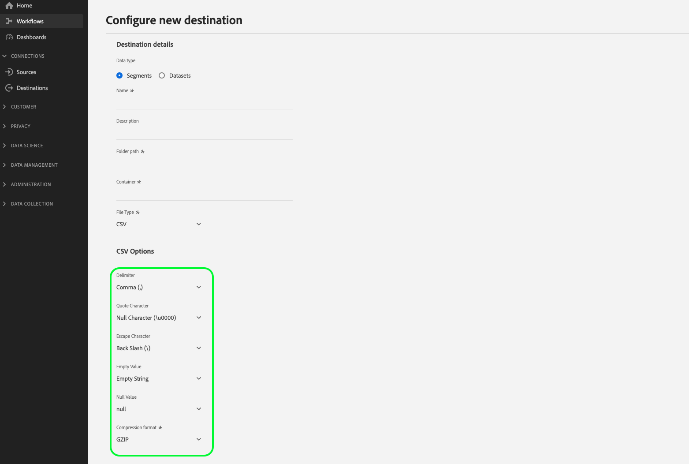

# Configuration des options de formatage de fichier pour les destinations basées sur des fichiers

>[!IMPORTANT]
> 
>Les options de formatage des fichiers décrites dans ce document ne sont actuellement disponibles que pour les fichiers CSV.

La possibilité de configurer diverses options de formatage des fichiers exportés vous est offerte lorsque vous vous [connectez](/help/destinations/ui/connect-destination.md) à une destination basée sur des fichiers, telle que [Amazon S3](/help/destinations/catalog/cloud-storage/amazon-s3.md#connect), [Azure Blob](/help/destinations/catalog/cloud-storage/azure-blob.md#connect) ou [SFTP](/help/destinations/catalog/cloud-storage/sftp.md#connect).

Vous pouvez configurer diverses options de formatage des fichiers exportés à l’aide de l’interface utilisateur d’Experience Platform. Vous pouvez modifier plusieurs propriétés des fichiers exportés pour répondre aux exigences du système de réception de fichiers de votre côté, afin de lire et d’interpréter de manière optimale les fichiers provenant d’Experience Platform.

<!--
* To configure file formatting options for exported files by using the Experience Platform UI, read this document.
* To configure file formatting options for exported files by using the Experience Platform Flow Service API, read [Flow Service API - Destinations](https://developer.adobe.com/experience-platform-apis/references/destinations/).
-->

## Configuration du formatage des fichiers pour les fichiers CSV {#file-configuration}

Pour afficher les options de formatage de fichier, démarrez le workflow [se connecter à la destination](/help/destinations/ui/connect-destination.md). Sélectionnez **Type de données : Segments** et **Type de fichier : CSV** pour afficher les paramètres de mise en forme de fichier disponibles pour les fichiers `CSV` exportés.

>[!IMPORTANT]
>
>Toutes ces options ne sont peut-être pas disponibles pour la destination à laquelle vous vous connectez. Il appartient au développeur de la destination de déterminer les options de formatage des fichiers qu’il souhaite prendre en charge dans sa destination. Le développeur de la destination peut déterminer quelles options sont disponibles lors de la connexion à la destination. Les options obligatoires sont marquées d’un astérisque dans l’interface utilisateur d’Experience Platform.
> 
>Les destinations de stockage dans le cloud intégrées par l’Adobe - [Amazon S3](/help/destinations/catalog/cloud-storage/amazon-s3.md), [Azure Blob](/help/destinations/catalog/cloud-storage/azure-blob.md), [Azure Data Lake Storage Gen2](/help/destinations/catalog/cloud-storage/adls-gen2.md), [Data Landing Zone](/help/destinations/catalog/cloud-storage/data-landing-zone.md), [Stockage dans le cloud Google](/help/destinations/catalog/cloud-storage/google-cloud-storage.md), [SFTP](/help/destinations/catalog/cloud-storage/sftp.md) - ne prennent actuellement en charge que les six options CSV mises en évidence ci-dessous.

### Délimiteur {#delimiter}

>[!CONTEXTUALHELP]
>id="platform_destinations_csvOptions_delimiter"
>title="Délimiteur"
>abstract="Utilisez ce contrôle pour définir un séparateur pour chaque champ et valeur. Consultez la documentation pour obtenir des exemples pour chaque sélection."

Utilisez ce contrôle pour définir un séparateur pour chaque champ et valeur dans les fichiers CSV exportés. Les options disponibles sont les suivantes :

* Deux points `(:)`
* Virgule `(,)`
* Pipe `(|)`
* Point-virgule `(;)`
* Onglet `(\t)`

#### Exemples

Affichez les exemples ci-dessous du contenu dans les fichiers CSV exportés avec chacune des sélections dans l’interface utilisateur.

* Exemple de sortie avec **[!UICONTROL Colon`(:)`]** sélectionné : `male:John:Doe`
* Exemple de sortie avec **[!UICONTROL Comma`(,)`]** sélectionné : `male,John,Doe`
* Exemple de sortie avec **[!UICONTROL Pipe`(|)`]** sélectionné : `male|John|Doe`
* Exemple de sortie avec **[!UICONTROL Semicolon`(;)`]** sélectionné : `male;John;Doe`
* Exemple de sortie avec **[!UICONTROL Tab`(\t)`]** sélectionné : `male \t John \t Doe`

### Guillemets {#quote-character}

>[!CONTEXTUALHELP]
>id="platform_destinations_csvOptions_quoteCharacter"
>title="Guillemets"
>abstract="Utilisez cette option pour supprimer les guillemets doubles des chaînes exportées. Consultez la documentation pour obtenir des exemples pour chaque sélection."

Utilisez cette option pour supprimer les guillemets doubles des chaînes exportées. Les options disponibles sont les suivantes :

* **[!UICONTROL Caractère nul (\0000)]**. Utilisez cette option pour supprimer les guillemets doubles des fichiers CSV exportés.
* **[!UICONTROL Guillemets doubles (&quot;)]**. Utilisez cette option pour conserver les guillemets doubles dans les fichiers CSV exportés.

#### Exemples

Affichez les exemples ci-dessous du contenu des fichiers CSV exportés avec chacune des sélections dans l’interface utilisateur.

* Exemple de sortie avec **[!UICONTROL Caractère nul (\0000)]** sélectionné : `Test,John,LastName`
* Exemple de sortie avec **[!UICONTROL Guillemets doubles (&quot;)]** sélectionné : `"Test","John","LastName"`

### Caractère d’échappement {#escape-character}

>[!CONTEXTUALHELP]
>id="platform_destinations_csvOptions_escapeCharacter"
>title="Caractère d’échappement"
>abstract="Définit un caractère unique utilisé pour lʼéchappement des guillemets dans une valeur déjà entre guillemets. Consultez la documentation pour obtenir des exemples pour chaque sélection."

Utilisez cette option pour définir un caractère unique pour échapper les guillemets dans une valeur déjà entre guillemets. Par exemple, cette option est utile lorsque vous avez une chaîne entre guillemets doubles où une partie de la chaîne est déjà entre guillemets doubles. Cette option détermine le caractère à remplacer par les guillemets doubles internes. Les options disponibles sont les suivantes :

* Barre oblique inverse `(\)`
* Guillemet simple `(')`

#### Exemples

Affichez les exemples ci-dessous du contenu des fichiers CSV exportés avec chacune des sélections dans l’interface utilisateur.

* Exemple de sortie avec **[!UICONTROL Barre oblique inverse`(\)`]** sélectionnée : `"Test,\"John\",LastName"`
* Exemple de sortie avec **[!UICONTROL Guillemet simple`(')`]** sélectionné : `"Test,'"John'",LastName"`

### Sortie de valeur vide {#empty-value-output}

>[!CONTEXTUALHELP]
>id="platform_destinations_csvOptions_emptyValueOutput"
>title="Sortie de valeur vide"
>abstract="Utilisez cette option pour définir comment les valeurs vides doivent être représentées dans les fichiers CSV exportés. Consultez la documentation pour obtenir des exemples pour chaque sélection."

Utilisez ce contrôle pour définir la représentation sous forme de chaîne d’une valeur vide. Cette option détermine le mode de représentation des valeurs vides dans les fichiers CSV exportés. Les options disponibles sont les suivantes :

* **[!UICONTROL Null (null)]**
* **Chaîne vide dans les guillemets doubles (&quot;&quot;&quot;)**
* **[!UICONTROL Chaîne vide]**

#### Exemples

Affichez les exemples ci-dessous du contenu des fichiers CSV exportés avec chacune des sélections dans l’interface utilisateur.

* Exemple de sortie avec **[!UICONTROL null]** sélectionné : `male,NULL,TestLastName`. Dans ce cas, Experience Platform transforme la valeur vide en valeur nulle.
* Exemple de sortie avec **&quot;** sélectionné : `male,"",TestLastName`. Dans ce cas, Experience Platform transforme la valeur vide en une paire de guillemets doubles.
* Exemple de sortie avec **[!UICONTROL Chaîne vide]** sélectionnée : `male,,TestLastName`. Dans ce cas, l’Experience Platform conserve la valeur vide et l’exporte telle quelle (sans guillemets doubles).

>[!TIP]
>
>La différence entre la sortie valeur vide et la sortie valeur nulle dans la section ci-dessous est qu’une valeur vide a une valeur réelle vide. La valeur NULL n’a aucune valeur. Considérez la valeur vide comme une vitre vide sur la table et la valeur nulle comme ne comportant pas du tout de vitre sur la table.

### Sortie de valeur nulle {#null-value-output}

>[!CONTEXTUALHELP]
>id="platform_destinations_csvOptions_nullValueOutput"
>title="Sortie de valeur nulle"
>abstract="Utilisez ce contrôle pour définir la représentation sous forme de chaîne d’une valeur null dans les fichiers exportés. Consultez la documentation pour obtenir des exemples pour chaque sélection."

Utilisez ce contrôle pour définir la représentation sous forme de chaîne d’une valeur null dans les fichiers exportés. Cette option détermine le mode de représentation des valeurs nulles dans vos fichiers CSV exportés. Les options disponibles sont les suivantes :

* **[!UICONTROL Null (null)]**
* **Chaîne vide dans les guillemets doubles (&quot;&quot;&quot;)**
* **[!UICONTROL Chaîne vide]**

#### Exemples

Affichez les exemples ci-dessous du contenu des fichiers CSV exportés avec chacune des sélections dans l’interface utilisateur.

* Exemple de sortie avec **[!UICONTROL null]** sélectionné : `male,NULL,TestLastName`. Dans ce cas, aucune transformation n’a lieu et le fichier CSV contient la valeur null.
* Exemple de sortie avec **&quot;** sélectionné : `male,"",TestLastName`. Dans ce cas, Experience Platform remplace la valeur nulle par des guillemets doubles autour d’une chaîne vide.
* Exemple de sortie avec **[!UICONTROL Chaîne vide]** sélectionnée : `male,,TestLastName`. Dans ce cas, Experience Platform remplace la valeur nulle par une chaîne vide (sans guillemets doubles).

### Format de compression {#compression-format}

>[!CONTEXTUALHELP]
>id="platform_destinations_csvOptions_compressionFormat"
>title="Format de compression"
>abstract="Définit le type de compression à utiliser lors de l’enregistrement de données dans un fichier. Les options prises en charge sont GZIP et NONE. Consultez la documentation pour obtenir des exemples pour chaque sélection."

Définit le type de compression à utiliser lors de l’enregistrement de données dans un fichier. Les options prises en charge sont GZIP et NONE. Cette option détermine si vous allez exporter des fichiers compressés ou non.

### Encodage

*Non affiché dans la capture d’écran de l’interface utilisateur*. Indique l’encodage (jeu de caractères) des fichiers CSV enregistrés. Les options sont UTF-8 ou UTF-16.

### Caractère pour échapper les guillemets

*Non affiché dans la capture d’écran de l’interface utilisateur*. Un indicateur précisant si les valeurs contenant des guillemets doivent toujours être placées entre guillemets.

La valeur par défaut est lʼéchappement de toutes les valeurs contenant un guillemet.

### Séparateur de ligne

*Non affiché dans la capture d’écran de l’interface utilisateur*. Définit le séparateur de ligne à utiliser pour l’écriture. Longueur maximale : 1 caractère.

### Ignorer l’espace blanc de début

*Non affiché dans la capture d’écran de l’interface utilisateur*. Indicateur précisant si les espaces de début des valeurs exportées doivent être ignorés.

Exemple de sortie avec **[!UICONTROL Vrai]** sélectionné : `"male","John","TestLastName"`
Exemple de sortie avec **[!UICONTROL Faux]** sélectionné : `" male","John","TestLastName"`

### Ignorer l’espace de fin

Non affiché dans la capture d’écran de l’interface utilisateur. Un indicateur précisant si les espaces blancs de fin de valeurs exportées doivent être ignorés ou non.

Exemple de sortie avec **[!UICONTROL Vrai]** sélectionné : `"male","John","TestLastName"`
Exemple de sortie avec **[!UICONTROL Faux]** sélectionné : `"male ","John","TestLastName"`

### Étapes suivantes {#next-steps}

Après avoir lu ce document, vous savez maintenant comment configurer les options d’exportation de vos fichiers de données CSV pour adapter le contenu du fichier aux exigences de votre système de réception de fichiers en aval. Vous pouvez ensuite lire le [tutoriel d’activation des destinations basées sur les fichiers](/help/destinations/ui/activate-batch-profile-destinations.md) pour commencer à exporter des fichiers vers votre emplacement de stockage dans le cloud préféré.
