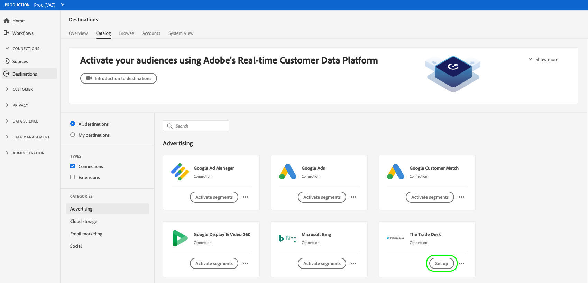
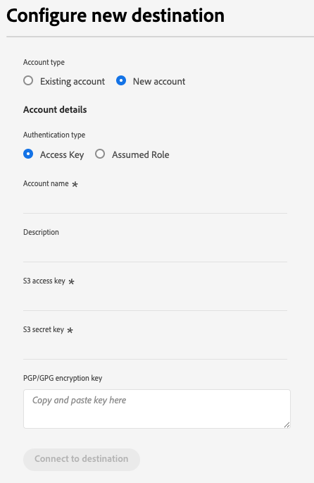

# Créer une connexion à une destination

>[!IMPORTANT]
> 
>* Pour vous connecter à une destination, vous avez besoin des autorisations de contrôle d’accès **[!UICONTROL Afficher les destinations]** et **[!UICONTROL Gérer les destinations]** . Lisez la [présentation du contrôle d’accès](/help/access-control/ui/overview.md) ou contactez votre administrateur ou administratrice du produit pour obtenir les autorisations requises.
>* Pour vous connecter à une destination qui prend en charge les exportations de jeux de données, vous avez besoin des **[!UICONTROL Afficher les destinations]** et **[!UICONTROL Gérer et activer les destinations de jeux de données]** [autorisations de contrôle d’accès](/help/access-control/home.md#permissions). Lisez la [présentation du contrôle d’accès](/help/access-control/ui/overview.md) ou contactez votre administrateur de produit pour obtenir les autorisations requises.

## Présentation {#overview}

Avant d’envoyer des données d’audience vers une destination, vous devez configurer une connexion à votre plateforme de destination. Cet article vous explique comment configurer une nouvelle connexion de destination, à laquelle vous pouvez ensuite activer des audiences ou exporter des jeux de données à l’aide de l’interface utilisateur de Adobe Experience Platform.

## Rechercher la destination souhaitée dans le catalogue {#setup}

1. Accédez à **[!UICONTROL Connexions]** > **[!UICONTROL Destinations]**, puis sélectionnez l’onglet **[!UICONTROL Catalogue]**.

   

2. Les cartes de destination du catalogue peuvent comporter différentes commandes d’action, selon que vous disposez d’une connexion existante à la destination et que les destinations prennent en charge l’activation d’audiences, l’exportation de jeux de données ou les deux. Vous pouvez voir une ou plusieurs des options suivantes pour les cartes de destination :

   * **[!UICONTROL Configurer]**. Une connexion doit d’abord être configurée vers cette destination avant de pouvoir activer des audiences ou exporter des jeux de données.
   * **[!UICONTROL Activer]**. Une connexion a déjà été configurée vers cette destination. Cette destination prend en charge l’activation des audiences et les exportations de jeux de données.
   * **[!UICONTROL Activer les audiences]**. Une connexion a déjà été configurée vers cette destination. Cette destination prend uniquement en charge l’activation des audiences.

   Pour plus d’informations sur la différence entre ces options, vous pouvez également vous reporter à la section [Catalogue](../ui/destinations-workspace.md#catalog) de la documentation de l’espace de travail de destination.

   Sélectionnez **[!UICONTROL Configurer]**, **[!UICONTROL Activer]** ou **[!UICONTROL Activer les audiences]**, selon le contrôle qui est disponible pour vous.

   

   

3. Si vous avez sélectionné **[!UICONTROL Configurer]**, passez à l’étape suivante, pour une [authentification](#authenticate) auprès de la destination.

   Si vous avez sélectionné **[!UICONTROL Activer]**, **[!UICONTROL Activer des audiences]** ou **[!UICONTROL Exporter des jeux de données]**, vous pouvez désormais voir une liste des connexions de destination existantes.

   Sélectionnez **[!UICONTROL Configurer une nouvelle destination]** pour établir une nouvelle connexion à la destination.

   

## S’authentifier auprès de la destination {#authenticate}

>[!CONTEXTUALHELP]
>id="platform_destinations_account_name"
>title="Nom du compte"
>abstract="Saisissez un nom qui vous permettra d’identifier facilement ce compte de destination à l’avenir. Cela s’avère particulièrement utile si vous disposez de plusieurs connexions à la même destination."

La première étape de la connexion à une destination consiste à s’authentifier sur la plateforme de destination.

Selon la destination à laquelle vous vous connectez, il se peut que vous soyez redirigé(e) vers la page du partenaire de destination pour vous authentifier ou que vous soyez invité(e) à saisir les informations d’authentification directement dans le workflow Experience Platform.

Lors de la configuration d’une nouvelle connexion de destination, vous devez fournir un **[!UICONTROL Nom du compte]** et, éventuellement, une **[!UICONTROL Description]**. Ces champs sont disponibles pour toutes les destinations.

* **[!UICONTROL Nom du compte]** : saisissez un nom qui vous aidera à identifier facilement ce compte de destination à l’avenir. Cela s’avère particulièrement utile si vous disposez de plusieurs connexions à la même destination.
* **[!UICONTROL Description]** (facultatif) : ajoutez des détails supplémentaires qui vous aideront, vous ou votre équipe, à faire la distinction entre les comptes, tels que l’objectif de la connexion ou le contexte commercial approprié.

Fournir des informations claires et descriptives dans ces champs facilite la gestion et la sélection du compte de destination approprié lors de l’activation des audiences.

Vous trouverez ci-dessous un exemple d’entrée requise pour l’authentification à une destination [!DNL Amazon S3]. Des instructions détaillées sur l’entrée requise sont fournies dans la page de documentation de chaque destination (consultez, par exemple, la section d’authentification pour [[!DNL Amazon S3]](/help/destinations/catalog/cloud-storage/amazon-s3.md#authenticate) et [[!DNL Facebook]](/help/destinations/catalog/social/facebook.md#authenticate)).

Paramètres d’authentification obligatoires et facultatifs pour **[!DNL Amazon S3]**

## Définir les paramètres de connexion {#set-up-connection-parameters}

Si vous avez déjà configuré l’authentification vers la destination, vous pouvez poursuivre avec le compte existant ou configurer un nouveau compte.

Selon la destination à laquelle vous vous connectez, vous devrez peut-être définir différents types de paramètres de connexion. Par exemple, lors de la connexion à une destination [!DNL Amazon S3], vous devez fournir des informations sur le nom du compartiment [!DNL Amazon S3] et le chemin d’accès au dossier dans lequel les fichiers seront déposés. Vous trouverez ci-dessous deux exemples d’entrées requises pour une destination [!DNL Amazon S3] et [!DNL Trade Desk]. Des instructions détaillées sur l’entrée requise sont fournies dans la page de documentation de chaque destination.

>[!IMPORTANT]
>
>Les images ci-dessous sont utilisées uniquement à titre d’illustration. Les informations de la connexion à la destination varient selon les destinations. Pour en savoir plus sur les informations de connexion de votre destination, lisez la section **Se connecter à la destination** de la page de chaque [catalogue de destinations](../catalog/overview.md) (par exemple, [[!DNL Google Customer Match]](../catalog/advertising/google-customer-match.md#connect), [[!DNL Trade Desk]](/help/destinations/catalog/advertising/tradedesk.md#connect) ou [[!DNL Amazon S3]](/help/destinations/catalog/cloud-storage/amazon-s3.md#destination-details)).

Paramètres d’entrée obligatoires et facultatifs pour **[!DNL Amazon S3]**

Paramètres d’entrée obligatoires et facultatifs pour **[!DNL The Trade Desk]**

### Configurer des options de formatage de fichier pour les fichiers exportés {#file-formatting-and-compression-options}

Pour les destinations basées sur des fichiers, vous pouvez configurer divers paramètres liés à la manière dont les fichiers exportés sont formatés et compressés. Pour plus d’informations sur toutes les options de formatage et de compression disponibles, consultez le [tutoriel Configurer des options de formatage de fichier pour les destinations basées sur des fichiers](/help/destinations/ui/batch-destinations-file-formatting-options.md).

### Configurer une connexion de destination pour l’activation d’audience, l’activation de compte, l’activation de prospects ou les exportations de jeux de données {#segment-activation-or-dataset-exports}

Certaines destinations basées sur des fichiers prennent en charge l’activation d’audiences pour les clients, les clients de compte ou les prospects connus, ainsi que les exportations de jeux de données. Pour ces destinations, vous pouvez choisir de créer une connexion qui vous permet d’[activer des audiences](/help/destinations/ui/activate-batch-profile-destinations.md), des [comptes](/help/destinations/ui/activate-account-audiences.md), des [prospects](/help/destinations/ui/activate-prospect-audiences.md) ou [exporter des jeux de données](/help/destinations/ui/export-datasets.md).

>[!WARNING]
>
>Lors de l’exportation de jeux de données, notez que les exportations vers des fichiers JSON sont uniquement prises en charge en mode compressé. Les exportations vers des fichiers [!DNL Parquet] sont prises en charge en mode compressé et non compressé.

### Activer les alertes de destination {#enable-alerts}

1. (Facultatif) Sélectionnez les alertes de flux de données de destination auxquelles vous souhaitez vous abonner. Vous pouvez vous abonner aux alertes lors de la création d’un flux de données pour recevoir des messages d’alerte concernant le statut, le succès ou l’échec de l’exécution de votre flux de données. Les alertes disponibles varient en fonction du type de destination (basé sur un fichier ou par diffusion en continu) à laquelle vous vous connectez. Consultez [S’abonner aux alertes de destination contextuelles](alerts.md) pour obtenir des informations détaillées sur les alertes de flux de données de destination.

   

2. Sélectionnez **[!UICONTROL Suivant]**.

   

## Sélectionner des actions marketing {#select-marketing-actions}

1. Sélectionnez les actions marketing applicables aux données que vous souhaitez exporter vers la destination. Les actions marketing indiquent la raison pour laquelle les données seront exportées vers la destination. Vous pouvez effectuer un choix parmi des actions marketing définies par Adobe ou créer votre propre action marketing. Pour plus d’informations sur les actions marketing, consultez la page [présentation des politiques d’utilisation des données](../../data-governance/policies/overview.md).

   

2. Sélectionnez **[!UICONTROL Enregistrer et quitter]** pour enregistrer la configuration de destination, ou sélectionnez **[!UICONTROL Suivant]** pour passer au [flux d’activation](activation-overview.md) des données d’audience.

## Étapes suivantes {#next-steps}

En lisant ce document, vous avez appris à utiliser l’interface utilisateur d’Experience Platform pour établir une connexion à une destination. Pour rappel, les paramètres de connexion disponibles et requis varient d’une destination à l’autre. Consultez également la page de documentation sur la destination dans le [catalogues des destinations](/help/destinations/catalog/overview.md) pour obtenir des informations spécifiques sur les entrées requises et les options disponibles par type de destination.

Ensuite, vous pouvez passer à [l’activation des audiences](/help/destinations/ui/activation-overview.md) ou [l’exportation de jeux de données](/help/destinations/ui/export-datasets.md) vers votre destination.