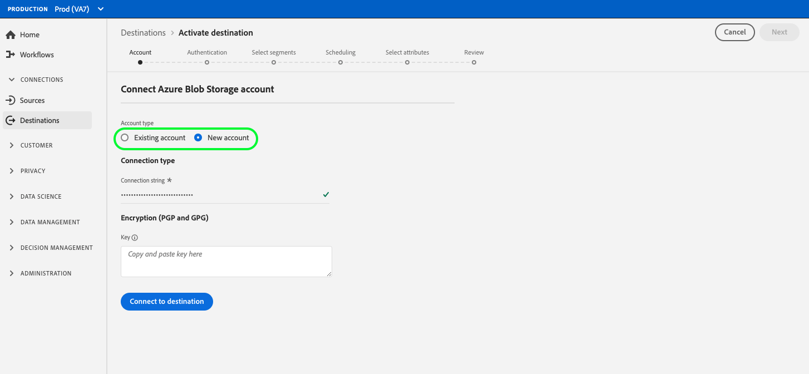

# Création d’une connexion de destination

## Présentation {#overview}

Avant d’envoyer des données d’audience vers une destination, vous devez configurer une connexion à votre plateforme de destination. Cet article vous explique comment configurer une nouvelle destination à l’aide de l’interface utilisateur de Adobe Experience Platform.

## Création d’une connexion de destination {#setup}

### Sélectionner la destination {#select-destination}

1. Accédez à **[!UICONTROL Connexions]** > **[!UICONTROL Destinations]**, puis sélectionnez l’onglet **[!UICONTROL Catalogue]** .

   

1. Selon que vous disposez d’une connexion existante à votre destination, vous pouvez voir un bouton **[!UICONTROL Configurer]** ou **[!UICONTROL Activer]** sur la carte de destination. Pour plus d’informations sur la différence entre **[!UICONTROL Activer]** et **[!UICONTROL Configurer]**, consultez la section [Catalogue](../ui/destinations-workspace.md#catalog) de la documentation de l’espace de travail de destination. Sélectionnez **[!UICONTROL Configurer]** ou **[!UICONTROL Activer]**, en fonction du bouton disponible.

   

   

<!-- 1. If you selected **[!UICONTROL Set up]**, skip this step. If you selected **[!UICONTROL Activate segments]**, you can now see a list of the existing destination connections. Select **[!UICONTROL Configure new destination]**.

    -->

### Étape du compte {#account}

Sélectionnez **[!UICONTROL Nouveau compte]** pour configurer une nouvelle connexion à votre destination. Ou, si vous avez précédemment configuré une connexion à votre destination, sélectionnez **[!UICONTROL Compte existant]** et sélectionnez la connexion existante.

Les informations d’identification que vous devez entrer à l’étape du compte varient en fonction de la destination et du type d’authentification.

* Pour les destinations de stockage dans le cloud, vous devez fournir des informations d’identification pour que l’Experience Platform puisse se connecter à votre emplacement de stockage.

   

* Pour Facebook et plusieurs autres destinations sociales et publicitaires, sélectionnez **[!UICONTROL Nouveau compte]** , puis **[!UICONTROL Se connecter à la destination]**. Vous accédez alors à la page de connexion de destination, afin que vous puissiez vous connecter Experience Platform à votre destination.

   

>[!IMPORTANT]
>
>Consultez la section **[!UICONTROL Paramètres de connexion]** de chaque page de catalogue de destinations pour obtenir des informations détaillées sur les paramètres requis dans cette étape (par exemple, [Azure Blob](../catalog/cloud-storage/azure-blob.md#parameters) nécessite une chaîne de connexion).

### Étape d’authentification {#authentication}

Saisissez les détails de la connexion à la plateforme de destination, puis sélectionnez **[!UICONTROL Créer la destination]**.

1. Sélectionnez les actions marketing applicables aux données que vous souhaitez exporter vers la destination. Les actions marketing indiquent l’intention pour laquelle les données seront exportées vers la destination. Vous pouvez effectuer un choix parmi des actions marketing définies par l’Adobe ou créer votre propre action marketing. Pour plus d’informations sur les actions marketing, consultez la [présentation des stratégies d’utilisation des données](../../data-governance/policies/overview.md) page.

   >[!IMPORTANT]
   >
   >L’image ci-dessous est utilisée à titre d’illustration uniquement. Les détails de la connexion de destination varient selon les destinations. Pour plus d’informations sur les détails de connexion de votre destination, voir la section **[!UICONTROL Paramètres de connexion]** de chaque page [catalogue de destination](../catalog/overview.md) (par exemple, [Correspondance client Google](../catalog/advertising/google-customer-match.md#parameters)).

   

1. Sélectionnez **[!UICONTROL Enregistrer et quitter]** pour enregistrer la configuration de destination ou **[!UICONTROL Suivant]** pour accéder au [flux d’activation](activation-overview.md) des données d’audience.