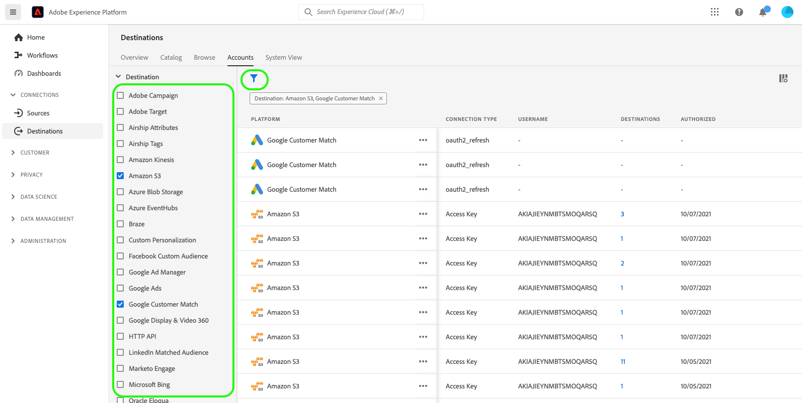

# Supprimer les comptes de destination

## Vue d’ensemble {#overview}

L’onglet **[!UICONTROL Comptes]** affiche des détails sur les connexions que vous avez établies avec diverses destinations. Consultez la [ Présentation des comptes ](../ui/destinations-workspace.md#accounts) pour obtenir toutes les informations disponibles pour chaque compte de destination.

Ce tutoriel décrit les étapes à suivre pour supprimer des comptes de destination qui ne sont plus nécessaires à l’aide de l’interface utilisateur d’Experience Platform.

## Supprimer des comptes {#delete}

>[!TIP]
>
>Avant de supprimer le compte de destination, vous devez d’abord supprimer les flux de données existants associés au compte de destination. Pour supprimer des flux de données de destination existants, reportez-vous au tutoriel sur la [suppression de flux de données de destination dans l’interface utilisateur](./delete-destinations.md).

Pour supprimer des comptes de destination existants, procédez comme suit.

1. Accédez à l’[interface utilisateur d’](https://platform.adobe.com/) et sélectionnez **[!UICONTROL Destinations]** dans la barre de navigation de gauche. Sélectionnez **[!UICONTROL Comptes]** dans l’en-tête supérieur pour afficher vos comptes existants.

   

2. Sélectionnez l’icône filtre  en haut à gauche pour lancer le panneau de tri. Le panneau de tri fournit une liste de toutes vos destinations. Vous pouvez sélectionner plusieurs destinations dans la liste pour afficher une sélection filtrée de comptes associés aux destinations sélectionnées.

   

3. Sélectionnez les points de suspension (`...`) à côté du nom du compte que vous souhaitez supprimer. Un panneau pop-up s’affiche, fournissant des options pour **[!UICONTROL Activer les audiences]**, **[!UICONTROL Modifier les détails]** et **[!UICONTROL Supprimer]** le compte. Sélectionnez le bouton  **[!UICONTROL Supprimer]** pour supprimer le compte souhaité.

   

4. Une boîte de dialogue de confirmation finale s’affiche. Sélectionnez **[!UICONTROL Supprimer]** pour terminer le processus.

## Étapes suivantes {#next-steps}

Vous avez correctement utilisé l’espace de travail des destinations pour supprimer des comptes existants.

Pour savoir comment effectuer ces opérations par programmation à l’aide de l’API [!DNL Flow Service], reportez-vous au tutoriel sur la [suppression de connexions à l’aide de l’API Flow Service](../api/delete-destination-account.md)
