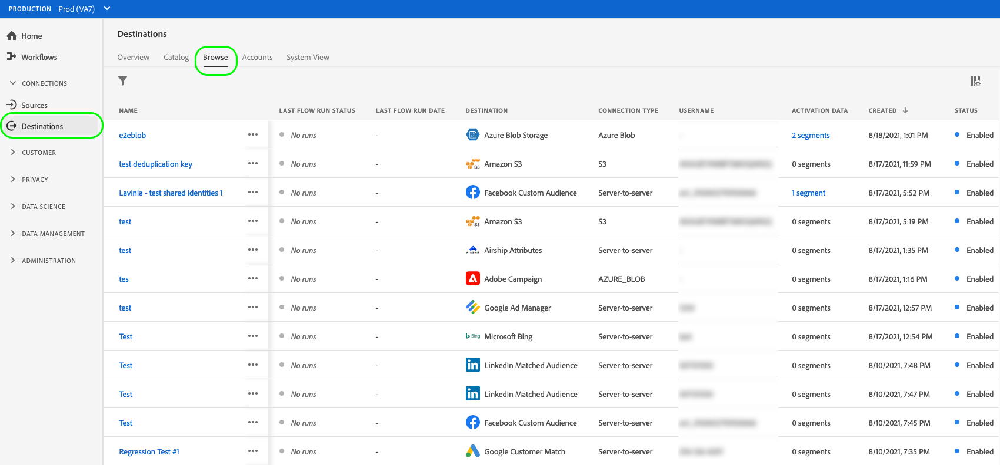
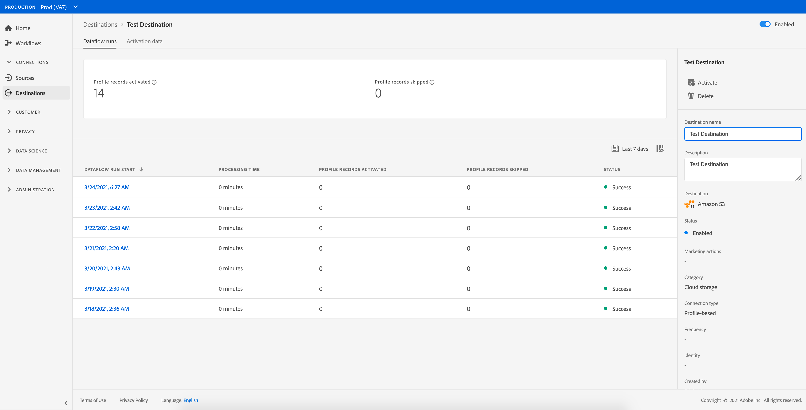
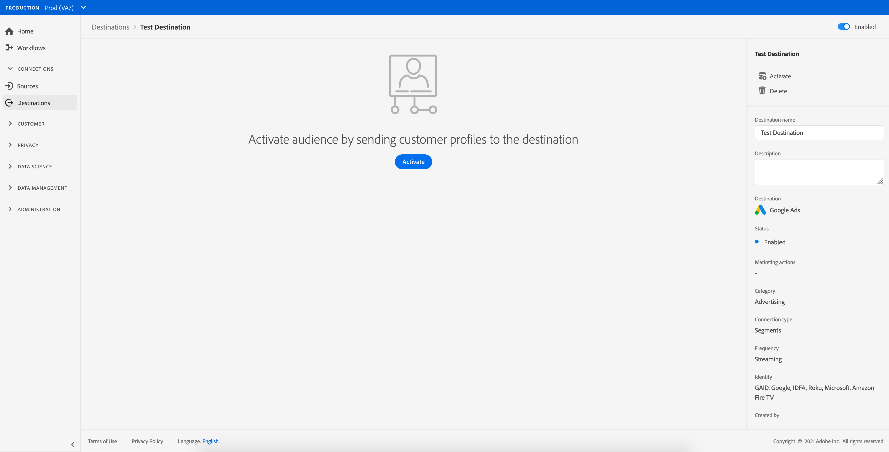
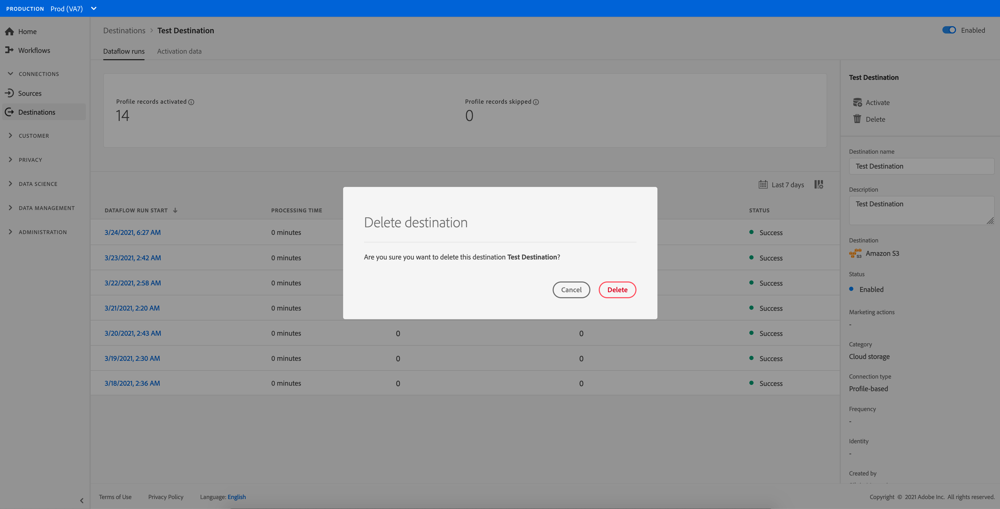

# Supprimer les destinations {#delete-destinations}

## Vue d’ensemble {#overview}

Dans l’interface utilisateur [!DNL Adobe Experience Platform], vous pouvez supprimer des connexions existantes à des destinations.

La suppression d’une destination supprime tous les flux de données existants vers cette destination. Toutes les audiences activées pour les destinations que vous supprimez ne sont pas mappées avant la suppression du flux de données.

Vous pouvez supprimer des destinations de l’[!DNL Experience Platform] [!DNL UI] de deux façons. Vous pouvez :

* [Supprimer des destinations de l’onglet [!UICONTROL Browse]](#delete-browse-tab)
* [Supprimer des destinations de la page des détails de la destination](#delete-destination-details-page)

## Supprimer des destinations de l’onglet Parcourir{#delete-browse-tab}

Suivez les étapes ci-dessous pour supprimer une destination de l’onglet [!UICONTROL Browse] .

1. Accédez à l’[interface utilisateur d’](https://platform.adobe.com/) puis sélectionnez **[!UICONTROL Destinations]** dans la barre de navigation de gauche. Sélectionnez **[!UICONTROL Browse]** dans l’en-tête supérieur pour afficher vos destinations existantes.

   

2. Sélectionnez l’icône filtre  en haut à gauche pour lancer le panneau de tri. Le panneau de tri fournit une liste de toutes vos destinations. Vous pouvez sélectionner plusieurs destinations dans la liste pour afficher une sélection filtrée de flux de données associés à la destination sélectionnée.

   

3. Sélectionnez le bouton  dans la colonne Nom , puis sélectionnez  **[!UICONTROL Delete]** pour supprimer une connexion de destination existante.
   

4. Sélectionnez **[!UICONTROL Delete]** pour confirmer la suppression de la connexion de destination.

   

## Supprimer des destinations de la page des détails de la destination {#delete-destination-details-page}

Suivez les étapes ci-dessous pour supprimer une destination de la page de détails de la destination.

1. Accédez à l’[interface utilisateur d’](https://platform.adobe.com/) puis sélectionnez **[!UICONTROL Destinations]** dans la barre de navigation de gauche. Sélectionnez **[!UICONTROL Browse]** dans l’en-tête supérieur pour afficher vos destinations existantes.

   

2. Sélectionnez l’icône filtre  en haut à gauche pour lancer le panneau de tri. Le panneau de tri fournit une liste de toutes vos destinations. Vous pouvez sélectionner plusieurs destinations dans la liste pour afficher une sélection filtrée de flux de données associés à la destination sélectionnée.

   

3. Sélectionnez le nom de la destination à supprimer.

   

   * Si la destination comporte des flux de données existants, vous êtes redirigé(e) vers l’onglet [!UICONTROL Dataflow runs] .

     

   * Si la destination ne comporte pas de flux de données existants, vous accédez à une page vide où vous pouvez commencer à activer les audiences.

     

4. Sélectionnez **[!UICONTROL Delete]** dans le rail de droite.

   

5. Sélectionnez **[!UICONTROL Delete]** dans la boîte de dialogue de confirmation pour supprimer la destination.

   

>[!NOTE]
>
>En fonction de la charge du serveur, la suppression de la destination peut prendre quelques minutes pour [!DNL Experience Platform].
