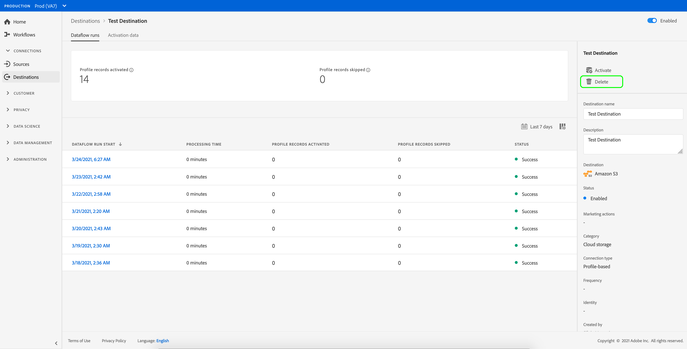

# Suppression de destinations {#delete-destinations}

## Présentation {#overview}

Dans l’interface utilisateur de Adobe Experience Platform, vous pouvez supprimer les connexions existantes aux destinations.

La suppression d’une destination supprime tous les flux de données existants vers cette destination. Tous les segments activés vers les destinations que vous supprimez sont démappés avant la suppression du flux de données.

Vous pouvez supprimer des destinations de [!DNL Platform] [!DNL UI] de deux façons. Vous pouvez :

* [Supprimer des destinations de l’onglet [!UICONTROL Parcourir]](#delete-browse-tab)
* [Suppression de destinations de la page de détails des destinations](#delete-destination-details-page)

>[!IMPORTANT]
>
>Bien que vous puissiez supprimer des *connexions existantes aux destinations*, comme décrit dans cet article, Platform ne vous permet pas actuellement de supprimer les *[comptes de destination](/help/destinations/ui/destinations-workspace.md#accounts)* existants.

## Suppression de destinations dans l’onglet Parcourir{#delete-browse-tab}

Suivez les étapes ci-dessous pour supprimer une destination de l’onglet [!UICONTROL Parcourir] .

1. Connectez-vous à l’[interface utilisateur Experience Platform](https://platform.adobe.com/) et sélectionnez **[!UICONTROL Destinations]** dans la barre de navigation de gauche. Pour afficher vos destinations existantes, sélectionnez **[!UICONTROL Parcourir]** dans l’en-tête supérieur.

   

2. Sélectionnez l’icône de filtre  en haut à gauche pour lancer le panneau de tri. Le panneau de tri fournit une liste de toutes vos destinations. Vous pouvez sélectionner plusieurs destinations dans la liste pour afficher une sélection filtrée de flux de données associés à la destination sélectionnée.

   

3. Sélectionnez le bouton  **[!UICONTROL Supprimer]** dans la colonne **[!UICONTROL Plateforme]** pour supprimer une destination existante.
   

4. Sélectionnez **[!UICONTROL Supprimer]** pour confirmer la suppression de la destination.

   

## Suppression de destinations de la page de détails des destinations{#delete-destination-details-page}

Suivez les étapes ci-dessous pour supprimer une destination de la page de détails des destinations.

1. Connectez-vous à l’[interface utilisateur Experience Platform](https://platform.adobe.com/) et sélectionnez **[!UICONTROL Destinations]** dans la barre de navigation de gauche. Pour afficher vos destinations existantes, sélectionnez **[!UICONTROL Parcourir]** dans l’en-tête supérieur.

   

2. Sélectionnez l’icône de filtre  en haut à gauche pour lancer le panneau de tri. Le panneau de tri fournit une liste de toutes vos destinations. Vous pouvez sélectionner plusieurs destinations dans la liste pour afficher une sélection filtrée de flux de données associés à la destination sélectionnée.

   

3. Sélectionnez le nom de la destination que vous souhaitez supprimer.

   

   * Si la destination comporte des flux de données existants, vous accédez à l’onglet [!UICONTROL Flux de données s’exécute] .

      

   * Si la destination ne comporte pas de flux de données existants, vous accédez à une page vide dans laquelle vous pouvez commencer à activer les audiences.

      

4. Sélectionnez **[!UICONTROL Supprimer]** dans le rail de droite.

   

5. Sélectionnez **[!UICONTROL Supprimer]** dans la boîte de dialogue de confirmation pour supprimer la destination.

   

   >[!NOTE]
   >
   >Selon la charge du serveur, la suppression de la destination peut prendre quelques minutes pour [!DNL Platform].
